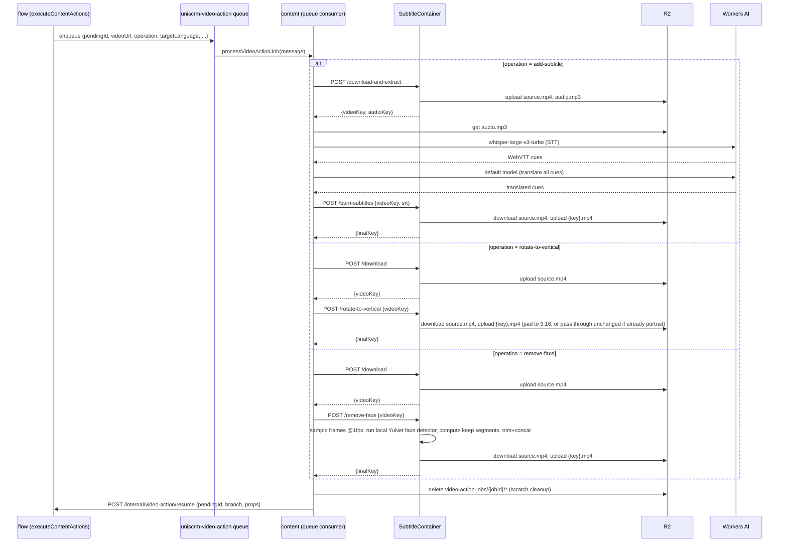

# Video Action pipeline sequence

```mermaid
sequenceDiagram
    participant Flow as flow (executeContentActions)
    participant Queue as uniscrm-video-action queue
    participant Content as content (queue consumer)
    participant Container as SubtitleContainer
    participant R2
    participant AI as Workers AI

    Flow->>Queue: enqueue {pendingId, videoUrl, operation, targetLanguage, ...}
    Queue->>Content: processVideoActionJob(message)
    alt operation = add-subtitle
        Content->>Container: POST /download-and-extract
        Container->>R2: upload source.mp4, audio.mp3
        Container-->>Content: {videoKey, audioKey}
        Content->>R2: get audio.mp3
        Content->>AI: whisper-large-v3-turbo (STT)
        AI-->>Content: WebVTT cues
        Content->>AI: default model (translate all cues)
        AI-->>Content: translated cues
        Content->>Container: POST /burn-subtitles {videoKey, srt}
        Container->>R2: download source.mp4, upload {key}.mp4
        Container-->>Content: {finalKey}
    else operation = rotate-to-vertical
        Content->>Container: POST /download
        Container->>R2: upload source.mp4
        Container-->>Content: {videoKey}
        Content->>Container: POST /rotate-to-vertical {videoKey}
        Container->>R2: download source.mp4, upload {key}.mp4 (pad to 9:16, or pass through unchanged if already portrait)
        Container-->>Content: {finalKey}
    else operation = remove-face
        Content->>Container: POST /download
        Container->>R2: upload source.mp4
        Container-->>Content: {videoKey}
        Content->>Container: POST /remove-face {videoKey}
        Container->>Container: sample frames @1fps, run local YuNet face detector, compute keep segments, trim+concat
        Container->>R2: download source.mp4, upload {key}.mp4
        Container-->>Content: {finalKey}
    end
    Content->>R2: delete video-action-jobs/{jobId}/* (scratch cleanup)
    Content->>Flow: POST /internal/video-action/resume {pendingId, branch, props}
```
