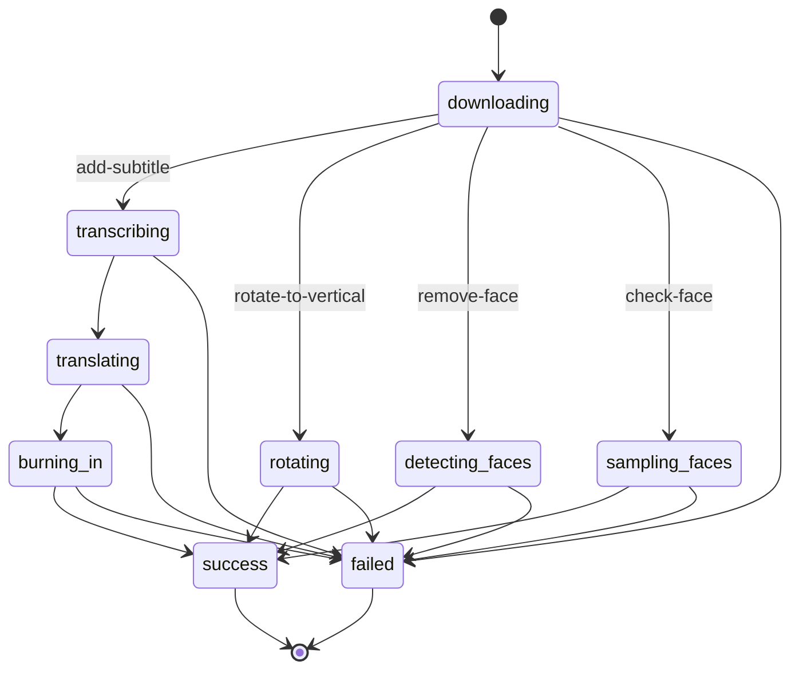

# video_action_jobs.job_status state machine

For `check-face` (the `videoCondition` node), `success` means "the face ratio was measured" —
not "the condition passed". The `true`/`false` decision is made by `flow`'s resume route.
