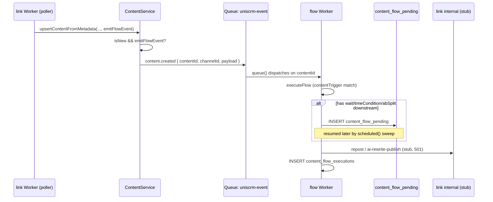
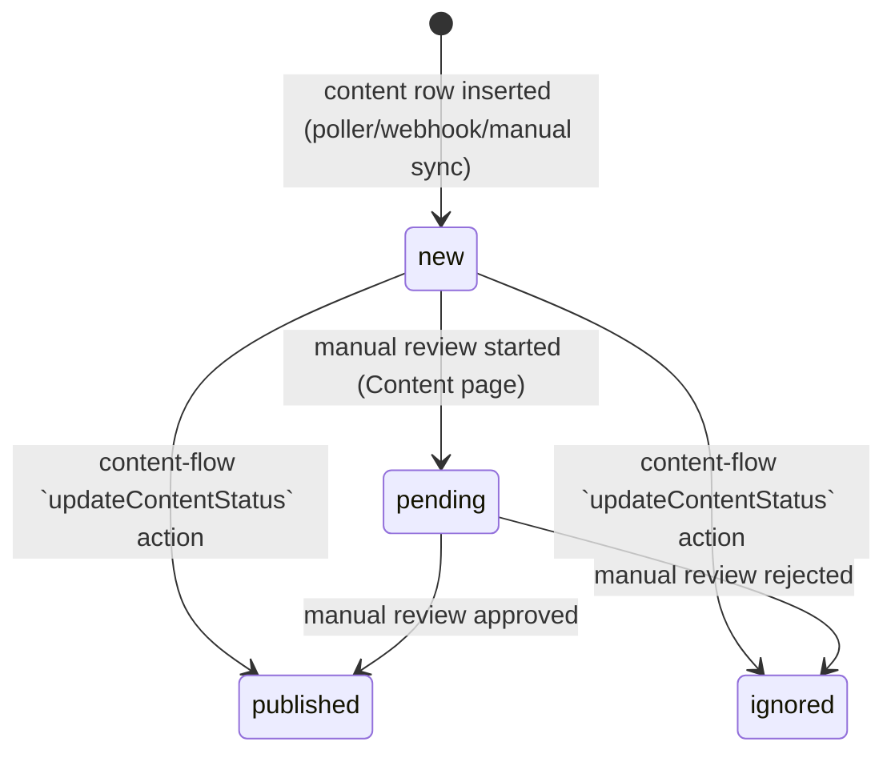

# Content-Triggered Flow Implementation Plan

> **For agentic workers:** REQUIRED SUB-SKILL: Use superpowers:subagent-driven-development (recommended) or superpowers:executing-plans to implement this plan task-by-task. Steps use checkbox (`- [ ]`) syntax for tracking.

**Goal:** Add a content-domain trigger/action path to `flow`, parallel to the existing user-domain one, so a tenant can build a flow that fires when its own connected X/TikTok channel ingests a new post, and reposts it or AI-rewrites it for another connected channel.

**Architecture:** New `contentTrigger` node + three new `action` actionTypes (`repost`, `aiRewritePublish`, `updateContentStatus`) reuse the existing engine (`executeFlow`/`collectActions`, unchanged condition evaluation) but write to brand-new parallel tables (`content_flow_pending`, `content_flow_executions`) instead of the existing user-scoped ones. `link`'s `ContentService.upsertContentFromMetadata()` emits a `content.created` message onto the existing `FLOW_QUEUE`, discriminated from user events by a `contentId` field instead of `userId`. The real X-repost/TikTok-publish APIs are stubbed this phase. The Flows UI splits into "User Flows" / "Content Flows" tabs.

**Tech Stack:** Cloudflare Workers (Hono), D1, Cloudflare Queues, React + Zustand + `@xyflow/react`, Vitest (`@cloudflare/vitest-pool-workers`).

**Spec:** `docs/superpowers/specs/2026-07-14-content-flow-triggers-design.md`

## Global Constraints

- Every task that touches `flow/src/*` or `link/src/*` must pass `tsc --noEmit` in that module before being considered done.
- No changes to existing `flows`, `flow_executions`, `flow_pending`, `rate_limits` schemas or to any existing user-flow code path/behavior — this is strictly additive.
- Backfill-phase content (an X/TikTok channel's historical posts on first connection) must never fire `content.created` — only genuinely new content discovered during incremental polling does. Getting this wrong means connecting a channel mass-fires publish actions against its entire back-catalog.
- `repost`/`aiRewritePublish` call explicitly-stubbed `link` internal endpoints this phase (return `501`, not a real X/TikTok write) — do not implement the real external API calls as part of this plan.
- Content-domain flow execution does **not** call `emitNodeLogs`/write to `PIPELINE_FLOW_LOG`/`FLOW_LOG_QUEUE` this phase — those have a fixed external R2 Pipeline schema keyed on `user_id`, and adding a `content_id` variant is a Pipeline-schema migration outside this plan's scope. Content-flow execution history lives only in `content_flow_executions`. State this in code as a comment, not a TODO — it's a deliberate scope boundary, not unfinished work.
- `repost`/`aiRewritePublish` get `hasBranches: true` (rendered with success/failed handles, consistent with `flow/CLAUDE.md`'s third-party-API convention) but — exactly like the existing `xAction` today — the engine does not actually traverse into the success/failed downstream branches at execution time. This is a pre-existing gap shared with `xAction`, not something this plan fixes or extends.
- Frontend node/store/inspector files in `flow` have no unit-test framework today (no vitest devDependency, no test script) — only a thin Playwright e2e smoke spec exists. Follow that established convention: frontend tasks are verified by `tsc --noEmit` + the e2e spec + a manual dev-server check, not by inventing a new component-testing setup.

---

## Task 1: Bootstrap Vitest for the `flow` module

The `flow` module currently has zero unit-test infrastructure (no `vitest` devDependency, no config, no `test` script — only a Playwright e2e spec). Every backend task below needs this. Mirror `link`'s exact setup, which already uses `@cloudflare/vitest-pool-workers` against `flow`'s own `wrangler.toml`.

**Files:**
- Modify: `flow/package.json`
- Create: `flow/vitest.config.ts`
- Create: `flow/tests/unit/smoke.test.ts`

**Interfaces:**
- Produces: `npm test` (in `flow/`) runs Vitest with Cloudflare Workers bindings (`FLOW_DB`, `WEB_DB`, `ADMIN_DB`) available via `env` in tests, exactly as `link/vitest.config.ts` already provides for `link`.

- [ ] **Step 1: Add vitest devDependencies matching `link`'s versions**

Read `link/package.json`'s `devDependencies` for the exact `vitest` and `@cloudflare/vitest-pool-workers` version strings, then add the same two entries plus a `test`/`test:watch` script to `flow/package.json`:

```json
{
  "scripts": {
    "dev": "vite",
    "dev:worker": "wrangler dev --env dev",
    "build": "vite build",
    "deploy:dev": "vite build --mode development && wrangler deploy --env dev",
    "deploy:prod": "vite build && wrangler deploy --env production",
    "typecheck": "tsc --noEmit",
    "test": "vitest run",
    "test:watch": "vitest"
  }
}
```

(Keep the rest of the file — `dependencies`, other `devDependencies` — unchanged; only add the two new devDependency entries and the two new script lines.)

- [ ] **Step 2: Create `flow/vitest.config.ts`**

```ts
import { defineConfig } from "vitest/config";
import { cloudflareTest } from "@cloudflare/vitest-pool-workers";

export default defineConfig({
  plugins: [cloudflareTest({ configPath: "./wrangler.toml", environment: "dev" })],
  test: {
    globals: true,
    exclude: ["**/node_modules/**", "tests/e2e/**"],
  },
});
```

- [ ] **Step 3: Install and write a smoke test**

```bash
cd flow && npm install
```

```ts
// flow/tests/unit/smoke.test.ts
import { describe, it, expect } from "vitest";
import { env } from "cloudflare:test";

describe("vitest-pool-workers bootstrap", () => {
  it("has the FLOW_DB binding available", () => {
    expect(env.FLOW_DB).toBeDefined();
  });
});
```

- [ ] **Step 4: Run it**

```bash
cd flow && npm test
```

Expected: 1 passed (the smoke test). If it fails with a binding/config error, fix `vitest.config.ts` before proceeding — every later task depends on this working.

- [ ] **Step 5: Commit**

```bash
git add flow/package.json flow/package-lock.json flow/vitest.config.ts flow/tests/unit/smoke.test.ts
git commit -m "test(flow): bootstrap vitest with cloudflare workers pool"
```

---

## Task 2: `content_flow_pending` / `content_flow_executions` migration

**Files:**
- Create: `flow/migrations/0013_content_flow_tables.sql`

**Interfaces:**
- Produces: two new tables, identical shape to `flow_pending`/`flow_executions` (`flow/migrations/0001_init.sql`) with `content_id` in place of `user_id`. Consumed by Tasks 5 and 6.

- [ ] **Step 1: Write the migration**

```sql
-- flow/migrations/0013_content_flow_tables.sql
DROP TABLE IF EXISTS content_flow_executions;
CREATE TABLE content_flow_executions (
  id TEXT PRIMARY KEY,
  flow_id TEXT NOT NULL,
  event_id TEXT,
  content_id TEXT NOT NULL,
  tenant_id INTEGER NOT NULL,
  matched INTEGER NOT NULL DEFAULT 1,
  created_at TEXT NOT NULL
);
CREATE INDEX IF NOT EXISTS idx_content_flow_exec_flow ON content_flow_executions(flow_id);
CREATE INDEX IF NOT EXISTS idx_content_flow_exec_content ON content_flow_executions(content_id);
CREATE INDEX IF NOT EXISTS idx_content_flow_exec_tenant ON content_flow_executions(tenant_id);

DROP TABLE IF EXISTS content_flow_pending;
CREATE TABLE content_flow_pending (
  id TEXT PRIMARY KEY,
  flow_id TEXT NOT NULL,
  node_id TEXT NOT NULL,
  content_id TEXT NOT NULL,
  tenant_id INTEGER NOT NULL,
  payload TEXT NOT NULL,
  execute_at TEXT NOT NULL,
  awaiting_event TEXT NOT NULL DEFAULT '',
  conditions TEXT NOT NULL DEFAULT '',
  retry_action TEXT NOT NULL DEFAULT '',
  retry_count INTEGER NOT NULL DEFAULT 0,
  created_at TEXT NOT NULL
);
CREATE INDEX IF NOT EXISTS idx_content_flow_pending_execute ON content_flow_pending(execute_at);
CREATE INDEX IF NOT EXISTS idx_content_flow_pending_content_event ON content_flow_pending(content_id, awaiting_event);
```

- [ ] **Step 2: Apply it locally and verify**

```bash
cd flow && wrangler d1 migrations apply uniscrm-flow-dev --local
```

Expected: output lists `0013_content_flow_tables.sql` as applied, no errors.

```bash
wrangler d1 execute uniscrm-flow-dev --local --command "SELECT name FROM sqlite_master WHERE type='table' AND name LIKE 'content_flow%'"
```

Expected: both `content_flow_executions` and `content_flow_pending` listed.

- [ ] **Step 3: Commit**

```bash
git add flow/migrations/0013_content_flow_tables.sql
git commit -m "feat(flow): add content_flow_pending/content_flow_executions tables"
```

---

## Task 3: `FlowQueueMessage` discriminated shape + `contentTrigger` matching in `executeFlow`

**Files:**
- Modify: `flow/src/types.ts`
- Modify: `flow/src/engine.ts:158-187` (`executeFlow`)
- Test: `flow/tests/unit/engine.test.ts`

**Interfaces:**
- Produces: `executeFlow(graph, "content.created", payload)` now also matches `contentTrigger` nodes and evaluates their `data.conditions` exactly like `xTrigger` does.
- Consumes: nothing new — `evaluateCondition` (`engine.ts:116-156`) is unchanged and already payload-shape-agnostic.

- [ ] **Step 1: Write the failing test**

```ts
// flow/tests/unit/engine.test.ts
import { describe, it, expect } from "vitest";
import { executeFlow, type FlowGraph } from "../../src/engine";

describe("executeFlow: contentTrigger", () => {
  function graphWithContentTrigger(conditions: { field: string; operator: string; value: string }[]): FlowGraph {
    return {
      nodes: [
        { id: "t1", type: "contentTrigger", data: { conditions }, position: { x: 0, y: 0 } },
        { id: "a1", type: "action", data: { actionType: "updateContentStatus", status: "published" }, position: { x: 200, y: 0 } },
      ],
      edges: [{ id: "e1", source: "t1", target: "a1" }],
    };
  }

  it("matches a contentTrigger node on eventType 'content.created' with no conditions", () => {
    const result = executeFlow(graphWithContentTrigger([]), "content.created", { channel_type: "X" });
    expect(result.matched).toBe(true);
    expect(result.actions).toHaveLength(1);
    expect(result.actions[0]).toMatchObject({ type: "updateContentStatus" });
  });

  it("does not match a contentTrigger node when a condition fails", () => {
    const graph = graphWithContentTrigger([{ field: "channel_type", operator: "==", value: "TIKTOK" }]);
    const result = executeFlow(graph, "content.created", { channel_type: "X" });
    expect(result.matched).toBe(false);
    expect(result.actions).toHaveLength(0);
  });

  it("does not match a contentTrigger node on an unrelated eventType", () => {
    const result = executeFlow(graphWithContentTrigger([]), "follow.followed", { channel_type: "X" });
    expect(result.matched).toBe(false);
  });

  it("still matches xTrigger nodes unaffected by the new contentTrigger clause", () => {
    const graph: FlowGraph = {
      nodes: [
        { id: "t1", type: "xTrigger", data: { eventType: "follow.followed", conditions: [] }, position: { x: 0, y: 0 } },
        { id: "a1", type: "action", data: { actionType: "addToList", listId: "l1" }, position: { x: 200, y: 0 } },
      ],
      edges: [{ id: "e1", source: "t1", target: "a1" }],
    };
    const result = executeFlow(graph, "follow.followed", {});
    expect(result.matched).toBe(true);
  });
});
```

- [ ] **Step 2: Run it to verify it fails**

```bash
cd flow && npx vitest run tests/unit/engine.test.ts
```

Expected: FAIL — `updateContentStatus` actionType isn't handled yet in `collectActions` (Task 4), and `contentTrigger` isn't matched as a trigger node yet, so `result.matched` is `false` where the test expects `true`.

- [ ] **Step 3: Add `contentTrigger` to the trigger-node filter**

In `flow/src/engine.ts`, find `executeFlow`'s trigger filter (around line 163):

```ts
  const triggerNodes = graph.nodes.filter(
    (n) => (n.type === "xTrigger" && (n.data.eventType === eventType || n.data.triggerType === eventType))
      || (n.type === "cronTrigger" && eventType === "cron.trigger")
  );
```

Replace with:

```ts
  const triggerNodes = graph.nodes.filter(
    (n) => (n.type === "xTrigger" && (n.data.eventType === eventType || n.data.triggerType === eventType))
      || (n.type === "cronTrigger" && eventType === "cron.trigger")
      || (n.type === "contentTrigger" && eventType === "content.created")
  );
```

No other change in `executeFlow` is needed — the loop below already reads `trigger.data.conditions` generically for any trigger node type.

- [ ] **Step 4: Add the `FlowQueueMessage` discriminated shape**

In `flow/src/types.ts`, replace:

```ts
export interface FlowQueueMessage {
  tenantId: string;
  eventType: string;
  userId: string;
  channelId: string;
  payload: Record<string, unknown>;
}
```

with:

```ts
export interface FlowQueueMessage {
  tenantId: string;
  eventType: string;
  channelId: string;
  payload: Record<string, unknown>;
  userId?: string;    // present for user-domain events (follow/DM/post webhooks)
  contentId?: string; // present for content-domain events (content.created) — mutually exclusive with userId
}
```

(This test doesn't exercise `types.ts` directly — it's consumed in Task 5 — but making the type change alongside the engine change here keeps both halves of "what a content event looks like" in one commit.)

- [ ] **Step 5: Run the test again — still expect a failure**

```bash
cd flow && npx vitest run tests/unit/engine.test.ts
```

Expected: the `contentTrigger` matching tests now pass, but the first test still fails on `expect(result.actions[0]).toMatchObject({ type: "updateContentStatus" })` — `collectActions` doesn't know `updateContentStatus` yet. That's Task 4.

- [ ] **Step 6: Commit**

```bash
git add flow/src/types.ts flow/src/engine.ts flow/tests/unit/engine.test.ts
git commit -m "feat(flow): match contentTrigger nodes on content.created events"
```

---

## Task 4: New action types in `collectActions` (`repost`, `aiRewritePublish`, `updateContentStatus`)

**Files:**
- Modify: `flow/src/engine.ts:250-267` (the `targetNode.type === "action"` branch inside `collectActions`)
- Test: `flow/tests/unit/engine.test.ts` (extend)

**Interfaces:**
- Produces: `collectActions` now recognizes three new `data.actionType` values on `action` nodes:
  - `repost` → `ActionResult { type: "repost", nodeId, hasBranches: true }`
  - `aiRewritePublish` → `ActionResult { type: "aiRewritePublish", nodeId, hasBranches: true, targetChannelId }`
  - `updateContentStatus` → `ActionResult { type: "updateContentStatus", nodeId, hasBranches: false, status }`, and (like `changeUserProps`) traversal continues past it.

- [ ] **Step 1: Extend the failing test**

Add to `flow/tests/unit/engine.test.ts`:

```ts
describe("collectActions: new content-domain action types", () => {
  it("collects a repost action with hasBranches true", () => {
    const graph: FlowGraph = {
      nodes: [
        { id: "t1", type: "contentTrigger", data: { conditions: [] }, position: { x: 0, y: 0 } },
        { id: "a1", type: "action", data: { actionType: "repost" }, position: { x: 200, y: 0 } },
      ],
      edges: [{ id: "e1", source: "t1", target: "a1" }],
    };
    const result = executeFlow(graph, "content.created", {});
    expect(result.actions).toEqual([{ type: "repost", nodeId: "a1", hasBranches: true }]);
  });

  it("collects an aiRewritePublish action carrying its target channel", () => {
    const graph: FlowGraph = {
      nodes: [
        { id: "t1", type: "contentTrigger", data: { conditions: [] }, position: { x: 0, y: 0 } },
        { id: "a1", type: "action", data: { actionType: "aiRewritePublish", channelId: "tiktok-chan-1" }, position: { x: 200, y: 0 } },
      ],
      edges: [{ id: "e1", source: "t1", target: "a1" }],
    };
    const result = executeFlow(graph, "content.created", {});
    expect(result.actions).toEqual([
      { type: "aiRewritePublish", nodeId: "a1", hasBranches: true, targetChannelId: "tiktok-chan-1" },
    ]);
  });

  it("collects an updateContentStatus action and continues traversal past it", () => {
    const graph: FlowGraph = {
      nodes: [
        { id: "t1", type: "contentTrigger", data: { conditions: [] }, position: { x: 0, y: 0 } },
        { id: "a1", type: "action", data: { actionType: "updateContentStatus", status: "published" }, position: { x: 200, y: 0 } },
        { id: "a2", type: "action", data: { actionType: "updateContentStatus", status: "ignored" }, position: { x: 400, y: 0 } },
      ],
      edges: [
        { id: "e1", source: "t1", target: "a1" },
        { id: "e2", source: "a1", target: "a2" },
      ],
    };
    const result = executeFlow(graph, "content.created", {});
    expect(result.actions).toEqual([
      { type: "updateContentStatus", nodeId: "a1", hasBranches: false, status: "published" },
      { type: "updateContentStatus", nodeId: "a2", hasBranches: false, status: "ignored" },
    ]);
  });
});
```

- [ ] **Step 2: Run it to verify it fails**

```bash
cd flow && npx vitest run tests/unit/engine.test.ts
```

Expected: FAIL — `collectActions` currently produces `{ type: "repost", nodeId: "a1", hasBranches: false }` (falls through the existing `isExternalApi` default) and has no `targetChannelId`/`status` handling.

- [ ] **Step 3: Extend the `action` branch in `collectActions`**

In `flow/src/engine.ts`, find (around line 250):

```ts
    if (targetNode.type === "action") {
      const actionType = targetNode.data.actionType as string;
      const isExternalApi = actionType === "xAction";
      const actionData: ActionResult = { type: actionType, nodeId: targetNode.id, hasBranches: isExternalApi };
      if (actionType === "addToList") actionData.listId = targetNode.data.listId as string;
      if (actionType === "xAction") {
        actionData.xEvent = targetNode.data.xEvent as string;
        actionData.channelId = targetNode.data.channelId as string;
        if (targetNode.data.messageText) actionData.messageText = targetNode.data.messageText as string;
      }
      actions.push(actionData);
      nodeLogs.push({ nodeId: targetNode.id, direction: "exit" });

      if (!isExternalApi) {
        collectActions(graph, targetNode.id, payload, actions, pendingWaits, nodeLogs);
      }
      continue;
    }
```

Replace with:

```ts
    if (targetNode.type === "action") {
      const actionType = targetNode.data.actionType as string;
      const isExternalApi = actionType === "xAction" || actionType === "repost" || actionType === "aiRewritePublish";
      const actionData: ActionResult = { type: actionType, nodeId: targetNode.id, hasBranches: isExternalApi };
      if (actionType === "addToList") actionData.listId = targetNode.data.listId as string;
      if (actionType === "xAction") {
        actionData.xEvent = targetNode.data.xEvent as string;
        actionData.channelId = targetNode.data.channelId as string;
        if (targetNode.data.messageText) actionData.messageText = targetNode.data.messageText as string;
      }
      if (actionType === "aiRewritePublish") {
        actionData.targetChannelId = targetNode.data.channelId as string;
      }
      if (actionType === "updateContentStatus") {
        actionData.status = targetNode.data.status as string;
      }
      actions.push(actionData);
      nodeLogs.push({ nodeId: targetNode.id, direction: "exit" });

      if (!isExternalApi) {
        collectActions(graph, targetNode.id, payload, actions, pendingWaits, nodeLogs);
      }
      continue;
    }
```

(`repost` needs no extra `actionData` fields — its target channel is always the same channel the content came from, resolved from the queue message's `channelId` at execution time in Task 5, not configured on the node.)

- [ ] **Step 4: Run the tests again**

```bash
cd flow && npx vitest run tests/unit/engine.test.ts
```

Expected: all tests in the file PASS.

- [ ] **Step 5: Commit**

```bash
git add flow/src/engine.ts flow/tests/unit/engine.test.ts
git commit -m "feat(flow): add repost/aiRewritePublish/updateContentStatus action types"
```

---

## Task 5: Queue consumer content-domain dispatch + `executeContentActions`

**Files:**
- Modify: `flow/src/index.ts` (the `queue()` handler, `flow/src/index.ts:639-756`)
- Test: `flow/tests/unit/queue-content.test.ts`

**Interfaces:**
- Consumes: `FlowQueueMessage` (Task 3), `executeFlow`/`collectActions` (Tasks 3-4), `content_flow_executions`/`content_flow_pending` tables (Task 2).
- Produces: `executeContentActions(actions: ActionResult[], contentId: string, channelId: string, tenantId: string, env: Env, payload?: Record<string, unknown>, flowId?: string): Promise<void>` — new function alongside the existing `executeActions`. A message with `contentId` set routes through this path entirely instead of the existing user-domain path; a message with `userId` set is completely unaffected (regression-tested here too).

- [ ] **Step 1: Write the failing test**

```ts
// flow/tests/unit/queue-content.test.ts
import { describe, it, expect, vi, beforeEach, afterEach } from "vitest";
import { env } from "cloudflare:test";
import worker from "../../src/index";

const graphContentToStatus = JSON.stringify({
  nodes: [
    { id: "t1", type: "contentTrigger", data: { conditions: [] }, position: { x: 0, y: 0 } },
    { id: "a1", type: "action", data: { actionType: "updateContentStatus", status: "published" }, position: { x: 200, y: 0 } },
  ],
  edges: [{ id: "e1", source: "t1", target: "a1" }],
});

function makeBatch(body: Record<string, unknown>) {
  return {
    queue: "uniscrm-event-dev",
    messages: [{ body, ack: vi.fn(), retry: vi.fn() }],
  } as any;
}

describe("queue(): content.created dispatch", () => {
  beforeEach(async () => {
    await env.FLOW_DB.prepare(
      `INSERT INTO flows (id, tenant_id, name, graph_json, status, created_at, updated_at)
       VALUES ('flow-c1', 1, 'content flow', ?, 'published', datetime('now'), datetime('now'))`
    ).bind(graphContentToStatus).run();
    await env.WEB_DB.prepare(
      `INSERT INTO tenants (tenant_id, d1_database_id) VALUES (1, 'tenant-db-1')`
    ).run().catch(() => {}); // no-op if tenants table already seeded by another test / has different required columns
  });

  afterEach(async () => {
    await env.FLOW_DB.prepare(`DELETE FROM flows WHERE id = 'flow-c1'`).run();
    await env.FLOW_DB.prepare(`DELETE FROM content_flow_executions WHERE flow_id = 'flow-c1'`).run();
  });

  it("matches a published flow with a contentTrigger and records content_flow_executions keyed by content_id", async () => {
    await worker.queue(
      makeBatch({ tenantId: "1", eventType: "content.created", contentId: "content-abc", channelId: "chan-1", payload: {} }),
      env
    );

    const row = await env.FLOW_DB.prepare(
      `SELECT flow_id, content_id, tenant_id, matched FROM content_flow_executions WHERE flow_id = 'flow-c1'`
    ).first<{ flow_id: string; content_id: string; tenant_id: number; matched: number }>();

    expect(row).toMatchObject({ flow_id: "flow-c1", content_id: "content-abc", tenant_id: 1, matched: 1 });
  });

  it("does not touch flow_executions (the user-domain table) for a content message", async () => {
    await worker.queue(
      makeBatch({ tenantId: "1", eventType: "content.created", contentId: "content-xyz", channelId: "chan-1", payload: {} }),
      env
    );

    const row = await env.FLOW_DB.prepare(
      `SELECT id FROM flow_executions WHERE flow_id = 'flow-c1'`
    ).first();
    expect(row).toBeNull();
  });
});
```

- [ ] **Step 2: Run it to verify it fails**

```bash
cd flow && npx vitest run tests/unit/queue-content.test.ts
```

Expected: FAIL — the current `queue()` handler destructures `userId` unconditionally and always writes to `flow_executions`; `content_flow_executions` never gets a row.

- [ ] **Step 3: Add `executeContentActions` above the `queue()` handler**

In `flow/src/index.ts`, right after the existing `executeActions` function (ends around line 174), add:

```ts
async function executeContentActions(
  actions: ActionResult[],
  contentId: string,
  channelId: string,
  tenantId: string,
  env: Env,
  payload?: Record<string, unknown>,
  flowId?: string
): Promise<void> {
  for (const action of actions) {
    if (action.type === "repost") {
      const res = await fetch(`${env.LINK_URL}/internal/x/repost`, {
        method: "POST",
        headers: { "Content-Type": "application/json", "X-Internal-Secret": env.INTERNAL_SECRET },
        body: JSON.stringify({ channelId, contentId, flowId: flowId || null }),
      });
      console.log(JSON.stringify({ event: "content_action_repost", contentId, channelId, status: res.status }));
    } else if (action.type === "aiRewritePublish") {
      const targetChannelId = action.targetChannelId as string;
      const res = await fetch(`${env.LINK_URL}/internal/content/ai-rewrite-publish`, {
        method: "POST",
        headers: { "Content-Type": "application/json", "X-Internal-Secret": env.INTERNAL_SECRET },
        body: JSON.stringify({ contentId, sourceChannelId: channelId, targetChannelId, flowId: flowId || null }),
      });
      console.log(JSON.stringify({ event: "content_action_ai_rewrite_publish", contentId, targetChannelId, status: res.status }));
    } else if (action.type === "updateContentStatus" && action.status) {
      const tenantRow = await env.WEB_DB.prepare("SELECT d1_database_id FROM tenants WHERE tenant_id = ?")
        .bind(Number(tenantId)).first<{ d1_database_id: string }>();
      if (tenantRow?.d1_database_id) {
        const tdb = new TenantDataDB(env.CF_ACCOUNT_ID, env.CF_D1_API_TOKEN, tenantRow.d1_database_id);
        await tdb.run(`UPDATE content SET status = ? WHERE id = ?`, [action.status as string, contentId]);
      }
    }
  }
}
```

- [ ] **Step 4: Branch the `queue()` handler on `contentId` vs `userId`**

In `flow/src/index.ts`, find the start of the per-message loop body (around line 646):

```ts
    for (const message of batch.messages) {
      try {
        const { tenantId, eventType, userId, payload } = message.body as FlowQueueMessage;

        const rows = await env.FLOW_DB.prepare(
          `SELECT id, graph_json FROM flows WHERE tenant_id = ? AND status = 'published'`
        )
          .bind(tenantId)
          .all<{ id: string; graph_json: string }>();

        for (const flow of rows.results) {
```

Change the destructure to include the new fields, and add an early content-domain branch immediately after the `rows` query, before the existing `for (const flow of rows.results)` loop:

```ts
    for (const message of batch.messages) {
      try {
        const { tenantId, eventType, userId, contentId, channelId, payload } = message.body as FlowQueueMessage;

        const rows = await env.FLOW_DB.prepare(
          `SELECT id, graph_json FROM flows WHERE tenant_id = ? AND status = 'published'`
        )
          .bind(tenantId)
          .all<{ id: string; graph_json: string }>();

        if (contentId) {
          for (const flow of rows.results) {
            const graph: FlowGraph = JSON.parse(flow.graph_json);
            const result = executeFlow(graph, eventType, payload);
            // Content-domain execution intentionally skips emitNodeLogs/PIPELINE_FLOW_LOG —
            // that sink's schema is fixed and keyed on user_id; adding a content_id variant
            // is a Pipeline-schema migration out of scope here. content_flow_executions is
            // this domain's only execution history for now.
            if (result.actions.length > 0) {
              await executeContentActions(result.actions, contentId, channelId, tenantId, env, payload, flow.id);
              await env.FLOW_DB.prepare(
                `INSERT INTO content_flow_executions (id, flow_id, content_id, tenant_id, matched, created_at)
                 VALUES (?, ?, ?, ?, 1, ?)`
              ).bind(crypto.randomUUID(), flow.id, contentId, tenantId, new Date().toISOString()).run();
              console.log(JSON.stringify({ event: "content_flow_matched", flowId: flow.id, contentId, eventType, actions: result.actions }));
            }

            for (const wait of result.pendingWaits) {
              const executeAt = new Date(Date.now() + wait.durationMs).toISOString();
              // Stash channelId inside the stored payload (under channel_id) — content_flow_pending
              // has no channel_id column of its own, and the resume path in scheduled() (Task 6)
              // needs the source channel to execute repost/aiRewritePublish once the wait elapses.
              await env.FLOW_DB.prepare(
                `INSERT INTO content_flow_pending (id, flow_id, node_id, content_id, tenant_id, payload, execute_at, created_at, awaiting_event, conditions)
                 VALUES (?, ?, ?, ?, ?, ?, ?, ?, ?, ?)`
              ).bind(
                crypto.randomUUID(), flow.id, wait.nodeId, contentId, tenantId,
                JSON.stringify({ ...payload, channel_id: channelId }), executeAt, new Date().toISOString(), wait.awaitingEvent || "",
                wait.conditions ? JSON.stringify(wait.conditions) : ""
              ).run();
              console.log(JSON.stringify({ event: "content_flow_wait_scheduled", flowId: flow.id, nodeId: wait.nodeId, executeAt }));
            }
          }
          message.ack();
          continue;
        }

        for (const flow of rows.results) {
```

(The rest of the existing `for (const flow of rows.results)` block for user-domain events, and everything after it in the `try`, is unchanged — the new `if (contentId) { ... continue; }` block returns early for content messages so the original user-domain code never runs for them, and is never reached for user messages since `contentId` is undefined there.)

- [ ] **Step 5: Run the tests**

```bash
cd flow && npx vitest run tests/unit/queue-content.test.ts tests/unit/engine.test.ts
```

Expected: all PASS.

- [ ] **Step 6: Regression-check the existing user-domain path is untouched**

```bash
cd flow && npx vitest run
```

Expected: all tests pass (including `smoke.test.ts`, `engine.test.ts`, `queue-content.test.ts` — there is no pre-existing `index.test.ts` for the user-domain queue path since `flow` had no unit tests before Task 1, so there's nothing else to regress here, but re-run the full suite anyway as the habit this plan establishes).

- [ ] **Step 7: Commit**

```bash
git add flow/src/index.ts flow/tests/unit/queue-content.test.ts
git commit -m "feat(flow): dispatch content.created queue messages to content_flow_* tables"
```

---

## Task 6: `scheduled()` sweep for `content_flow_pending`

Content-domain flows can have `wait`/`timeCondition`/`abSplit` nodes downstream of a `contentTrigger` (all payload-generic, unchanged by this design) before reaching an action — those produce `pendingWaits` (Task 5, Step 4) that need the same cron-driven resumption the user-domain `flow_pending` sweep already does.

**Files:**
- Modify: `flow/src/index.ts`'s `scheduled()` handler (`flow/src/index.ts:758` onward, the `flow_pending` sweep around line 787-869)
- Test: `flow/tests/unit/scheduled-content.test.ts`

**Interfaces:**
- Consumes: `content_flow_pending` rows (Task 2), `resumeFromNode` (existing, unchanged), `executeContentActions` (Task 5).

- [ ] **Step 1: Write the failing test**

```ts
// flow/tests/unit/scheduled-content.test.ts
import { describe, it, expect, afterEach } from "vitest";
import { env } from "cloudflare:test";
import worker from "../../src/index";

const graphWithWait = JSON.stringify({
  nodes: [
    { id: "t1", type: "contentTrigger", data: { conditions: [] }, position: { x: 0, y: 0 } },
    { id: "w1", type: "wait", data: { duration: 1, unit: "minutes" }, position: { x: 200, y: 0 } },
    { id: "a1", type: "action", data: { actionType: "updateContentStatus", status: "published" }, position: { x: 400, y: 0 } },
  ],
  edges: [
    { id: "e1", source: "t1", target: "w1" },
    { id: "e2", source: "w1", target: "a1" },
  ],
});

describe("scheduled(): content_flow_pending sweep", () => {
  afterEach(async () => {
    await env.FLOW_DB.prepare(`DELETE FROM flows WHERE id = 'flow-c2'`).run();
    await env.FLOW_DB.prepare(`DELETE FROM content_flow_pending WHERE flow_id = 'flow-c2'`).run();
  });

  it("resumes a due content_flow_pending row via resumeFromNode and clears it", async () => {
    await env.FLOW_DB.prepare(
      `INSERT INTO flows (id, tenant_id, name, graph_json, status, created_at, updated_at)
       VALUES ('flow-c2', 1, 'content wait flow', ?, 'published', datetime('now'), datetime('now'))`
    ).bind(graphWithWait).run();

    const past = new Date(Date.now() - 1000).toISOString();
    await env.FLOW_DB.prepare(
      `INSERT INTO content_flow_pending (id, flow_id, node_id, content_id, tenant_id, payload, execute_at, created_at)
       VALUES ('pend-1', 'flow-c2', 'w1', 'content-abc', 1, '{}', ?, datetime('now'))`
    ).bind(past).run();

    await worker.scheduled({} as any, env);

    const remaining = await env.FLOW_DB.prepare(`SELECT id FROM content_flow_pending WHERE id = 'pend-1'`).first();
    expect(remaining).toBeNull();

    const exec = await env.FLOW_DB.prepare(
      `SELECT content_id FROM content_flow_executions WHERE flow_id = 'flow-c2'`
    ).first<{ content_id: string }>();
    expect(exec).toMatchObject({ content_id: "content-abc" });
  });
});
```

- [ ] **Step 2: Run it to verify it fails**

```bash
cd flow && npx vitest run tests/unit/scheduled-content.test.ts
```

Expected: FAIL — `scheduled()` only queries `flow_pending`, never touches `content_flow_pending`, so the row is never cleared and no `content_flow_executions` row appears.

- [ ] **Step 3: Add a `content_flow_pending` sweep to `scheduled()`**

In `flow/src/index.ts`, find the end of the existing `flow_pending` sweep loop inside `scheduled()` (the `for (const row of pending.results) { ... }` block starting around line 797 — it ends with node-log emission, `flow_executions` insert, and rate-limit-retry rescheduling, closing the `try`/`catch` around line 869-880-ish). Immediately after that loop's closing brace (still inside `scheduled()`, before the function's final closing brace), add a parallel sweep:

```ts
    const contentPending = await env.FLOW_DB.prepare(
      `SELECT id, flow_id, node_id, content_id, tenant_id, payload, awaiting_event FROM content_flow_pending WHERE execute_at <= ?`
    )
      .bind(now)
      .all<{ id: string; flow_id: string; node_id: string; content_id: string; tenant_id: string; payload: string; awaiting_event: string }>();

    for (const row of contentPending.results) {
      try {
        const claim = await env.FLOW_DB.prepare(`DELETE FROM content_flow_pending WHERE id = ?`).bind(row.id).run();
        if (!claim.meta.changes) continue;

        const flow = await env.FLOW_DB.prepare(`SELECT graph_json, status FROM flows WHERE id = ?`)
          .bind(row.flow_id)
          .first<{ graph_json: string; status: string }>();
        if (!flow || flow.status !== "published") continue;

        const graph: FlowGraph = JSON.parse(flow.graph_json);
        const payload = JSON.parse(row.payload);
        const branch = row.awaiting_event ? "no" : undefined;
        const result = resumeFromNode(graph, row.node_id, payload, branch);

        if (result.actions.length > 0) {
          const channelId = String(payload.channel_id ?? "");
          await executeContentActions(result.actions, row.content_id, channelId, row.tenant_id, env, payload, row.flow_id);
          await env.FLOW_DB.prepare(
            `INSERT INTO content_flow_executions (id, flow_id, content_id, tenant_id, matched, created_at)
             VALUES (?, ?, ?, ?, 1, ?)`
          ).bind(crypto.randomUUID(), row.flow_id, row.content_id, row.tenant_id, now).run();
        }

        for (const wait of result.pendingWaits) {
          const executeAt = new Date(Date.now() + wait.durationMs).toISOString();
          await env.FLOW_DB.prepare(
            `INSERT INTO content_flow_pending (id, flow_id, node_id, content_id, tenant_id, payload, execute_at, created_at, awaiting_event)
             VALUES (?, ?, ?, ?, ?, ?, ?, ?, ?)`
          ).bind(crypto.randomUUID(), row.flow_id, wait.nodeId, row.content_id, row.tenant_id, row.payload, executeAt, now, wait.awaitingEvent || "").run();
        }
      } catch (e) {
        console.error(JSON.stringify({ event: "content_flow_pending_error", id: row.id, error: String(e) }));
      }
    }
```

- [ ] **Step 4: Run the test**

```bash
cd flow && npx vitest run tests/unit/scheduled-content.test.ts
```

Expected: PASS.

- [ ] **Step 5: Run the full suite**

```bash
cd flow && npx vitest run
```

Expected: all PASS.

- [ ] **Step 6: Commit**

```bash
git add flow/src/index.ts flow/tests/unit/scheduled-content.test.ts
git commit -m "feat(flow): resume content_flow_pending waits in the cron sweep"
```

---

## Task 7: `GET /api/flows` domain filter

**Files:**
- Modify: `flow/src/index.ts:274-310` (`GET /api/flows`)
- Test: `flow/tests/unit/flows-list.test.ts`

**Interfaces:**
- Produces: `GET /api/flows?domain=content` returns only flows whose `graph_json` contains `contentTrigger`; `GET /api/flows?domain=user` (or no `domain` param, the default) returns only flows that don't. Consumed by Task 15 (`useFlows`/`api.flows.list`).

- [ ] **Step 1: Write the failing test**

```ts
// flow/tests/unit/flows-list.test.ts
import { describe, it, expect, afterEach } from "vitest";
import { env } from "cloudflare:test";
import worker from "../../src/index";

const userFlowGraph = JSON.stringify({ nodes: [{ id: "t1", type: "xTrigger", data: {}, position: { x: 0, y: 0 } }], edges: [] });
const contentFlowGraph = JSON.stringify({ nodes: [{ id: "t1", type: "contentTrigger", data: {}, position: { x: 0, y: 0 } }], edges: [] });

// Auth is proxied to WEB_URL's /api/auth/me in production; this test calls the
// handler directly via a request carrying the same tenant/member context the
// authMiddleware sets, matching how other flow/src/index.ts route tests in this
// suite are expected to seed state directly rather than mocking the auth fetch.
describe("GET /api/flows domain filter", () => {
  afterEach(async () => {
    await env.FLOW_DB.prepare(`DELETE FROM flows WHERE tenant_id = 999`).run();
  });

  it("graph_json LIKE filter distinguishes contentTrigger flows from others", async () => {
    await env.FLOW_DB.batch([
      env.FLOW_DB.prepare(
        `INSERT INTO flows (id, tenant_id, name, graph_json, status, created_at, updated_at) VALUES ('f-user', 999, 'u', ?, 'draft', datetime('now'), datetime('now'))`
      ).bind(userFlowGraph),
      env.FLOW_DB.prepare(
        `INSERT INTO flows (id, tenant_id, name, graph_json, status, created_at, updated_at) VALUES ('f-content', 999, 'c', ?, 'draft', datetime('now'), datetime('now'))`
      ).bind(contentFlowGraph),
    ]);

    const contentRows = await env.FLOW_DB.prepare(
      `SELECT id FROM flows WHERE tenant_id = 999 AND graph_json LIKE '%contentTrigger%'`
    ).all<{ id: string }>();
    expect(contentRows.results.map((r) => r.id)).toEqual(["f-content"]);

    const userRows = await env.FLOW_DB.prepare(
      `SELECT id FROM flows WHERE tenant_id = 999 AND graph_json NOT LIKE '%contentTrigger%'`
    ).all<{ id: string }>();
    expect(userRows.results.map((r) => r.id)).toEqual(["f-user"]);
  });
});
```

(This test exercises the exact SQL predicate the route will use, directly against `FLOW_DB`, rather than going through Hono's auth middleware — matching how Task 5/6's tests exercise `queue()`/`scheduled()` directly rather than through `fetch()`. It proves the filter logic is correct before wiring it into the route.)

- [ ] **Step 2: Run it to verify it currently would pass trivially (this is characterizing the SQL, not the route yet) — then wire the route**

```bash
cd flow && npx vitest run tests/unit/flows-list.test.ts
```

Expected: PASS (this test only exercises raw SQL, no route code yet — it's here to lock down the exact predicate before editing the route, per the migration-file convention already used elsewhere in this codebase for `graph_json LIKE '%cronTrigger%'`).

- [ ] **Step 3: Add the `domain` filter to the route**

In `flow/src/index.ts`, find `app.get("/api/flows", ...)` (around line 274):

```ts
app.get("/api/flows", async (c) => {
  const tenantId = c.get("tenantId");
  const page = Math.max(1, parseInt(c.req.query("page") || "1", 10));
  const limit = Math.min(50, Math.max(1, parseInt(c.req.query("limit") || "10", 10)));
  const offset = (page - 1) * limit;

  const countRow = await c.env.FLOW_DB.prepare(
    `SELECT COUNT(*) as total FROM flows WHERE tenant_id = ?`
  )
    .bind(tenantId)
    .first<{ total: number }>();
  const total = countRow?.total || 0;

  const rows = await c.env.FLOW_DB.prepare(
    `SELECT f.id, f.name, f.description, f.status, f.member_id, f.created_at, f.updated_at,
       (SELECT COUNT(*) FROM flow_executions WHERE flow_id = f.id) as trigger_count
     FROM flows f WHERE f.tenant_id = ? ORDER BY f.updated_at DESC LIMIT ? OFFSET ?`
  )
    .bind(tenantId, limit, offset)
    .all<{ id: string; name: string; description: string; status: string; member_id: string; created_at: string; updated_at: string; trigger_count: number }>();
```

Replace with:

```ts
app.get("/api/flows", async (c) => {
  const tenantId = c.get("tenantId");
  const page = Math.max(1, parseInt(c.req.query("page") || "1", 10));
  const limit = Math.min(50, Math.max(1, parseInt(c.req.query("limit") || "10", 10)));
  const offset = (page - 1) * limit;
  const domain = c.req.query("domain") === "content" ? "content" : "user";
  const domainClause = domain === "content" ? "AND f.graph_json LIKE '%contentTrigger%'" : "AND f.graph_json NOT LIKE '%contentTrigger%'";

  const countRow = await c.env.FLOW_DB.prepare(
    `SELECT COUNT(*) as total FROM flows f WHERE f.tenant_id = ? ${domainClause}`
  )
    .bind(tenantId)
    .first<{ total: number }>();
  const total = countRow?.total || 0;

  const rows = await c.env.FLOW_DB.prepare(
    `SELECT f.id, f.name, f.description, f.status, f.member_id, f.created_at, f.updated_at,
       (SELECT COUNT(*) FROM flow_executions WHERE flow_id = f.id) + (SELECT COUNT(*) FROM content_flow_executions WHERE flow_id = f.id) as trigger_count
     FROM flows f WHERE f.tenant_id = ? ${domainClause} ORDER BY f.updated_at DESC LIMIT ? OFFSET ?`
  )
    .bind(tenantId, limit, offset)
    .all<{ id: string; name: string; description: string; status: string; member_id: string; created_at: string; updated_at: string; trigger_count: number }>();
```

(The `trigger_count` subquery now sums both execution tables so a content-flow's "No. Triggered" column on the Content Flows tab shows real data — `flow_executions` will simply always be 0 for a content-domain flow's `flow_id`, so the sum is exactly the content-domain count.)

`domainClause` is a fixed string literal chosen by the server (`"content"` or `"user"`), never interpolated from unsanitized user input beyond the binary ternary above — safe to inline into the SQL text.

- [ ] **Step 4: Typecheck**

```bash
cd flow && npm run typecheck
```

Expected: no errors.

- [ ] **Step 5: Run the full test suite**

```bash
cd flow && npx vitest run
```

Expected: all PASS.

- [ ] **Step 6: Commit**

```bash
git add flow/src/index.ts flow/tests/unit/flows-list.test.ts
git commit -m "feat(flow): add domain filter to GET /api/flows"
```

---

## Task 8: `link` stub endpoints — `/internal/x/repost`, `/internal/content/ai-rewrite-publish`

**Files:**
- Modify: `link/src/routes-internal.ts`
- Test: `link/tests/services/routes-internal-content.test.ts` (new — check existing e2e conventions in `link/tests/e2e/channels.spec.ts` if a route-level test fixture already exists; otherwise a direct unit test against the exported router, matching this file's Hono-router style)

**Interfaces:**
- Produces: `POST /internal/x/repost` and `POST /internal/content/ai-rewrite-publish`, both behind the existing `internalAuthMiddleware` (mounted at `/internal/*` in `link/src/index.ts:29`, unchanged). Both return `501` with `{ ok: false, notImplemented: true }` — real X/TikTok write APIs are out of scope this phase.

- [ ] **Step 1: Write the failing test**

```ts
// link/tests/services/routes-internal-content.test.ts
import { describe, it, expect } from "vitest";
import { env } from "cloudflare:test";
import worker from "../../src/index";

describe("stub content-flow action endpoints", () => {
  it("POST /internal/x/repost returns 501 not-implemented", async () => {
    const res = await worker.fetch(
      new Request("https://link-dev.uni-scrm.com/internal/x/repost", {
        method: "POST",
        headers: { "Content-Type": "application/json", "X-Internal-Secret": env.INTERNAL_SECRET },
        body: JSON.stringify({ channelId: "chan-1", contentId: "content-1" }),
      }),
      env
    );
    expect(res.status).toBe(501);
    const body = await res.json();
    expect(body).toMatchObject({ ok: false, notImplemented: true });
  });

  it("POST /internal/content/ai-rewrite-publish returns 501 not-implemented", async () => {
    const res = await worker.fetch(
      new Request("https://link-dev.uni-scrm.com/internal/content/ai-rewrite-publish", {
        method: "POST",
        headers: { "Content-Type": "application/json", "X-Internal-Secret": env.INTERNAL_SECRET },
        body: JSON.stringify({ contentId: "content-1", sourceChannelId: "chan-1", targetChannelId: "chan-2" }),
      }),
      env
    );
    expect(res.status).toBe(501);
    const body = await res.json();
    expect(body).toMatchObject({ ok: false, notImplemented: true });
  });

  it("rejects requests missing the internal secret", async () => {
    const res = await worker.fetch(
      new Request("https://link-dev.uni-scrm.com/internal/x/repost", {
        method: "POST",
        headers: { "Content-Type": "application/json" },
        body: JSON.stringify({ channelId: "chan-1", contentId: "content-1" }),
      }),
      env
    );
    expect(res.status).toBe(401);
  });
});
```

- [ ] **Step 2: Run it to verify it fails**

```bash
cd link && npx vitest run tests/services/routes-internal-content.test.ts
```

Expected: FAIL — both routes 404 (not yet defined).

- [ ] **Step 3: Add the two stub routes**

In `link/src/routes-internal.ts`, inside `internalRoutes()`, after the existing `router.post("/x/action", ...)` handler, add:

```ts
  // Stub: real X repost API not implemented yet. Content-flow's `repost` action
  // calls this so the flow-engine framework (Task 5/6 in the content-flow-triggers
  // plan) can be built and tested end-to-end without waiting on the real API.
  router.post("/x/repost", async (c) => {
    const { channelId, contentId } = await c.req.json<{ channelId: string; contentId: string; flowId?: string | null }>();
    console.log(JSON.stringify({ event: "repost_stub_called", channelId, contentId }));
    return c.json({ ok: false, notImplemented: true }, 501);
  });

  // Stub: real TikTok Content Posting API (and X post-creation for the reverse
  // direction) not implemented yet — same reasoning as /x/repost above.
  router.post("/content/ai-rewrite-publish", async (c) => {
    const { contentId, sourceChannelId, targetChannelId } = await c.req.json<{
      contentId: string; sourceChannelId: string; targetChannelId: string; flowId?: string | null;
    }>();
    console.log(JSON.stringify({ event: "ai_rewrite_publish_stub_called", contentId, sourceChannelId, targetChannelId }));
    return c.json({ ok: false, notImplemented: true }, 501);
  });
```

- [ ] **Step 4: Run the tests**

```bash
cd link && npx vitest run tests/services/routes-internal-content.test.ts
```

Expected: PASS.

- [ ] **Step 5: Commit**

```bash
git add link/src/routes-internal.ts link/tests/services/routes-internal-content.test.ts
git commit -m "feat(link): stub content-flow action endpoints (repost, ai-rewrite-publish)"
```

---

## Task 9: `ContentService` emits `content.created` on genuinely new incremental content

**Files:**
- Modify: `link/src/services/content.ts` (`ContentService` constructor and `upsertContentFromMetadata`, `content.ts:39-50, 140-226`)
- Test: `link/tests/services/content.test.ts` (extend)

**Interfaces:**
- Produces: `ContentService` constructor gains a 6th optional param `flowQueue?: Queue`. `upsertContentFromMetadata(rawItem, resolvedProps, channelId, channelType, emitFlowEvent: boolean)` gains a required 5th param — when `true` and the row `isNew`, sends `{ tenantId, eventType: "content.created", contentId: id, channelId, payload: { channel_type: channelType, ...resolvedProps } }` onto `flowQueue`. When `false` (backfill), never sends regardless of `isNew`.
- Consumed by: Task 10 (pollers pass `false` during backfill, `true` during incremental).

- [ ] **Step 1: Write the failing tests**

Add to `link/tests/services/content.test.ts` (extending the existing `describe("ContentService.upsertContentFromMetadata", ...)` block — add a new nested `describe`):

```ts
  describe("content.created emission (emitFlowEvent param)", () => {
    function createMockFlowQueue() {
      return { send: vi.fn().mockResolvedValue(undefined) };
    }

    it("sends content.created when isNew and emitFlowEvent is true", async () => {
      const flowQueue = createMockFlowQueue();
      const svc = new ContentService(tenantDb as any, vectorize as any, ai as any, 42, undefined, flowQueue as any);
      tenantDb.query.mockResolvedValue([]);

      await svc.upsertContentFromMetadata(
        { id: "t1" },
        { source_content_id: "t1", content_type: "TWEET", content_text: "hi" },
        "chan1",
        "X",
        true
      );

      expect(flowQueue.send).toHaveBeenCalledTimes(1);
      const [msg] = flowQueue.send.mock.calls[0];
      expect(msg).toMatchObject({
        tenantId: "42",
        eventType: "content.created",
        channelId: "chan1",
        payload: expect.objectContaining({ channel_type: "X", content_type: "TWEET" }),
      });
      expect(typeof msg.contentId).toBe("string");
      expect(msg.contentId.length).toBeGreaterThan(0);
    });

    it("does not send content.created when emitFlowEvent is false (backfill phase)", async () => {
      const flowQueue = createMockFlowQueue();
      const svc = new ContentService(tenantDb as any, vectorize as any, ai as any, 42, undefined, flowQueue as any);
      tenantDb.query.mockResolvedValue([]);

      await svc.upsertContentFromMetadata(
        { id: "t1" },
        { source_content_id: "t1", content_type: "TWEET" },
        "chan1",
        "X",
        false
      );

      expect(flowQueue.send).not.toHaveBeenCalled();
    });

    it("does not send content.created when the row already existed (isNew false), even if emitFlowEvent is true", async () => {
      const flowQueue = createMockFlowQueue();
      const svc = new ContentService(tenantDb as any, vectorize as any, ai as any, 42, undefined, flowQueue as any);
      tenantDb.query.mockResolvedValue([{ id: "existing-uuid" }]);

      await svc.upsertContentFromMetadata(
        { id: "t1" },
        { source_content_id: "t1", content_text: "updated" },
        "chan1",
        "X",
        true
      );

      expect(flowQueue.send).not.toHaveBeenCalled();
    });

    it("does not throw when no flowQueue was provided at all", async () => {
      const svc = new ContentService(tenantDb as any, vectorize as any, ai as any, 42);
      tenantDb.query.mockResolvedValue([]);

      await expect(
        svc.upsertContentFromMetadata({ id: "t1" }, { source_content_id: "t1" }, "chan1", "X", true)
      ).resolves.not.toThrow();
    });
  });
```

- [ ] **Step 2: Run it to verify it fails**

```bash
cd link && npx vitest run tests/services/content.test.ts
```

Expected: FAIL — `upsertContentFromMetadata` doesn't accept a 5th param or a `flowQueue` constructor arg yet (TypeScript/runtime error: too many arguments / `flowQueue` undefined never called).

- [ ] **Step 3: Add the `flowQueue` param and emission logic**

In `link/src/services/content.ts`, update the constructor:

```ts
  constructor(
    private tenantDb: TenantDataDB,
    private vectorize: VectorizeIndex,
    private ai: Ai,
    private tenantId: number,
    private pipelineContent?: Pipeline,
    private flowQueue?: Queue
  ) {
    this.namespace = `tenant-${tenantId}`;
  }
```

Add `Queue` to the type-only import at the top of the file (it's a Cloudflare Workers global type already available via `@cloudflare/workers-types`, same as `VectorizeIndex`/`Ai`/`D1Database` used elsewhere in this file without explicit import — no import line needed, it's ambient).

Update `upsertContentFromMetadata`'s signature and its final `return isNew;`:

```ts
  async upsertContentFromMetadata(
    rawItem: Record<string, unknown>,
    resolvedProps: Record<string, unknown>,
    channelId: string,
    channelType: ChannelType,
    emitFlowEvent: boolean
  ): Promise<boolean> {
```

Find the function's closing `return isNew;` (line 225 in the current file) and replace with:

```ts
    if (isNew && emitFlowEvent && this.flowQueue) {
      await this.flowQueue.send({
        tenantId: String(this.tenantId),
        eventType: "content.created",
        contentId: id,
        channelId,
        payload: { channel_type: channelType, ...resolvedProps },
      }).catch((err) => {
        console.error(JSON.stringify({ event: "content_flow_queue_send_error", contentId: id, error: String(err) }));
      });
    }

    return isNew;
```

- [ ] **Step 4: Run the tests**

```bash
cd link && npx vitest run tests/services/content.test.ts
```

Expected: PASS.

- [ ] **Step 5: Fix the now-broken call sites (Task 10 will do this properly, but typecheck must pass first)**

```bash
cd link && npm run typecheck
```

Expected: errors in `pollers/x-posts.ts` and `pollers/tiktok-content.ts` — both call `upsertContentFromMetadata(item, props, channelId, "X"/"TIKTOK")` with only 4 args, now missing the required 5th (`emitFlowEvent`). This is expected and fixed in Task 10 — do not paper over it here with a default value (that would silently make the backfill-gating decision wrong by default). Leave the typecheck red at the end of this task; it's the very next task's Step 1.

- [ ] **Step 6: Commit**

```bash
git add link/src/services/content.ts link/tests/services/content.test.ts
git commit -m "feat(link): ContentService emits content.created for new incremental content"
```

---

## Task 10: Thread `emitFlowEvent` through the X/TikTok pollers

**Files:**
- Modify: `link/src/services/pollers/x-posts.ts` (`upsertPage`, `runBackfill`, `runIncrementalPoll`, `PostsPollerContext`)
- Modify: `link/src/services/pollers/tiktok-content.ts` (`upsertPage`, `runBackfill`, `runIncrementalPoll`, `TikTokContentPollerContext`)
- Modify: `link/src/services/pollers/poll-channel.ts` (pass `env.FLOW_QUEUE` into both poller contexts)
- Test: `link/tests/services/x-posts.test.ts`, `link/tests/services/pollers/tiktok-content.test.ts` (extend both)

**Interfaces:**
- Produces: both pollers' `upsertPage(contentService, items, channelId, emitFlowEvent)` now take and forward a 4th param; `runBackfill` calls it with `false`, `runIncrementalPoll` calls it with `true`. `PostsPollerContext`/`TikTokContentPollerContext` gain `flowQueue?: Queue`, forwarded into `new ContentService(..., ctx.pipelineContent, ctx.flowQueue)`.

- [ ] **Step 1: Confirm the typecheck failure from Task 9 is exactly this**

```bash
cd link && npm run typecheck
```

Expected: `Expected 5 arguments, but got 4` at the `upsertContentFromMetadata` call sites in `x-posts.ts` and `tiktok-content.ts`.

- [ ] **Step 2: Write the failing tests (X posts poller)**

`link/tests/services/x-posts.test.ts` already has a `baseCtx(linkDb, tenantDb, overrides)` helper (accepting an `overrides` object merged into the context), a `createMockLinkDb`/`createMockTenantDb`/`createMockAi`/`createMockVectorize` fixture set, and a `fetchMock`/`jsonResponse` pair stubbed globally in `beforeEach`. `tenantDb.query` defaults to resolving `[]`, meaning every tweet looks "new" (per the file's own comment on that line) unless a test overrides it. Add a new `describe` block at the end of the file, reusing all of that as-is:

```ts
describe("x-posts poller: content.created emission gating", () => {
  it("does not emit content.created during backfill even for new posts", async () => {
    const linkDb = createMockLinkDb({ cursor: null, backfill_complete: 0, last_polled_at: null });
    const tenantDb = createMockTenantDb();
    const flowQueue = { send: vi.fn().mockResolvedValue(undefined) };

    fetchMock.mockImplementationOnce(() => jsonResponse({ data: [{ id: "t1", text: "hello" }], meta: {} }));

    await runPostsPoller(baseCtx(linkDb, tenantDb, { flowQueue }));

    expect(flowQueue.send).not.toHaveBeenCalled();
  });

  it("emits content.created during incremental polling for new posts", async () => {
    const linkDb = createMockLinkDb({ cursor: null, backfill_complete: 1, last_polled_at: "2026-07-10T00:00:00.000Z" });
    const tenantDb = createMockTenantDb();
    const flowQueue = { send: vi.fn().mockResolvedValue(undefined) };

    fetchMock.mockImplementationOnce(() => jsonResponse({ data: [{ id: "t1", text: "hello" }], meta: {} }));

    await runPostsPoller(baseCtx(linkDb, tenantDb, { flowQueue }));

    expect(flowQueue.send).toHaveBeenCalledTimes(1);
    expect(flowQueue.send.mock.calls[0][0]).toMatchObject({ eventType: "content.created", channelId: "chan1" });
  });
});
```

- [ ] **Step 3: Run to verify failure**

```bash
cd link && npx vitest run tests/services/x-posts.test.ts
```

Expected: FAIL (TypeScript compile error under vitest, or a wrong-arg-count runtime error) since `upsertPage` doesn't accept/forward a 4th arg yet.

- [ ] **Step 4: Update `x-posts.ts`**

```ts
export interface PostsPollerContext {
  channelId: string;
  xUserId: string;
  accessToken: string;
  linkDb: D1Database;
  tenantDb: TenantDataDB;
  tenantId: number;
  ai: Ai;
  vectorize: VectorizeIndex;
  pipelineContent?: Pipeline;
  flowQueue?: Queue;
  deadline: number;
}
```

Update `runPostsPoller` where `contentService` is constructed:

```ts
  const contentService = new ContentService(ctx.tenantDb, ctx.vectorize, ctx.ai, ctx.tenantId, ctx.pipelineContent, ctx.flowQueue);
```

Update `upsertPage` (the page-processing helper) to take and forward `emitFlowEvent`:

```ts
async function upsertPage(
  contentService: ContentService,
  items: Record<string, unknown>[],
  channelId: string,
  emitFlowEvent: boolean
): Promise<number> {
  let newCount = 0;
  for (const item of items) {
    const props = resolveProps(item, POSTS_METADATA.contentProps, POSTS_METADATA.linkPrefix);
    if (item.article) {
      props.content_type = "ARTICLE";
    }
    const isNew = await contentService.upsertContentFromMetadata(item, props, channelId, "X", emitFlowEvent);
    if (isNew) newCount++;
  }
  return newCount;
}
```

Update every call site of `upsertPage` inside `runBackfill` to pass `false`, and inside `runIncrementalPoll` to pass `true` (both files call it once per page inside their respective while-loops — find `await upsertPage(contentService, ...)` in each function and add the corresponding boolean literal as the 4th argument).

- [ ] **Step 5: Apply the identical change to `tiktok-content.ts`**

Same shape: `TikTokContentPollerContext` gains `flowQueue?: Queue`; `runTikTokContentPoller`'s `new ContentService(...)` call gains `ctx.flowQueue` as the 6th arg; `upsertPage` gains and forwards `emitFlowEvent: boolean`; `runBackfill`'s call site passes `false`, `runIncrementalPoll`'s passes `true`.

- [ ] **Step 6: Wire `env.FLOW_QUEUE` into both contexts in `poll-channel.ts`**

In `link/src/services/pollers/poll-channel.ts`, both `runFollowersPoller`/`runPostsPoller` and `runTikTokContentPoller` are called with an inline context object (`pollXChannel`, `pollTikTokChannel`). Add `flowQueue: env.FLOW_QUEUE` to the `runPostsPoller(...)` call sites (both the initial call and the retry-after-refresh call inside `pollXChannel`) and to both `runTikTokContentPoller(...)` call sites inside `pollTikTokChannel`:

```ts
        await runPostsPoller({
          channelId: row.id, xUserId: config.x_user_id, accessToken,
          linkDb: env.LINK_DB, tenantDb, tenantId: row.tenant_id!,
          ai: env.AI, vectorize: env.VECTORIZE, pipelineContent: env.PIPELINE_CONTENT, flowQueue: env.FLOW_QUEUE,
          deadline: Date.now() + PER_CHANNEL_BUDGET_MS,
        });
```

(Apply the same `flowQueue: env.FLOW_QUEUE,` addition to all four call sites — two in `pollXChannel` for `runPostsPoller`, two in `pollTikTokChannel` for `runTikTokContentPoller` — leave `runFollowersPoller`'s two call sites untouched, followers don't emit content events.)

- [ ] **Step 7: Typecheck and run tests**

```bash
cd link && npm run typecheck
```

Expected: no errors.

```bash
cd link && npx vitest run
```

Expected: all PASS, including the new gating assertions from Step 2 and the full existing suite (regression check — `x-users.test.ts`, `cron-polling.test.ts`, etc. all still green).

- [ ] **Step 8: Commit**

```bash
git add link/src/services/pollers/x-posts.ts link/src/services/pollers/tiktok-content.ts link/src/services/pollers/poll-channel.ts link/tests/services/x-posts.test.ts link/tests/services/pollers/tiktok-content.test.ts
git commit -m "feat(link): gate content.created emission to incremental-only polling"
```

---

## Task 11: `getContentTriggerFields()` — condition fields from `PROPS` entity=content

**Files:**
- Modify: `flow/frontend/config/trigger-fields.ts`
- Test: `flow/tests/unit/content-trigger-fields.test.ts`

**Interfaces:**
- Produces: `getContentTriggerFields(locale: Locale = "en"): TriggerFieldDefinition[]` — reuses the existing `propToField()` helper (`trigger-fields.ts:31-49`), sourced from `PROPS.filter(p => p.entity?.includes("content"))` instead of `EventMetadata_X`. Consumed by Task 12 (`ContentTriggerInspector`).

- [ ] **Step 1: Write the failing test**

```ts
// flow/tests/unit/content-trigger-fields.test.ts
import { describe, it, expect } from "vitest";
import { getContentTriggerFields } from "../../frontend/config/trigger-fields";
import { PROPS } from "../../../metadata/props";

describe("getContentTriggerFields", () => {
  it("includes every PROPS entry tagged entity: content", () => {
    const fields = getContentTriggerFields("en");
    const expectedIds = PROPS.filter((p) => p.entity?.includes("content")).map((p) => p.propId);
    expect(fields.map((f) => f.id).sort()).toEqual(expectedIds.sort());
  });

  it("excludes user-only props (e.g. followers_count)", () => {
    const fields = getContentTriggerFields("en");
    expect(fields.find((f) => f.id === "followers_count")).toBeUndefined();
  });

  it("gives ENUM_INT/ENUM_TEXT content props enum operators and options", () => {
    const fields = getContentTriggerFields("en");
    const contentType = fields.find((f) => f.id === "content_type");
    expect(contentType?.dataType).toBe("enum");
    expect(contentType?.operators).toEqual(["==", "!="]);
  });
});
```

- [ ] **Step 2: Run it to verify it fails**

```bash
cd flow && npx vitest run tests/unit/content-trigger-fields.test.ts
```

Expected: FAIL — `getContentTriggerFields` doesn't exist yet.

- [ ] **Step 3: Add the function**

In `flow/frontend/config/trigger-fields.ts`, after the existing `getChannelTypes`/`CHANNEL_TYPES`/`getEventDefinition` exports, add:

```ts
export function getContentTriggerFields(locale: Locale = "en"): TriggerFieldDefinition[] {
  return PROPS
    .filter((p) => p.entity?.includes("content"))
    .map((p) => propToField(p.propId, locale, "event"))
    .filter(Boolean) as TriggerFieldDefinition[];
}

export const CONTENT_TRIGGER_FIELDS: TriggerFieldDefinition[] = getContentTriggerFields("en");
```

(Uses `"event"` as the `group` value for every field — content props aren't split into "event" vs "user" groups the way X trigger fields are, since there's no separate user-context in a content-flow; `ConditionsEditor`'s `SelectPropsValue` groups by this field but a single group renders fine, matching how `evDef.contextFields` already sometimes has all-"event" fields e.g. `dm.received`'s fields.)

`PROPS` needs to be imported — check the top of `trigger-fields.ts`; it already imports `{ EventMetadata_X, PROPS, t }` from `"../../../metadata"` (line 1), so `PROPS` is already in scope, no new import needed.

- [ ] **Step 4: Run the test**

```bash
cd flow && npx vitest run tests/unit/content-trigger-fields.test.ts
```

Expected: PASS.

- [ ] **Step 5: Typecheck**

```bash
cd flow && npm run typecheck
```

Expected: no errors.

- [ ] **Step 6: Commit**

```bash
git add flow/frontend/config/trigger-fields.ts flow/tests/unit/content-trigger-fields.test.ts
git commit -m "feat(flow): add getContentTriggerFields from PROPS entity=content"
```

---

## Task 12: `contentTrigger` canvas node + Inspector panel

**Files:**
- Create: `flow/frontend/nodes/ContentTriggerNode.tsx`
- Modify: `flow/frontend/nodes/index.ts`
- Modify: `flow/frontend/components/Inspector.tsx`

**Interfaces:**
- Produces: `nodeTypes.contentTrigger` registered for `@xyflow/react` canvas rendering. `Inspector`'s dispatch gains `node.type === "contentTrigger"` rendering a `ContentTriggerInspector` (conditions-only, using `CONTENT_TRIGGER_FIELDS` from Task 11).
- Consumes: `CONTENT_TRIGGER_FIELDS` (Task 11), existing `ConditionsEditor` (`Inspector.tsx:72-147`, unchanged).

- [ ] **Step 1: Create the canvas node component**

Mirror `flow/frontend/nodes/XTriggerNode.tsx`'s structure exactly, with content-specific labeling:

```tsx
// flow/frontend/nodes/ContentTriggerNode.tsx
import { Handle, Position, type NodeProps } from "@xyflow/react";
import AnalyticsBadges from "./AnalyticsBadges";

export default function ContentTriggerNode({ data, selected }: NodeProps) {
  const conditions = (data.conditions as unknown[]) || [];
  const condCount = conditions.filter((c: any) => c?.field).length;

  return (
    <div
      className={`px-4 py-3 rounded-lg border-2 bg-white min-w-[160px] ${
        selected ? "border-blue-500 shadow-md" : "border-purple-300"
      }`}
    >
      <div className="flex items-center gap-2">
        <span className="text-lg">📄</span>
        <div>
          <span className="font-semibold text-sm text-purple-700">Content Trigger</span>
          <p className="text-xs text-gray-500">New content ingested</p>
          {condCount > 0 && (
            <p className="text-xs text-purple-500">{condCount} condition{condCount > 1 ? "s" : ""}</p>
          )}
        </div>
      </div>
      <AnalyticsBadges analytics={data._analytics as any} />
      <Handle type="source" position={Position.Right} className="!bg-purple-500 !w-3 !h-3" />
    </div>
  );
}
```

- [ ] **Step 2: Register it in `nodes/index.ts`**

```ts
import ContentTriggerNode from "./ContentTriggerNode";
```

Add to the import list at the top, and add to the exported `nodeTypes` object:

```ts
export const nodeTypes = {
  xTrigger: XTriggerNode,
  contentTrigger: ContentTriggerNode,
  cronTrigger: CronTriggerNode,
  action: ActionNode,
  wait: WaitNode,
  waitForEvent: WaitForEventNode,
  timeCondition: TimeConditionNode,
  userPropsCondition: UserPropsConditionNode,
  abSplit: AbSplitNode,
  webhook: WebhookNode,
  changeUserProps: ChangeUserPropsNode,
};
```

- [ ] **Step 3: Add `ContentTriggerInspector` to `Inspector.tsx`**

Add the import at the top:

```ts
import { CHANNEL_TYPES, CONTENT_TRIGGER_FIELDS, type TriggerFieldDefinition } from "../config/trigger-fields";
```

(Replacing the existing `import { CHANNEL_TYPES, type TriggerFieldDefinition } from "../config/trigger-fields";` line with this one that adds `CONTENT_TRIGGER_FIELDS`.)

Add the new inspector component after `XTriggerInspector` (around line 225):

```tsx
function ContentTriggerInspector({ nodeId, data }: { nodeId: string; data: Record<string, any> }) {
  const { updateNodeData } = useFlowEditor();
  const conditions: Condition[] = data.conditions || [];
  const fields = CONTENT_TRIGGER_FIELDS;

  return (
    <div>
      <h4 className="text-sm font-semibold text-primary mb-3">Content Trigger</h4>
      <p className="text-xs text-muted-foreground mb-3">Fires when a new item is ingested from one of your own connected channels.</p>
      <ConditionsEditor
        conditions={conditions}
        fields={fields}
        onChange={(c) => updateNodeData(nodeId, { conditions: c })}
      />
    </div>
  );
}
```

- [ ] **Step 4: Wire it into the `Inspector` dispatch**

In the `Inspector` default export, add alongside the existing `node.type === "xTrigger"` branch:

```tsx
      {node.type === "contentTrigger" && (
        <ContentTriggerInspector nodeId={node.id} data={node.data as Record<string, any>} />
      )}
```

- [ ] **Step 5: Typecheck**

```bash
cd flow && npm run typecheck
```

Expected: no errors.

- [ ] **Step 6: Commit**

```bash
git add flow/frontend/nodes/ContentTriggerNode.tsx flow/frontend/nodes/index.ts flow/frontend/components/Inspector.tsx
git commit -m "feat(flow): add contentTrigger canvas node and inspector"
```

---

## Task 13: New action types in `ActionNode`, `Inspector`, and the editor store

**Files:**
- Modify: `flow/frontend/nodes/ActionNode.tsx`
- Modify: `flow/frontend/components/Inspector.tsx`
- Modify: `flow/frontend/store/flow-editor.ts`

**Interfaces:**
- Produces: `addNode("repost"|"aiRewritePublish"|"updateContentStatus", position)` creates an `action` node with the right `data.actionType`; `ActionNode` renders labels/icons/branch-handles for all three; `Inspector`'s `ActionInspector` renders a config panel for each.

- [ ] **Step 1: Extend `ActionNode.tsx`'s label/icon dispatch and `EXTERNAL_API_ACTIONS`**

```tsx
const EXTERNAL_API_ACTIONS = ["xAction", "repost", "aiRewritePublish"];
```

In the `if (actionType === "addToList") { ... } else if (actionType === "xAction") { ... } else { ... }` chain, add two branches before the final `else`:

```tsx
  } else if (actionType === "repost") {
    label = "Repost";
    description = "Repost this content on the same channel";
    icon = "🔁";
  } else if (actionType === "aiRewritePublish") {
    const channelId = data.channelId as string;
    label = "AI Rewrite & Publish";
    description = channelId ? "Target channel selected" : "Select a target channel...";
    icon = "✨";
  } else if (actionType === "updateContentStatus") {
    const status = data.status as string;
    label = "Update Content Status";
    description = status ? `Set status to "${status}"` : "Select a status...";
    icon = "🏷️";
  } else {
```

- [ ] **Step 2: Extend `ActionInspector`'s dispatch in `Inspector.tsx`**

In `ActionInspector`, after the existing `if (actionType === "xAction") { return <XActionInspector .../>; }`, add:

```tsx
  if (actionType === "repost") {
    return (
      <div>
        <h4 className="text-sm font-semibold text-primary mb-3">Repost</h4>
        <p className="text-xs text-muted-foreground">Reposts this content on the same channel it was ingested from. No configuration needed.</p>
      </div>
    );
  }

  if (actionType === "aiRewritePublish") {
    return <AiRewritePublishInspector nodeId={nodeId} data={data} />;
  }

  if (actionType === "updateContentStatus") {
    return <UpdateContentStatusInspector nodeId={nodeId} data={data} />;
  }
```

Add the two new inspector components after `XActionInspector` (around line 443):

```tsx
const CONTENT_CHANNEL_TYPES = ["X", "TIKTOK"];

function AiRewritePublishInspector({ nodeId, data }: { nodeId: string; data: Record<string, any> }) {
  const { updateNodeData } = useFlowEditor();
  const [channelType, setChannelType] = useState<string>(data.channelType || "");
  const [channels, setChannels] = useState<{ id: string; username: string }[]>([]);

  useEffect(() => {
    if (!channelType) { setChannels([]); return; }
    api.channels.list(channelType).then(setChannels).catch(() => setChannels([]));
  }, [channelType]);

  return (
    <div>
      <h4 className="text-sm font-semibold text-primary mb-3">AI Rewrite &amp; Publish</h4>
      <div className="space-y-3">
        <div>
          <Label className="text-xs block mb-1">Target Platform</Label>
          <Select
            value={channelType}
            onChange={(e: SelectChange) => { setChannelType(e.target.value); updateNodeData(nodeId, { channelType: e.target.value, channelId: "" }); }}
            className="w-full text-sm"
          >
            <option value="">Select platform...</option>
            {CONTENT_CHANNEL_TYPES.map((ct) => <option key={ct} value={ct}>{ct}</option>)}
          </Select>
        </div>
        {channelType && (
          <div>
            <Label className="text-xs block mb-1">Target Account</Label>
            {channels.length === 0 ? (
              <p className="text-xs text-muted-foreground italic">No accounts linked for this platform</p>
            ) : (
              <Select
                value={data.channelId || ""}
                onChange={(e: SelectChange) => updateNodeData(nodeId, { channelId: e.target.value })}
                className="w-full text-sm"
              >
                <option value="">Select account...</option>
                {channels.map((ch) => <option key={ch.id} value={ch.id}>@{ch.username}</option>)}
              </Select>
            )}
          </div>
        )}
      </div>
    </div>
  );
}

function UpdateContentStatusInspector({ nodeId, data }: { nodeId: string; data: Record<string, any> }) {
  const { updateNodeData } = useFlowEditor();
  return (
    <div>
      <h4 className="text-sm font-semibold text-primary mb-3">Update Content Status</h4>
      <div>
        <Label className="text-xs block mb-1">New Status</Label>
        <Select
          value={data.status || ""}
          onChange={(e: SelectChange) => updateNodeData(nodeId, { status: e.target.value })}
          className="w-full text-sm"
        >
          <option value="">Select status...</option>
          <option value="published">Published</option>
          <option value="ignored">Ignored</option>
        </Select>
      </div>
    </div>
  );
}
```

- [ ] **Step 3: Extend `flow-editor.ts`'s `ACTION_TYPES` and `addNode`**

```ts
const ACTION_TYPES = ["addToList", "xAction", "repost", "aiRewritePublish", "updateContentStatus"];
```

In `addNode`, inside the `else if (ACTION_TYPES.includes(type))` branch, extend the inner `if`/`else if` chain:

```ts
    } else if (ACTION_TYPES.includes(type)) {
      nodeType = "action";
      if (type === "addToList") {
        data = { actionType: type, listId: "", listName: "" };
      } else if (type === "xAction") {
        data = { actionType: type, xEvent: "", channelId: "" };
      } else if (type === "repost") {
        data = { actionType: type };
      } else if (type === "aiRewritePublish") {
        data = { actionType: type, channelType: "", channelId: "" };
      } else if (type === "updateContentStatus") {
        data = { actionType: type, status: "" };
      }
    } else if (type === "contentTrigger") {
      nodeType = "contentTrigger";
      data = { conditions: [] };
    } else {
      return;
    }
```

(The `contentTrigger` branch must come before the final `else { return; }` — insert it as a new `else if` right before that final fallback, as shown.)

- [ ] **Step 4: Extend `isValidConnection`**

```ts
function isValidConnection(source: Node | undefined, target: Node | undefined): boolean {
  if (!source || !target) return false;
  const targetType = target.type;
  const sourceType = source.type;
  if (targetType === "xTrigger" || targetType === "cronTrigger" || targetType === "contentTrigger") return false;
  const validTargets = ["action", "wait", "waitForEvent", "timeCondition", "userPropsCondition", "abSplit", "webhook", "changeUserProps"];
  const validSources = ["xTrigger", "cronTrigger", "contentTrigger", "wait", "waitForEvent", "action", "timeCondition", "userPropsCondition", "abSplit", "webhook", "changeUserProps"];
  if (validSources.includes(sourceType!) && validTargets.includes(targetType!)) return true;
  return false;
}
```

(`action` is already both a valid source and target — `repost`/`aiRewritePublish`/`updateContentStatus` are `actionType`s under that same `action` node type, so no further change is needed there.)

- [ ] **Step 5: Typecheck**

```bash
cd flow && npm run typecheck
```

Expected: no errors.

- [ ] **Step 6: Commit**

```bash
git add flow/frontend/nodes/ActionNode.tsx flow/frontend/components/Inspector.tsx flow/frontend/store/flow-editor.ts
git commit -m "feat(flow): add repost/aiRewritePublish/updateContentStatus to editor UI"
```

---

## Task 14: Domain-based Sidebar filtering

**Files:**
- Modify: `flow/frontend/components/Sidebar.tsx`

**Interfaces:**
- Produces: `Sidebar` reads `nodes` from `useFlowEditor()` and hides nodes inapplicable to the current flow's domain — content-domain (`contentTrigger` present in `nodes`) hides `xTrigger`/`cronTrigger`/`addToList`/`xAction`/`userPropsCondition`/`changeUserProps`/`waitForEvent`; user-domain (default, no `contentTrigger`) hides `contentTrigger`/`repost`/`aiRewritePublish`/`updateContentStatus`. `wait`/`timeCondition`/`abSplit`/`webhook` stay visible in both.

- [ ] **Step 1: Add a per-item `domain` tag and filter by the flow's current domain**

Replace the whole file:

```tsx
import { useFlowEditor } from "../store/flow-editor";
import { CHANNEL_TYPES } from "../config/trigger-fields";

type Domain = "user" | "content" | "both";

interface DraggableItemProps {
  type: string;
  label: string;
  description: string;
  color: string;
  icon: string;
}

function DraggableItem({ type, label, description, color, icon }: DraggableItemProps) {
  const onDragStart = (e: React.DragEvent) => {
    e.dataTransfer.setData("application/reactflow-type", type);
    e.dataTransfer.effectAllowed = "move";
  };

  return (
    <div
      draggable
      onDragStart={onDragStart}
      className={`p-3 rounded-lg border cursor-grab active:cursor-grabbing hover:shadow-sm transition-shadow ${color}`}
    >
      <div className="flex items-center gap-2">
        <span>{icon}</span>
        <span className="text-sm font-medium text-foreground">{label}</span>
      </div>
      <p className="text-xs text-muted-foreground mt-1">{description}</p>
    </div>
  );
}

export default function Sidebar() {
  const nodes = useFlowEditor((s) => s.nodes);
  const domain: Domain = nodes.some((n) => n.type === "contentTrigger") ? "content" : "user";
  const visible = (itemDomain: Domain) => itemDomain === "both" || itemDomain === domain;

  return (
    <aside className="w-60 border-r border-border bg-background p-4 overflow-y-auto">
      <h3 className="text-xs font-semibold text-muted-foreground uppercase tracking-wider mb-3">Triggers</h3>
      <div className="space-y-2 mb-6">
        {visible("user") && CHANNEL_TYPES.map((ct) => (
          <DraggableItem
            key={ct.channelType}
            type="xTrigger"
            label={`${ct.label} Trigger`}
            description={`${ct.events.length} events`}
            color="border-primary/30 bg-primary/5"
            icon={ct.icon}
          />
        ))}
        {visible("user") && (
          <DraggableItem type="cronTrigger" label="Cron Trigger" description="Trigger on a schedule" color="border-primary/30 bg-primary/5" icon="⏰" />
        )}
        {visible("content") && (
          <DraggableItem type="contentTrigger" label="Content Trigger" description="Trigger on new content" color="border-primary/30 bg-primary/5" icon="📄" />
        )}
      </div>

      <h3 className="text-xs font-semibold text-muted-foreground uppercase tracking-wider mb-3">Flow Control</h3>
      <div className="space-y-2 mb-6">
        {visible("user") && (
          <DraggableItem type="waitForEvent" label="Wait for Event" description="Check if event has occurred" color="border-secondary bg-secondary/30" icon="🔍" />
        )}
        <DraggableItem type="wait" label="Wait" description="Delay for a specified duration" color="border-secondary bg-secondary/30" icon="⏳" />
        <DraggableItem type="timeCondition" label="Time Condition" description="Gate by time-of-day / day-of-week" color="border-secondary bg-secondary/30" icon="🕐" />
        {visible("user") && (
          <DraggableItem type="userPropsCondition" label="User Props" description="Branch by user properties" color="border-secondary bg-secondary/30" icon="👤" />
        )}
        <DraggableItem type="abSplit" label="A/B Split" description="Split traffic by % or condition" color="border-secondary bg-secondary/30" icon="⚡" />
      </div>

      <h3 className="text-xs font-semibold text-muted-foreground uppercase tracking-wider mb-3">Actions</h3>
      <div className="space-y-2">
        {visible("user") && (
          <DraggableItem type="addToList" label="Add to List" description="Add user to a profile list" color="border-accent bg-accent/50" icon="📋" />
        )}
        {visible("user") && (
          <DraggableItem type="xAction" label="X Action" description="Follow or unfollow user on X" color="border-accent bg-accent/50" icon="𝕏" />
        )}
        <DraggableItem type="webhook" label="Webhook" description="Send HTTP request" color="border-accent bg-accent/50" icon="🔗" />
        {visible("user") && (
          <DraggableItem type="changeUserProps" label="Change User Props" description="Update user properties" color="border-accent bg-accent/50" icon="✏️" />
        )}
        {visible("content") && (
          <DraggableItem type="repost" label="Repost" description="Repost this content on the same channel" color="border-accent bg-accent/50" icon="🔁" />
        )}
        {visible("content") && (
          <DraggableItem type="aiRewritePublish" label="AI Rewrite & Publish" description="Rewrite and publish to another channel" color="border-accent bg-accent/50" icon="✨" />
        )}
        {visible("content") && (
          <DraggableItem type="updateContentStatus" label="Update Content Status" description="Set this content's status" color="border-accent bg-accent/50" icon="🏷️" />
        )}
      </div>
    </aside>
  );
}
```

- [ ] **Step 2: Typecheck**

```bash
cd flow && npm run typecheck
```

Expected: no errors.

- [ ] **Step 3: Commit**

```bash
git add flow/frontend/components/Sidebar.tsx
git commit -m "feat(flow): hide inapplicable sidebar nodes based on flow domain"
```

---

## Task 15: Flows list tabs, `domain`-aware templates, backend/frontend `api` plumbing

**Files:**
- Modify: `flow/frontend/lib/api.ts`
- Modify: `flow/frontend/hooks/useFlows.ts`
- Modify: `flow/frontend/config/templates.ts`
- Modify: `flow/frontend/pages/FlowsPage.tsx`
- Modify: `flow/tests/e2e/flows.spec.ts` (extend)

**Interfaces:**
- Produces: `api.flows.list(page, domain?)`; `useFlows(domain)`; `FlowTemplate.domain: "user" | "content"`; `FlowsPage` renders a "User Flows" / "Content Flows" tab pair, each tab fetching/filtering by its domain and seeding new flows/templates accordingly.

- [ ] **Step 1: Extend `api.flows.list`**

In `flow/frontend/lib/api.ts`:

```ts
    list: (page = 1, domain: "user" | "content" = "user") =>
      request<{ flows: FlowSummary[]; total: number; page: number; totalPages: number }>(
        `/api/flows?page=${page}&domain=${domain}`
      ),
```

- [ ] **Step 2: Extend `useFlows`**

In `flow/frontend/hooks/useFlows.ts`, thread a `domain` param through:

```ts
export function useFlows(domain: "user" | "content" = "user") {
  const [flows, setFlows] = useState<FlowSummary[]>([]);
  const [loading, setLoading] = useState(true);
  const [page, setPage] = useState(1);
  const [totalPages, setTotalPages] = useState(1);
  const [total, setTotal] = useState(0);

  const fetchFlows = useCallback(async (p: number) => {
    setLoading(true);
    try {
      const data = await api.flows.list(p, domain);
      setFlows(data.flows);
      setTotalPages(data.totalPages);
      setTotal(data.total);
    } catch {
      setFlows([]);
    } finally {
      setLoading(false);
    }
  }, [domain]);

  // Two effects, not one: switching domain resets to page 1 here; the page-keyed
  // effect below is what actually fetches. If the user had paginated past page 1
  // before switching tabs, this fires one extra (stale-page) fetch before the
  // page-reset settles and triggers the correct one — harmless, self-corrects
  // on the next render, not worth a more complex single-effect merge for this.
  useEffect(() => {
    setPage(1);
  }, [domain]);

  useEffect(() => {
    fetchFlows(page);
  }, [page, fetchFlows]);
  // ...rest of the hook (createFlow/deleteFlow/refresh) unchanged
```

(Two effects: one resets to page 1 and refetches whenever `domain` changes, the other refetches on page changes within the current domain — both call the same `fetchFlows`, which is safe to invoke twice on a domain switch since React batches the state updates and the second effect's `page` dependency is still `1` at that point.)

- [ ] **Step 3: Add `domain` to `FlowTemplate` and every existing template**

In `flow/frontend/config/templates.ts`:

```ts
export interface FlowTemplate {
  id: string;
  name: string;
  description: string;
  domain: "user" | "content";
  graph: {
    nodes: { id: string; type: string; position: { x: number; y: number }; data: Record<string, unknown> }[];
    edges: { id: string; source: string; target: string; sourceHandle?: string }[];
  };
}
```

Add `domain: "user",` to each of the three existing template objects (`tpl-follow-back-blue`, `tpl-unfollow-unfollowers`, `tpl-dm-not-followed-back`), right after each one's `description` field.

Add a new content-domain template at the end of the `FLOW_TEMPLATES` array:

```ts
  {
    id: "tpl-content-rewrite-crosspost",
    name: "AI-rewrite new posts to another channel",
    description: "When a new post is ingested from a connected channel, rewrite it with AI and publish it to another connected channel",
    domain: "content",
    graph: {
      nodes: [
        { id: "t1", type: "contentTrigger", position: { x: 0, y: 0 }, data: { conditions: [] } },
        { id: "a1", type: "action", position: { x: 320, y: 0 }, data: { actionType: "aiRewritePublish", channelType: "", channelId: "" } },
      ],
      edges: [
        { id: "e1", source: "t1", target: "a1" },
      ],
    },
  },
```

- [ ] **Step 4: Add tabs to `FlowsPage.tsx`**

Add a `domain` state and pass it into `useFlows`, filter `FLOW_TEMPLATES` by the active tab, filter `getNodeIcon`'s new node types, and pass `?domain=` through to `/flows/new`:

In `getNodeIcon`, add recognition for the new node/action types so template cards render sensible icons instead of falling through to the default:

```ts
function getNodeIcon(type: string, data: Record<string, unknown>) {
  if (type === "xTrigger") return XIcon;
  if (type === "contentTrigger") return FileTextIcon;
  if (type === "waitForEvent") return SearchIcon;
  if (type === "wait") return ClockIcon;
  if (type === "action") {
    const at = data.actionType as string;
    if (at === "addToList") return ListIcon;
    if (at === "repost" || at === "aiRewritePublish") return FileTextIcon;
    if (at === "updateContentStatus") return ListIcon;
    return XIcon;
  }
  return ClockIcon;
}
```

Add `FileText as FileTextIcon` to the existing `lucide-react` import line:

```ts
import { Pencil as EditIcon, Search as SearchIcon, Clock as ClockIcon, List as ListIcon, FileText as FileTextIcon } from "lucide-react";
```

In the `FlowsPage` component, add domain state right after the existing state declarations:

```tsx
  const [domain, setDomain] = useState<"user" | "content">("user");
  const { flows, loading, page, total, totalPages, setPage, createFlow, deleteFlow, refresh } = useFlows(domain);
```

(Remove the old `const { flows, loading, page, total, totalPages, setPage, createFlow, deleteFlow, refresh } = useFlows();` line that had no argument.)

Update `handleCreate` to pass `domain`:

```tsx
  const handleCreate = (template?: FlowTemplate) => {
    if (template) {
      navigate(`/flows/new?template=${template.id}`);
    } else {
      navigate(`/flows/new?domain=${domain}`);
    }
  };
```

Filter the template grid to the active tab:

```tsx
          <div className="grid grid-cols-3 gap-4 mb-8">
            {FLOW_TEMPLATES.filter((tpl) => tpl.domain === domain).map((tpl) => {
```

Add the tab bar itself, right after the `<Button onClick={() => handleCreate()}>+ New</Button>` header block:

```tsx
          <div className="mb-6">
            <Button onClick={() => handleCreate()}>+ New</Button>
          </div>

          <div className="flex gap-1 mb-6 border-b border-border">
            <button
              type="button"
              onClick={() => setDomain("user")}
              className={`px-4 py-2 text-sm font-medium border-b-2 -mb-px ${domain === "user" ? "border-primary text-foreground" : "border-transparent text-muted-foreground"}`}
            >
              User Flows
            </button>
            <button
              type="button"
              onClick={() => setDomain("content")}
              className={`px-4 py-2 text-sm font-medium border-b-2 -mb-px ${domain === "content" ? "border-primary text-foreground" : "border-transparent text-muted-foreground"}`}
            >
              Content Flows
            </button>
          </div>
```

- [ ] **Step 5: Wire `?domain=content` into new-flow seeding on the editor side**

In `flow/frontend/pages/EditorPage.tsx`, find the `useEffect` that handles `id === "new"` (around line 145-157):

```tsx
  useEffect(() => {
    if (!id) return;
    if (id === "new") {
      const tplId = searchParams.get("template");
      const tpl = tplId ? FLOW_TEMPLATES.find(t => t.id === tplId) : null;
      const name = tpl?.name || "Untitled Flow";
      const nodes = tpl?.graph.nodes || [];
      const edges = tpl?.graph.edges || [];
      setFlow(null as any, name, false, nodes, edges);
      void useFlowEditor.getState().autoFillChannelIds();
      setLoading(false);
      return;
    }
```

Replace with (adding the `domain`-seeding branch right after `setFlow`, before `autoFillChannelIds`):

```tsx
  useEffect(() => {
    if (!id) return;
    if (id === "new") {
      const tplId = searchParams.get("template");
      const tpl = tplId ? FLOW_TEMPLATES.find(t => t.id === tplId) : null;
      const name = tpl?.name || "Untitled Flow";
      const nodes = tpl?.graph.nodes || [];
      const edges = tpl?.graph.edges || [];
      setFlow(null as any, name, false, nodes, edges);
      if (!tpl && searchParams.get("domain") === "content") {
        useFlowEditor.getState().addNode("contentTrigger", { x: 0, y: 0 });
      }
      void useFlowEditor.getState().autoFillChannelIds();
      setLoading(false);
      return;
    }
```

(`setFlow` resets `nodes`/`edges` to `[]` synchronously via Zustand's `set`; the immediately-following `addNode` call reads/writes that same store state on the next tick, so the seeded `contentTrigger` node survives — this is the same store the `?template=` branch already populates via `nodes`/`edges`, just going through `addNode` instead of a literal array since there's no template graph to seed from.)

- [ ] **Step 6: Extend the e2e smoke spec**

```ts
// flow/tests/e2e/flows.spec.ts — add:
test("GET /api/flows?domain=content returns only contentTrigger flows", async ({ request }) => {
  const res = await request.get("/api/flows?domain=content");
  expect(res.status()).toBe(200);
  const data = await res.json();
  expect(data).toHaveProperty("flows");
});
```

- [ ] **Step 7: Typecheck**

```bash
cd flow && npm run typecheck
```

Expected: no errors.

- [ ] **Step 8: Commit**

```bash
git add flow/frontend/lib/api.ts flow/frontend/hooks/useFlows.ts flow/frontend/config/templates.ts flow/frontend/pages/FlowsPage.tsx flow/frontend/pages/EditorPage.tsx flow/tests/e2e/flows.spec.ts
git commit -m "feat(flow): split Flows page into User Flows / Content Flows tabs"
```

---

## Task 16: Documentation deliverables

**Files:**
- Modify: `flow/sequence.md`
- Create: `link/src/services/status.md`

**Interfaces:** none (documentation only).

- [ ] **Step 1: Append the content-flow sequence diagram to `flow/sequence.md`**

Add a second `mermaid sequenceDiagram` block after the existing one:

```markdown

## Content-triggered flows


```

- [ ] **Step 2: Create `link/src/services/status.md`**

```markdown
# `content.status` State Machine



`status` is not `_status`-suffixed (unlike e.g. `maigret_status`), so it fell outside the literal trigger for this diagram in root `CLAUDE.md`. Documenting it anyway: the content-triggered-flow design (`docs/superpowers/specs/2026-07-14-content-flow-triggers-design.md`) added an automated edge into this state machine (the `updateContentStatus` action), which previously only had manual/UI-driven transitions.
```

- [ ] **Step 3: Commit**

```bash
git add flow/sequence.md link/src/services/status.md
git commit -m "docs: add content-flow sequence diagram and content.status state machine"
```

---

## Task 17: Full verification pass

**Files:** none (verification only).

- [ ] **Step 1: Run both modules' full test suites**

```bash
cd flow && npx vitest run
cd ../link && npx vitest run
```

Expected: all PASS in both.

- [ ] **Step 2: Typecheck both modules**

```bash
cd flow && npm run typecheck
cd ../link && npm run typecheck
```

Expected: no errors in either.

- [ ] **Step 3: Apply the migration to the dev D1 database (not just local)**

```bash
cd flow && wrangler d1 migrations apply uniscrm-flow-dev --env dev
```

Confirm `0013_content_flow_tables.sql` is listed as applied and no errors occur. Do **not** run this against the production database as part of this plan — that's a separate, explicit deploy step outside implementation.

- [ ] **Step 4: Manual dev-server verification (per CLAUDE.md's coding-agent completion rule)**

Start `flow`'s dev server (`npm run dev:worker` and `npm run dev` per the module's existing scripts, or however this project's `run`/local-dev convention already starts multi-worker local sessions) and in a browser:

1. Navigate to the Flows page — confirm the "User Flows" / "Content Flows" tabs render and the existing user flows still show under "User Flows" with unchanged behavior (no regression).
2. Switch to "Content Flows" — confirm it's empty (or shows nothing yet), click the "AI-rewrite new posts to another channel" template card, confirm the editor opens with a `contentTrigger` node and an `aiRewritePublish` action node connected.
3. Click the `contentTrigger` node — confirm the Inspector shows a Conditions editor sourced from content props (e.g. `channel_type`, `content_type`, `view_count`) and does **not** show an Account/Event selector (that's `xTrigger`-only).
4. Click the `aiRewritePublish` node — confirm the Sidebar (with this node selected / this flow's domain) hides `xTrigger`, `cronTrigger`, `userPropsCondition`, `changeUserProps`, `addToList`, `xAction`, `waitForEvent`, and shows `contentTrigger`, `repost`, `aiRewritePublish`, `updateContentStatus` instead.
5. Save and publish the flow.
6. Manually insert a test content row via `wrangler d1 execute` against the local/dev tenant DB (or via the existing content-sync UI) to trigger `upsertContentFromMetadata` with `emitFlowEvent=true`, and confirm (via `wrangler tail` on the `flow` worker, or the `content_flow_executions` table) that the flow matched and the stub endpoint was called (visible in `link`'s logs as `ai_rewrite_publish_stub_called`).

Report the outcome of each of these 6 checks explicitly — this is the step that actually proves the feature works end-to-end, not just that individual units pass.

- [ ] **Step 5: Final commit if any fixups were needed during manual verification**

```bash
git add -A
git commit -m "fix: address issues found during manual content-flow verification"
```

(Only if Step 4 surfaced something — if everything passed cleanly, there's nothing to commit here.)
