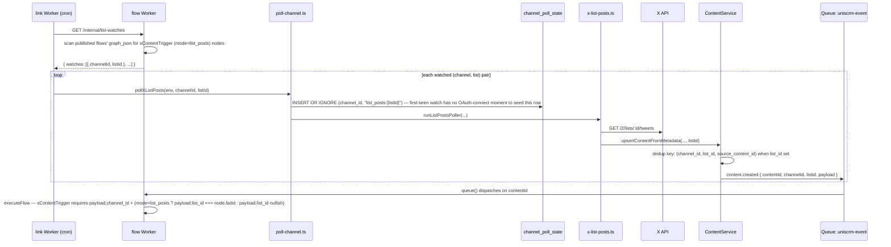

# X List Posts Trigger Implementation Plan

> **For agentic workers:** REQUIRED SUB-SKILL: Use superpowers:subagent-driven-development (recommended) or superpowers:executing-plans to implement this plan task-by-task. Steps use checkbox (`- [ ]`) syntax for tracking.

**Goal:** Replace the generic `contentTrigger` flow node with a platform-specific `xContentTrigger` node that supports a new "List Posts" mode — polling an X List (via `get-owned-lists` + `get-list-posts`) so flows can trigger on other accounts' posts, not just the tenant's own content.

**Architecture:** `link` gains a new poller (`x-list-posts.ts`) that treats each `(channel, list)` pair as its own polling target, reusing `ContentService`'s existing dedup/emission pipeline with a widened dedup key (`channel_id, list_id, source_content_id`) so the same tweet in two different lists fires independently. Since which lists are wanted lives in `flow`'s `graph_json` (a separate DB `link` can't query directly), `link`'s cron pulls the current demand from a new `flow` internal endpoint before each polling cycle. `flow`'s engine gains a required channel/list match clause for the new node type — today's `contentTrigger` never filtered by source at all.

**Tech Stack:** Cloudflare Workers (Hono), D1, Cloudflare Queues, React + Zustand (`@xyflow/react`), Vitest (`vitest-pool-workers` for `flow`, plain Vitest mocks for `link`).

## Global Constraints

- No real customers yet — the tenant-DB schema change (Task 1) ships via a direct `TENANT_DB_INIT_SQL` edit + one-time `wrangler d1 execute` against existing dev tenant DBs, not a general-purpose migration runner.
- `xContentTrigger` **replaces** `contentTrigger` outright — no dual-support period, no data migration for existing flows (clean cutover, confirmed with the project owner).
- Every existing poller (X own-posts, TikTok content, Notion, manual sync) must keep writing/deduping exactly as today — all existing `content` rows have `list_id IS NULL`, and the existing partial-index-scoped dedup path must be behaviorally identical to the current unconditional one for those rows.
- Per-list independent firing is a deliberate design choice, not something to "simplify" back to global (channel-only) dedup: the same tweet appearing in two different monitored Lists must fire both lists' flows independently.
- `list_id` does **not** join the R2 analytics pipeline stream schema or the compactor's dedup key in this phase — two D1 rows for the same tweet (one per list) intentionally collapse to one row in R2 analytics; this is accepted, not treated as a bug.
- Third-party API actions (per `flow/CLAUDE.md`) get `success`/`failed` branches; internal-service actions get one branch. This plan adds no new action types, so this only matters for code review context on the surrounding engine code.

---

## Task 1: Tenant DB schema — `content.list_id` + per-list dedup indexes

**Files:**
- Modify: `admin/src/services/tenant-init-sql.ts:52-81`
- No test file (this array has no existing unit test — it's exercised indirectly by every module that queries `content`, covered in Task 2).

**Interfaces:**
- Produces: `content.list_id TEXT` column (nullable), and two partial unique indexes replacing the single `idx_content_channel_source`, consumed by Task 2's `ContentService.upsertContentFromMetadata`.

- [ ] **Step 1: Confirm the partial-index UPSERT syntax works (already verified — record the confirmed SQL)**

This was verified against SQLite 3.51 (D1's engine) before writing this plan:

```sql
CREATE TABLE content (id TEXT PRIMARY KEY, channel_id TEXT, source_content_id TEXT NOT NULL, list_id TEXT, content_text TEXT);
CREATE UNIQUE INDEX idx_content_channel_source ON content(channel_id, source_content_id) WHERE list_id IS NULL;
CREATE UNIQUE INDEX idx_content_channel_list_source ON content(channel_id, list_id, source_content_id) WHERE list_id IS NOT NULL;

INSERT INTO content (id, channel_id, source_content_id, list_id, content_text) VALUES ('a', 'chan1', 't1', NULL, 'v1')
  ON CONFLICT(channel_id, source_content_id) WHERE list_id IS NULL DO UPDATE SET content_text = excluded.content_text;
```

Confirmed behavior: re-polling the same non-list tweet updates the existing row (no duplicate); the same tweet via two different `list_id`s produces two separate rows; re-polling the same tweet via the same list updates that list's row (no duplicate). No further verification step needed — proceed directly to Step 2.

- [ ] **Step 2: Update `TENANT_DB_INIT_SQL`'s `content` table + indexes**

In `admin/src/services/tenant-init-sql.ts`, the `content` table CREATE currently ends `raw_data TEXT NOT NULL DEFAULT '{}', created_at TEXT NOT NULL, updated_at TEXT NOT NULL)`. Add `list_id` and replace the single unique index:

```ts
  `CREATE TABLE IF NOT EXISTS content (
    id TEXT PRIMARY KEY,
    channel_id TEXT,
    channel_type TEXT NOT NULL,
    content_type TEXT,
    source_content_id TEXT NOT NULL,
    list_id TEXT,
    title TEXT,
    content_text TEXT,
    summary TEXT,
    status TEXT DEFAULT 'new',
    source_url TEXT,
    source_updated_at TEXT,
    source_created_at TEXT,
    bookmark_count INTEGER,
    view_count INTEGER,
    like_count INTEGER,
    quote_count INTEGER,
    reply_count INTEGER,
    repost_count INTEGER,
    share_count INTEGER,
    cover_image_url TEXT,
    duration INTEGER,
    height INTEGER,
    width INTEGER,
    raw_data TEXT NOT NULL DEFAULT '{}',
    created_at TEXT NOT NULL,
    updated_at TEXT NOT NULL
  )`,
  `CREATE UNIQUE INDEX IF NOT EXISTS idx_content_channel_source ON content(channel_id, source_content_id) WHERE list_id IS NULL`,
  `CREATE UNIQUE INDEX IF NOT EXISTS idx_content_channel_list_source ON content(channel_id, list_id, source_content_id) WHERE list_id IS NOT NULL`,
  `CREATE INDEX IF NOT EXISTS idx_content_status ON content(status)`,
```

(`list_id` inserted right after `source_content_id` in the column list; the old single `CREATE UNIQUE INDEX ... idx_content_channel_source ON content(channel_id, source_content_id)` line is replaced by the two partial-index lines above — `idx_content_channel_source` is reused as the name for the `list_id IS NULL` variant since it's a drop-in behavioral replacement for existing rows.)

- [ ] **Step 3: Apply the same change to existing dev tenant DB(s) directly**

`TENANT_DB_INIT_SQL` only runs for brand-new tenants (`admin/src/services/tenant-provisioning.ts`'s `provisionDatabase`). Any tenant already provisioned in dev needs the column + index change applied by hand. Find the dev tenant DB(s):

```bash
wrangler d1 execute uniscrm-web-dev --env dev --config web/wrangler.toml --remote \
  --command "SELECT tenant_id, d1_database_id FROM tenants WHERE d1_database_id IS NOT NULL"
```

For each `d1_database_id` returned, run (replace `<DB_ID>`):

```bash
wrangler d1 execute <DB_ID> --env dev --remote --command "
ALTER TABLE content ADD COLUMN list_id TEXT;
DROP INDEX IF EXISTS idx_content_channel_source;
CREATE UNIQUE INDEX idx_content_channel_source ON content(channel_id, source_content_id) WHERE list_id IS NULL;
CREATE UNIQUE INDEX idx_content_channel_list_source ON content(channel_id, list_id, source_content_id) WHERE list_id IS NOT NULL;
"
```

Expected output: no errors; a second `SELECT sql FROM sqlite_master WHERE name LIKE 'idx_content_channel%'` against the same DB should show both partial indexes with their `WHERE` clauses.

- [ ] **Step 4: Commit**

```bash
git add admin/src/services/tenant-init-sql.ts
git commit -m "feat(admin): add content.list_id + per-list dedup indexes to tenant DB schema"
```

---

## Task 2: `ContentService.upsertContentFromMetadata` — per-list dedup + `listId` in emitted event

**Files:**
- Modify: `link/src/services/content.ts:141-240`
- Test: `link/tests/services/content.test.ts`

**Interfaces:**
- Consumes: Task 1's `content.list_id` column + partial indexes.
- Produces: `upsertContentFromMetadata(rawItem, resolvedProps, channelId, channelType, emitFlowEvent, listId?)` — new optional 6th parameter, `listId?: string`. When provided, the emitted `content.created` message gains a `listId` field. Consumed by Task 3 (`FlowQueueMessage.listId`) and Task 6 (the new list-posts poller calls this with `listId` set).

- [ ] **Step 1: Write the failing tests**

Add to `link/tests/services/content.test.ts`, inside a new `describe` block after the existing `content.created emission` block (before the closing `});` of the outer `describe("ContentService.upsertContentFromMetadata", ...)`):

```ts
  describe("per-list dedup (listId param)", () => {
    it("omits list_id from the SQL and matches today's dedup exactly when listId is not passed", async () => {
      tenantDb.query.mockResolvedValue([]);
      await service.upsertContentFromMetadata({ id: "t1" }, { source_content_id: "t1" }, "chan1", "X", false);

      const [querySql, queryParams] = tenantDb.query.mock.calls[0];
      expect(querySql).toContain("list_id IS NULL");
      expect(queryParams).toEqual(["chan1", "t1"]);

      const [insertSql] = tenantDb.run.mock.calls[0];
      expect(insertSql).toContain("ON CONFLICT(channel_id, source_content_id) WHERE list_id IS NULL DO UPDATE SET");
    });

    it("scopes the existing-row lookup and conflict target by listId when provided", async () => {
      tenantDb.query.mockResolvedValue([]);
      await service.upsertContentFromMetadata({ id: "t2" }, { source_content_id: "t2" }, "chan1", "X", false, "listA");

      const [querySql, queryParams] = tenantDb.query.mock.calls[0];
      expect(querySql).toContain("list_id = ?");
      expect(queryParams).toEqual(["chan1", "t2", "listA"]);

      const [insertSql, insertParams] = tenantDb.run.mock.calls[0];
      expect(insertSql).toContain("ON CONFLICT(channel_id, list_id, source_content_id) WHERE list_id IS NOT NULL DO UPDATE SET");
      expect(insertParams).toEqual(expect.arrayContaining(["listA"]));
    });

    it("treats the same source_content_id in two different lists as two separate new rows", async () => {
      tenantDb.query.mockResolvedValue([]); // both lookups find nothing existing
      const isNewA = await service.upsertContentFromMetadata({ id: "t3" }, { source_content_id: "t3" }, "chan1", "X", false, "listA");
      const isNewB = await service.upsertContentFromMetadata({ id: "t3" }, { source_content_id: "t3" }, "chan1", "X", false, "listB");

      expect(isNewA).toBe(true);
      expect(isNewB).toBe(true);
      expect(tenantDb.run).toHaveBeenCalledTimes(2);
    });

    it("includes listId in the emitted content.created message when provided", async () => {
      const flowQueue = { send: vi.fn().mockResolvedValue(undefined) };
      const svc = new ContentService(tenantDb as any, vectorize as any, ai as any, 42, undefined, flowQueue as any);
      tenantDb.query.mockResolvedValue([]);

      await svc.upsertContentFromMetadata({ id: "t4" }, { source_content_id: "t4" }, "chan1", "X", true, "listA");

      expect(flowQueue.send).toHaveBeenCalledTimes(1);
      const [msg] = flowQueue.send.mock.calls[0];
      expect(msg).toMatchObject({ eventType: "content.created", channelId: "chan1", listId: "listA" });
    });

    it("omits listId from the emitted message entirely when not provided (not just undefined)", async () => {
      const flowQueue = { send: vi.fn().mockResolvedValue(undefined) };
      const svc = new ContentService(tenantDb as any, vectorize as any, ai as any, 42, undefined, flowQueue as any);
      tenantDb.query.mockResolvedValue([]);

      await svc.upsertContentFromMetadata({ id: "t5" }, { source_content_id: "t5" }, "chan1", "X", true);

      const [msg] = flowQueue.send.mock.calls[0];
      expect("listId" in msg).toBe(false);
    });
  });
```

- [ ] **Step 2: Run tests to verify they fail**

Run: `cd link && npx vitest run tests/services/content.test.ts`
Expected: FAIL — the new tests fail because `upsertContentFromMetadata` doesn't accept a 6th param yet and the SQL doesn't contain `list_id IS NULL` / `list_id = ?`.

- [ ] **Step 3: Implement**

In `link/src/services/content.ts`, replace the `upsertContentFromMetadata` method body (lines 141-240) with:

```ts
  async upsertContentFromMetadata(
    rawItem: Record<string, unknown>,
    resolvedProps: Record<string, unknown>,
    channelId: string,
    channelType: ChannelType,
    emitFlowEvent: boolean,
    listId?: string
  ): Promise<boolean> {
    const sourceContentId = String(resolvedProps.source_content_id ?? "");
    if (!sourceContentId) throw new Error("upsertContentFromMetadata: missing source_content_id");

    const existing = listId
      ? await this.tenantDb.query<Record<string, unknown> & { id: string }>(
          `SELECT id, ${CONTENT_TABLE_COLUMNS.join(", ")} FROM content WHERE channel_id = ? AND source_content_id = ? AND list_id = ?`,
          [channelId, sourceContentId, listId]
        )
      : await this.tenantDb.query<Record<string, unknown> & { id: string }>(
          `SELECT id, ${CONTENT_TABLE_COLUMNS.join(", ")} FROM content WHERE channel_id = ? AND source_content_id = ? AND list_id IS NULL`,
          [channelId, sourceContentId]
        );
    const isNew = existing.length === 0;
    const id = isNew ? crypto.randomUUID() : existing[0].id;
    const now = new Date().toISOString();
    const rawData = JSON.stringify(rawItem);

    const columnValues: Record<string, unknown> = {};
    for (const [propId, column] of Object.entries(CONTENT_COLUMN_MAP)) {
      const val = resolvedProps[propId];
      if (val !== undefined && val !== null && val !== "") columnValues[column] = val;
    }
    const dynamicCols = Object.keys(columnValues);
    // Incremental poller re-walks recently-seen posts every cron tick (see
    // pollers/x-posts.ts's runIncrementalPoll) — without this check, every visit resends
    // an unchanged content row to the R2 pipeline, which has no dedup on write (append-only
    // Iceberg sink; see docs/adr/0002-r2-data-catalog-dedup-via-periodic-compaction.md).
    const unchanged = !isNew && dynamicCols.every((c) => String(columnValues[c]) === String(existing[0][c] ?? ""));

    const insertCols = ["id", "channel_id", "channel_type", "source_content_id", "list_id", "raw_data", ...dynamicCols, "created_at", "updated_at"];
    const insertPlaceholders = ["?", "?", "?", "?", "?", "?", ...dynamicCols.map(() => "?"), "?", "?"];
    const insertParams = [id, channelId, channelType, sourceContentId, listId ?? null, rawData, ...dynamicCols.map((c) => columnValues[c]), now, now];
    const updateSets = [
      "raw_data = json_patch(content.raw_data, excluded.raw_data)",
      "updated_at = excluded.updated_at",
      ...dynamicCols.map((c) => `${c} = excluded.${c}`),
    ];
    const conflictTarget = listId
      ? "(channel_id, list_id, source_content_id) WHERE list_id IS NOT NULL"
      : "(channel_id, source_content_id) WHERE list_id IS NULL";

    await this.tenantDb.run(
      `INSERT INTO content (${insertCols.join(", ")})
       VALUES (${insertPlaceholders.join(", ")})
       ON CONFLICT${conflictTarget} DO UPDATE SET
         ${updateSets.join(",\n         ")}`,
      insertParams
    );

    await this.embedContents([{
      id,
      channel_id: channelId,
      channel_type: channelType,
      content_type: (columnValues.content_type as string) ?? null,
      source_content_id: sourceContentId,
      title: null,
      content_text: (columnValues.content_text as string) ?? null,
      summary: null,
      status: "new",
      source_url: null,
      source_updated_at: null,
      source_created_at: (columnValues.source_created_at as string) ?? null,
      raw_data: rawData,
      created_at: now,
      updated_at: now,
    }]);

    if (this.pipelineContent && this.tenantId && !unchanged) {
      const record: Record<string, unknown> = {
        tenant_id: this.tenantId,
        id,
        channel_id: channelId,
        channel_type: channelType,
        source_content_id: sourceContentId,
        created_at: now,
        updated_at: now,
      };
      // Only isInsight-marked props reach R2 — free-text fields like title/content_text
      // stay D1-only (raw_data), same rule x-users.ts follows for the user pipeline.
      // list_id intentionally does not join this record — R2 analytics collapses the same
      // tweet seen via two lists into one row, which is accepted for this phase (see plan's
      // Global Constraints).
      for (const prop of INSIGHT_PROPS) {
        if (prop.propId in resolvedProps) record[prop.propId] = resolvedProps[prop.propId];
      }
      await this.pipelineContent.send([record]).catch((err) => {
        console.error(JSON.stringify({ event: "pipeline_content_error", error: String(err) }));
      });
    }

    if (isNew && emitFlowEvent && this.flowQueue) {
      await this.flowQueue.send({
        tenantId: String(this.tenantId),
        eventType: "content.created",
        contentId: id,
        channelId,
        ...(listId ? { listId } : {}),
        payload: { channel_type: channelType, ...resolvedProps },
      }).catch((err) => {
        console.error(JSON.stringify({ event: "content_flow_queue_send_error", contentId: id, error: String(err) }));
      });
    }

    return isNew;
  }
```

- [ ] **Step 4: Run tests to verify they pass**

Run: `cd link && npx vitest run tests/services/content.test.ts`
Expected: PASS — all existing tests (which call the method without a 6th argument) continue to pass unchanged, plus the 5 new tests.

- [ ] **Step 5: Commit**

```bash
git add link/src/services/content.ts link/tests/services/content.test.ts
git commit -m "feat(link): per-list content dedup in ContentService.upsertContentFromMetadata"
```

---

## Task 3: `FlowQueueMessage.listId` + `xContentTrigger` engine matching (backend rename)

**Files:**
- Modify: `flow/src/types.ts:31-38`
- Modify: `flow/src/engine.ts:163-167`
- Modify: `flow/src/index.ts:735-786` (queue handler's `contentId` branch)
- Test: `flow/tests/unit/engine.test.ts` (rewrite the `contentTrigger` describe blocks)
- Test: `flow/tests/unit/queue-content.test.ts` (rename fixture node type + add required fields)
- Test: `flow/tests/unit/scheduled-content.test.ts` (rename fixture node type only)

**Interfaces:**
- Consumes: Task 2's `listId` field on the emitted `content.created` message.
- Produces: `executeFlow`'s trigger match for `xContentTrigger` nodes, requiring `n.data.channelId === payload.channel_id` and (for `mode: "list_posts"`) `n.data.listId === payload.list_id`. Consumed by Task 10-13 (frontend node writes `data.channelId`/`data.mode`/`data.listId` in this shape).

- [ ] **Step 1: Write the failing tests — replace `engine.test.ts`'s `contentTrigger` coverage**

Replace lines 1-45 of `flow/tests/unit/engine.test.ts` (the `describe("executeFlow: contentTrigger", ...)` block) with:

```ts
import { describe, it, expect } from "vitest";
import { executeFlow, resumeFromNode, type FlowGraph } from "../../src/engine";

describe("executeFlow: xContentTrigger", () => {
  function graphWithXContentTrigger(
    conditions: { field: string; operator: string; value: string }[],
    data: Record<string, unknown> = {}
  ): FlowGraph {
    return {
      nodes: [
        { id: "t1", type: "xContentTrigger", data: { channelId: "chan1", mode: "my_posts", conditions, ...data }, position: { x: 0, y: 0 } },
        { id: "a1", type: "action", data: { actionType: "updateContentStatus", status: "published" }, position: { x: 200, y: 0 } },
      ],
      edges: [{ id: "e1", source: "t1", target: "a1" }],
    };
  }

  it("matches a My Posts node when channel_id matches and no list_id is on the payload", () => {
    const result = executeFlow(graphWithXContentTrigger([]), "content.created", { channel_id: "chan1", channel_type: "X" });
    expect(result.matched).toBe(true);
    expect(result.actions).toHaveLength(1);
    expect(result.actions[0]).toMatchObject({ type: "updateContentStatus" });
  });

  it("does not match a My Posts node for a different channel_id", () => {
    const result = executeFlow(graphWithXContentTrigger([]), "content.created", { channel_id: "chan-other", channel_type: "X" });
    expect(result.matched).toBe(false);
  });

  it("does not match a My Posts node when the event carries a list_id (list-sourced content must not fire My Posts flows)", () => {
    const result = executeFlow(graphWithXContentTrigger([]), "content.created", { channel_id: "chan1", list_id: "listA", channel_type: "X" });
    expect(result.matched).toBe(false);
  });

  it("matches a List Posts node only when both channel_id and list_id match", () => {
    const graph = graphWithXContentTrigger([], { mode: "list_posts", listId: "listA" });
    const matches = executeFlow(graph, "content.created", { channel_id: "chan1", list_id: "listA", channel_type: "X" });
    expect(matches.matched).toBe(true);

    const wrongList = executeFlow(graph, "content.created", { channel_id: "chan1", list_id: "listB", channel_type: "X" });
    expect(wrongList.matched).toBe(false);

    const noList = executeFlow(graph, "content.created", { channel_id: "chan1", channel_type: "X" });
    expect(noList.matched).toBe(false);
  });

  it("does not match when a condition fails", () => {
    const graph = graphWithXContentTrigger([{ field: "channel_type", operator: "==", value: "TIKTOK" }]);
    const result = executeFlow(graph, "content.created", { channel_id: "chan1", channel_type: "X" });
    expect(result.matched).toBe(false);
    expect(result.actions).toHaveLength(0);
  });

  it("does not match on an unrelated eventType", () => {
    const result = executeFlow(graphWithXContentTrigger([]), "follow.followed", { channel_id: "chan1", channel_type: "X" });
    expect(result.matched).toBe(false);
  });

  it("still matches xTrigger nodes unaffected by the new xContentTrigger clause", () => {
    const graph: FlowGraph = {
      nodes: [
        { id: "t1", type: "xTrigger", data: { eventType: "follow.followed", conditions: [] }, position: { x: 0, y: 0 } },
        { id: "a1", type: "action", data: { actionType: "addToList", listId: "l1" }, position: { x: 200, y: 0 } },
      ],
      edges: [{ id: "e1", source: "t1", target: "a1" }],
    };
    const result = executeFlow(graph, "follow.followed", {});
    expect(result.matched).toBe(true);
  });
});
```

Then, in the same file, update the three remaining fixtures that use `type: "contentTrigger"` (in `describe("collectActions: new content-domain action types", ...)` and `describe("resumeFromNode: ...")`) — these test action collection, not trigger matching, so only the node `type` string and `data` need updating to keep them internally consistent; find each occurrence of:

```ts
{ id: "t1", type: "contentTrigger", data: { conditions: [] }, position: { x: 0, y: 0 } },
```

and replace with:

```ts
{ id: "t1", type: "xContentTrigger", data: { channelId: "chan1", mode: "my_posts", conditions: [] }, position: { x: 0, y: 0 } },
```

and change the corresponding `executeFlow(graph, "content.created", {})` calls in those same tests (the three `it(...)` blocks under `describe("collectActions: new content-domain action types", ...)`) to pass a matching payload:

```ts
executeFlow(graph, "content.created", { channel_id: "chan1" })
```

(`resumeFromNode` calls in the `describe("resumeFromNode: ...")` block are unaffected — `resumeFromNode` doesn't re-run trigger matching, so those fixtures' trigger node is inert scaffolding; leave their `executeFlow`-free bodies as-is except renaming the literal type string for consistency, per the plan's clean-cutover constraint of not leaving `contentTrigger` referenced anywhere.)

- [ ] **Step 2: Run tests to verify they fail**

Run: `cd flow && npx vitest run tests/unit/engine.test.ts`
Expected: FAIL — `xContentTrigger` isn't matched by `executeFlow` yet (falls through to `matched: false` for every new test).

- [ ] **Step 3: Implement — `types.ts`**

In `flow/src/types.ts`, update `FlowQueueMessage` (lines 31-38):

```ts
export interface FlowQueueMessage {
  tenantId: string;
  eventType: string;
  channelId: string;
  payload: Record<string, unknown>;
  userId?: string;    // present for user-domain events (follow/DM/post webhooks)
  contentId?: string; // present for content-domain events (content.created) — mutually exclusive with userId
  listId?: string;    // present only for list-sourced content.created events (xContentTrigger List Posts mode)
}
```

- [ ] **Step 4: Implement — `engine.ts`**

In `flow/src/engine.ts`, replace the `triggerNodes` filter inside `executeFlow` (lines 163-167):

```ts
  const triggerNodes = graph.nodes.filter(
    (n) => (n.type === "xTrigger" && (n.data.eventType === eventType || n.data.triggerType === eventType))
      || (n.type === "cronTrigger" && eventType === "cron.trigger")
      || (n.type === "xContentTrigger" && eventType === "content.created"
          && n.data.channelId === payload.channel_id
          && (n.data.mode === "list_posts"
              ? n.data.listId === payload.list_id
              : payload.list_id === undefined || payload.list_id === null))
  );
```

- [ ] **Step 5: Implement — `index.ts`'s queue handler payload merge**

In `flow/src/index.ts`, the `queue()` handler's `contentId` branch (around line 737-786) currently destructures `payload` and passes it straight into `executeFlow`/uses `{ ...payload, channel_id: channelId }` separately when scheduling waits. Replace the destructure line and the loop so both call sites share one merged payload:

Replace:

```ts
        const { tenantId, eventType, userId, contentId, channelId, payload } = message.body as FlowQueueMessage;
```

with:

```ts
        const { tenantId, eventType, userId, contentId, channelId, listId, payload } = message.body as FlowQueueMessage;
```

Then, inside the `if (contentId) { ... }` block, immediately before `for (const flow of rows.results) {`, add:

```ts
          const matchPayload = { ...payload, channel_id: channelId, ...(listId ? { list_id: listId } : {}) };
```

and change the loop body's `executeFlow(graph, eventType, payload)` call to `executeFlow(graph, eventType, matchPayload)`. Then replace both occurrences inside that same `contentId` block of:

```ts
JSON.stringify({ ...payload, channel_id: channelId })
```

with:

```ts
JSON.stringify(matchPayload)
```

(These are the `content_flow_pending` INSERT for `result.pendingWaits` inside the `for (const flow of rows.results)` loop, and — check carefully — there is only one such occurrence inside the `contentId` block; the other `{ ...payload, channel_id: channelId }` you may see belongs to `executeContentActions`'s pending-wait scheduling deeper in the file, which is a **different, unrelated payload variable in a different function** and must NOT be touched.)

- [ ] **Step 6: Update `queue-content.test.ts` and `scheduled-content.test.ts` fixtures**

In `flow/tests/unit/queue-content.test.ts`, every graph fixture's trigger node currently reads:

```ts
{ id: "t1", type: "contentTrigger", data: { conditions: [] }, position: { x: 0, y: 0 } },
```

Replace each with (there are 3 occurrences: `graphContentToStatus` at the top, and two more inside the `describe("queue(): xContentAction branch resolution", ...)` block — `graphWithBranchesObj` and `graphWithInterpolation`):

```ts
{ id: "t1", type: "xContentTrigger", data: { channelId: "chan-1", mode: "my_posts", conditions: [] }, position: { x: 0, y: 0 } },
```

Match each fixture's `channelId` to that test's `makeBatch(...)` `channelId` value: `graphContentToStatus`'s tests use `channelId: "chan-1"` (both `it` blocks) — use `"chan-1"`. `graphWithBranchesObj`'s tests use `channelId: "src-chan"` — use `"src-chan"`. `graphWithInterpolation` also uses `channelId: "src-chan"` — use `"src-chan"`.

In `flow/tests/unit/scheduled-content.test.ts`, the two `type: "contentTrigger"` occurrences (`graphWithWait` and `graphWithBranches`) are only ever reached via `resumeFromNode` (never `executeFlow`), so trigger matching never runs against them — rename the type string only, for consistency, no `data` changes needed:

```ts
{ id: "t1", type: "xContentTrigger", data: { conditions: [] }, position: { x: 0, y: 0 } },
```

- [ ] **Step 7: Run tests to verify they pass**

Run: `cd flow && npx vitest run tests/unit/engine.test.ts tests/unit/queue-content.test.ts tests/unit/scheduled-content.test.ts`
Expected: PASS — all tests green.

- [ ] **Step 8: Commit**

```bash
git add flow/src/types.ts flow/src/engine.ts flow/src/index.ts flow/tests/unit/engine.test.ts flow/tests/unit/queue-content.test.ts flow/tests/unit/scheduled-content.test.ts
git commit -m "feat(flow): xContentTrigger engine matching by channel+list, replacing contentTrigger"
```

---

## Task 4: `metadata/x-byok.ts` — `get-list-posts` content mapping

**Files:**
- Modify: `metadata/x-byok.ts:25-43`

**Interfaces:**
- Produces: `ContentMetadata_X` gains a `sourceContentType: "get-list-posts"` entry. Consumed by Task 6's poller.

- [ ] **Step 1: Add the entry**

In `metadata/x-byok.ts`, add a second entry to the `ContentMetadata_X` array (after the existing `"get-posts"` entry, before the closing `];`):

```ts
  {
    sourceContentType: "get-list-posts", // https://docs.x.com/x-api/lists/get-list-posts
    linkPrefix: "data[]",
    contentProps: [
      { propId: "content_type", value: "TWEET" },
      { propId: "source_content_id", dataId: "{linkPrefix}.id" },
      { propId: "source_created_at", dataId: "{linkPrefix}.created_at" },
      { propId: "title", dataId: "{linkPrefix}.article.title" },
      { propId: "content_text", dataId: "{linkPrefix}.text" },
      { propId: "bookmark_count", dataId: "{linkPrefix}.public_metrics.bookmark_count" },
      { propId: "view_count", dataId: "{linkPrefix}.public_metrics.impression_count" },
      { propId: "like_count", dataId: "{linkPrefix}.public_metrics.like_count" },
      { propId: "quote_count", dataId: "{linkPrefix}.public_metrics.quote_count" },
      { propId: "reply_count", dataId: "{linkPrefix}.public_metrics.reply_count" },
      { propId: "repost_count", dataId: "{linkPrefix}.public_metrics.retweet_count" },
    ],
  },
```

This is identical to the `"get-posts"` mapping — List Tweets returns the same X Tweet object shape as the user-tweets endpoint. Kept as a separate entry (rather than reusing `"get-posts"`) to match this file's one-entry-per-endpoint convention and to avoid coupling the two pollers if the shapes ever diverge.

- [ ] **Step 2: No test needed** — this is a static declarative mapping array with no branching logic; it's exercised end-to-end by Task 6's poller tests via `resolveProps`.

- [ ] **Step 3: Commit**

```bash
git add metadata/x-byok.ts
git commit -m "feat(metadata): add get-list-posts content mapping for X List Posts trigger"
```

---

## Task 5: `link` X API client — `fetchOwnedLists` + `fetchListPostsPage`

**Files:**
- Modify: `link/src/services/x-posts-api.ts`
- Test: `link/tests/services/x-posts-api.test.ts`

**Interfaces:**
- Produces: `fetchOwnedLists(accessToken: string, xUserId: string): Promise<{ id: string; name: string }[]>` and `fetchListPostsPage(accessToken: string, listId: string, paginationToken?: string): Promise<XPostsFetchResult>` (reuses the existing `XPostsFetchResult`/`XPostsPage` types). Consumed by Task 6 (poller) and Task 9 (lists dropdown proxy route).

- [ ] **Step 1: Read the existing test file's conventions**

`link/tests/services/x-posts-api.test.ts` already covers `fetchPostsPage`/`createPost` with `vi.stubGlobal("fetch", ...)`. Add new tests following the same pattern — open the file first to match its exact `beforeEach`/`afterEach` stub setup before adding the block below (do not duplicate the stub setup if a shared one already wraps the whole file).

- [ ] **Step 2: Write the failing tests**

Add to `link/tests/services/x-posts-api.test.ts`:

```ts
import { fetchOwnedLists, fetchListPostsPage } from "../../src/services/x-posts-api";

describe("fetchOwnedLists", () => {
  it("returns id/name pairs from get-owned-lists", async () => {
    const fetchMock = vi.fn().mockResolvedValue(
      new Response(JSON.stringify({ data: [{ id: "list1", name: "Competitors" }, { id: "list2", name: "Influencers" }] }), { status: 200 })
    );
    vi.stubGlobal("fetch", fetchMock);

    const lists = await fetchOwnedLists("tok", "x-user-1");

    expect(lists).toEqual([{ id: "list1", name: "Competitors" }, { id: "list2", name: "Influencers" }]);
    const [url] = fetchMock.mock.calls[0];
    expect(String(url)).toContain("/2/users/x-user-1/owned_lists");
    vi.unstubAllGlobals();
  });

  it("returns an empty array when the account owns no lists", async () => {
    vi.stubGlobal("fetch", vi.fn().mockResolvedValue(new Response(JSON.stringify({}), { status: 200 })));
    const lists = await fetchOwnedLists("tok", "x-user-1");
    expect(lists).toEqual([]);
    vi.unstubAllGlobals();
  });

  it("throws XUnauthorizedError on 401", async () => {
    const { XUnauthorizedError } = await import("../../src/services/x-errors");
    vi.stubGlobal("fetch", vi.fn().mockResolvedValue(new Response("", { status: 401 })));
    await expect(fetchOwnedLists("tok", "x-user-1")).rejects.toBeInstanceOf(XUnauthorizedError);
    vi.unstubAllGlobals();
  });
});

describe("fetchListPostsPage", () => {
  it("requests /2/lists/:id/tweets with the list id and pagination token", async () => {
    const fetchMock = vi.fn().mockResolvedValue(
      new Response(JSON.stringify({ data: [{ id: "t1", text: "hi" }], meta: { next_token: "p2" } }), { status: 200 })
    );
    vi.stubGlobal("fetch", fetchMock);

    const { page, rateLimited } = await fetchListPostsPage("tok", "listA", "p1");

    expect(rateLimited).toBe(false);
    expect(page).toEqual({ data: [{ id: "t1", text: "hi" }], nextToken: "p2" });
    const [url] = fetchMock.mock.calls[0];
    expect(String(url)).toContain("/2/lists/listA/tweets");
    expect(String(url)).toContain("pagination_token=p1");
    vi.unstubAllGlobals();
  });

  it("returns rateLimited:true on 429 without throwing", async () => {
    vi.stubGlobal("fetch", vi.fn().mockResolvedValue(new Response("", { status: 429 })));
    const { rateLimited } = await fetchListPostsPage("tok", "listA");
    expect(rateLimited).toBe(true);
    vi.unstubAllGlobals();
  });
});
```

- [ ] **Step 3: Run tests to verify they fail**

Run: `cd link && npx vitest run tests/services/x-posts-api.test.ts`
Expected: FAIL — `fetchOwnedLists`/`fetchListPostsPage` are not exported yet.

- [ ] **Step 4: Implement**

In `link/src/services/x-posts-api.ts`, append after the existing `fetchPostsPage` function (after line 68, before `export interface CreatePostResult`):

```ts
export interface XOwnedList {
  id: string;
  name: string;
}

export async function fetchOwnedLists(accessToken: string, xUserId: string): Promise<XOwnedList[]> {
  const url = new URL(`https://api.x.com/2/users/${xUserId}/owned_lists`);
  url.searchParams.set("max_results", "100");

  const res = await fetch(url.toString(), {
    headers: { Authorization: `Bearer ${accessToken}` },
  });

  if (res.status === 401) {
    throw new XUnauthorizedError(`X get-owned-lists failed: ${res.status} ${await res.text()}`);
  }
  if (!res.ok) {
    throw new Error(`X get-owned-lists failed: ${res.status} ${await res.text()}`);
  }

  const body = (await res.json()) as { data?: { id: string; name: string }[] };
  return (body.data || []).map((l) => ({ id: l.id, name: l.name }));
}

export async function fetchListPostsPage(
  accessToken: string,
  listId: string,
  paginationToken?: string
): Promise<XPostsFetchResult> {
  const url = new URL(`https://api.x.com/2/lists/${listId}/tweets`);
  url.searchParams.set("max_results", "100");
  url.searchParams.set("tweet.fields", TWEET_FIELDS);
  if (paginationToken) url.searchParams.set("pagination_token", paginationToken);

  const res = await fetch(url.toString(), {
    headers: { Authorization: `Bearer ${accessToken}` },
  });

  if (res.status === 429) {
    return { page: { data: [] }, rateLimited: true };
  }
  if (res.status === 401) {
    throw new XUnauthorizedError(`X get-list-posts failed: ${res.status} ${await res.text()}`);
  }
  if (!res.ok) {
    throw new Error(`X get-list-posts failed: ${res.status} ${await res.text()}`);
  }

  const body = (await res.json()) as { data?: Record<string, unknown>[]; meta?: { next_token?: string } };
  return { page: { data: body.data || [], nextToken: body.meta?.next_token }, rateLimited: false };
}
```

Add the import at the top of the file (line 1 already has `import { XUnauthorizedError } from "./x-errors";` — no change needed there, it's already imported).

- [ ] **Step 5: Run tests to verify they pass**

Run: `cd link && npx vitest run tests/services/x-posts-api.test.ts`
Expected: PASS.

- [ ] **Step 6: Commit**

```bash
git add link/src/services/x-posts-api.ts link/tests/services/x-posts-api.test.ts
git commit -m "feat(link): fetchOwnedLists + fetchListPostsPage X API client functions"
```

---

## Task 6: `link` — new poller `x-list-posts.ts`

**Files:**
- Create: `link/src/services/pollers/x-list-posts.ts`
- Test: `link/tests/services/pollers/x-list-posts.test.ts`

**Interfaces:**
- Consumes: Task 2's `upsertContentFromMetadata(..., listId)`, Task 4's `"get-list-posts"` metadata entry, Task 5's `fetchListPostsPage`.
- Produces: `runListPostsPoller(ctx: ListPostsPollerContext): Promise<void>`. Consumed by Task 8's cron integration.

- [ ] **Step 1: Write the failing tests**

Create `link/tests/services/pollers/x-list-posts.test.ts`, modeled directly on `link/tests/services/x-posts.test.ts`:

```ts
import { describe, it, expect, vi, beforeEach, afterEach } from "vitest";
import { runListPostsPoller } from "../../../src/services/pollers/x-list-posts";

function createMockLinkDb(initialState: { cursor: string | null; backfill_complete: number; last_polled_at: string | null } | null) {
  const state = { ...initialState } as any;
  const first = vi.fn().mockImplementation(() => Promise.resolve(state ? { ...state } : null));
  const run = vi.fn().mockImplementation(() => Promise.resolve({ success: true }));
  const bind = vi.fn().mockReturnValue({ first, run });
  const prepare = vi.fn().mockReturnValue({ bind });
  return { prepare, _state: state, _run: run, _bind: bind };
}

function createMockTenantDb() {
  return {
    query: vi.fn().mockResolvedValue([]),
    run: vi.fn().mockResolvedValue({ changes: 1 }),
    batch: vi.fn(),
    getDbId: vi.fn().mockReturnValue("db-1"),
  };
}

function createMockAi() {
  return { run: vi.fn().mockResolvedValue({ data: [[0.1, 0.2]] }) };
}

function createMockVectorize() {
  return { upsert: vi.fn().mockResolvedValue(undefined), deleteByIds: vi.fn() };
}

describe("runListPostsPoller", () => {
  let fetchMock: ReturnType<typeof vi.fn>;

  beforeEach(() => {
    fetchMock = vi.fn();
    vi.stubGlobal("fetch", fetchMock);
  });

  afterEach(() => {
    vi.unstubAllGlobals();
  });

  function jsonResponse(body: unknown, status = 200) {
    return Promise.resolve(new Response(JSON.stringify(body), { status }));
  }

  function baseCtx(linkDb: any, tenantDb: any, overrides: Partial<Record<string, unknown>> = {}) {
    return {
      channelId: "chan1", listId: "listA", accessToken: "tok",
      linkDb: linkDb as any, tenantDb: tenantDb as any, tenantId: 1,
      ai: createMockAi() as any, vectorize: createMockVectorize() as any,
      deadline: Date.now() + 20_000,
      ...overrides,
    };
  }

  it("does nothing when no poll_state row exists for this channel+list", async () => {
    const linkDb = createMockLinkDb(null);
    const tenantDb = createMockTenantDb();
    await runListPostsPoller(baseCtx(linkDb, tenantDb));
    expect(fetchMock).not.toHaveBeenCalled();
  });

  it("reads/writes channel_poll_state under poller_name 'list_posts:listA'", async () => {
    const linkDb = createMockLinkDb({ cursor: null, backfill_complete: 1, last_polled_at: "2026-07-10T00:00:00.000Z" });
    const tenantDb = createMockTenantDb();
    fetchMock.mockImplementationOnce(() => jsonResponse({ data: [], meta: {} }));

    await runListPostsPoller(baseCtx(linkDb, tenantDb));

    const selectCall = linkDb.prepare.mock.calls.find((c: unknown[]) => (c[0] as string).includes("SELECT"));
    expect(selectCall[0]).toContain("poller_name = ?");
    const bindCall = linkDb._bind.mock.calls.find((c: unknown[]) => c.includes("list_posts:listA"));
    expect(bindCall).toBeTruthy();
  });

  it("backfill: pages until no next_token, then marks backfill_complete, without emitting content.created", async () => {
    const linkDb = createMockLinkDb({ cursor: null, backfill_complete: 0, last_polled_at: null });
    const tenantDb = createMockTenantDb();
    const flowQueue = { send: vi.fn().mockResolvedValue(undefined) };

    fetchMock
      .mockImplementationOnce(() => jsonResponse({ data: [{ id: "t1", text: "other account's post" }], meta: { next_token: "p2" } }))
      .mockImplementationOnce(() => jsonResponse({ data: [{ id: "t2", text: "another" }], meta: {} }));

    await runListPostsPoller(baseCtx(linkDb, tenantDb, { flowQueue }));

    expect(fetchMock).toHaveBeenCalledTimes(2);
    expect(tenantDb.run).toHaveBeenCalledTimes(2);
    expect(flowQueue.send).not.toHaveBeenCalled();
  });

  it("incremental: emits content.created with listId for new list posts", async () => {
    const linkDb = createMockLinkDb({ cursor: null, backfill_complete: 1, last_polled_at: "2026-07-10T00:00:00.000Z" });
    const tenantDb = createMockTenantDb();
    const flowQueue = { send: vi.fn().mockResolvedValue(undefined) };

    fetchMock.mockImplementationOnce(() => jsonResponse({ data: [{ id: "t1", text: "hello" }], meta: {} }));

    await runListPostsPoller(baseCtx(linkDb, tenantDb, { flowQueue }));

    expect(flowQueue.send).toHaveBeenCalledTimes(1);
    expect(flowQueue.send.mock.calls[0][0]).toMatchObject({ eventType: "content.created", channelId: "chan1", listId: "listA" });
  });

  it("passes listId through to upsertContentFromMetadata (via ContentService.upsertContentFromMetadata's list-scoped INSERT)", async () => {
    const linkDb = createMockLinkDb({ cursor: null, backfill_complete: 1, last_polled_at: "2026-07-10T00:00:00.000Z" });
    const tenantDb = createMockTenantDb();
    fetchMock.mockImplementationOnce(() => jsonResponse({ data: [{ id: "t1", text: "hello" }], meta: {} }));

    await runListPostsPoller(baseCtx(linkDb, tenantDb));

    const insertCall = tenantDb.run.mock.calls.find((c: unknown[]) => (c[0] as string).includes("INSERT INTO content"));
    expect(insertCall![0]).toContain("ON CONFLICT(channel_id, list_id, source_content_id) WHERE list_id IS NOT NULL");
    expect(insertCall![1]).toContain("listA");
  });
});
```

- [ ] **Step 2: Run tests to verify they fail**

Run: `cd link && npx vitest run tests/services/pollers/x-list-posts.test.ts`
Expected: FAIL — module doesn't exist yet.

- [ ] **Step 3: Implement**

Create `link/src/services/pollers/x-list-posts.ts`, closely mirroring `x-posts.ts` (`runPostsPoller`) but keyed by list and always passing `listId` through:

```ts
import type { TenantDataDB } from "../../../../shared/tenant-data-db";
import type { Pipeline } from "../../types";
import { ContentService } from "../content";
import { fetchListPostsPage } from "../x-posts-api";
import { resolveProps } from "./resolve-props";
import { ContentMetadata_X } from "../../../../metadata/x-byok";

const LIST_POSTS_METADATA = ContentMetadata_X.find((m) => m.sourceContentType === "get-list-posts")!;

export interface ListPostsPollerContext {
  channelId: string;
  listId: string;
  accessToken: string;
  linkDb: D1Database;
  tenantDb: TenantDataDB;
  tenantId: number;
  ai: Ai;
  vectorize: VectorizeIndex;
  pipelineContent?: Pipeline;
  flowQueue?: Queue;
  deadline: number;
}

interface PollStateRow {
  cursor: string | null;
  backfill_complete: number;
  last_polled_at: string | null;
}

function pollerName(listId: string): string {
  return `list_posts:${listId}`;
}

export async function runListPostsPoller(ctx: ListPostsPollerContext): Promise<void> {
  const name = pollerName(ctx.listId);
  const state = await ctx.linkDb
    .prepare("SELECT cursor, backfill_complete, last_polled_at FROM channel_poll_state WHERE channel_id = ? AND poller_name = ?")
    .bind(ctx.channelId, name)
    .first<PollStateRow>();

  if (!state || Object.keys(state).length === 0) {
    console.log(JSON.stringify({ event: "list_posts_poll_skipped_not_seeded", channel_id: ctx.channelId, list_id: ctx.listId }));
    return;
  }

  const contentService = new ContentService(ctx.tenantDb, ctx.vectorize, ctx.ai, ctx.tenantId, ctx.pipelineContent, ctx.flowQueue);
  const phase = state.backfill_complete ? "incremental" : "backfill";
  console.log(JSON.stringify({ event: "list_posts_poll_started", channel_id: ctx.channelId, list_id: ctx.listId, phase, cursor: state.cursor }));

  if (!state.backfill_complete) {
    await runBackfill(ctx, contentService, state.cursor);
  } else {
    await runIncrementalPoll(ctx, contentService);
  }
}

async function upsertPage(
  contentService: ContentService,
  items: Record<string, unknown>[],
  channelId: string,
  listId: string,
  emitFlowEvent: boolean
): Promise<number> {
  let newCount = 0;
  for (const item of items) {
    const props = resolveProps(item, LIST_POSTS_METADATA.contentProps, LIST_POSTS_METADATA.linkPrefix);
    if (item.article) {
      props.content_type = "ARTICLE";
    }
    const isNew = await contentService.upsertContentFromMetadata(item, props, channelId, "X", emitFlowEvent, listId);
    if (isNew) newCount++;
  }
  return newCount;
}

async function runBackfill(
  ctx: ListPostsPollerContext,
  contentService: ContentService,
  startCursor: string | null
): Promise<void> {
  let cursor = startCursor || undefined;
  let pagesFetched = 0;
  const name = pollerName(ctx.listId);

  while (Date.now() < ctx.deadline) {
    const { page, rateLimited } = await fetchListPostsPage(ctx.accessToken, ctx.listId, cursor);
    if (rateLimited) {
      console.log(JSON.stringify({ event: "list_posts_poll_rate_limited", channel_id: ctx.channelId, list_id: ctx.listId, phase: "backfill", pagesFetched }));
      return;
    }

    pagesFetched++;
    await upsertPage(contentService, page.data, ctx.channelId, ctx.listId, false);

    if (!page.nextToken) {
      await ctx.linkDb
        .prepare(
          "UPDATE channel_poll_state SET cursor = NULL, backfill_complete = 1, last_polled_at = datetime('now'), updated_at = datetime('now') WHERE channel_id = ? AND poller_name = ?"
        )
        .bind(ctx.channelId, name)
        .run();
      console.log(JSON.stringify({ event: "list_posts_poll_backfill_complete", channel_id: ctx.channelId, list_id: ctx.listId, pagesFetched }));
      return;
    }

    cursor = page.nextToken;
    await ctx.linkDb
      .prepare("UPDATE channel_poll_state SET cursor = ?, updated_at = datetime('now') WHERE channel_id = ? AND poller_name = ?")
      .bind(cursor, ctx.channelId, name)
      .run();
  }

  console.log(JSON.stringify({ event: "list_posts_poll_deadline_reached", channel_id: ctx.channelId, list_id: ctx.listId, phase: "backfill", pagesFetched }));
}

async function runIncrementalPoll(ctx: ListPostsPollerContext, contentService: ContentService): Promise<void> {
  const name = pollerName(ctx.listId);
  // List Tweets has no since_id parameter (unlike the user-tweets timeline endpoint) — each
  // cycle fetches only the latest page and relies on the dedup index to determine what's new,
  // per the design spec's accepted v1 limitation (a burst of more-than-one-page of new posts
  // within a single poll interval could miss the oldest of that batch).
  const { page, rateLimited } = await fetchListPostsPage(ctx.accessToken, ctx.listId);
  if (rateLimited) {
    console.log(JSON.stringify({ event: "list_posts_poll_rate_limited", channel_id: ctx.channelId, list_id: ctx.listId, phase: "incremental" }));
    return;
  }

  const newCount = await upsertPage(contentService, page.data, ctx.channelId, ctx.listId, true);
  console.log(JSON.stringify({ event: "list_posts_poll_incremental_complete", channel_id: ctx.channelId, list_id: ctx.listId, fetched: page.data.length, newCount }));

  await ctx.linkDb
    .prepare("UPDATE channel_poll_state SET last_polled_at = datetime('now'), updated_at = datetime('now') WHERE channel_id = ? AND poller_name = ?")
    .bind(ctx.channelId, name)
    .run();
}
```

- [ ] **Step 4: Run tests to verify they pass**

Run: `cd link && npx vitest run tests/services/pollers/x-list-posts.test.ts`
Expected: PASS.

- [ ] **Step 5: Commit**

```bash
git add link/src/services/pollers/x-list-posts.ts link/tests/services/pollers/x-list-posts.test.ts
git commit -m "feat(link): x-list-posts poller for X List Posts trigger"
```

---

## Task 7: `flow` — `GET /internal/list-watches` endpoint

**Files:**
- Modify: `flow/src/index.ts` (add route near the existing `/internal/trigger` route, ~line 307)
- Test: `flow/tests/unit/list-watches.test.ts` (new file)

**Interfaces:**
- Produces: `GET /internal/list-watches` → `{ watches: { channelId: string; listId: string }[] }`, authenticated via `X-Internal-Secret` (same pattern as `/internal/trigger`). Consumed by Task 8's cron integration.

- [ ] **Step 1: Write the failing tests**

Create `flow/tests/unit/list-watches.test.ts`:

```ts
import { describe, it, expect, beforeEach, afterEach } from "vitest";
import { env } from "cloudflare:test";
import worker from "../../src/index";

const INTERNAL_SECRET = (env as any).INTERNAL_SECRET || "test-secret";

function req(path: string, headers: Record<string, string> = {}) {
  return new Request(`https://flow.test${path}`, { headers: { "X-Internal-Secret": INTERNAL_SECRET, ...headers } });
}

describe("GET /internal/list-watches", () => {
  beforeEach(async () => {
    await env.FLOW_DB.prepare(
      `CREATE TABLE IF NOT EXISTS flows (
         id TEXT PRIMARY KEY, tenant_id INTEGER NOT NULL, member_id TEXT NOT NULL DEFAULT '',
         name TEXT NOT NULL DEFAULT 'Untitled Flow', description TEXT DEFAULT '',
         graph_json TEXT NOT NULL DEFAULT '{"nodes":[],"edges":[]}', status TEXT NOT NULL DEFAULT 'draft',
         created_at TEXT NOT NULL, updated_at TEXT NOT NULL
       )`
    ).run();
  });

  afterEach(async () => {
    await env.FLOW_DB.prepare(`DELETE FROM flows WHERE id LIKE 'lw-%'`).run();
  });

  it("returns 401 without a valid X-Internal-Secret", async () => {
    const res = await worker.fetch(new Request("https://flow.test/internal/list-watches"), env);
    expect(res.status).toBe(401);
  });

  it("returns distinct channelId/listId pairs from published xContentTrigger List Posts nodes", async () => {
    const graph1 = JSON.stringify({
      nodes: [{ id: "t1", type: "xContentTrigger", data: { channelId: "chan1", mode: "list_posts", listId: "listA" }, position: { x: 0, y: 0 } }],
      edges: [],
    });
    const graph2 = JSON.stringify({
      nodes: [{ id: "t1", type: "xContentTrigger", data: { channelId: "chan1", mode: "list_posts", listId: "listA" }, position: { x: 0, y: 0 } }],
      edges: [],
    }); // duplicate pair — must be deduped
    await env.FLOW_DB.batch([
      env.FLOW_DB.prepare(`INSERT INTO flows (id, tenant_id, graph_json, status, created_at, updated_at) VALUES ('lw-1', 1, ?, 'published', datetime('now'), datetime('now'))`).bind(graph1),
      env.FLOW_DB.prepare(`INSERT INTO flows (id, tenant_id, graph_json, status, created_at, updated_at) VALUES ('lw-2', 1, ?, 'published', datetime('now'), datetime('now'))`).bind(graph2),
    ]);

    const res = await worker.fetch(req("/internal/list-watches"), env);
    expect(res.status).toBe(200);
    const body = await res.json() as { watches: { channelId: string; listId: string }[] };
    expect(body.watches).toEqual([{ channelId: "chan1", listId: "listA" }]);
  });

  it("ignores My Posts mode nodes and draft flows", async () => {
    const myPostsGraph = JSON.stringify({
      nodes: [{ id: "t1", type: "xContentTrigger", data: { channelId: "chan2", mode: "my_posts" }, position: { x: 0, y: 0 } }],
      edges: [],
    });
    const draftGraph = JSON.stringify({
      nodes: [{ id: "t1", type: "xContentTrigger", data: { channelId: "chan3", mode: "list_posts", listId: "listB" }, position: { x: 0, y: 0 } }],
      edges: [],
    });
    await env.FLOW_DB.batch([
      env.FLOW_DB.prepare(`INSERT INTO flows (id, tenant_id, graph_json, status, created_at, updated_at) VALUES ('lw-3', 1, ?, 'published', datetime('now'), datetime('now'))`).bind(myPostsGraph),
      env.FLOW_DB.prepare(`INSERT INTO flows (id, tenant_id, graph_json, status, created_at, updated_at) VALUES ('lw-4', 1, ?, 'draft', datetime('now'), datetime('now'))`).bind(draftGraph),
    ]);

    const res = await worker.fetch(req("/internal/list-watches"), env);
    const body = await res.json() as { watches: { channelId: string; listId: string }[] };
    expect(body.watches).toEqual([]);
  });
});
```

- [ ] **Step 2: Run tests to verify they fail**

Run: `cd flow && npx vitest run tests/unit/list-watches.test.ts`
Expected: FAIL — route returns 404.

- [ ] **Step 3: Implement**

In `flow/src/index.ts`, add a new route right after the existing `/internal/trigger` route (after its closing `});` around line 307):

```ts
// Internal: which (channel, list) pairs any published flow's xContentTrigger List Posts
// node currently wants polled. link's cron pulls this before each polling cycle — flow's
// graph_json is the sole source of truth, nothing is persisted on link's side for this.
app.get("/internal/list-watches", async (c) => {
  const secret = c.req.header("X-Internal-Secret");
  if (secret !== c.env.INTERNAL_SECRET) return c.json({ error: "Unauthorized" }, 401);

  const rows = await c.env.FLOW_DB.prepare(
    `SELECT graph_json FROM flows WHERE status = 'published' AND graph_json LIKE '%xContentTrigger%'`
  ).all<{ graph_json: string }>();

  const seen = new Set<string>();
  const watches: { channelId: string; listId: string }[] = [];
  for (const row of rows.results) {
    let graph: FlowGraph;
    try {
      graph = JSON.parse(row.graph_json);
    } catch {
      continue;
    }
    for (const node of graph.nodes) {
      if (node.type !== "xContentTrigger" || node.data.mode !== "list_posts") continue;
      const channelId = node.data.channelId as string;
      const listId = node.data.listId as string;
      if (!channelId || !listId) continue;
      const key = `${channelId}:${listId}`;
      if (seen.has(key)) continue;
      seen.add(key);
      watches.push({ channelId, listId });
    }
  }

  return c.json({ watches });
});
```

- [ ] **Step 4: Run tests to verify they pass**

Run: `cd flow && npx vitest run tests/unit/list-watches.test.ts`
Expected: PASS.

- [ ] **Step 5: Commit**

```bash
git add flow/src/index.ts flow/tests/unit/list-watches.test.ts
git commit -m "feat(flow): GET /internal/list-watches endpoint for link's cron demand-sync"
```

---

## Task 8: `link` — cron integration (find-or-create poll state + run the list-posts poller)

**Files:**
- Modify: `link/src/types.ts` (add `FLOW_URL: string;` to `Env`)
- Modify: `link/src/services/pollers/poll-channel.ts` (new `pollXListPosts` function)
- Modify: `link/src/cron.ts` (`handlePolling` pulls list-watches and calls `pollXListPosts`)
- Modify: `link/wrangler.toml` (add `FLOW_URL` var to `[env.dev.vars]` and `[env.production.vars]`)
- Test: `link/tests/services/pollers/poll-channel.test.ts` (this file already exists — extend it, do not create a second one)

**Interfaces:**
- Consumes: Task 6's `runListPostsPoller`, Task 7's `/internal/list-watches`.
- Produces: `pollXListPosts(env: Env, channelId: string, listId: string): Promise<void>`, exported from `poll-channel.ts`.

`link/tests/services/pollers/poll-channel.test.ts` already exists and covers `pollChannelOnce` with: top-level `vi.mock(...)` calls for each poller + `x-token`/`tiktok-token`/`app-credentials`, a `baseEnv(linkDb, webDb)` helper, a `mockWebDb()` helper, and per-test `linkDb.prepare` mocks that branch on `sql.includes("FROM channels")` vs. everything else. Follow this file's real conventions exactly, not an invented pattern — do not create a second test file for `pollXListPosts`.

- [ ] **Step 1: Add the new mock and import**

Add `runListPostsPollerMock` alongside the existing poller mocks at the top of `link/tests/services/pollers/poll-channel.test.ts`:

```ts
const runListPostsPollerMock = vi.fn().mockResolvedValue(undefined);
```

Add its `vi.mock` call alongside the existing ones:

```ts
vi.mock("../../../src/services/pollers/x-list-posts", () => ({
  runListPostsPoller: (...args: unknown[]) => runListPostsPollerMock(...args),
}));
```

Change the bottom import line from:

```ts
import { pollChannelOnce } from "../../../src/services/pollers/poll-channel";
```

to:

```ts
import { pollChannelOnce, pollXListPosts } from "../../../src/services/pollers/poll-channel";
```

Add its clear/reset to the existing `beforeEach`:

```ts
    runListPostsPollerMock.mockClear().mockResolvedValue(undefined);
```

- [ ] **Step 2: Write the failing tests**

Add a new `describe` block at the end of the file, after the existing `describe("pollChannelOnce", ...)` block's closing `});`:

```ts
describe("pollXListPosts", () => {
  beforeEach(() => {
    runListPostsPollerMock.mockClear().mockResolvedValue(undefined);
    getAppCredentialsMock.mockClear();
    getValidTokenMock.mockClear().mockResolvedValue("tok");
  });

  it("no-ops when the channel is not found", async () => {
    const linkDb = { prepare: vi.fn().mockReturnValue({ bind: vi.fn().mockReturnValue({ first: vi.fn().mockResolvedValue(null) }) }) };
    await pollXListPosts(baseEnv(linkDb, mockWebDb()), "chan1", "listA");
    expect(runListPostsPollerMock).not.toHaveBeenCalled();
  });

  it("no-ops when the channel is not BYOK-active", async () => {
    const linkDb = {
      prepare: vi.fn().mockReturnValue({ bind: vi.fn().mockReturnValue({ first: vi.fn().mockResolvedValue({
        id: "chan1", tenant_id: 1, config: JSON.stringify({ is_byok: false, x_user_id: "xu1" }),
      }) }) }),
    };
    await pollXListPosts(baseEnv(linkDb, mockWebDb()), "chan1", "listA");
    expect(runListPostsPollerMock).not.toHaveBeenCalled();
  });

  it("find-or-creates the channel_poll_state row for 'list_posts:{listId}', then calls runListPostsPoller with the channel's token", async () => {
    const linkDb = {
      prepare: vi.fn().mockImplementation((sql: string) => {
        if (sql.includes("FROM channels")) {
          return { bind: vi.fn().mockReturnValue({ first: vi.fn().mockResolvedValue({
            id: "chan1", tenant_id: 1, config: JSON.stringify({ is_byok: true, x_user_id: "xu1" }),
          }) }) };
        }
        if (sql.includes("INSERT OR IGNORE INTO channel_poll_state")) {
          return { bind: vi.fn().mockReturnValue({ run: vi.fn().mockResolvedValue({ success: true, meta: { changes: 1 } }) }) };
        }
        // shouldPoll's SELECT FROM channel_poll_state — no prior last_polled_at, always allowed through
        return { bind: vi.fn().mockReturnValue({ first: vi.fn().mockResolvedValue({ backfill_complete: 0, last_polled_at: null }) }) };
      }),
    };

    await pollXListPosts(baseEnv(linkDb, mockWebDb()), "chan1", "listA");

    const insertIgnoreCall = linkDb.prepare.mock.calls.find((c: unknown[]) => (c[0] as string).includes("INSERT OR IGNORE INTO channel_poll_state"));
    expect(insertIgnoreCall).toBeTruthy();
    expect(runListPostsPollerMock).toHaveBeenCalledWith(expect.objectContaining({ channelId: "chan1", listId: "listA", accessToken: "tok" }));
  });

  it("skips polling when shouldPoll's repoll gate says too recent, but the poll_state row was still seeded", async () => {
    const linkDb = {
      prepare: vi.fn().mockImplementation((sql: string) => {
        if (sql.includes("FROM channels")) {
          return { bind: vi.fn().mockReturnValue({ first: vi.fn().mockResolvedValue({
            id: "chan1", tenant_id: 1, config: JSON.stringify({ is_byok: true, x_user_id: "xu1" }),
          }) }) };
        }
        if (sql.includes("INSERT OR IGNORE INTO channel_poll_state")) {
          return { bind: vi.fn().mockReturnValue({ run: vi.fn().mockResolvedValue({ success: true, meta: { changes: 0 } }) }) };
        }
        return { bind: vi.fn().mockReturnValue({ first: vi.fn().mockResolvedValue({ backfill_complete: 1, last_polled_at: new Date().toISOString() }) }) };
      }),
    };

    await pollXListPosts(baseEnv(linkDb, mockWebDb()), "chan1", "listA");

    expect(runListPostsPollerMock).not.toHaveBeenCalled();
  });

  it("force-refreshes and retries once on XUnauthorizedError", async () => {
    runListPostsPollerMock
      .mockRejectedValueOnce(new XUnauthorizedError("expired"))
      .mockResolvedValueOnce(undefined);
    const linkDb = {
      prepare: vi.fn().mockImplementation((sql: string) => {
        if (sql.includes("FROM channels")) {
          return { bind: vi.fn().mockReturnValue({ first: vi.fn().mockResolvedValue({
            id: "chan1", tenant_id: 1, config: JSON.stringify({ is_byok: true, x_user_id: "xu1" }),
          }) }) };
        }
        if (sql.includes("INSERT OR IGNORE INTO channel_poll_state")) {
          return { bind: vi.fn().mockReturnValue({ run: vi.fn().mockResolvedValue({ success: true, meta: { changes: 1 } }) }) };
        }
        return { bind: vi.fn().mockReturnValue({ first: vi.fn().mockResolvedValue({ backfill_complete: 0, last_polled_at: null }) }) };
      }),
    };

    await pollXListPosts(baseEnv(linkDb, mockWebDb()), "chan1", "listA");

    expect(refreshAccessTokenMock).toHaveBeenCalledWith("chan1");
    expect(runListPostsPollerMock).toHaveBeenCalledTimes(2);
    expect(runListPostsPollerMock.mock.calls[1][0]).toMatchObject({ accessToken: "refreshed-tok" });
  });
});
```

- [ ] **Step 3: Run tests to verify they fail**

Run: `cd link && npx vitest run tests/services/pollers/poll-channel.test.ts`
Expected: FAIL — `pollXListPosts` is not exported yet.

- [ ] **Step 4: Implement — `types.ts`**

In `link/src/types.ts`, add to the `Env` interface (alongside the existing `LINK_URL: string;`):

```ts
  FLOW_URL: string;
```

- [ ] **Step 5: Implement — `poll-channel.ts`**

In `link/src/services/pollers/poll-channel.ts`, add the import and new function. Add to the imports at the top:

```ts
import { runListPostsPoller } from "./x-list-posts";
```

Add this new exported function after `pollTikTokChannel` (end of file):

```ts
export async function pollXListPosts(env: Env, channelId: string, listId: string): Promise<void> {
  const row = await env.LINK_DB
    .prepare("SELECT id, config, tenant_id FROM channels WHERE channel_type = 'X' AND id = ? AND is_active = 1")
    .bind(channelId)
    .first<{ id: string; config: string; tenant_id: number | null }>();
  if (!row) return;

  const config = JSON.parse(row.config) as ByokConfig & { x_user_id?: string };
  if (!config.is_byok || !config.x_user_id || !row.tenant_id) return;

  const pollerName = `list_posts:${listId}`;

  // No "connect" moment seeds this row the way OAuth-connect does for the standard pollers —
  // a list watch first exists the moment a flow publishes an xContentTrigger List Posts node.
  // Without this, shouldPoll's "no state row -> skip" guard (below) would mean this list
  // never gets polled. Seed it before the shouldPoll check so the very first cron cycle that
  // sees this watch already has a row to gate against on the next cycle.
  await env.LINK_DB
    .prepare("INSERT OR IGNORE INTO channel_poll_state (channel_id, poller_name, backfill_complete) VALUES (?, ?, 0)")
    .bind(channelId, pollerName)
    .run();

  if (!(await shouldPoll(env, channelId, pollerName))) return;

  let accessToken: string;
  let tenantDb: import("../../../../shared/tenant-data-db").TenantDataDB;
  let tokenService: XTokenService;
  try {
    const creds = await getAppCredentials(env, config);
    tokenService = new XTokenService(env.LINK_DB, creds.clientId, creds.clientSecret);
    accessToken = await tokenService.getValidToken(channelId);

    const db = await resolveTenantDb(env, row.tenant_id!);
    if (!db) return;
    tenantDb = db;
  } catch (e) {
    console.error(JSON.stringify({ event: "list_posts_poll_setup_error", channel_id: channelId, list_id: listId, error: String(e) }));
    return;
  }

  try {
    try {
      await runListPostsPoller({
        channelId, listId, accessToken,
        linkDb: env.LINK_DB, tenantDb, tenantId: row.tenant_id!,
        ai: env.AI, vectorize: env.VECTORIZE, pipelineContent: env.PIPELINE_CONTENT, flowQueue: env.FLOW_QUEUE,
        deadline: Date.now() + PER_CHANNEL_BUDGET_MS,
      });
    } catch (e) {
      if (!(e instanceof XUnauthorizedError)) throw e;
      accessToken = await tokenService.refreshAccessToken(channelId);
      await runListPostsPoller({
        channelId, listId, accessToken,
        linkDb: env.LINK_DB, tenantDb, tenantId: row.tenant_id!,
        ai: env.AI, vectorize: env.VECTORIZE, pipelineContent: env.PIPELINE_CONTENT, flowQueue: env.FLOW_QUEUE,
        deadline: Date.now() + PER_CHANNEL_BUDGET_MS,
      });
    }
  } catch (e) {
    console.error(JSON.stringify({ event: "list_posts_poll_error", channel_id: channelId, list_id: listId, error: String(e) }));
  }
}
```

- [ ] **Step 6: Implement — `cron.ts`**

In `link/src/cron.ts`, add the import:

```ts
import { pollChannelOnce, pollXListPosts } from "./services/pollers/poll-channel";
```

(replacing the existing `import { pollChannelOnce } from "./services/pollers/poll-channel";` line)

Then, in `handlePolling`, after the existing per-channel loop's closing `}` (end of the `for (const row of rows.results)` loop, still inside `handlePolling`, before its own closing `}`), add:

```ts
  if (Date.now() < runDeadline) {
    try {
      const res = await fetch(`${env.FLOW_URL}/internal/list-watches`, {
        headers: { "X-Internal-Secret": env.INTERNAL_SECRET },
      });
      if (res.ok) {
        const { watches } = await res.json() as { watches: { channelId: string; listId: string }[] };
        console.log(JSON.stringify({ event: "list_watches_fetched", count: watches.length }));
        for (const w of watches) {
          if (Date.now() >= runDeadline) {
            console.log(JSON.stringify({ event: "polling_cron_budget_exhausted", channel_id: w.channelId, list_id: w.listId }));
            break;
          }
          await pollXListPosts(env, w.channelId, w.listId);
        }
      } else {
        console.error(JSON.stringify({ event: "list_watches_fetch_failed", status: res.status }));
      }
    } catch (e) {
      console.error(JSON.stringify({ event: "list_watches_fetch_error", error: String(e) }));
    }
  }
```

- [ ] **Step 7: Implement — `wrangler.toml`**

In `link/wrangler.toml`, add `FLOW_URL` next to the existing `LINK_URL`/`CONTENT_URL`/`WEB_URL` vars:

In `[env.dev.vars]` (after `WEB_URL = "https://web-dev.uni-scrm.com"`):

```toml
FLOW_URL = "https://flow-dev.uni-scrm.com"
```

In `[env.production.vars]` (after `WEB_URL = "https://web.uni-scrm.com"`):

```toml
FLOW_URL = "https://flow.uni-scrm.com"
```

- [ ] **Step 8: Run tests to verify they pass**

Run: `cd link && npx vitest run tests/services/pollers/poll-channel.test.ts`
Expected: PASS.

- [ ] **Step 9: Commit**

```bash
git add link/src/types.ts link/src/services/pollers/poll-channel.ts link/src/cron.ts link/wrangler.toml link/tests/services/pollers/poll-channel.test.ts
git commit -m "feat(link): cron pulls list-watches from flow and polls each watched X List"
```

---

## Task 9: `link` — `GET /api/channels/x/:channelId/lists` (get-owned-lists proxy)

**Files:**
- Modify: `link/src/routes-channels.ts`
- Test: `link/tests/services/routes-internal-content.test.ts` — check this file's scope first; if it doesn't cover `routes-channels.ts` HTTP routes directly (it may be internal-routes-only despite the name), create `link/tests/routes-channels.test.ts` instead. Search first: `grep -l "channelsRoutes\|routes-channels" link/tests -r`.

**Interfaces:**
- Consumes: Task 5's `fetchOwnedLists`.
- Produces: `GET /api/channels/x/:channelId/lists` → `{ lists: { id: string; name: string }[] }`. Consumed by Task 13's frontend proxy + Inspector.

`link/tests/services/routes-channels-byok.test.ts` already exercises `routes-channels.ts` at the Hono-app level (`app.route("/", channelsRoutes())`, `app.fetch(request, env)`, a hand-rolled SQL-string-matching mock `LINK_DB`, and real `encrypt`/`decrypt`/`generateMasterKey` from `uniscrm-byok` for BYOK app credentials). Create a new file alongside it rather than extending that one, since this route's mock DB needs different SQL shapes.

- [ ] **Step 1: Write the failing test**

Create `link/tests/services/routes-channels-x-lists.test.ts`:

```ts
import { describe, it, expect, beforeEach, vi } from "vitest";
import { Hono } from "hono";
import { generateMasterKey, encrypt } from "uniscrm-byok";
import { channelsRoutes } from "../../src/routes-channels";
import type { Env } from "../../src/types";

vi.mock("../../src/services/x-posts-api", async (importOriginal) => {
  const actual = await importOriginal<typeof import("../../src/services/x-posts-api")>();
  return { ...actual, fetchOwnedLists: vi.fn() };
});

interface FakeRow {
  id: string;
  config: string;
  tenant_id: number;
}

function createMockLinkDb() {
  const rows = new Map<string, FakeRow>();
  const db = {
    prepare: (sql: string) => ({
      bind: (...args: unknown[]) => ({
        first: async <T>() => {
          if (sql.includes("SELECT config FROM channels WHERE id = ? AND tenant_id = ? AND channel_type = 'X' AND is_active = 1")) {
            const [id, tenantId] = args as [string, number];
            const row = rows.get(id);
            if (!row || row.tenant_id !== tenantId) return null;
            return { config: row.config } as unknown as T;
          }
          return null;
        },
        run: async () => ({ success: true, meta: { changes: 0 } }),
      }),
    }),
    _rows: rows,
  };
  return db;
}

function buildTestApp(linkDb: ReturnType<typeof createMockLinkDb>, masterKey: string, tenantId = 1) {
  const app = new Hono<{ Bindings: Env }>();
  app.use("*", async (c, next) => {
    c.set("tenantId" as never, tenantId as never);
    await next();
  });
  app.route("/", channelsRoutes());
  const env = { LINK_DB: linkDb, ENCRYPTION_KEY: { get: async () => masterKey } } as unknown as Env;
  return { app, env };
}

describe("GET /x/:channelId/lists", () => {
  let masterKey: string;

  beforeEach(async () => {
    masterKey = await generateMasterKey();
    vi.clearAllMocks();
  });

  it("returns the connected channel's owned X Lists as { lists }", async () => {
    const linkDb = createMockLinkDb();
    const [encClientId, encClientSecret, encConsumerSecret] = await Promise.all([
      encrypt("cid", masterKey), encrypt("csecret", masterKey), encrypt("consecret", masterKey),
    ]);
    linkDb._rows.set("chan1", {
      id: "chan1",
      tenant_id: 1,
      config: JSON.stringify({
        is_byok: true, x_user_id: "xu1", access_token: "valid-token",
        app_client_id: encClientId, app_client_secret: encClientSecret, app_consumer_secret: encConsumerSecret,
      }),
    });
    const { app, env } = buildTestApp(linkDb, masterKey);
    const { fetchOwnedLists } = await import("../../src/services/x-posts-api");
    (fetchOwnedLists as any).mockResolvedValue([{ id: "list1", name: "Competitors" }]);

    const res = await app.fetch(new Request("https://link-dev.uni-scrm.com/x/chan1/lists"), env);

    expect(res.status).toBe(200);
    const body = await res.json<{ lists: { id: string; name: string }[] }>();
    expect(body.lists).toEqual([{ id: "list1", name: "Competitors" }]);
    expect(fetchOwnedLists).toHaveBeenCalledWith("valid-token", "xu1");
  });

  it("returns 404 when the channel does not belong to the authenticated tenant", async () => {
    const linkDb = createMockLinkDb();
    linkDb._rows.set("chan-other-tenant", { id: "chan-other-tenant", tenant_id: 2, config: JSON.stringify({ is_byok: true, x_user_id: "xu2" }) });
    const { app, env } = buildTestApp(linkDb, masterKey, 1);

    const res = await app.fetch(new Request("https://link-dev.uni-scrm.com/x/chan-other-tenant/lists"), env);

    expect(res.status).toBe(404);
  });
});
```

- [ ] **Step 2: Run tests to verify they fail**

Run: `cd link && npx vitest run tests/services/routes-channels-x-lists.test.ts`
Expected: FAIL — route returns 404 for both tests (route doesn't exist yet).

- [ ] **Step 3: Implement**

In `link/src/routes-channels.ts`, add the import:

```ts
import { XTokenService } from "./services/x-token";
import { fetchOwnedLists } from "./services/x-posts-api";
```

Add this route inside `channelsRoutes()`, after the existing `router.get("/x/status", ...)` block (before `router.delete("/x", ...)`):

```ts
  router.get("/x/:channelId/lists", async (c) => {
    const tenantId = c.get("tenantId" as never) as number;
    const channelId = c.req.param("channelId");
    const row = await c.env.LINK_DB
      .prepare("SELECT config FROM channels WHERE id = ? AND tenant_id = ? AND channel_type = 'X' AND is_active = 1")
      .bind(channelId, tenantId)
      .first<{ config: string }>();
    if (!row) return c.json({ error: "Channel not found" }, 404);

    const config = JSON.parse(row.config) as ByokConfig & { x_user_id?: string };
    if (!config.is_byok || !config.x_user_id) return c.json({ lists: [] });

    try {
      const creds = await getAppCredentials(c.env, config);
      const tokenService = new XTokenService(c.env.LINK_DB, creds.clientId, creds.clientSecret);
      const accessToken = await tokenService.getValidToken(channelId);
      const lists = await fetchOwnedLists(accessToken, config.x_user_id);
      return c.json({ lists });
    } catch (e) {
      console.error(JSON.stringify({ event: "fetch_owned_lists_error", channel_id: channelId, error: String(e) }));
      return c.json({ lists: [] });
    }
  });
```

- [ ] **Step 4: Run tests to verify they pass**

Run: `cd link && npx vitest run tests/services/routes-channels-x-lists.test.ts`
Expected: PASS.

- [ ] **Step 5: Commit**

```bash
git add link/src/routes-channels.ts link/tests/services/routes-channels-x-lists.test.ts
git commit -m "feat(link): GET /api/channels/x/:channelId/lists proxy for get-owned-lists"
```

---

## Task 10: `flow` frontend — `XContentTriggerNode.tsx` + node registration

**Files:**
- Create: `flow/frontend/nodes/XContentTriggerNode.tsx`
- Delete: `flow/frontend/nodes/ContentTriggerNode.tsx`
- Modify: `flow/frontend/nodes/index.ts:2,15`

**Interfaces:**
- Produces: canvas rendering for `data: { channelId, mode, listId?, listName?, conditions }`.

- [ ] **Step 1: Create the new node component**

Create `flow/frontend/nodes/XContentTriggerNode.tsx`:

```tsx
import { Handle, Position, type NodeProps } from "@xyflow/react";
import AnalyticsBadges from "./AnalyticsBadges";

export default function XContentTriggerNode({ data, selected }: NodeProps) {
  const conditions = (data.conditions as unknown[]) || [];
  const condCount = conditions.filter((c: any) => c?.field).length;
  const mode = data.mode as string;
  const subtitle = mode === "list_posts"
    ? `List: ${(data.listName as string) || "(not selected)"}`
    : "My own posts";

  return (
    <div
      className={`px-4 py-3 rounded-lg border-2 bg-white min-w-[160px] ${
        selected ? "border-blue-500 shadow-md" : "border-purple-300"
      }`}
    >
      <div className="flex items-center gap-2">
        <span className="text-lg">𝕏</span>
        <div>
          <span className="font-semibold text-sm text-purple-700">X Content Trigger</span>
          <p className="text-xs text-gray-500">{subtitle}</p>
          {condCount > 0 && (
            <p className="text-xs text-purple-500">{condCount} condition{condCount > 1 ? "s" : ""}</p>
          )}
        </div>
      </div>
      <AnalyticsBadges analytics={data._analytics as any} />
      <Handle type="source" position={Position.Right} className="!bg-purple-500 !w-3 !h-3" />
    </div>
  );
}
```

- [ ] **Step 2: Remove the old node component**

```bash
rm flow/frontend/nodes/ContentTriggerNode.tsx
```

- [ ] **Step 3: Update `nodes/index.ts`**

In `flow/frontend/nodes/index.ts`, replace:

```ts
import ContentTriggerNode from "./ContentTriggerNode";
```

with:

```ts
import XContentTriggerNode from "./XContentTriggerNode";
```

and replace:

```ts
  contentTrigger: ContentTriggerNode,
```

with:

```ts
  xContentTrigger: XContentTriggerNode,
```

- [ ] **Step 4: Verify the build picks up the rename**

Run: `cd flow && npx tsc --noEmit -p .` (or the project's existing typecheck command if different — check `flow/package.json`'s `scripts` for the exact `typecheck`/`build` script name first)
Expected: no new errors from this file (other files still referencing `contentTrigger`/`ContentTriggerNode` are fixed in Tasks 11-12 — some errors are expected until those land; re-run this same check again after Task 12).

- [ ] **Step 5: Commit**

```bash
git add flow/frontend/nodes/XContentTriggerNode.tsx flow/frontend/nodes/index.ts
git rm flow/frontend/nodes/ContentTriggerNode.tsx
git commit -m "feat(flow-frontend): XContentTriggerNode replacing ContentTriggerNode"
```

---

## Task 11: `flow` frontend — `XContentTriggerInspector`

**Files:**
- Modify: `flow/frontend/components/Inspector.tsx`
- Modify: `flow/frontend/lib/api.ts` (add `channels.xLists`)

**Interfaces:**
- Consumes: Task 9's `GET /api/channels/x/:channelId/lists` (via a new flow-side proxy route added in Task 13 — this task calls `api.channels.xLists(channelId)`, whose HTTP path is wired up in Task 13; the Inspector can be built and typechecked now, but the dropdown won't return real data until Task 13 lands. Note this explicitly rather than silently shipping a dead call.)

- [ ] **Step 1: Add the API client method**

In `flow/frontend/lib/api.ts`, add to the `channels` object (after `listCached`):

```ts
    xLists: (channelId: string) =>
      request<{ lists: { id: string; name: string }[] }>(`/api/channels/${channelId}/x-lists`),
```

- [ ] **Step 2: Replace `ContentTriggerInspector` with `XContentTriggerInspector`**

In `flow/frontend/components/Inspector.tsx`, replace the entire `ContentTriggerInspector` function (lines 229-245) with:

```tsx
function XContentTriggerInspector({ nodeId, data }: { nodeId: string; data: Record<string, any> }) {
  const { updateNodeData } = useFlowEditor();
  const conditions: Condition[] = data.conditions || [];
  const mode = (data.mode as string) || "my_posts";
  const channelId = data.channelId as string;
  const [channels, setChannels] = useState<ChannelOption[]>([]);
  const [lists, setLists] = useState<{ id: string; name: string }[]>([]);
  const [loadingLists, setLoadingLists] = useState(false);

  useEffect(() => {
    api.channels.list("X").then(setChannels).catch(() => setChannels([]));
  }, []);

  useEffect(() => {
    if (mode !== "list_posts" || !channelId) { setLists([]); return; }
    setLoadingLists(true);
    api.channels.xLists(channelId)
      .then((res) => setLists(res.lists || []))
      .catch(() => setLists([]))
      .finally(() => setLoadingLists(false));
  }, [mode, channelId]);

  return (
    <div>
      <h4 className="text-sm font-semibold text-primary mb-3">X Content Trigger</h4>
      <div className="space-y-3">
        <div>
          <Label className="text-xs block mb-1">Account</Label>
          {channels.length === 0 ? (
            <p className="text-xs text-muted-foreground italic">No X accounts linked</p>
          ) : (
            <Select
              value={channelId || ""}
              onChange={(e: SelectChange) => updateNodeData(nodeId, { channelId: e.target.value, listId: "", listName: "" })}
              className="w-full text-sm"
            >
              <option value="">Select account...</option>
              {channels.map((ch) => (
                <option key={ch.id} value={ch.id}>@{ch.username}</option>
              ))}
            </Select>
          )}
        </div>

        <div>
          <Label className="text-xs block mb-1">Source</Label>
          <Select
            value={mode}
            onChange={(e: SelectChange) => updateNodeData(nodeId, { mode: e.target.value, listId: "", listName: "" })}
            className="w-full text-sm"
          >
            <option value="my_posts">My Posts</option>
            <option value="list_posts">List Posts</option>
          </Select>
        </div>

        {mode === "list_posts" && (
          <div>
            <Label className="text-xs block mb-1">List</Label>
            {!channelId ? (
              <p className="text-xs text-muted-foreground italic">Select an account first</p>
            ) : loadingLists ? (
              <p className="text-xs text-muted-foreground">Loading...</p>
            ) : lists.length === 0 ? (
              <p className="text-xs text-muted-foreground italic">No owned Lists found on this account</p>
            ) : (
              <Select
                value={data.listId || ""}
                onChange={(e: SelectChange) => {
                  const list = lists.find((l) => l.id === e.target.value);
                  updateNodeData(nodeId, { listId: e.target.value, listName: list?.name || "" });
                }}
                className="w-full text-sm"
              >
                <option value="">Select list...</option>
                {lists.map((l) => (
                  <option key={l.id} value={l.id}>{l.name}</option>
                ))}
              </Select>
            )}
          </div>
        )}

        <p className="text-xs text-muted-foreground">
          {mode === "list_posts"
            ? "Fires when a new post appears in this X List (from any account)."
            : "Fires when a new item is ingested from this account's own posts."}
        </p>

        <ConditionsEditor
          conditions={conditions}
          fields={CONTENT_TRIGGER_FIELDS}
          onChange={(c) => updateNodeData(nodeId, { conditions: c })}
        />
      </div>
    </div>
  );
}
```

- [ ] **Step 3: Update the dispatch in `Inspector`'s default export**

Replace:

```tsx
      {node.type === "contentTrigger" && (
        <ContentTriggerInspector nodeId={node.id} data={node.data as Record<string, any>} />
      )}
```

with:

```tsx
      {node.type === "xContentTrigger" && (
        <XContentTriggerInspector nodeId={node.id} data={node.data as Record<string, any>} />
      )}
```

- [ ] **Step 4: Commit**

```bash
git add flow/frontend/components/Inspector.tsx flow/frontend/lib/api.ts
git commit -m "feat(flow-frontend): XContentTriggerInspector with My Posts / List Posts modes"
```

---

## Task 12: `flow` frontend — Sidebar, templates, store, domain routing rename sweep

**Files:**
- Modify: `flow/frontend/components/Sidebar.tsx:2,37,58`
- Modify: `flow/frontend/config/templates.ts:76`
- Modify: `flow/frontend/store/flow-editor.ts:55-57,135-137`
- Modify: `flow/src/index.ts:367` (domain routing LIKE clause)

**Interfaces:**
- Consumes: Task 10's `xContentTrigger` node type, Task 11's Inspector.
- Produces: fully working editor — dragging "X Content Trigger" onto the canvas creates a valid `xContentTrigger` node; the Content Flows tab's domain filter matches on the new type string.

- [ ] **Step 1: `Sidebar.tsx`**

Replace line 37:

```ts
  const domain: Domain = nodes.some((n) => n.type === "contentTrigger") ? "content" : "user";
```

with:

```ts
  const domain: Domain = nodes.some((n) => n.type === "xContentTrigger") ? "content" : "user";
```

Replace line 58:

```tsx
          <DraggableItem type="contentTrigger" label="Content Trigger" description="Trigger on new content" color="border-primary/30 bg-primary/5" icon="📄" />
```

with:

```tsx
          <DraggableItem type="xContentTrigger" label="X Content Trigger" description="Trigger on new X content" color="border-primary/30 bg-primary/5" icon="𝕏" />
```

- [ ] **Step 2: `templates.ts`**

In the `"tpl-content-rewrite-crosspost"` template, replace:

```ts
        { id: "t1", type: "contentTrigger", position: { x: 0, y: 0 }, data: { conditions: [] } },
```

with:

```ts
        { id: "t1", type: "xContentTrigger", position: { x: 0, y: 0 }, data: { channelId: "", mode: "my_posts", listId: "", listName: "", conditions: [] } },
```

- [ ] **Step 3: `store/flow-editor.ts`**

Replace `isValidConnection`'s two references (lines 55-57):

```ts
  if (targetType === "xTrigger" || targetType === "cronTrigger" || targetType === "contentTrigger") return false;
  const validTargets = ["action", "wait", "waitForEvent", "timeCondition", "userPropsCondition", "abSplit", "webhook", "changeUserProps"];
  const validSources = ["xTrigger", "cronTrigger", "contentTrigger", "wait", "waitForEvent", "action", "timeCondition", "userPropsCondition", "abSplit", "webhook", "changeUserProps"];
```

with:

```ts
  if (targetType === "xTrigger" || targetType === "cronTrigger" || targetType === "xContentTrigger") return false;
  const validTargets = ["action", "wait", "waitForEvent", "timeCondition", "userPropsCondition", "abSplit", "webhook", "changeUserProps"];
  const validSources = ["xTrigger", "cronTrigger", "xContentTrigger", "wait", "waitForEvent", "action", "timeCondition", "userPropsCondition", "abSplit", "webhook", "changeUserProps"];
```

Replace `addNode`'s branch (lines 135-137):

```ts
    } else if (type === "contentTrigger") {
      nodeType = "contentTrigger";
      data = { conditions: [] };
    } else {
```

with:

```ts
    } else if (type === "xContentTrigger") {
      nodeType = "xContentTrigger";
      data = { channelId: "", mode: "my_posts", listId: "", listName: "", conditions: [] };
    } else {
```

- [ ] **Step 4: `flow/src/index.ts` domain routing**

Replace line 367:

```ts
  const domainClause = domain === "content" ? "AND f.graph_json LIKE '%contentTrigger%'" : "AND f.graph_json NOT LIKE '%contentTrigger%'";
```

with:

```ts
  const domainClause = domain === "content" ? "AND f.graph_json LIKE '%xContentTrigger%'" : "AND f.graph_json NOT LIKE '%xContentTrigger%'";
```

- [ ] **Step 5: Typecheck and run the full frontend + backend test suites**

Run: `cd flow && npx tsc --noEmit -p .` (or the module's real typecheck script — see Task 10 Step 4's note)
Expected: no errors referencing `contentTrigger`/`ContentTriggerNode`/`ContentTriggerInspector` anywhere in `flow/`.

Run: `cd flow && npx vitest run`
Expected: all tests pass (this re-confirms Task 3's engine/queue/scheduled test updates alongside everything else).

- [ ] **Step 6: Commit**

```bash
git add flow/frontend/components/Sidebar.tsx flow/frontend/config/templates.ts flow/frontend/store/flow-editor.ts flow/src/index.ts
git commit -m "feat(flow-frontend): complete contentTrigger -> xContentTrigger rename sweep"
```

---

## Task 13: `flow` — proxy route for the X Lists dropdown

**Files:**
- Modify: `flow/src/index.ts` (new proxy route + auth middleware wildcard)

**Interfaces:**
- Consumes: Task 9's `GET /api/channels/x/:channelId/lists` (link).
- Produces: `GET /api/channels/:channelId/x-lists` (flow) — closes the loop for Task 11's `api.channels.xLists(channelId)` call.

- [ ] **Step 1: Add the wildcard auth middleware and the new proxy route**

In `flow/src/index.ts`, replace:

```ts
app.use("/api/channels", authMiddleware);
```

with:

```ts
app.use("/api/channels", authMiddleware);
app.use("/api/channels/*", authMiddleware);
```

Then add a new route right after the existing `/api/channels` proxy (after its closing `});`, around line 347):

```ts
// Proxy X owned-lists lookup from link worker (for the xContentTrigger List Posts dropdown)
app.get("/api/channels/:channelId/x-lists", async (c) => {
  const linkUrl = c.env.LINK_URL;
  const channelId = c.req.param("channelId");
  const res = await fetch(`${linkUrl}/api/channels/x/${channelId}/lists`, {
    headers: { Cookie: c.req.raw.headers.get("Cookie") || "" },
  });
  return new Response(await res.text(), {
    status: res.status,
    headers: { "Content-Type": "application/json" },
  });
});
```

- [ ] **Step 2: Verify manually against a real connected X channel in dev**

This route has no dedicated unit test (it's a 5-line passthrough proxy, consistent with the untested `/api/channels`, `/api/lists`, `/api/llm-providers` proxies already in this file) — verify it in the browser as part of Task 14's end-to-end check instead.

- [ ] **Step 3: Commit**

```bash
git add flow/src/index.ts
git commit -m "feat(flow): proxy route for X owned-lists lookup"
```

---

## Task 14: Documentation — `flow/sequence.md`

**Files:**
- Modify: `flow/sequence.md`

**Interfaces:** None (documentation only, per `CLAUDE.md`'s mandate to diagram async queue flows in the source's sibling folder).

- [ ] **Step 1: Append a new section**

Add to the end of `flow/sequence.md` (after the existing "Content-domain: xContentAction" section):

```markdown

## X List Posts trigger: demand-sync + per-list dedup

`link`'s cron has no direct visibility into `flow`'s `graph_json` (separate DB) — it pulls
current demand from `flow` before each polling cycle, rather than `flow` pushing state into
`link` on publish/unpublish.



Same tweet appearing in two different monitored Lists produces two separate `content` rows
(one per list) and fires both lists' flows independently — this is intentional (see the
design spec's "Cross-list dedup" decision), not a duplicate-trigger bug. `list_id` does not
join the R2 analytics pipeline in this phase (see the design spec's Global Constraints) —
analytics collapses both rows to one via the existing `(tenant_id, channel_id,
source_content_id)` compactor key.
```

- [ ] **Step 2: Commit**

```bash
git add flow/sequence.md
git commit -m "docs(flow): sequence diagram for X List Posts demand-sync + per-list dedup"
```
