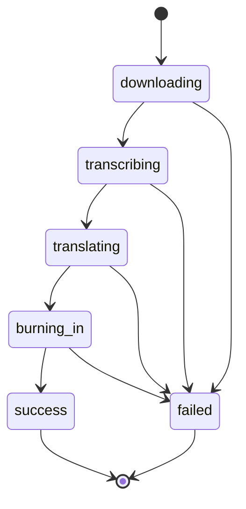
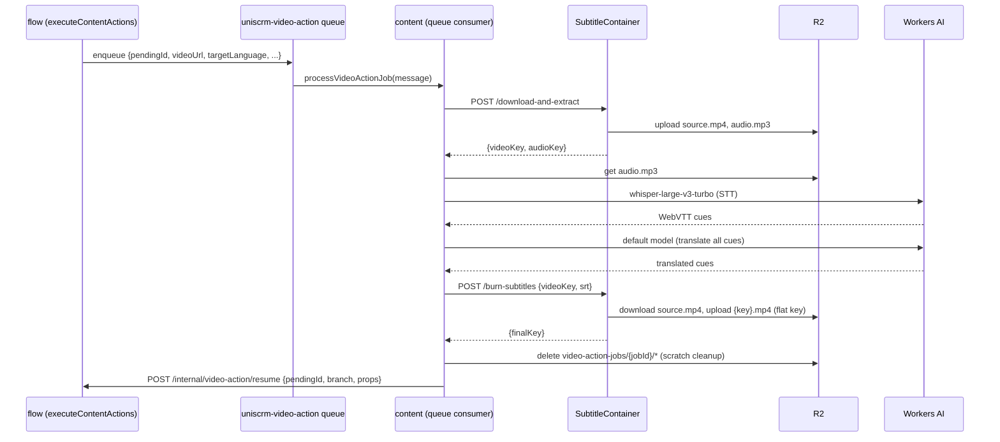

# Video Action: Add Subtitle Implementation Plan

> **For agentic workers:** REQUIRED SUB-SKILL: Use superpowers:subagent-driven-development (recommended) or superpowers:executing-plans to implement this plan task-by-task. Steps use checkbox (`- [ ]`) syntax for tracking.

**Goal:** Add a new "Video Action" content-flow node (operation: Add Subtitle) that
downloads a content item's video, transcribes its speech, translates the transcript into
a selected language, burns the translated subtitles into the video, and caches the result
in R2 — exposing `$content.processed_video_url`, `$content.video_transcript`, and
`$content.translated_subtitle_text` to downstream nodes.

**Architecture:** `link` gains one new endpoint that resolves a content item's public
video URL (no downloading). `flow` dispatches the job to a new dedicated queue
(decoupling it from the main event queue) and tracks it via the existing
`content_flow_pending` mechanism. `content` owns the entire pipeline: a Cloudflare
Container (yt-dlp + ffmpeg) handles OS-level video/audio work and uploads directly to R2
via the S3 API; the Worker itself calls Workers AI for speech-to-text (which returns
timed WebVTT natively) and translation, then calls back into `flow` to resume the
node's `success`/`failed` branch.

**Tech Stack:** Hono (all three Workers), `@cloudflare/containers` (Container DO class),
Python/Flask + yt-dlp + ffmpeg + boto3 (container image), Workers AI
(`@cf/openai/whisper-large-v3-turbo` for STT, tenant default model for translation), D1,
Cloudflare Queues, R2 (S3-compatible API for container→R2 uploads).

## Global Constraints

- Full design context: `docs/superpowers/specs/2026-07-19-video-action-add-subtitle-design.md`
  — read it before starting Task 1; every task below implements one piece of it.
- No publish step — this feature only produces an artifact + props. Do not add any
  publish/upload-to-platform code.
- Translation always uses the Workers AI **default** model (`generateContent(env, {
  ..., provider: "default" })`, no `skillId`) — never add a provider dropdown for this
  node.
- Target language is a fixed dropdown — never free text.
- Duration cap is a **plain constant**, 600 seconds — not a per-tenant setting.
- No queue-level auto-retry anywhere in this pipeline: every failure must be caught,
  recorded once (job status + error), and the queue message always acknowledged
  (i.e., never let an exception propagate out of the queue consumer uncaught).
- The node has `success`/`failed` branches — never a single pass-through branch.
- Job status transitions: `downloading` → `transcribing` → `translating` →
  `burning_in` → `success` | `failed` (from any state).
- Match existing code style exactly: Hono internal routes check
  `X-Internal-Secret` per-route in `flow` (no blanket middleware — see
  `flow/src/index.ts:519-520`), but via a blanket `app.use("/internal/*",
  internalAuthMiddleware)` in `content`/`link`. Do not unify these — follow each
  module's own existing convention.
- Do not introduce a shared helper to de-duplicate the `resumeFromNode` /
  `emitContentNodeLogs` / nested-`executeContentActions` / `pendingWaits` block that
  already appears 3+ times in `flow/src/index.ts` — this codebase's established style is
  to repeat this block per branch rather than abstract it; match that style for the new
  resume route instead of refactoring it away.
- New Cloudflare resources needed (queue creation, R2 API token/secrets) are
  controller-executed steps at the end of this plan (see Verification) — not part of any
  task's automated test suite.

---

### Task 1: metadata — new content props

**Files:**
- Modify: `metadata/props.ts`

**Interfaces:**
- Produces: three new `propId` entries (`processed_video_url`, `video_transcript`,
  `translated_subtitle_text`) that later tasks reference by string literal — no function
  signatures involved.

- [ ] **Step 1: Add the three prop entries**

Add after the existing `duration` entry (around line 175-180) in `metadata/props.ts`:

```ts
  {
    propId: "processed_video_url",
    dataType: "TEXT",
    fieldType: "VIDEO",
    entity: ["content"],
    label: { en: "Subtitled Video", zh: "字幕视频" },
  },
  {
    propId: "video_transcript",
    dataType: "TEXT",
    entity: ["content"],
    label: { en: "Video Transcript", zh: "视频转录文本" },
  },
  {
    propId: "translated_subtitle_text",
    dataType: "TEXT",
    entity: ["content"],
    label: { en: "Translated Subtitle Text", zh: "翻译字幕文本" },
  },
```

If `fieldType: "VIDEO"` is not an existing literal in this file's `fieldType` union type,
widen the union to include `"VIDEO"` (check the type definition near the top of the file
first — follow whatever pattern `"IMAGE"` already uses for `cover_image_url`).

- [ ] **Step 2: Typecheck**

Run: `cd metadata && npx tsc --noEmit` (or whatever this module's existing typecheck
command is — check `metadata/package.json`'s `scripts` if unsure).
Expected: no errors.

- [ ] **Step 3: Commit**

```bash
git add metadata/props.ts
git commit -m "feat(metadata): add processed_video_url, video_transcript, translated_subtitle_text content props"
```

---

### Task 2: link — resolve a content item's video URL

**Files:**
- Modify: `link/src/routes-internal.ts`
- Test: `link/tests/services/routes-internal-video-url.test.ts` (new)

**Interfaces:**
- Produces: `POST /internal/content/video-url` — request `{contentId: string, channelId:
  string, sourceContentId: string}` (this last field is `payload.source_content_id`,
  resolved upstream by `flow`, same as the existing `/x/repost` etc. routes never look
  this up server-side — see Global Constraints and `link/src/routes-internal.ts:203`'s
  comment) → response `{url: string | null}`. Never throws; a content item with no video
  (e.g. a text-only tweet) returns `{url: null}`, never a 4xx/5xx.

- [ ] **Step 1: Write the failing test**

Create `link/tests/services/routes-internal-video-url.test.ts`:

```ts
import { describe, it, expect, vi, beforeEach } from "vitest";
import { internalRoutes } from "../../src/routes-internal";

function makeEnv(channelRow: { channel_type: string; config: string } | null) {
  return {
    INTERNAL_SECRET: "test-secret",
    LINK_DB: {
      prepare: () => ({
        bind: () => ({
          first: async () => channelRow,
        }),
      }),
    },
  } as any;
}

describe("POST /internal/content/video-url", () => {
  it("returns a youtube watch URL for a YouTube channel", async () => {
    const router = internalRoutes();
    const env = makeEnv({ channel_type: "YOUTUBE_ACCOUNT", config: "{}" });
    const res = await router.request(
      "/content/video-url",
      {
        method: "POST",
        headers: { "Content-Type": "application/json" },
        body: JSON.stringify({ contentId: "c1", channelId: "ch1", sourceContentId: "abc123" }),
      },
      env
    );
    const body = await res.json() as { url: string | null };
    expect(body.url).toBe("https://www.youtube.com/watch?v=abc123");
  });

  it("returns null when the channel is not found", async () => {
    const router = internalRoutes();
    const env = makeEnv(null);
    const res = await router.request(
      "/content/video-url",
      {
        method: "POST",
        headers: { "Content-Type": "application/json" },
        body: JSON.stringify({ contentId: "c1", channelId: "ch1", sourceContentId: "abc123" }),
      },
      env
    );
    const body = await res.json() as { url: string | null };
    expect(body.url).toBeNull();
  });

  it("returns null for an unsupported channel type", async () => {
    const router = internalRoutes();
    const env = makeEnv({ channel_type: "TIKTOK", config: "{}" });
    const res = await router.request(
      "/content/video-url",
      {
        method: "POST",
        headers: { "Content-Type": "application/json" },
        body: JSON.stringify({ contentId: "c1", channelId: "ch1", sourceContentId: "abc123" }),
      },
      env
    );
    const body = await res.json() as { url: string | null };
    expect(body.url).toBeNull();
  });
});
```

- [ ] **Step 2: Run test to verify it fails**

Run: `cd link && npx vitest run tests/services/routes-internal-video-url.test.ts`
Expected: FAIL — route does not exist yet (404 / undefined body).

- [ ] **Step 3: Implement the route**

Add to `link/src/routes-internal.ts` (near the other `/content/*` routes, following the
exact channel-lookup style of `/x/repost` at line 201-227 and the `channel_type` gate
style of `/content/create-post` at line 288-342):

```ts
  // Resolves a content item's public watch/permalink video URL for the Video Action
  // node's pipeline (entirely owned by content — link only resolves the URL, never
  // downloads or processes anything). Returns { url: null } (never an error status) for
  // any content item that has no video, so the caller can route to its "failed" branch
  // uniformly rather than special-casing "not found" vs "no video".
  router.post("/content/video-url", async (c) => {
    const { channelId, sourceContentId } = await c.req.json<{
      contentId: string; channelId: string; sourceContentId: string;
    }>();

    const channel = await c.env.LINK_DB.prepare("SELECT channel_type, config FROM channels WHERE id = ?")
      .bind(channelId).first<{ channel_type: string; config: string }>();
    if (!channel) {
      console.log(JSON.stringify({ event: "video_url_channel_not_found", channelId }));
      return c.json({ url: null });
    }

    // "YOUTUBE_ACCOUNT" (not "YOUTUBE") is the actual channels.channel_type value for
    // YouTube — confirmed against link/src/oauth.ts's channel insert and every other
    // reader of YouTube channel rows in this module (routes-channels.ts, webhook-youtube.ts).
    // "YOUTUBE" only exists as a content-table/event-payload platform tag, a different
    // concept from this table's channel_type column — do not confuse the two.
    if (channel.channel_type === "YOUTUBE_ACCOUNT" && sourceContentId) {
      return c.json({ url: `https://www.youtube.com/watch?v=${sourceContentId}` });
    }
    if (channel.channel_type === "X" && sourceContentId) {
      const config = JSON.parse(channel.config);
      const handle = config.x_username;
      if (handle) return c.json({ url: `https://x.com/${handle}/status/${sourceContentId}` });
    }

    console.log(JSON.stringify({ event: "video_url_no_video", channelId, channelType: channel.channel_type }));
    return c.json({ url: null });
  });
```

Note the `console.log(JSON.stringify({event: ...}))` calls above are required, not
optional — every neighboring route in this file (`/x/repost`, `/x/bookmark`,
`/content/create-post`, `/tiktok/photo-post`) logs on every outcome, including
early-return/unsupported paths, so a silent "no video" resolution is observable rather
than invisible. Add one for the successful YouTube/X match paths too, matching the same
style.

If `channels` table's column names differ from `channel_type`/`config` (unlikely — this
matches every other route in this file), or if X channels store their handle under a
different config key than `x_username`, check `link/src/services/x-token.ts` or any
existing X channel-config read for the actual key name and use that instead.

- [ ] **Step 4: Run test to verify it passes**

Run: `cd link && npx vitest run tests/services/routes-internal-video-url.test.ts`
Expected: PASS (3/3).

- [ ] **Step 5: Run full link suite**

Run: `cd link && npx vitest run`
Expected: all tests pass (no regressions).

- [ ] **Step 6: Commit**

```bash
git add link/src/routes-internal.ts link/tests/services/routes-internal-video-url.test.ts
git commit -m "feat(link): add /internal/content/video-url endpoint for Video Action pipeline"
```

---

### Task 3: content — job status table + job-store service

**Files:**
- Create: `content/migrations/0005_video_action_jobs.sql`
- Create: `content/src/services/video-action/job-store.ts`
- Create: `content/src/services/video-action/status.md`
- Test: `content/tests/services/video-action/job-store.test.ts` (new)

**Interfaces:**
- Produces: `createJob(env, params): Promise<string>` (returns new job id),
  `updateJobStatus(env, jobId, status, failedStep?, error?): Promise<void>`,
  `job_status` values used by later tasks: `"downloading" | "transcribing" |
  "translating" | "burning_in" | "success" | "failed"`.

- [ ] **Step 1: Write the migration**

Create `content/migrations/0005_video_action_jobs.sql`:

```sql
-- Per-job tracking for the Video Action pipeline (download -> transcribe -> translate ->
-- burn-in). Exists purely for diagnosability: this pipeline runs in a background queue
-- consumer with no synchronous caller to report errors to, so job_status + failed_step +
-- error let a stuck/failed job be diagnosed without digging through Workers logs.
CREATE TABLE video_action_jobs (
  id TEXT PRIMARY KEY,
  pending_id TEXT NOT NULL,
  content_id TEXT NOT NULL,
  tenant_id INTEGER NOT NULL,
  target_language TEXT NOT NULL,
  job_status TEXT NOT NULL,
  failed_step TEXT,
  error TEXT,
  created_at TEXT NOT NULL,
  updated_at TEXT NOT NULL
);
```

- [ ] **Step 2: Write the failing test**

Create `content/tests/services/video-action/job-store.test.ts`:

```ts
import { describe, it, expect, vi } from "vitest";
import { createJob, updateJobStatus } from "../../../src/services/video-action/job-store";

function makeEnv() {
  const runs: { sql: string; args: unknown[] }[] = [];
  return {
    env: {
      CONTENT_DB: {
        prepare: (sql: string) => ({
          bind: (...args: unknown[]) => ({
            run: async () => { runs.push({ sql, args }); return { success: true }; },
          }),
        }),
      } as any,
    },
    runs,
  };
}

describe("video-action job-store", () => {
  it("createJob inserts a row with job_status='downloading' and returns its id", async () => {
    const { env, runs } = makeEnv();
    const jobId = await createJob(env, {
      pendingId: "p1", contentId: "c1", tenantId: 1, targetLanguage: "zh",
    });
    expect(typeof jobId).toBe("string");
    expect(runs[0].sql).toContain("INSERT INTO video_action_jobs");
    expect(runs[0].args).toContain("downloading");
  });

  it("updateJobStatus updates status, failed_step, and error", async () => {
    const { env, runs } = makeEnv();
    await updateJobStatus(env, "job1", "failed", "downloading", "yt-dlp exited 1");
    expect(runs[0].sql).toContain("UPDATE video_action_jobs");
    expect(runs[0].args).toEqual(expect.arrayContaining(["failed", "downloading", "yt-dlp exited 1", "job1"]));
  });
});
```

- [ ] **Step 3: Run test to verify it fails**

Run: `cd content && npx vitest run tests/services/video-action/job-store.test.ts`
Expected: FAIL — module does not exist.

- [ ] **Step 4: Implement job-store.ts**

Create `content/src/services/video-action/job-store.ts`:

```ts
import type { Env } from "../../types";

export type JobStatus = "downloading" | "transcribing" | "translating" | "burning_in" | "success" | "failed";

export interface CreateJobParams {
  pendingId: string;
  contentId: string;
  tenantId: number;
  targetLanguage: string;
}

export async function createJob(env: Env, params: CreateJobParams): Promise<string> {
  const id = crypto.randomUUID();
  const now = new Date().toISOString();
  await env.CONTENT_DB.prepare(
    `INSERT INTO video_action_jobs (id, pending_id, content_id, tenant_id, target_language, job_status, created_at, updated_at)
     VALUES (?, ?, ?, ?, ?, ?, ?, ?)`
  ).bind(id, params.pendingId, params.contentId, params.tenantId, params.targetLanguage, "downloading", now, now).run();
  return id;
}

export async function updateJobStatus(
  env: Env,
  jobId: string,
  status: JobStatus,
  failedStep?: string,
  error?: string
): Promise<void> {
  const now = new Date().toISOString();
  await env.CONTENT_DB.prepare(
    `UPDATE video_action_jobs SET job_status = ?, failed_step = ?, error = ?, updated_at = ? WHERE id = ?`
  ).bind(status, failedStep || null, error || null, now, jobId).run();
}
```

- [ ] **Step 5: Run test to verify it passes**

Run: `cd content && npx vitest run tests/services/video-action/job-store.test.ts`
Expected: PASS (2/2).

- [ ] **Step 6: Write status.md**

Create `content/src/services/video-action/status.md` (per this repo's CLAUDE.md
convention — any `_status`-suffixed DB column gets a state diagram alongside its code):

```markdown
# video_action_jobs.job_status state machine


```

- [ ] **Step 7: Apply the migration to dev D1**

Run: `cd content && wrangler d1 migrations apply uniscrm-content-dev --env dev`
Expected: `0005_video_action_jobs.sql` applied successfully.

- [ ] **Step 8: Commit**

```bash
git add content/migrations/0005_video_action_jobs.sql content/src/services/video-action/job-store.ts content/src/services/video-action/status.md content/tests/services/video-action/job-store.test.ts
git commit -m "feat(content): add video_action_jobs table and job-store service"
```

---

### Task 4: content — subtitle container (download + burn-in)

**Files:**
- Create: `content/Dockerfile`
- Create: `content/main.py`
- Create: `content/src/services/video-action/container-client.ts`
- Modify: `content/src/index.ts` (export `SubtitleContainer` class)
- Modify: `content/src/types.ts` (add container/R2-credential bindings)
- Modify: `content/wrangler.toml` (container + DO binding + R2 access-key secrets, both envs)
- Modify: `content/package.json` (add `@cloudflare/containers` dependency)
- Test: `content/tests/services/video-action/container-client.test.ts` (new)

**Interfaces:**
- Produces: `downloadAndExtract(env, {jobId, videoUrl}): Promise<{videoKey: string,
  audioKey: string} | {error: string}>`, `burnSubtitles(env, {jobId, videoKey,
  subtitleSrt}): Promise<{finalKey: string} | {error: string}>`.
- Consumes: nothing from earlier tasks (container is self-contained); later tasks (5-8)
  will call these two functions.

- [ ] **Step 1: Write the Dockerfile**

Create `content/Dockerfile` (same base as the verified spike — `python:3.12-slim` +
`yt-dlp` + `ffmpeg`, now with `flask` + `boto3` for R2 upload/download):

```dockerfile
FROM python:3.12-slim

RUN apt-get update && apt-get install -y --no-install-recommends ffmpeg && rm -rf /var/lib/apt/lists/*
RUN pip install --no-cache-dir yt-dlp flask boto3

WORKDIR /app
COPY main.py .

EXPOSE 8080
CMD ["python", "main.py"]
```

- [ ] **Step 2: Write the container's Flask app**

Create `content/main.py`:

```python
import os
import subprocess
import uuid
import boto3
from flask import Flask, request, jsonify

app = Flask(__name__)


def r2_client():
    return boto3.client(
        "s3",
        endpoint_url=f"https://{os.environ['R2_ACCOUNT_ID']}.r2.cloudflarestorage.com",
        aws_access_key_id=os.environ["R2_ACCESS_KEY_ID"],
        aws_secret_access_key=os.environ["R2_SECRET_ACCESS_KEY"],
    )


@app.route("/health")
def health():
    return jsonify({"status": "ok"})


@app.route("/download-and-extract", methods=["POST"])
def download_and_extract():
    body = request.get_json()
    job_id = body["job_id"]
    video_url = body["video_url"]

    work_dir = f"/tmp/{job_id}"
    os.makedirs(work_dir, exist_ok=True)
    video_path = f"{work_dir}/source.mp4"
    audio_path = f"{work_dir}/audio.mp3"

    dl = subprocess.run(
        ["yt-dlp", "-f", "best[ext=mp4]/best", "-o", video_path, video_url],
        capture_output=True, text=True, timeout=600,
    )
    if dl.returncode != 0 or not os.path.exists(video_path):
        return jsonify({"error": f"download failed: {dl.stderr[-2000:]}"}), 200

    extract = subprocess.run(
        ["ffmpeg", "-y", "-i", video_path, "-vn", "-acodec", "libmp3lame", audio_path],
        capture_output=True, text=True, timeout=300,
    )
    if extract.returncode != 0 or not os.path.exists(audio_path):
        return jsonify({"error": f"audio extraction failed: {extract.stderr[-2000:]}"}), 200

    bucket = os.environ["R2_BUCKET_NAME"]
    video_key = f"video-action-jobs/{job_id}/source.mp4"
    audio_key = f"video-action-jobs/{job_id}/audio.mp3"
    client = r2_client()
    client.upload_file(video_path, bucket, video_key)
    client.upload_file(audio_path, bucket, audio_key)

    return jsonify({"video_key": video_key, "audio_key": audio_key})


@app.route("/burn-subtitles", methods=["POST"])
def burn_subtitles():
    body = request.get_json()
    job_id = body["job_id"]
    video_key = body["video_key"]
    subtitle_srt = body["subtitle_srt"]

    work_dir = f"/tmp/{job_id}"
    os.makedirs(work_dir, exist_ok=True)
    video_path = f"{work_dir}/source.mp4"
    srt_path = f"{work_dir}/subs.srt"
    output_path = f"{work_dir}/output.mp4"

    bucket = os.environ["R2_BUCKET_NAME"]
    client = r2_client()
    client.download_file(bucket, video_key, video_path)

    with open(srt_path, "w", encoding="utf-8") as f:
        f.write(subtitle_srt)

    burn = subprocess.run(
        ["ffmpeg", "-y", "-i", video_path, "-vf", f"subtitles={srt_path}", "-c:a", "copy", output_path],
        capture_output=True, text=True, timeout=600,
    )
    if burn.returncode != 0 or not os.path.exists(output_path):
        return jsonify({"error": f"burn-in failed: {burn.stderr[-2000:]}"}), 200

    final_key = f"{uuid.uuid4()}.mp4"
    client.upload_file(output_path, bucket, final_key)

    # video-action-jobs/{job_id}/* scratch files (source.mp4, audio.mp3) are cleaned up
    # by the Worker after this call returns, once it has both this final_key and knows
    # the job resolved (success either way) — see Task 7's cleanup step.

    return jsonify({"final_key": final_key})


if __name__ == "__main__":
    app.run(host="0.0.0.0", port=8080)
```

- [ ] **Step 3: Add the Container DO class and Env bindings**

Add `@cloudflare/containers` to `content/package.json`'s `devDependencies` (match the
version already used in `profile/package.json`: `"@cloudflare/containers": "^0.1.0"`),
then `cd content && npm install`.

Add to `content/src/types.ts`:

```ts
  SUBTITLE_CONTAINER: DurableObjectNamespace;
  R2_ACCOUNT_ID: string;
  R2_ACCESS_KEY_ID: { get(): Promise<string> };
  R2_SECRET_ACCESS_KEY: { get(): Promise<string> };
  R2_BUCKET_NAME: string;
```

Add to `content/src/index.ts` (near the top, after imports):

```ts
import { Container } from "@cloudflare/containers";

export class SubtitleContainer extends Container<Env> {
  defaultPort = 8080;
  sleepAfter = "5m";
  enableInternet = true;
}
```

- [ ] **Step 4: Add wrangler.toml bindings (both envs)**

Add to `content/wrangler.toml`'s `[env.dev]` section (after `[env.dev.ai]`, before the
existing `r2_buckets` block):

```toml
[[env.dev.containers]]
class_name = "SubtitleContainer"
image = "./Dockerfile"
instance_type = "standard-1"
max_instances = 1

[[env.dev.durable_objects.bindings]]
name = "SUBTITLE_CONTAINER"
class_name = "SubtitleContainer"

[[env.dev.migrations]]
tag = "v1"
new_sqlite_classes = ["SubtitleContainer"]

[env.dev.vars]
R2_ACCOUNT_ID = "b34f3ff4aec4c36584672d5bf1320757"
R2_BUCKET_NAME = "uniscrm-content-media-dev"

[[env.dev.secrets_store_secrets]]
binding = "R2_ACCESS_KEY_ID"
store_id = "358a0014b2254c2eafb877e4182fd977"
secret_name = "uniscrm-content-r2-access-key-id-dev"

[[env.dev.secrets_store_secrets]]
binding = "R2_SECRET_ACCESS_KEY"
store_id = "358a0014b2254c2eafb877e4182fd977"
secret_name = "uniscrm-content-r2-secret-access-key-dev"
```

Note `[env.dev.vars]` already exists earlier in the file with `WEB_URL`/`CONTENT_URL`/etc
— merge `R2_ACCOUNT_ID`/`R2_BUCKET_NAME` into that existing block rather than creating a
second `[env.dev.vars]` table (TOML would silently only keep the last one). Mirror the
same additions in `[env.production]` with `instance_type` `max_instances = 3` (matching
`profile`'s dev/prod `max_instances` split) and secret names without the `-dev` suffix
(`uniscrm-content-r2-access-key-id`, `uniscrm-content-r2-secret-access-key`), bucket name
`uniscrm-content-media`.

The container needs the R2 credentials as actual **container process env vars** (not
just Worker bindings) — the `Container` base class exposes an `envVars` property
(`ContainerStartOptions['env']`, confirmed via
`node_modules/@cloudflare/containers/dist/lib/container.d.ts`) for exactly this. Extend
the `SubtitleContainer` class from Step 3:

```ts
export class SubtitleContainer extends Container<Env> {
  defaultPort = 8080;
  sleepAfter = "5m";
  enableInternet = true;

  constructor(ctx: DurableObjectState, env: Env) {
    super(ctx, env);
  }

  override async startAndWaitForPorts(...args: Parameters<Container["startAndWaitForPorts"]>) {
    this.envVars = {
      R2_ACCOUNT_ID: this.env.R2_ACCOUNT_ID,
      R2_ACCESS_KEY_ID: await this.env.R2_ACCESS_KEY_ID.get(),
      R2_SECRET_ACCESS_KEY: await this.env.R2_SECRET_ACCESS_KEY.get(),
      R2_BUCKET_NAME: this.env.R2_BUCKET_NAME,
    };
    return super.startAndWaitForPorts(...args);
  }
}
```

If `Container`'s actual base class signature differs from this override shape (check
`node_modules/@cloudflare/containers/dist/lib/container.d.ts`'s exact
`startAndWaitForPorts` signature — the Explore research for this plan found the property
but not the full method signature), adjust to match — the important part is `envVars` is
set before the container process starts, using the Secrets Store bindings' `.get()`
method exactly like `content/src/services/crypto.ts` already does for `ENCRYPTION_KEY`.

- [ ] **Step 5: Write container-client.ts**

Create `content/src/services/video-action/container-client.ts`:

```ts
import type { Env } from "../../types";

export interface DownloadResult {
  videoKey?: string;
  audioKey?: string;
  error?: string;
}

export interface BurnResult {
  finalKey?: string;
  error?: string;
}

export async function downloadAndExtract(env: Env, jobId: string, videoUrl: string): Promise<DownloadResult> {
  const container = env.SUBTITLE_CONTAINER.getByName("subtitle-singleton");
  await container.startAndWaitForPorts();
  const res = await container.fetch("http://container/download-and-extract", {
    method: "POST",
    headers: { "Content-Type": "application/json" },
    body: JSON.stringify({ job_id: jobId, video_url: videoUrl }),
  });
  const body = await res.json() as { video_key?: string; audio_key?: string; error?: string };
  if (body.error) return { error: body.error };
  return { videoKey: body.video_key, audioKey: body.audio_key };
}

export async function burnSubtitles(env: Env, jobId: string, videoKey: string, subtitleSrt: string): Promise<BurnResult> {
  const container = env.SUBTITLE_CONTAINER.getByName("subtitle-singleton");
  await container.startAndWaitForPorts();
  const res = await container.fetch("http://container/burn-subtitles", {
    method: "POST",
    headers: { "Content-Type": "application/json" },
    body: JSON.stringify({ job_id: jobId, video_key: videoKey, subtitle_srt: subtitleSrt }),
  });
  const body = await res.json() as { final_key?: string; error?: string };
  if (body.error) return { error: body.error };
  return { finalKey: body.final_key };
}
```

- [ ] **Step 6: Write the failing test, then verify it passes**

Create `content/tests/services/video-action/container-client.test.ts`:

```ts
import { describe, it, expect, vi } from "vitest";
import { downloadAndExtract, burnSubtitles } from "../../../src/services/video-action/container-client";

function makeEnv(fetchResponse: unknown) {
  const container = {
    startAndWaitForPorts: vi.fn(async () => {}),
    fetch: vi.fn(async () => new Response(JSON.stringify(fetchResponse))),
  };
  return {
    SUBTITLE_CONTAINER: { getByName: () => container },
  } as any;
}

describe("container-client", () => {
  it("downloadAndExtract returns keys on success", async () => {
    const env = makeEnv({ video_key: "v1", audio_key: "a1" });
    const result = await downloadAndExtract(env, "job1", "https://youtube.com/watch?v=x");
    expect(result).toEqual({ videoKey: "v1", audioKey: "a1" });
  });

  it("downloadAndExtract surfaces an error", async () => {
    const env = makeEnv({ error: "download failed" });
    const result = await downloadAndExtract(env, "job1", "https://youtube.com/watch?v=x");
    expect(result.error).toBe("download failed");
  });

  it("burnSubtitles returns finalKey on success", async () => {
    const env = makeEnv({ final_key: "final-abc.mp4" });
    const result = await burnSubtitles(env, "job1", "video-action-jobs/job1/source.mp4", "1\n00:00:00,000 --> 00:00:01,000\nhello\n");
    expect(result).toEqual({ finalKey: "final-abc.mp4" });
  });
});
```

Run: `cd content && npx vitest run tests/services/video-action/container-client.test.ts`
Expected: FAIL first (module doesn't exist), then PASS (3/3) once Step 5's code exists.

- [ ] **Step 7: Deploy and smoke-test the container in dev**

Run: `cd content && wrangler deploy --env dev`. Confirm the deploy output shows the
`SubtitleContainer` image built and the container application created (same log shape as
the spike in this plan's design doc). Manually verify with:
`curl -X POST https://content-dev.uni-scrm.com/internal/... ` — there is no HTTP route
exposed for this container directly yet (that comes in Task 7); for now, confirming the
deploy succeeds without Docker/binding errors is sufficient smoke-testing for this task.

- [ ] **Step 8: Commit**

```bash
git add content/Dockerfile content/main.py content/src/services/video-action/container-client.ts content/src/index.ts content/src/types.ts content/wrangler.toml content/package.json content/tests/services/video-action/container-client.test.ts
git commit -m "feat(content): add SubtitleContainer (yt-dlp download + ffmpeg burn-in) and container-client"
```

---

### Task 5: content — speech-to-text service

**Files:**
- Create: `content/src/services/video-action/transcribe.ts`
- Test: `content/tests/services/video-action/transcribe.test.ts` (new)

**Interfaces:**
- Produces: `transcribeAudio(env, audioKey: string): Promise<Cue[] | null>` where `Cue =
  {start: string, end: string, text: string}` (timestamps as VTT-format strings, e.g.
  `"00:00:01.500"`); returns `null` on any failure (missing R2 object, Workers AI error,
  unparseable VTT).
- Consumes: `env.MEDIA_BUCKET` (existing binding), `env.AI` (existing binding).

- [ ] **Step 1: Write the failing test**

Create `content/tests/services/video-action/transcribe.test.ts`:

```ts
import { describe, it, expect, vi } from "vitest";
import { transcribeAudio, parseVtt } from "../../../src/services/video-action/transcribe";

describe("parseVtt", () => {
  it("parses cues with timestamps and text", () => {
    const vtt = `WEBVTT

00:00:00.000 --> 00:00:02.500
Hello there.

00:00:02.500 --> 00:00:05.000
This is a test.
`;
    const cues = parseVtt(vtt);
    expect(cues).toEqual([
      { start: "00:00:00.000", end: "00:00:02.500", text: "Hello there." },
      { start: "00:00:02.500", end: "00:00:05.000", text: "This is a test." },
    ]);
  });
});

describe("transcribeAudio", () => {
  it("returns null when the audio object is missing from R2", async () => {
    const env = {
      MEDIA_BUCKET: { get: async () => null },
      AI: { run: vi.fn() },
    } as any;
    const result = await transcribeAudio(env, "video-action-jobs/job1/audio.mp3");
    expect(result).toBeNull();
    expect(env.AI.run).not.toHaveBeenCalled();
  });

  it("returns parsed cues on a successful Whisper call", async () => {
    const vtt = "WEBVTT\n\n00:00:00.000 --> 00:00:01.000\nHi\n";
    const env = {
      MEDIA_BUCKET: { get: async () => ({ arrayBuffer: async () => new ArrayBuffer(8) }) },
      AI: { run: vi.fn(async () => ({ vtt })) },
    } as any;
    const result = await transcribeAudio(env, "video-action-jobs/job1/audio.mp3");
    expect(result).toEqual([{ start: "00:00:00.000", end: "00:00:01.000", text: "Hi" }]);
  });

  it("returns null when Workers AI throws", async () => {
    const env = {
      MEDIA_BUCKET: { get: async () => ({ arrayBuffer: async () => new ArrayBuffer(8) }) },
      AI: { run: vi.fn(async () => { throw new Error("model error"); }) },
    } as any;
    const result = await transcribeAudio(env, "video-action-jobs/job1/audio.mp3");
    expect(result).toBeNull();
  });
});
```

- [ ] **Step 2: Run test to verify it fails**

Run: `cd content && npx vitest run tests/services/video-action/transcribe.test.ts`
Expected: FAIL — module does not exist.

- [ ] **Step 3: Implement transcribe.ts**

Create `content/src/services/video-action/transcribe.ts`:

```ts
import type { Env } from "../../types";

export interface Cue {
  start: string;
  end: string;
  text: string;
}

export function parseVtt(vtt: string): Cue[] {
  const cues: Cue[] = [];
  const blocks = vtt.split(/\r?\n\r?\n/).map((b) => b.trim()).filter(Boolean);
  for (const block of blocks) {
    const lines = block.split(/\r?\n/);
    const timeLine = lines.find((l) => l.includes("-->"));
    if (!timeLine) continue;
    const [start, end] = timeLine.split("-->").map((s) => s.trim());
    const textLines = lines.slice(lines.indexOf(timeLine) + 1);
    const text = textLines.join(" ").trim();
    if (!text) continue;
    cues.push({ start, end, text });
  }
  return cues;
}

export async function transcribeAudio(env: Env, audioKey: string): Promise<Cue[] | null> {
  const object = await env.MEDIA_BUCKET.get(audioKey);
  if (!object) return null;

  try {
    const buffer = await object.arrayBuffer();
    const base64 = Buffer.from(buffer).toString("base64");
    const result = await env.AI.run("@cf/openai/whisper-large-v3-turbo", { audio: base64 }) as { vtt?: string };
    if (!result.vtt) return null;
    const cues = parseVtt(result.vtt);
    return cues.length > 0 ? cues : null;
  } catch (err) {
    console.error(JSON.stringify({ event: "transcribe_failed", audioKey, error: String(err) }));
    return null;
  }
}
```

- [ ] **Step 4: Run test to verify it passes**

Run: `cd content && npx vitest run tests/services/video-action/transcribe.test.ts`
Expected: PASS (4/4).

- [ ] **Step 5: Commit**

```bash
git add content/src/services/video-action/transcribe.ts content/tests/services/video-action/transcribe.test.ts
git commit -m "feat(content): add video-action transcribe service (Workers AI Whisper, WebVTT parsing)"
```

---

### Task 6: content — translation service

**Files:**
- Create: `content/src/services/video-action/translate.ts`
- Test: `content/tests/services/video-action/translate.test.ts` (new)

**Interfaces:**
- Consumes: `Cue` type + nothing else from Task 5 (decoupled — takes cues as plain
  input); `generateContent` from `content/src/services/generate.ts` (existing,
  signature: `generateContent(env, {tenantId, prompt, provider, skillId?}):
  Promise<string>`).
- Produces: `translateCues(env, tenantId: number, cues: Cue[], targetLanguage: string):
  Promise<{translatedCues: Cue[], plainText: string} | null>` (cue-count mismatch after
  translation → `null`, treated as a pipeline failure by the caller);
  `cuesToSrt(cues: Cue[]): string` (VTT-style timestamps → SRT format for the
  container's ffmpeg burn-in step, since SRT is the more universally-supported ffmpeg
  subtitle input).

- [ ] **Step 1: Write the failing test**

Create `content/tests/services/video-action/translate.test.ts`:

```ts
import { describe, it, expect, vi } from "vitest";
import { translateCues, cuesToSrt } from "../../../src/services/video-action/translate";
import * as generateModule from "../../../src/services/generate";
import type { Cue } from "../../../src/services/video-action/transcribe";

const cues: Cue[] = [
  { start: "00:00:00.000", end: "00:00:02.000", text: "Hello there." },
  { start: "00:00:02.000", end: "00:00:04.000", text: "This is a test." },
];

describe("cuesToSrt", () => {
  it("converts VTT-style timestamps to SRT format with sequential indices", () => {
    const srt = cuesToSrt(cues);
    expect(srt).toContain("1\n00:00:00,000 --> 00:00:02,000\nHello there.");
    expect(srt).toContain("2\n00:00:02,000 --> 00:00:04,000\nThis is a test.");
  });
});

describe("translateCues", () => {
  it("translates all cues and preserves count/order", async () => {
    vi.spyOn(generateModule, "generateContent").mockResolvedValue("1. 你好。\n2. 这是一个测试。");
    const result = await translateCues({} as any, 1, cues, "zh");
    expect(result?.translatedCues).toEqual([
      { start: "00:00:00.000", end: "00:00:02.000", text: "你好。" },
      { start: "00:00:02.000", end: "00:00:04.000", text: "这是一个测试。" },
    ]);
    expect(result?.plainText).toBe("你好。 这是一个测试。");
  });

  it("returns null on a cue-count mismatch", async () => {
    vi.spyOn(generateModule, "generateContent").mockResolvedValue("1. 你好。");
    const result = await translateCues({} as any, 1, cues, "zh");
    expect(result).toBeNull();
  });

  it("returns null when generateContent throws", async () => {
    vi.spyOn(generateModule, "generateContent").mockRejectedValue(new Error("model error"));
    const result = await translateCues({} as any, 1, cues, "zh");
    expect(result).toBeNull();
  });
});
```

- [ ] **Step 2: Run test to verify it fails**

Run: `cd content && npx vitest run tests/services/video-action/translate.test.ts`
Expected: FAIL — module does not exist.

- [ ] **Step 3: Implement translate.ts**

Create `content/src/services/video-action/translate.ts`:

```ts
import type { Env } from "../../types";
import { generateContent } from "../generate";
import type { Cue } from "./transcribe";

export function cuesToSrt(cues: Cue[]): string {
  return cues
    .map((cue, i) => `${i + 1}\n${cue.start.replace(".", ",")} --> ${cue.end.replace(".", ",")}\n${cue.text}`)
    .join("\n\n");
}

export async function translateCues(
  env: Env,
  tenantId: number,
  cues: Cue[],
  targetLanguage: string
): Promise<{ translatedCues: Cue[]; plainText: string } | null> {
  const numbered = cues.map((cue, i) => `${i + 1}. ${cue.text}`).join("\n");
  const prompt = `Translate each numbered line into ${targetLanguage}. Output ONLY the translated lines, same numbering, one per line, no commentary:\n\n${numbered}`;

  let response: string;
  try {
    response = await generateContent(env, { tenantId, prompt, provider: "default" });
  } catch (err) {
    console.error(JSON.stringify({ event: "translate_failed", error: String(err) }));
    return null;
  }

  const lines = response
    .split(/\r?\n/)
    .map((l) => l.trim())
    .filter(Boolean)
    .map((l) => l.replace(/^\d+\.\s*/, ""));

  if (lines.length !== cues.length) {
    console.error(JSON.stringify({ event: "translate_cue_count_mismatch", expected: cues.length, got: lines.length }));
    return null;
  }

  const translatedCues = cues.map((cue, i) => ({ ...cue, text: lines[i] }));
  const plainText = translatedCues.map((c) => c.text).join(" ");
  return { translatedCues, plainText };
}
```

- [ ] **Step 4: Run test to verify it passes**

Run: `cd content && npx vitest run tests/services/video-action/translate.test.ts`
Expected: PASS (4/4).

- [ ] **Step 5: Commit**

```bash
git add content/src/services/video-action/translate.ts content/tests/services/video-action/translate.test.ts
git commit -m "feat(content): add video-action translate service (batched cue translation, SRT reassembly)"
```

---

### Task 7: content — queue consumer orchestration

**Files:**
- Create: `content/src/queue-video-action.ts`
- Create: `content/src/services/video-action/sequence.md`
- Modify: `content/src/index.ts` (add `queue` handler to the default export)
- Modify: `content/src/types.ts` (add `VIDEO_ACTION_QUEUE` consumer's message type import if needed, `FLOW_URL`)
- Modify: `content/wrangler.toml` (add queue consumer block + `FLOW_URL` var, both envs)
- Test: `content/tests/queue-video-action.test.ts` (new)

**Interfaces:**
- Consumes: `createJob`/`updateJobStatus` (Task 3), `downloadAndExtract`/`burnSubtitles`
  (Task 4), `transcribeAudio` (Task 5), `translateCues`/`cuesToSrt` (Task 6).
- Produces: `processVideoActionJob(env, message: VideoActionQueueMessage): Promise<void>`
  — the exported orchestration function the `queue()` handler calls per message; never
  throws (every step is try/caught, matching the "no queue-level auto-retry" global
  constraint).
- `VideoActionQueueMessage` shape (also referenced by Task 11, which produces these
  messages from `flow`): `{pendingId: string, contentId: string, tenantId: number,
  videoUrl: string, targetLanguage: string, flowId: string, nodeId: string, payload:
  Record<string, unknown>}`.

- [ ] **Step 1: Write the failing test**

Create `content/tests/queue-video-action.test.ts`:

```ts
import { describe, it, expect, vi, beforeEach } from "vitest";
import { processVideoActionJob } from "../src/queue-video-action";
import * as jobStore from "../src/services/video-action/job-store";
import * as containerClient from "../src/services/video-action/container-client";
import * as transcribeModule from "../src/services/video-action/transcribe";
import * as translateModule from "../src/services/video-action/translate";

const message = {
  pendingId: "pend1", contentId: "c1", tenantId: 1,
  videoUrl: "https://youtube.com/watch?v=x", targetLanguage: "zh",
  flowId: "f1", nodeId: "n1", payload: {},
};

function makeEnv() {
  return {
    FLOW_URL: "https://flow-dev.uni-scrm.com",
    INTERNAL_SECRET: "test-secret",
    MEDIA_BUCKET: { delete: vi.fn() },
  } as any;
}

describe("processVideoActionJob", () => {
  beforeEach(() => {
    vi.restoreAllMocks();
    vi.stubGlobal("fetch", vi.fn(async () => new Response("{}")));
    vi.spyOn(jobStore, "createJob").mockResolvedValue("job1");
    vi.spyOn(jobStore, "updateJobStatus").mockResolvedValue(undefined);
  });

  it("resolves success end-to-end and posts branch='success' to flow", async () => {
    vi.spyOn(containerClient, "downloadAndExtract").mockResolvedValue({ videoKey: "v1", audioKey: "a1" });
    vi.spyOn(transcribeModule, "transcribeAudio").mockResolvedValue([{ start: "00:00:00.000", end: "00:00:01.000", text: "hi" }]);
    vi.spyOn(translateModule, "translateCues").mockResolvedValue({ translatedCues: [{ start: "00:00:00.000", end: "00:00:01.000", text: "你好" }], plainText: "你好" });
    vi.spyOn(containerClient, "burnSubtitles").mockResolvedValue({ finalKey: "final-xyz.mp4" });

    await processVideoActionJob(makeEnv(), message);

    expect(jobStore.updateJobStatus).toHaveBeenCalledWith(expect.anything(), "job1", "success");
    const resumeCall = (fetch as any).mock.calls.find((c: any[]) => c[0].includes("/internal/video-action/resume"));
    expect(resumeCall).toBeDefined();
    const body = JSON.parse(resumeCall[1].body);
    expect(body.branch).toBe("success");
    expect(body.props.processed_video_url).toContain("final-xyz.mp4");
  });

  it("resolves failed when download fails, without calling transcribe", async () => {
    vi.spyOn(containerClient, "downloadAndExtract").mockResolvedValue({ error: "yt-dlp failed" });
    const transcribeSpy = vi.spyOn(transcribeModule, "transcribeAudio");

    await processVideoActionJob(makeEnv(), message);

    expect(transcribeSpy).not.toHaveBeenCalled();
    expect(jobStore.updateJobStatus).toHaveBeenCalledWith(expect.anything(), "job1", "failed", "downloading", "yt-dlp failed");
    const resumeCall = (fetch as any).mock.calls.find((c: any[]) => c[0].includes("/internal/video-action/resume"));
    const body = JSON.parse(resumeCall[1].body);
    expect(body.branch).toBe("failed");
  });

  it("resolves failed on a cue-count mismatch during translation", async () => {
    vi.spyOn(containerClient, "downloadAndExtract").mockResolvedValue({ videoKey: "v1", audioKey: "a1" });
    vi.spyOn(transcribeModule, "transcribeAudio").mockResolvedValue([{ start: "00:00:00.000", end: "00:00:01.000", text: "hi" }]);
    vi.spyOn(translateModule, "translateCues").mockResolvedValue(null);

    await processVideoActionJob(makeEnv(), message);

    expect(jobStore.updateJobStatus).toHaveBeenCalledWith(expect.anything(), "job1", "failed", "translating", expect.any(String));
  });

  it("never throws even if a step throws unexpectedly", async () => {
    vi.spyOn(containerClient, "downloadAndExtract").mockRejectedValue(new Error("boom"));
    await expect(processVideoActionJob(makeEnv(), message)).resolves.not.toThrow();
  });
});
```

- [ ] **Step 2: Run test to verify it fails**

Run: `cd content && npx vitest run tests/queue-video-action.test.ts`
Expected: FAIL — module does not exist.

- [ ] **Step 3: Implement queue-video-action.ts**

Create `content/src/queue-video-action.ts`:

```ts
import type { Env } from "./types";
import { createJob, updateJobStatus } from "./services/video-action/job-store";
import { downloadAndExtract, burnSubtitles } from "./services/video-action/container-client";
import { transcribeAudio } from "./services/video-action/transcribe";
import { translateCues, cuesToSrt } from "./services/video-action/translate";

export interface VideoActionQueueMessage {
  pendingId: string;
  contentId: string;
  tenantId: number;
  videoUrl: string;
  targetLanguage: string;
  flowId: string;
  nodeId: string;
  payload: Record<string, unknown>;
}

async function resumeFlow(env: Env, pendingId: string, branch: "success" | "failed", props: Record<string, unknown> = {}): Promise<void> {
  try {
    await fetch(`${env.FLOW_URL}/internal/video-action/resume`, {
      method: "POST",
      headers: { "Content-Type": "application/json", "X-Internal-Secret": env.INTERNAL_SECRET },
      body: JSON.stringify({ pendingId, branch, props }),
    });
  } catch (err) {
    console.error(JSON.stringify({ event: "video_action_resume_callback_failed", pendingId, error: String(err) }));
    // No retry — flow's content_flow_pending timeout sweep is the backstop for a dropped callback.
  }
}

async function cleanupScratch(env: Env, jobId: string): Promise<void> {
  try {
    await env.MEDIA_BUCKET.delete(`video-action-jobs/${jobId}/source.mp4`);
    await env.MEDIA_BUCKET.delete(`video-action-jobs/${jobId}/audio.mp3`);
  } catch (err) {
    console.error(JSON.stringify({ event: "video_action_scratch_cleanup_failed", jobId, error: String(err) }));
  }
}

export async function processVideoActionJob(env: Env, message: VideoActionQueueMessage): Promise<void> {
  const jobId = await createJob(env, {
    pendingId: message.pendingId, contentId: message.contentId,
    tenantId: message.tenantId, targetLanguage: message.targetLanguage,
  });

  try {
    const downloaded = await downloadAndExtract(env, jobId, message.videoUrl);
    if (downloaded.error || !downloaded.videoKey || !downloaded.audioKey) {
      await updateJobStatus(env, jobId, "failed", "downloading", downloaded.error || "unknown download error");
      await cleanupScratch(env, jobId);
      await resumeFlow(env, message.pendingId, "failed");
      return;
    }

    await updateJobStatus(env, jobId, "transcribing");
    const cues = await transcribeAudio(env, downloaded.audioKey);
    if (!cues) {
      await updateJobStatus(env, jobId, "failed", "transcribing", "no speech detected or transcription error");
      await cleanupScratch(env, jobId);
      await resumeFlow(env, message.pendingId, "failed");
      return;
    }

    await updateJobStatus(env, jobId, "translating");
    const translated = await translateCues(env, message.tenantId, cues, message.targetLanguage);
    if (!translated) {
      await updateJobStatus(env, jobId, "failed", "translating", "translation failed or cue count mismatch");
      await cleanupScratch(env, jobId);
      await resumeFlow(env, message.pendingId, "failed");
      return;
    }

    await updateJobStatus(env, jobId, "burning_in");
    const srt = cuesToSrt(translated.translatedCues);
    const burned = await burnSubtitles(env, jobId, downloaded.videoKey, srt);
    if (burned.error || !burned.finalKey) {
      await updateJobStatus(env, jobId, "failed", "burning_in", burned.error || "unknown burn-in error");
      await cleanupScratch(env, jobId);
      await resumeFlow(env, message.pendingId, "failed");
      return;
    }

    await updateJobStatus(env, jobId, "success");
    await cleanupScratch(env, jobId);

    const originalText = cues.map((c) => c.text).join(" ");
    await resumeFlow(env, message.pendingId, "success", {
      processed_video_url: `${env.CONTENT_URL}/public/media/${burned.finalKey}`,
      video_transcript: originalText,
      translated_subtitle_text: translated.plainText,
    });
  } catch (err) {
    console.error(JSON.stringify({ event: "video_action_job_error", jobId, error: String(err) }));
    await updateJobStatus(env, jobId, "failed", "unknown", String(err));
    await cleanupScratch(env, jobId);
    await resumeFlow(env, message.pendingId, "failed");
  }
}
```

The final artifact's key is a flat UUID (`{uuid}.mp4`, from Task 4's container code —
`final_key = f"{uuid.uuid4()}.mp4"`, no folder prefix), deliberately matching the
existing `/internal/generate-image` route's key convention exactly. This is required,
not stylistic: `content/src/index.ts`'s existing `GET /public/media/:key` route reads
`c.req.param("key")` via Hono's `:key` param, which does **not** match across `/` — a
`videos/{uuid}.mp4`-style key would silently 404 through that route. Since retention no
longer needs a distinguishing prefix (the final artifact shares the same 48h lifecycle
rule as everything else per the design's locked decision), there's no reason to deviate
from the flat-key convention the existing route already assumes.

- [ ] **Step 4: Wire the queue handler into content/src/index.ts**

Add to `content/src/index.ts`'s default export (which currently only has `fetch` — see
Global Constraints):

```ts
import { processVideoActionJob, type VideoActionQueueMessage } from "./queue-video-action";

export default {
  async fetch(request: Request, env: Env): Promise<Response> {
    // ...existing fetch body unchanged...
  },

  async queue(batch: MessageBatch<VideoActionQueueMessage>, env: Env): Promise<void> {
    for (const message of batch.messages) {
      await processVideoActionJob(env, message.body);
    }
  },
};
```

- [ ] **Step 5: Add FLOW_URL + queue consumer binding to wrangler.toml**

Add `FLOW_URL` to `content/wrangler.toml`'s existing `[env.dev.vars]` block (merge, don't
duplicate the table — same caution as Task 4 Step 4):
`FLOW_URL = "https://flow-dev.uni-scrm.com"` (prod: `"https://flow.uni-scrm.com"`).

Add (both envs):

```toml
[[env.dev.queues.consumers]]
queue = "uniscrm-video-action-dev"
max_batch_size = 1
max_batch_timeout = 5
```

(prod: `queue = "uniscrm-video-action"`) — `max_batch_size = 1` matches the locked
decision that this pipeline processes one job at a time globally (see design doc).

- [ ] **Step 6: Write sequence.md**

Create `content/src/services/video-action/sequence.md` (per this repo's CLAUDE.md
convention — any async queue flow gets a sequence diagram alongside its code):

```markdown
# Video Action pipeline sequence


```

- [ ] **Step 7: Run test to verify it passes**

Run: `cd content && npx vitest run tests/queue-video-action.test.ts`
Expected: PASS (4/4).

- [ ] **Step 8: Run full content suite**

Run: `cd content && npx vitest run`
Expected: all tests pass (no regressions).

- [ ] **Step 9: Commit**

```bash
git add content/src/queue-video-action.ts content/src/index.ts content/src/types.ts content/wrangler.toml content/src/services/video-action/sequence.md content/tests/queue-video-action.test.ts
git commit -m "feat(content): wire video-action queue consumer orchestrating download/STT/translate/burn-in"
```

---

### Task 8: flow — node registry entry

**Files:**
- Modify: `flow/nodeTypeRegistry.ts`
- Modify: `flow/tests/unit/node-type-registry.test.ts`

**Interfaces:**
- Produces: `NODE_TYPE_REGISTRY.videoAction` entry consumed by Tasks 9-12.

- [ ] **Step 1: Add the registry entry**

Add to `flow/nodeTypeRegistry.ts`, immediately after the `tiktokContentAction` entry
(before `videoCondition`, matching this file's existing action-family grouping):

```ts
  videoAction: {
    reactFlowType: "action",
    label: "Video Action",
    description: "Add translated subtitles to the content's video",
    domain: "content",
    role: "action",
    generatable: true,
    promptFragment: `   For video actions: data: { actionType: "videoAction", operation: ["add-subtitle"], targetLanguage: "zh" }
   - "add-subtitle": downloads the content's video, transcribes speech, translates it into targetLanguage, burns in subtitles, caches the result in R2. Has "success"/"failed" branches. Never publishes anywhere — produces $content.processed_video_url, $content.video_transcript, $content.translated_subtitle_text for later nodes to use.`,
  },
```

Add `"videoAction"` to `CONTENT_FLOW_SIDEBAR_ORDER` (lines 286-289), immediately after
`"tiktokContentAction"`:

```ts
export const CONTENT_FLOW_SIDEBAR_ORDER: string[] = [
  "xContentTrigger", "youtubeContentTrigger", "xContentAction", "tiktokContentAction", "videoAction", "videoCondition",
  "wait", "timeCondition", "abSplit", "webhook",
];
```

- [ ] **Step 2: Fix the hardcoded test array**

In `flow/tests/unit/node-type-registry.test.ts`, add `"videoAction"` to the literal
array at lines 187-193 (the only truly hardcoded, non-derived array in this file — see
this plan's research):

```ts
      [
        "xContentTrigger", "youtubeContentTrigger", "xContentAction", "tiktokContentAction", "videoAction", "videoCondition",
        "wait", "timeCondition", "abSplit", "webhook",
      ].sort()
```

Also add `"videoAction"` to the `reactFlowType === "action"` spot-check at line 49 (for
symmetry with `xContentAction`/`tiktokContentAction`, since it's optional but keeps this
test meaningfully exhaustive):

```ts
    for (const key of ["addToList", "xAction", "xContentAction", "tiktokContentAction", "videoAction"]) {
      expect(NODE_TYPE_REGISTRY[key].reactFlowType).toBe("action");
    }
```

- [ ] **Step 3: Run the test**

Run: `cd flow && npx vitest run tests/unit/node-type-registry.test.ts`
Expected: PASS (all tests, including the two just modified).

- [ ] **Step 4: Update generate-prompt.ts if needed**

Check `flow/src/generate-prompt.ts`'s `buildContentDomainPrompt()` — if it hardcodes an
allow-list of content-domain action types anywhere (the way it needed a fix for
`videoCondition` per this plan's design doc history), add `"videoAction"` there too. If
it derives its list generically from the registry (as the Video Condition feature's
final fix made it do), no change is needed — verify which is the case before editing.

- [ ] **Step 5: Commit**

```bash
git add flow/nodeTypeRegistry.ts flow/tests/unit/node-type-registry.test.ts
git commit -m "feat(flow): register videoAction node type"
```

---

### Task 9: flow — engine.ts action data capture

**Files:**
- Modify: `flow/src/engine.ts`
- Test: `flow/tests/unit/engine.test.ts` (extend existing, if present — check first)

**Interfaces:**
- Consumes: `NODE_TYPE_REGISTRY.videoAction` (Task 8, for reference only — this task
  doesn't read the registry directly, it mirrors the existing `xContentAction`/
  `tiktokContentAction` data-capture pattern).
- Produces: `ActionResult` objects with `type: "videoAction"`, `hasBranches: true`,
  `targetLanguage: string` — consumed by Task 10's `executeContentActions` branch.

- [ ] **Step 1: Write the failing test**

Check whether `flow/tests/unit/engine.test.ts` (or wherever `buildActionData`/
`collectActions` is tested — search for existing `xContentAction` test cases) exists and
follow its exact structure. Add a case:

```ts
it("buildActionData captures videoAction fields with hasBranches=true", () => {
  const node = {
    id: "n1", type: "action",
    data: { actionType: "videoAction", targetLanguage: "zh" },
  } as any;
  const result = buildActionData(node);
  expect(result).toEqual({
    type: "videoAction", nodeId: "n1", hasBranches: true, targetLanguage: "zh",
  });
});
```

(Adjust the exact assertion shape/import path to match whatever this test file's
existing `xContentAction` case looks like — copy its structure exactly, changing only
the `actionType`/expected fields.)

- [ ] **Step 2: Run test to verify it fails**

Run: `cd flow && npx vitest run tests/unit/engine.test.ts` (or the correct path found in
Step 1).
Expected: FAIL — `hasBranches` is `false` and `targetLanguage` is `undefined` since
`videoAction` isn't in the `isExternalApi` chain yet.

- [ ] **Step 3: Implement**

In `flow/src/engine.ts`'s `buildActionData` (lines 244-270), add `"videoAction"` to the
`isExternalApi` OR-chain (line 246):

```ts
  const isExternalApi = actionType === "xAction" || actionType === "xContentAction" || actionType === "tiktokContentAction" || actionType === "videoAction";
```

Add a new block alongside the `xContentAction`/`tiktokContentAction` blocks:

```ts
  if (actionType === "videoAction") {
    actionData.targetLanguage = (targetNode.data.targetLanguage as string) || "zh";
  }
```

If `ActionResult`'s type definition (near the top of `engine.ts`) is a closed interface
rather than an index-signature/`Record<string, unknown>`-based type, add `targetLanguage?:
string;` to it.

- [ ] **Step 4: Run test to verify it passes**

Run: `cd flow && npx vitest run tests/unit/engine.test.ts`
Expected: PASS.

- [ ] **Step 5: Run full flow test suite (unit only, fast feedback)**

Run: `cd flow && npx vitest run tests/unit`
Expected: all tests pass (no regressions).

- [ ] **Step 6: Commit**

```bash
git add flow/src/engine.ts flow/tests/unit/engine.test.ts
git commit -m "feat(flow): engine captures videoAction targetLanguage with hasBranches"
```

---

### Task 10: flow — dispatch videoAction to the queue

**Files:**
- Modify: `flow/src/index.ts`
- Modify: `flow/src/types.ts` (add `VIDEO_ACTION_QUEUE`, `LINK_URL` already exists)
- Modify: `flow/wrangler.toml` (add `VIDEO_ACTION_QUEUE` producer, both envs)
- Test: `flow/tests/unit/execute-content-actions.test.ts` (extend existing — search for
  the file covering `executeContentActions`, likely named similarly to this)

**Interfaces:**
- Consumes: `ActionResult` with `type: "videoAction"`, `targetLanguage` (Task 9);
  `link`'s `POST /internal/content/video-url` (Task 2).
- Produces: enqueues `VideoActionQueueMessage` (matching Task 7's shape exactly) to
  `VIDEO_ACTION_QUEUE`; inserts a `content_flow_pending` row with `awaiting_event =
  "video_action_complete"`.

- [ ] **Step 1: Write the failing tests**

Find the existing test file covering `executeContentActions` (search
`grep -rln "executeContentActions" flow/tests/`) and add cases matching its existing
mocking style (likely `vi.stubGlobal("fetch", ...)` and a mock `env.FLOW_DB`/queue):

```ts
it("videoAction: duration over 600s resolves failed immediately, no queue dispatch or link call", async () => {
  const queueSend = vi.fn();
  const env = makeTestEnv({ VIDEO_ACTION_QUEUE: { send: queueSend } }); // adapt to this file's existing env-mock helper
  vi.stubGlobal("fetch", vi.fn());
  const action = { type: "videoAction", nodeId: "n1", targetLanguage: "zh", hasBranches: true };
  const payload = { duration: 700 };

  await executeContentActions(graphWithFailedBranch, [action], "c1", "ch1", "1", env, payload, "f1");

  expect(fetch).not.toHaveBeenCalled();
  expect(queueSend).not.toHaveBeenCalled();
  // assert the graph's "failed" branch node was logged/executed, matching this file's
  // existing assertion style for other resolved-branch tests (e.g. videoCondition's)
});

it("videoAction: no video URL from link resolves failed immediately, no queue dispatch", async () => {
  const queueSend = vi.fn();
  const env = makeTestEnv({ VIDEO_ACTION_QUEUE: { send: queueSend } });
  vi.stubGlobal("fetch", vi.fn(async () => new Response(JSON.stringify({ url: null }))));
  const action = { type: "videoAction", nodeId: "n1", targetLanguage: "zh", hasBranches: true };

  await executeContentActions(graphWithFailedBranch, [action], "c1", "ch1", "1", env, {}, "f1");

  expect(queueSend).not.toHaveBeenCalled();
});

it("videoAction: valid video enqueues a job and inserts a content_flow_pending row, without resolving a branch yet", async () => {
  const queueSend = vi.fn();
  const dbRun = vi.fn(async () => ({ meta: { changes: 1 } }));
  const env = makeTestEnv({ VIDEO_ACTION_QUEUE: { send: queueSend }, FLOW_DB: { prepare: () => ({ bind: () => ({ run: dbRun }) }) } });
  vi.stubGlobal("fetch", vi.fn(async () => new Response(JSON.stringify({ url: "https://youtube.com/watch?v=x" }))));
  const action = { type: "videoAction", nodeId: "n1", targetLanguage: "zh", hasBranches: true };

  await executeContentActions(graphWithBothBranches, [action], "c1", "ch1", "1", env, { source_content_id: "x" }, "f1");

  expect(queueSend).toHaveBeenCalledTimes(1);
  const message = queueSend.mock.calls[0][0];
  expect(message.videoUrl).toBe("https://youtube.com/watch?v=x");
  expect(message.targetLanguage).toBe("zh");
  expect(dbRun).toHaveBeenCalled(); // content_flow_pending insert
});
```

Adapt these to whatever this file's actual `makeTestEnv`/graph-fixture helpers are named
— read the existing file first and match its conventions exactly rather than introducing
new helper names.

- [ ] **Step 2: Run tests to verify they fail**

Run: `cd flow && npx vitest run <the test file found in Step 1>`
Expected: FAIL — no `videoAction` branch exists in `executeContentActions` yet.

- [ ] **Step 3: Implement the videoAction branch**

Add to `flow/src/index.ts`'s `executeContentActions`, as a new `else if` branch
alongside `videoCondition` (before the function's closing brace at line 481):

```ts
    } else if (action.type === "videoAction") {
      const duration = Number(payload?.duration ?? 0);
      const MAX_DURATION_SECONDS = 600;
      const nodeId = action.nodeId as string;

      if (duration > MAX_DURATION_SECONDS) {
        console.log(JSON.stringify({ event: "content_action_video_action_duration_exceeded", contentId, duration }));
        const resumed = resumeFromNode(graph, nodeId, payload, "failed");
        if (resumed.nodeLogs.length > 1) await emitContentNodeLogs(resumed.nodeLogs.slice(1), flowId || "", contentId, tenantId, env);
        if (resumed.actions.length > 0) {
          const nested = await executeContentActions(graph, resumed.actions, contentId, channelId, tenantId, env, payload, flowId);
          rateLimited.push(...nested.rateLimited);
        }
        continue;
      }

      const sourceContentId = String(payload?.source_content_id ?? "");
      let videoUrl: string | null = null;
      try {
        const res = await fetch(`${env.LINK_URL}/internal/content/video-url`, {
          method: "POST",
          headers: { "Content-Type": "application/json", "X-Internal-Secret": env.INTERNAL_SECRET },
          body: JSON.stringify({ contentId, channelId, sourceContentId }),
        });
        if (res.ok) {
          const body = await res.json() as { url: string | null };
          videoUrl = body.url;
        }
      } catch {
        // network error: treated the same as "no video" below
      }

      if (!videoUrl) {
        console.log(JSON.stringify({ event: "content_action_video_action_no_video", contentId }));
        const resumed = resumeFromNode(graph, nodeId, payload, "failed");
        if (resumed.nodeLogs.length > 1) await emitContentNodeLogs(resumed.nodeLogs.slice(1), flowId || "", contentId, tenantId, env);
        if (resumed.actions.length > 0) {
          const nested = await executeContentActions(graph, resumed.actions, contentId, channelId, tenantId, env, payload, flowId);
          rateLimited.push(...nested.rateLimited);
        }
        continue;
      }

      const pendingId = crypto.randomUUID();
      const now = new Date().toISOString();
      const executeAt = new Date(Date.now() + 15 * 60 * 1000).toISOString();
      await env.FLOW_DB.prepare(
        `INSERT INTO content_flow_pending (id, flow_id, node_id, content_id, tenant_id, payload, execute_at, created_at, awaiting_event)
         VALUES (?, ?, ?, ?, ?, ?, ?, ?, ?)`
      ).bind(
        pendingId, flowId || "", nodeId, contentId, Number(tenantId),
        JSON.stringify({ ...payload, channel_id: channelId }), executeAt, now, "video_action_complete"
      ).run();

      await env.VIDEO_ACTION_QUEUE.send({
        pendingId, contentId, tenantId: Number(tenantId),
        videoUrl, targetLanguage: (action.targetLanguage as string) || "zh",
        flowId: flowId || "", nodeId, payload,
      });

      console.log(JSON.stringify({ event: "content_action_video_action_dispatched", contentId, pendingId }));
    }
  }

  return { rateLimited };
}
```

Note this branch does **not** call `resumeFromNode` on the success path — unlike every
other branch in this function, `videoAction`'s branch resolution happens later, when
`content`'s queue consumer calls the new `/internal/video-action/resume` route (Task
11). The two early-exit paths (duration cap, no video) are the only cases resolved
synchronously here, matching the design's "no-video → failed immediately" and
"duration-cap → failed immediately" decisions.

- [ ] **Step 4: Add Env fields and wrangler.toml producer binding**

Add to `flow/src/types.ts`: `VIDEO_ACTION_QUEUE: Queue;` (or whatever type
`MAIGRET_QUEUE`/`FLOW_QUEUE` use in `link/src/types.ts` — match it exactly).

Add to `flow/wrangler.toml` (near the existing `[[env.dev.queues.consumers]]` block):

```toml
[[env.dev.queues.producers]]
binding = "VIDEO_ACTION_QUEUE"
queue = "uniscrm-video-action-dev"
```

(prod: `queue = "uniscrm-video-action"`).

- [ ] **Step 5: Run tests to verify they pass**

Run: `cd flow && npx vitest run <the test file from Step 1>`
Expected: PASS (all cases from Step 1).

- [ ] **Step 6: Run full flow suite**

Run: `cd flow && npx vitest run`
Expected: all tests pass (no regressions).

- [ ] **Step 7: Commit**

```bash
git add flow/src/index.ts flow/src/types.ts flow/wrangler.toml flow/tests/unit/execute-content-actions.test.ts
git commit -m "feat(flow): dispatch videoAction to dedicated queue with duration cap and no-video guard"
```

---

### Task 11: flow — resume endpoint + sweep timeout fix

**Files:**
- Modify: `flow/src/index.ts`
- Test: `flow/tests/unit/video-action-resume.test.ts` (new)

**Interfaces:**
- Produces: `POST /internal/video-action/resume {pendingId, branch, props}` — deletes
  the matching `content_flow_pending` row and resumes the flow's branch, merging `props`
  into the payload before resuming.
- Modifies: the periodic sweep's branch-resolution (the line at
  `flow/src/index.ts:1310`) to resolve `"failed"` for a timed-out `videoAction` pending
  row instead of the existing hardcoded `"no"`.

- [ ] **Step 1: Write the failing tests**

Create `flow/tests/unit/video-action-resume.test.ts` (adapt env/graph mocking to match
this repo's existing style — check a neighboring test file like the one covering
`/internal/trigger` for the exact Hono-testing pattern used):

```ts
import { describe, it, expect, vi } from "vitest";
import app from "../../src/index"; // adjust to actual export used for route testing elsewhere

describe("POST /internal/video-action/resume", () => {
  it("rejects without the correct X-Internal-Secret", async () => {
    const res = await app.request("/internal/video-action/resume", {
      method: "POST",
      headers: { "Content-Type": "application/json" },
      body: JSON.stringify({ pendingId: "p1", branch: "success", props: {} }),
    }, { INTERNAL_SECRET: "real-secret" } as any);
    expect(res.status).toBe(401);
  });

  it("deletes the pending row and resumes with merged props on success", async () => {
    // Mirror this file's neighbor tests for exact FLOW_DB/graph mocking; assert:
    // - DELETE FROM content_flow_pending WHERE id = ? was called with pendingId
    // - resumeFromNode was effectively invoked with branch "success" and payload
    //   containing the merged props (processed_video_url etc.)
  });

  it("is a no-op (200, does nothing) if the pending row was already claimed/deleted", async () => {
    // Mirror the existing "claim" pattern's race-safety (DELETE ... changes === 0 → skip)
  });
});
```

Write the DB-mocking bodies of the last two tests by copying the exact mock shape used
in this repo's existing tests for other `content_flow_pending`-driven paths (e.g. the
`videoCondition` execution test) — this plan intentionally leaves the mock plumbing to
be copied from a real neighbor rather than invented fresh, per this project's existing
test-file conventions.

- [ ] **Step 2: Run tests to verify they fail**

Run: `cd flow && npx vitest run tests/unit/video-action-resume.test.ts`
Expected: FAIL — route does not exist yet.

- [ ] **Step 3: Implement the resume route**

Add to `flow/src/index.ts`, near the existing `/internal/trigger` route (matching its
exact per-route `X-Internal-Secret` check style — see Global Constraints):

```ts
app.post("/internal/video-action/resume", async (c) => {
  const secret = c.req.header("X-Internal-Secret");
  if (secret !== c.env.INTERNAL_SECRET) return c.json({ error: "Unauthorized" }, 401);

  const { pendingId, branch, props } = await c.req.json<{
    pendingId: string; branch: "success" | "failed"; props?: Record<string, unknown>;
  }>();

  // SELECT before DELETE: the row's fields are needed after the claim, and the claim
  // itself (the DELETE) is what guards against a race with the sweep also resolving
  // this same row on timeout — see flow/src/index.ts:1300's identical claim pattern.
  const row = await c.env.FLOW_DB.prepare(
    `SELECT flow_id, node_id, content_id, tenant_id, payload FROM content_flow_pending WHERE id = ?`
  ).bind(pendingId).first<{ flow_id: string; node_id: string; content_id: string; tenant_id: number; payload: string }>();
  if (!row) return c.json({ ok: true, alreadyResolved: true });

  const claim = await c.env.FLOW_DB.prepare(`DELETE FROM content_flow_pending WHERE id = ?`).bind(pendingId).run();
  if (!claim.meta.changes) return c.json({ ok: true, alreadyResolved: true });

  const flow = await c.env.FLOW_DB.prepare(`SELECT graph_json, status FROM flows WHERE id = ?`)
    .bind(row.flow_id).first<{ graph_json: string; status: string }>();
  if (!flow || flow.status !== "published") return c.json({ ok: true });

  const graph: FlowGraph = JSON.parse(flow.graph_json);
  const payload = { ...JSON.parse(row.payload), ...(props || {}) };
  const resumed = resumeFromNode(graph, row.node_id, payload, branch);
  if (resumed.nodeLogs.length > 1) await emitContentNodeLogs(resumed.nodeLogs.slice(1), row.flow_id, row.content_id, row.tenant_id, c.env);
  if (resumed.actions.length > 0) {
    const nested = await executeContentActions(graph, resumed.actions, row.content_id, String(payload.channel_id ?? ""), String(row.tenant_id), c.env, payload, row.flow_id);
    await c.env.FLOW_DB.prepare(
      `INSERT INTO content_flow_executions (id, flow_id, content_id, tenant_id, matched, created_at)
       VALUES (?, ?, ?, ?, 1, ?)`
    ).bind(crypto.randomUUID(), row.flow_id, row.content_id, row.tenant_id, new Date().toISOString()).run();
  }
  for (const wait of resumed.pendingWaits) {
    const executeAt = new Date(Date.now() + wait.durationMs).toISOString();
    await c.env.FLOW_DB.prepare(
      `INSERT INTO content_flow_pending (id, flow_id, node_id, content_id, tenant_id, payload, execute_at, created_at, awaiting_event)
       VALUES (?, ?, ?, ?, ?, ?, ?, ?, ?)`
    ).bind(crypto.randomUUID(), row.flow_id, wait.nodeId, row.content_id, row.tenant_id, JSON.stringify(payload), executeAt, new Date().toISOString(), wait.awaitingEvent || "").run();
  }

  return c.json({ ok: true });
});
```

- [ ] **Step 4: Fix the sweep's timeout branch resolution**

In the periodic sweep (the function containing `flow/src/index.ts:1310`), change:

```ts
        const branch = row.awaiting_event ? "no" : undefined;
        const result = resumeFromNode(graph, row.node_id, payload, branch);
```

to look up the node's type first and special-case `videoAction`. **Important: unlike
`videoCondition` (which has its own `reactFlowType: "videoCondition"`), `videoAction`
has `reactFlowType: "action"` — its real identity lives in `data.actionType`, not
`node.type`.** A check of `node.type === "videoAction"` would never match:

```ts
        const timedOutNode = graph.nodes.find((n) => n.id === row.node_id);
        const isTimedOutVideoAction = timedOutNode?.type === "action" && timedOutNode?.data?.actionType === "videoAction";
        const branch = isTimedOutVideoAction ? "failed" : (row.awaiting_event ? "no" : undefined);
        const result = resumeFromNode(graph, row.node_id, payload, branch);
```

Verify `FlowGraph`'s type (imported at the top of `flow/src/index.ts`) exposes `.nodes`
as an array with `.id`/`.type`/`.data` fields — this matches the shape already used
elsewhere in this file (e.g. `engine.ts`'s `buildActionData` reads `targetNode.data.actionType`
for every action-family node, while `collectActions`'s `targetNode.type === "videoCondition"` checks in
`engine.ts` operate on the same node shape).

- [ ] **Step 5: Run tests to verify they pass**

Run: `cd flow && npx vitest run tests/unit/video-action-resume.test.ts`
Expected: PASS.

- [ ] **Step 6: Add a sweep-timeout test**

Add to whichever existing test file covers the periodic sweep (search
`grep -rln "content_flow_pending" flow/tests/` for the sweep's test file) a case:

```ts
it("a timed-out videoAction pending row resumes the 'failed' branch, not 'no'", async () => {
  // Insert a content_flow_pending row with awaiting_event="video_action_complete" and
  // execute_at in the past, for a graph whose node n1 has type "videoAction" with a
  // "failed"-branch edge to some downstream node. Run the sweep (scheduled()). Assert
  // the downstream node reached via the "failed" edge was logged/executed — not a
  // silent no-op (which is what the old hardcoded "no" branch would have produced,
  // since "no" doesn't exist as an edge on a videoAction node).
});
```

- [ ] **Step 7: Run full flow suite**

Run: `cd flow && npx vitest run`
Expected: all tests pass (no regressions).

- [ ] **Step 8: Commit**

```bash
git add flow/src/index.ts flow/tests/unit/video-action-resume.test.ts
git commit -m "feat(flow): add /internal/video-action/resume endpoint and fix sweep timeout branch for videoAction"
```

---

### Task 12: flow frontend — node UI

**Files:**
- Modify: `flow/frontend/components/Inspector.tsx`
- Modify: `flow/frontend/components/Sidebar.tsx`
- Modify: `flow/frontend/store/flow-editor.ts`
- Modify: `flow/frontend/nodes/ActionNode.tsx`

**Interfaces:**
- Consumes: `NODE_TYPE_REGISTRY.videoAction` (Task 8).
- No new exported interfaces — this is leaf UI wiring only.

- [ ] **Step 0: Add videoAction to ActionNode's EXTERNAL_API_ACTIONS**

Task 8's review found this gap: `flow/frontend/nodes/ActionNode.tsx:8` has its own
hardcoded `EXTERNAL_API_ACTIONS` list, separate from `flow/src/engine.ts`'s
`isExternalApi` chain (Task 9) — it drives whether the canvas node renders
success/failed handles vs. a single output handle. Without this, videoAction's canvas
node would render a single handle even though the flow claims (per the LLM prompt
fragment, and per Task 9's `hasBranches: true`) that it has two. Add it:

```ts
const EXTERNAL_API_ACTIONS = ["xAction", "xContentAction", "tiktokContentAction", "videoAction"];
```

- [ ] **Step 1: Add to ACTION_TYPES and addNode's data defaults**

In `flow/frontend/store/flow-editor.ts`, add `"videoAction"` to `ACTION_TYPES` (line 45):

```ts
const ACTION_TYPES = ["addToList", "xAction", "xContentAction", "tiktokContentAction", "videoAction"];
```

Add a branch inside the `ACTION_TYPES.includes(type)` block (alongside the existing
`tiktokContentAction` branch):

```ts
      } else if (type === "videoAction") {
        data = { actionType: type, targetLanguage: "zh" };
```

- [ ] **Step 2: Add the Sidebar entry**

In `flow/frontend/components/Sidebar.tsx`, add to `actionItems` (matching the
`xContentAction`/`tiktokContentAction` style, not the `flowControlItems` style
`videoCondition` uses — see this plan's research on why):

```tsx
  if (visible("videoAction")) {
    actionItems.push({
      key: "videoAction",
      el: <DraggableItem key="videoAction" type="videoAction" label={NODE_TYPE_REGISTRY.videoAction.label!} description={NODE_TYPE_REGISTRY.videoAction.description!} color="border-accent bg-accent/50" icon="🎬" />,
    });
  }
```

- [ ] **Step 3: Add the Inspector**

In `flow/frontend/components/Inspector.tsx`, add a language dropdown constant and
inspector component (styled after `VideoConditionInspector`'s simplicity — this node
has no provider dropdown per the locked design decision):

```tsx
const VIDEO_ACTION_LANGUAGES = [
  { value: "zh", label: "Chinese" },
  { value: "en", label: "English" },
  { value: "ja", label: "Japanese" },
  { value: "ko", label: "Korean" },
  { value: "es", label: "Spanish" },
  { value: "fr", label: "French" },
  { value: "de", label: "German" },
];

function VideoActionInspector({ nodeId, data }: { nodeId: string; data: Record<string, any> }) {
  const { updateNodeData } = useFlowEditor();

  return (
    <div>
      <h4 className="text-sm font-semibold text-primary mb-3">{NODE_TYPE_REGISTRY.videoAction.label}</h4>
      <div className="space-y-3">
        <div>
          <Label className="text-xs block mb-1">Target Language</Label>
          <Select
            value={data.targetLanguage || "zh"}
            onChange={(e: SelectChange) => updateNodeData(nodeId, { targetLanguage: e.target.value })}
            className="w-full text-sm"
          >
            {VIDEO_ACTION_LANGUAGES.map((l) => (
              <option key={l.value} value={l.value}>{l.label}</option>
            ))}
          </Select>
        </div>
      </div>
    </div>
  );
}
```

Register its dispatch site alongside the other `node.type === "action" &&
node.data.actionType === "..."` checks (find where `TikTokContentActionInspector` is
dispatched and mirror that exact conditional pattern, since `videoAction` is
`reactFlowType: "action"` discriminated by `data.actionType`, not its own
`node.type`):

```tsx
      {node.type === "action" && node.data.actionType === "videoAction" && (
        <VideoActionInspector nodeId={node.id} data={node.data as Record<string, any>} />
      )}
```

- [ ] **Step 4: Manual browser verification**

Start dev servers (`flow`, `content`, `link` — whichever this repo's usual local dev
workflow requires; check `CLAUDE.md`'s "dev环境尽量用本地wrangler cli部署测试"
guidance). Open the flow editor, drag a "Video Action" node from the sidebar onto the
canvas, confirm the Inspector shows the language dropdown, connect it downstream of a
`youtubeContentTrigger`, confirm both a "success" and "failed" outgoing connection can
be drawn (since `reactFlowType: "action"` nodes render via the generic `ActionNode` —
verify it shows two handles, matching how `xContentAction`/`tiktokContentAction` already
render success/failed handles today), save and publish the flow.

- [ ] **Step 5: Run frontend build/typecheck**

Run: `cd flow && npm run build` (or whatever this module's typecheck/build command is —
check `flow/package.json`).
Expected: no type errors.

- [ ] **Step 6: Commit**

```bash
git add flow/frontend/components/Inspector.tsx flow/frontend/components/Sidebar.tsx flow/frontend/store/flow-editor.ts flow/frontend/nodes/ActionNode.tsx
git commit -m "feat(flow): add Video Action node UI (Sidebar entry, Inspector language dropdown)"
```

---

## Verification (controller-executed, after all tasks pass review)

These are real-infrastructure steps, not part of any task's automated tests — matching
this repo's established pattern (e.g. the Content-Owned Media Storage plan's bucket
creation was a controller-executed final step, never delegated to a subagent):

1. Create the new Cloudflare Queue (both envs): the `wrangler.toml` producer/consumer
   blocks in Tasks 7 and 10 declare bindings, but the underlying queue resource itself
   may need explicit creation — run `wrangler queues create uniscrm-video-action-dev`
   (and `uniscrm-video-action` for prod) if `wrangler deploy` doesn't auto-create it
   (check the deploy output; `link`'s existing `uniscrm-maigret-dev`/`uniscrm-event-dev`
   queues are the precedent for whether this repo's Cloudflare account auto-provisions
   queues on first producer/consumer deploy or requires this manual step).
2. Create an R2 API token (S3-compatible access key ID + secret access key) scoped to
   the `uniscrm-content-media-dev`/`uniscrm-content-media` buckets, and store both halves
   in the Secrets Store under the exact `secret_name`s used in Task 4's wrangler.toml
   additions (`uniscrm-content-r2-access-key-id[-dev]`,
   `uniscrm-content-r2-secret-access-key[-dev]`).
3. Deploy `content`, `flow`, `link` to dev (`wrangler deploy --env dev` in each).
4. End-to-end manual test: trigger (or simulate) a `youtubeContentTrigger` event for a
   short (<10 min) public video, through a published flow containing a Video Action node
   connected to both a "success" and "failed" downstream logger/no-op node. Confirm:
   - the job appears in `video_action_jobs` and progresses through its status states
   - the final video is fetchable at the returned `processed_video_url`
   - `video_transcript`/`translated_subtitle_text` are populated and readable
   - the flow's "success" branch fired (check `content_flow_executions`)
5. Regression test: trigger the same flow for a video over 10 minutes and confirm it
   resolves "failed" immediately, with no `video_action_jobs` row created and no queue
   message sent (verify via Cloudflare's queue metrics/logs, or by confirming no new row
   appears in `video_action_jobs`).
6. Regression test: trigger the flow for a text-only tweet (no video) via
   `xContentTrigger` and confirm "failed" resolves immediately via `link`'s `{url:
   null}` response, with no queue dispatch.
7. Translation quality spot-check (per the design doc's flagged risk): manually inspect
   one real translated video's subtitles for cue alignment and translation coherence —
   this is a judgment call, not a pass/fail assertion, but must be done before
   considering this feature production-ready.
