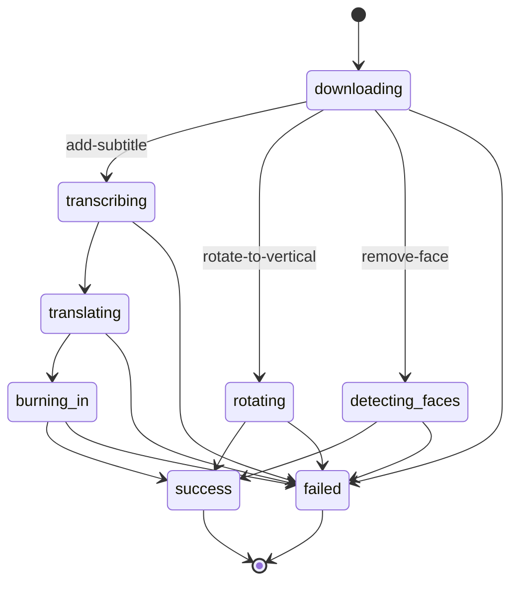
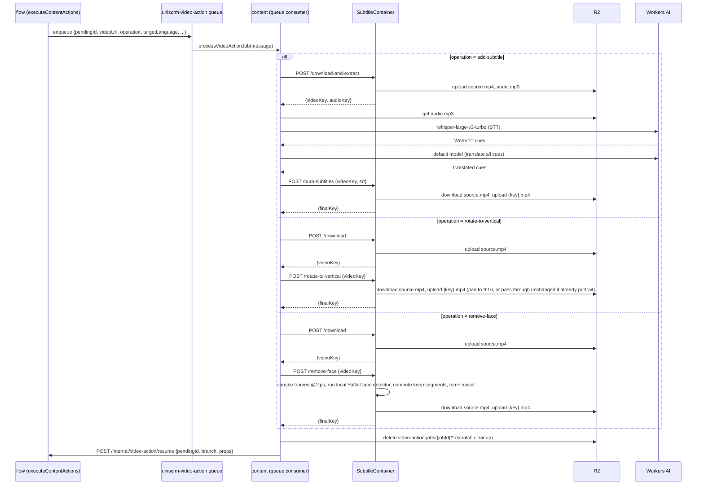

# Video Action: Rotate to Vertical + Remove Face Implementation Plan

> **For agentic workers:** REQUIRED SUB-SKILL: Use superpowers:subagent-driven-development (recommended) or superpowers:executing-plans to implement this plan task-by-task. Steps use checkbox (`- [ ]`) syntax for tracking.

**Goal:** Add two new operations — Rotate to Vertical and Remove Face — to the existing Video Action content-flow node, alongside the existing Add Subtitle, with an operation selector and node-chaining support.

**Architecture:** `flow`'s `videoAction` node gains an `operation` field (single-select: `add-subtitle` | `rotate-to-vertical` | `remove-face`). `content`'s queue consumer branches on `operation`; the two new operations reuse the existing `SubtitleContainer` (Docker/ffmpeg) with two new HTTP routes, one of which (`remove-face`) adds a local OpenCV (YuNet) face detector so no per-frame Workers AI round trip is needed. Chained Video Action nodes compose by having each node prefer the previous node's `$content.processed_video_url` over the content's original video.

**Tech Stack:** TypeScript (Hono/Workers, ReactFlow frontend), Python/Flask (container), ffmpeg, yt-dlp, OpenCV (`opencv-python-headless`, YuNet ONNX face detector), Cloudflare D1/Queues/Containers.

## Global Constraints

- One operation per Video Action node, selected via dropdown; combined effects require chaining multiple nodes (spec locked decision 1).
- A Video Action node's video source is `payload.processed_video_url` if present, else the content's original video via `link`'s `/internal/content/video-url` (spec locked decision 2).
- Remove Face cuts segments out (video gets shorter), not a blur/mask (spec locked decision 3).
- Remove Face fails (`failed` branch) if kept duration < 2 seconds (spec locked decision 4).
- Rotate to Vertical targets fixed 9:16 (1080×1920); no-ops (success, unchanged) if input height ≥ width (spec locked decision 5).
- Face detection is a local, in-container CV model (YuNet ONNX) — never a per-frame Workers AI call (spec locked decision 6).
- No user-facing tuning knobs for sampling rate / merge gap / padding / duration floor — hardcoded constants only (spec locked decision 7).
- New Python pytest coverage for pure logic only; run manually, never wired into CI / `deploy-dev.yml` (spec locked decision 8).
- `MAX_DURATION_SECONDS = 600` cap in `flow/src/index.ts` stays shared across all three operations, unchanged.
- `target_language` stays `NOT NULL` on `video_action_jobs`; new operations pass `""` rather than migrating nullability.

---

## Task 1: Job schema + job-store operation support

**Files:**
- Create: `content/migrations/0006_video_action_jobs_operation.sql`
- Modify: `content/src/services/video-action/job-store.ts`
- Modify: `content/src/services/video-action/status.md`
- Test: `content/tests/services/video-action/job-store.test.ts`

**Interfaces:**
- Produces: `createJob(env, { pendingId, contentId, tenantId, operation, targetLanguage })` (operation is now a required string param); `JobStatus` type extended with `"rotating" | "detecting_faces"`.

- [ ] **Step 1: Write the migration**

```sql
-- content/migrations/0006_video_action_jobs_operation.sql
-- Tracks which Video Action operation a job is running, now that add-subtitle,
-- rotate-to-vertical, and remove-face all share the same job table.
ALTER TABLE video_action_jobs ADD COLUMN operation TEXT NOT NULL DEFAULT 'add-subtitle';
```

- [ ] **Step 2: Update the existing job-store test to pass `operation` (compile-breaking otherwise)**

In `content/tests/services/video-action/job-store.test.ts`, change the existing first test:

```ts
  it("createJob inserts a row with job_status='downloading' and returns its id", async () => {
    const { env, runs } = makeEnv();
    const jobId = await createJob(env, {
      pendingId: "p1", contentId: "c1", tenantId: 1, operation: "add-subtitle", targetLanguage: "zh",
    });
    expect(typeof jobId).toBe("string");
    expect(runs[0].sql).toContain("INSERT INTO video_action_jobs");
    expect(runs[0].args).toContain("downloading");
  });
```

- [ ] **Step 3: Write the new failing test for operation persistence**

Add to the same `describe("video-action job-store", ...)` block:

```ts
  it("createJob persists the given operation", async () => {
    const { env, runs } = makeEnv();
    await createJob(env, {
      pendingId: "p2", contentId: "c2", tenantId: 1, operation: "rotate-to-vertical", targetLanguage: "",
    });
    expect(runs[0].args).toContain("rotate-to-vertical");
  });
```

- [ ] **Step 4: Run tests to verify they fail**

Run: `cd content && npx vitest run tests/services/video-action/job-store.test.ts`
Expected: FAIL — `createJob` doesn't accept/persist `operation` yet (TS type error on the `operation` field, or the new test's `toContain("rotate-to-vertical")` assertion fails).

- [ ] **Step 5: Implement `operation` support in job-store.ts**

Replace the full contents of `content/src/services/video-action/job-store.ts`:

```ts
import type { Env } from "../../types";

export type JobStatus =
  | "downloading"
  | "transcribing"
  | "translating"
  | "burning_in"
  | "rotating"
  | "detecting_faces"
  | "success"
  | "failed";

export interface CreateJobParams {
  pendingId: string;
  contentId: string;
  tenantId: number;
  operation: string;
  targetLanguage: string;
}

export async function createJob(env: Env, params: CreateJobParams): Promise<string> {
  const id = crypto.randomUUID();
  const now = new Date().toISOString();
  await env.CONTENT_DB.prepare(
    `INSERT INTO video_action_jobs (id, pending_id, content_id, tenant_id, operation, target_language, job_status, created_at, updated_at)
     VALUES (?, ?, ?, ?, ?, ?, ?, ?, ?)`
  ).bind(id, params.pendingId, params.contentId, params.tenantId, params.operation, params.targetLanguage, "downloading", now, now).run();
  return id;
}

export async function updateJobStatus(
  env: Env,
  jobId: string,
  status: JobStatus,
  failedStep?: string,
  error?: string
): Promise<void> {
  const now = new Date().toISOString();
  await env.CONTENT_DB.prepare(
    `UPDATE video_action_jobs SET job_status = ?, failed_step = ?, error = ?, updated_at = ? WHERE id = ?`
  ).bind(status, failedStep || null, error || null, now, jobId).run();
}
```

- [ ] **Step 6: Run tests to verify they pass**

Run: `cd content && npx vitest run tests/services/video-action/job-store.test.ts`
Expected: PASS (3 tests).

- [ ] **Step 7: Update status.md's state diagram**

Replace the full contents of `content/src/services/video-action/status.md`:

```markdown
# video_action_jobs.job_status state machine


```

- [ ] **Step 8: Typecheck**

Run: `cd content && npx tsc --noEmit`
Expected: no new errors in files touched this task.

- [ ] **Step 9: Commit**

```bash
git add content/migrations/0006_video_action_jobs_operation.sql content/src/services/video-action/job-store.ts content/src/services/video-action/status.md content/tests/services/video-action/job-store.test.ts
git commit -m "feat(content): track operation on video_action_jobs"
```

---

## Task 2: Container pure-logic functions (face-segment math) + pytest

**Files:**
- Create: `content/video_action_lib.py`
- Create: `content/tests/test_video_action_lib.py`

**Interfaces:**
- Produces: `compute_keep_segments(face_timestamps, video_duration, sample_interval=1.0, merge_gap=1.0, pad=0.2) -> list[tuple[float, float]]`, `needs_rotation(width, height) -> bool`, `is_too_short(total_kept_duration, min_duration=2.0) -> bool`. These have zero external dependencies (no flask/boto3/cv2 imports) so they're importable in a bare pytest run.

- [ ] **Step 1: Write the failing tests**

Create `content/tests/test_video_action_lib.py`:

```python
import sys
import os

sys.path.insert(0, os.path.join(os.path.dirname(__file__), ".."))

from video_action_lib import compute_keep_segments, needs_rotation, is_too_short


def test_compute_keep_segments_no_faces_keeps_whole_video():
    assert compute_keep_segments([], 10.0) == [(0.0, 10.0)]


def test_compute_keep_segments_single_face_segment_padded_and_cut_out():
    result = compute_keep_segments([5.0], 10.0)
    assert result == [(0.0, 4.8), (6.2, 10.0)]


def test_compute_keep_segments_merges_adjacent_face_samples():
    result = compute_keep_segments([3.0, 4.0, 5.0], 10.0)
    assert result == [(0.0, 2.8), (6.2, 10.0)]


def test_compute_keep_segments_merges_nearby_but_non_adjacent_faces_within_merge_gap():
    result = compute_keep_segments([0.0, 2.0], 10.0, sample_interval=1.0, merge_gap=1.5)
    assert result == [(3.2, 10.0)]


def test_compute_keep_segments_does_not_merge_faces_beyond_merge_gap():
    result = compute_keep_segments([0.0, 5.0], 10.0, sample_interval=1.0, merge_gap=1.0)
    assert result == [(1.2, 4.8), (6.2, 10.0)]


def test_compute_keep_segments_padding_clamped_at_video_start_and_end():
    result = compute_keep_segments([0.0, 9.0], 10.0, sample_interval=1.0, merge_gap=1.0)
    assert result == [(1.2, 8.8)]


def test_needs_rotation_true_for_landscape():
    assert needs_rotation(1920, 1080) is True


def test_needs_rotation_false_for_portrait():
    assert needs_rotation(1080, 1920) is False


def test_needs_rotation_false_for_square():
    assert needs_rotation(1000, 1000) is False


def test_is_too_short_below_threshold():
    assert is_too_short(1.5) is True


def test_is_too_short_at_or_above_threshold():
    assert is_too_short(2.0) is False
    assert is_too_short(5.0) is False
```

- [ ] **Step 2: Run tests to verify they fail**

Run: `cd content && pip install --quiet pytest && python -m pytest tests/test_video_action_lib.py -v`
Expected: FAIL — `ModuleNotFoundError: No module named 'video_action_lib'` (file doesn't exist yet).

- [ ] **Step 3: Implement the pure functions**

Create `content/video_action_lib.py`:

```python
def compute_keep_segments(face_timestamps, video_duration, sample_interval=1.0, merge_gap=1.0, pad=0.2):
    """Given sampled timestamps (seconds) where a face was detected, returns the list of
    (start, end) segments to KEEP — the complement of all face segments, after merging
    near-adjacent face segments and padding each to avoid abrupt mid-motion cuts."""
    if not face_timestamps:
        return [(0.0, video_duration)]

    raw_segments = sorted((t, t + sample_interval) for t in face_timestamps)

    merged = [raw_segments[0]]
    for start, end in raw_segments[1:]:
        last_start, last_end = merged[-1]
        if start - last_end <= merge_gap:
            merged[-1] = (last_start, max(last_end, end))
        else:
            merged.append((start, end))

    padded = [(max(0.0, s - pad), min(video_duration, e + pad)) for s, e in merged]

    face_segments = [padded[0]]
    for start, end in padded[1:]:
        last_start, last_end = face_segments[-1]
        if start <= last_end:
            face_segments[-1] = (last_start, max(last_end, end))
        else:
            face_segments.append((start, end))

    keep_segments = []
    cursor = 0.0
    for start, end in face_segments:
        if start > cursor:
            keep_segments.append((cursor, start))
        cursor = max(cursor, end)
    if cursor < video_duration:
        keep_segments.append((cursor, video_duration))

    return keep_segments


def needs_rotation(width, height):
    """True only for strictly landscape video — portrait and square are left unchanged."""
    return width > height


def is_too_short(total_kept_duration, min_duration=2.0):
    return total_kept_duration < min_duration
```

- [ ] **Step 4: Run tests to verify they pass**

Run: `cd content && python -m pytest tests/test_video_action_lib.py -v`
Expected: PASS (11 tests).

- [ ] **Step 5: Commit**

```bash
git add content/video_action_lib.py content/tests/test_video_action_lib.py
git commit -m "feat(content): add pure face-segment/rotation math for Video Action"
```

---

## Task 3: Container routes (rotate-to-vertical, remove-face) + Dockerfile

**Files:**
- Modify: `content/main.py`
- Modify: `content/Dockerfile`

**Interfaces:**
- Consumes: `compute_keep_segments`, `needs_rotation`, `is_too_short` from `content/video_action_lib.py` (Task 2).
- Produces: `POST /download` (video-only, `{video_key}` or `{error}`), `POST /rotate-to-vertical` (`{final_key}` or `{error}`), `POST /remove-face` (`{final_key}` or `{error}`). `/download-and-extract` and `/burn-subtitles` are unchanged in behavior (refactored internally to share the download helper).

No automated tests exist for `main.py`'s Flask routes today (only the pure functions from Task 2 are pytest-covered) — verification here is manual (Docker build + curl), matching this container's existing precedent.

- [ ] **Step 1: Update the Dockerfile**

Replace the full contents of `content/Dockerfile`:

```dockerfile
FROM python:3.12-slim

RUN apt-get update && apt-get install -y --no-install-recommends ffmpeg curl && rm -rf /var/lib/apt/lists/*
RUN pip install --no-cache-dir yt-dlp flask boto3 opencv-python-headless

WORKDIR /app

RUN curl -L -o face_detector.onnx https://github.com/opencv/opencv_zoo/raw/main/models/face_detection_yunet/face_detection_yunet_2023mar.onnx

COPY main.py .
COPY video_action_lib.py .

EXPOSE 8080
CMD ["python", "main.py"]
```

If this exact URL 404s during the build (OpenCV Zoo occasionally reorganizes its repo layout), search for the current raw URL to `face_detection_yunet_2023mar.onnx` in the `opencv/opencv_zoo` GitHub repo and use that instead — `docker build` fails loudly on a bad URL, so this is self-checking, not a silent guess.

- [ ] **Step 2: Replace `content/main.py` with the refactored + extended version**

```python
import os
import shutil
import subprocess
import uuid
import boto3
import cv2
from flask import Flask, request, jsonify
from video_action_lib import compute_keep_segments, needs_rotation, is_too_short

app = Flask(__name__)

FACE_DETECTOR_PATH = "/app/face_detector.onnx"


def r2_client():
    return boto3.client(
        "s3",
        endpoint_url=f"https://{os.environ['R2_ACCOUNT_ID']}.r2.cloudflarestorage.com",
        aws_access_key_id=os.environ["R2_ACCESS_KEY_ID"],
        aws_secret_access_key=os.environ["R2_SECRET_ACCESS_KEY"],
    )


def _download_video(job_id, video_url):
    """Downloads a video via yt-dlp into /tmp/{job_id}/source.mp4. Returns (video_path, error)."""
    work_dir = f"/tmp/{job_id}"
    os.makedirs(work_dir, exist_ok=True)
    video_path = f"{work_dir}/source.mp4"

    dl = subprocess.run(
        ["yt-dlp", "-f", "best[ext=mp4]/best", "-o", video_path, video_url],
        capture_output=True, text=True, timeout=600,
    )
    if dl.returncode != 0 or not os.path.exists(video_path):
        return None, f"download failed: {dl.stderr[-2000:]}"
    return video_path, None


def _probe_duration(video_path):
    probe = subprocess.run(
        ["ffprobe", "-v", "error", "-show_entries", "format=duration", "-of", "default=noprint_wrappers=1:nokey=1", video_path],
        capture_output=True, text=True, timeout=30,
    )
    return float(probe.stdout.strip())


def _probe_dimensions(video_path):
    probe = subprocess.run(
        ["ffprobe", "-v", "error", "-select_streams", "v:0", "-show_entries", "stream=width,height", "-of", "csv=s=x:p=0", video_path],
        capture_output=True, text=True, timeout=30,
    )
    width, height = probe.stdout.strip().split("x")
    return int(width), int(height)


@app.route("/health")
def health():
    return jsonify({"status": "ok"})


@app.route("/download", methods=["POST"])
def download():
    body = request.get_json()
    job_id = body["job_id"]
    video_url = body["video_url"]

    video_path, error = _download_video(job_id, video_url)
    if error:
        return jsonify({"error": error}), 200

    bucket = os.environ["R2_BUCKET_NAME"]
    video_key = f"video-action-jobs/{job_id}/source.mp4"
    r2_client().upload_file(video_path, bucket, video_key)

    return jsonify({"video_key": video_key})


@app.route("/download-and-extract", methods=["POST"])
def download_and_extract():
    body = request.get_json()
    job_id = body["job_id"]
    video_url = body["video_url"]

    video_path, error = _download_video(job_id, video_url)
    if error:
        return jsonify({"error": error}), 200

    work_dir = f"/tmp/{job_id}"
    audio_path = f"{work_dir}/audio.mp3"
    extract = subprocess.run(
        ["ffmpeg", "-y", "-i", video_path, "-vn", "-acodec", "libmp3lame", audio_path],
        capture_output=True, text=True, timeout=300,
    )
    if extract.returncode != 0 or not os.path.exists(audio_path):
        return jsonify({"error": f"audio extraction failed: {extract.stderr[-2000:]}"}), 200

    bucket = os.environ["R2_BUCKET_NAME"]
    video_key = f"video-action-jobs/{job_id}/source.mp4"
    audio_key = f"video-action-jobs/{job_id}/audio.mp3"
    client = r2_client()
    client.upload_file(video_path, bucket, video_key)
    client.upload_file(audio_path, bucket, audio_key)

    return jsonify({"video_key": video_key, "audio_key": audio_key})


@app.route("/burn-subtitles", methods=["POST"])
def burn_subtitles():
    body = request.get_json()
    job_id = body["job_id"]
    video_key = body["video_key"]
    subtitle_srt = body["subtitle_srt"]

    work_dir = f"/tmp/{job_id}"
    os.makedirs(work_dir, exist_ok=True)
    video_path = f"{work_dir}/source.mp4"
    srt_path = f"{work_dir}/subs.srt"
    output_path = f"{work_dir}/output.mp4"

    bucket = os.environ["R2_BUCKET_NAME"]
    client = r2_client()
    client.download_file(bucket, video_key, video_path)

    with open(srt_path, "w", encoding="utf-8") as f:
        f.write(subtitle_srt)

    burn = subprocess.run(
        ["ffmpeg", "-y", "-i", video_path, "-vf", f"subtitles={srt_path}", "-c:a", "copy", output_path],
        capture_output=True, text=True, timeout=600,
    )
    if burn.returncode != 0 or not os.path.exists(output_path):
        return jsonify({"error": f"burn-in failed: {burn.stderr[-2000:]}"}), 200

    final_key = f"{uuid.uuid4()}.mp4"
    client.upload_file(output_path, bucket, final_key, ExtraArgs={"ContentType": "video/mp4"})

    return jsonify({"final_key": final_key})


@app.route("/rotate-to-vertical", methods=["POST"])
def rotate_to_vertical():
    body = request.get_json()
    job_id = body["job_id"]
    video_key = body["video_key"]

    work_dir = f"/tmp/{job_id}"
    os.makedirs(work_dir, exist_ok=True)
    video_path = f"{work_dir}/source.mp4"
    output_path = f"{work_dir}/output.mp4"

    bucket = os.environ["R2_BUCKET_NAME"]
    client = r2_client()
    client.download_file(bucket, video_key, video_path)

    width, height = _probe_dimensions(video_path)

    if not needs_rotation(width, height):
        final_key = f"{uuid.uuid4()}.mp4"
        client.upload_file(video_path, bucket, final_key, ExtraArgs={"ContentType": "video/mp4"})
        return jsonify({"final_key": final_key})

    rotate = subprocess.run(
        ["ffmpeg", "-y", "-i", video_path, "-vf",
         "scale=1080:1920:force_original_aspect_ratio=decrease,pad=1080:1920:(ow-iw)/2:(oh-ih)/2:color=black",
         "-c:a", "copy", output_path],
        capture_output=True, text=True, timeout=600,
    )
    if rotate.returncode != 0 or not os.path.exists(output_path):
        return jsonify({"error": f"rotate failed: {rotate.stderr[-2000:]}"}), 200

    final_key = f"{uuid.uuid4()}.mp4"
    client.upload_file(output_path, bucket, final_key, ExtraArgs={"ContentType": "video/mp4"})
    return jsonify({"final_key": final_key})


@app.route("/remove-face", methods=["POST"])
def remove_face():
    body = request.get_json()
    job_id = body["job_id"]
    video_key = body["video_key"]

    work_dir = f"/tmp/{job_id}"
    frames_dir = f"{work_dir}/frames"
    video_path = f"{work_dir}/source.mp4"
    output_path = f"{work_dir}/output.mp4"

    try:
        os.makedirs(frames_dir, exist_ok=True)

        bucket = os.environ["R2_BUCKET_NAME"]
        client = r2_client()
        client.download_file(bucket, video_key, video_path)

        video_duration = _probe_duration(video_path)

        extract_frames = subprocess.run(
            ["ffmpeg", "-y", "-i", video_path, "-vf", "fps=1", f"{frames_dir}/frame_%04d.jpg"],
            capture_output=True, text=True, timeout=300,
        )
        if extract_frames.returncode != 0:
            return jsonify({"error": f"frame extraction failed: {extract_frames.stderr[-2000:]}"}), 200

        detector = cv2.FaceDetectorYN.create(FACE_DETECTOR_PATH, "", (320, 320))
        face_timestamps = []
        frame_files = sorted(os.listdir(frames_dir))
        for i, fname in enumerate(frame_files):
            frame = cv2.imread(f"{frames_dir}/{fname}")
            h, w = frame.shape[:2]
            detector.setInputSize((w, h))
            _, faces = detector.detect(frame)
            if faces is not None and len(faces) > 0:
                face_timestamps.append(float(i))

        keep_segments = compute_keep_segments(face_timestamps, video_duration)
        total_kept = sum(end - start for start, end in keep_segments)

        if is_too_short(total_kept):
            return jsonify({"error": "video too short after face removal"}), 200

        segment_paths = []
        for idx, (start, end) in enumerate(keep_segments):
            segment_path = f"{work_dir}/segment_{idx:04d}.mp4"
            trim = subprocess.run(
                ["ffmpeg", "-y", "-i", video_path, "-ss", str(start), "-to", str(end), "-c", "copy", segment_path],
                capture_output=True, text=True, timeout=300,
            )
            if trim.returncode != 0 or not os.path.exists(segment_path):
                return jsonify({"error": f"segment trim failed: {trim.stderr[-2000:]}"}), 200
            segment_paths.append(segment_path)

        concat_list_path = f"{work_dir}/concat_list.txt"
        with open(concat_list_path, "w", encoding="utf-8") as f:
            for p in segment_paths:
                f.write(f"file '{p}'\n")

        concat = subprocess.run(
            ["ffmpeg", "-y", "-f", "concat", "-safe", "0", "-i", concat_list_path, "-c", "copy", output_path],
            capture_output=True, text=True, timeout=300,
        )
        if concat.returncode != 0 or not os.path.exists(output_path):
            return jsonify({"error": f"concat failed: {concat.stderr[-2000:]}"}), 200

        final_key = f"{uuid.uuid4()}.mp4"
        client.upload_file(output_path, bucket, final_key, ExtraArgs={"ContentType": "video/mp4"})
        return jsonify({"final_key": final_key})
    finally:
        # Frame extraction can produce hundreds of jpg files per job — meaningfully more local
        # disk than any other route here — so this route alone cleans up its own /tmp scratch.
        shutil.rmtree(work_dir, ignore_errors=True)


if __name__ == "__main__":
    app.run(host="0.0.0.0", port=8080)
```

- [ ] **Step 3: Manual verification — build the image and smoke-test the new routes**

Run: `cd content && docker build -t subtitle-container-test .`
Expected: build succeeds (including the `curl` fetch of `face_detector.onnx` and `pip install opencv-python-headless`).

Run: `docker run -p 8080:8080 -e R2_ACCOUNT_ID=<dev-account-id> -e R2_ACCESS_KEY_ID=<dev-key> -e R2_SECRET_ACCESS_KEY=<dev-secret> -e R2_BUCKET_NAME=uniscrm-content-media-dev subtitle-container-test`
Expected: Flask starts, listening on 8080.

Run (new terminal): `curl http://localhost:8080/health`
Expected: `{"status": "ok"}`

Run: `curl -X POST http://localhost:8080/download -H "Content-Type: application/json" -d '{"job_id": "smoketest1", "video_url": "<any short public mp4 or YouTube Shorts URL>"}'`
Expected: `{"video_key": "video-action-jobs/smoketest1/source.mp4"}`

Run: `curl -X POST http://localhost:8080/rotate-to-vertical -H "Content-Type: application/json" -d '{"job_id": "smoketest1", "video_key": "video-action-jobs/smoketest1/source.mp4"}'`
Expected: `{"final_key": "<uuid>.mp4"}` — confirm in the R2 dashboard the uploaded file is 1080×1920 (or unchanged if the test video was already portrait).

Run: `curl -X POST http://localhost:8080/remove-face -H "Content-Type: application/json" -d '{"job_id": "smoketest1", "video_key": "video-action-jobs/smoketest1/source.mp4"}'`
Expected: `{"final_key": "<uuid>.mp4"}` for a video with some face-free segments, or `{"error": "video too short after face removal"}` for a video that's face-heavy throughout — either is a valid pass, confirming the pipeline runs end-to-end without crashing.

- [ ] **Step 4: Commit**

```bash
git add content/main.py content/Dockerfile
git commit -m "feat(content): add rotate-to-vertical and remove-face container routes"
```

---

## Task 4: container-client.ts wrappers

**Files:**
- Modify: `content/src/services/video-action/container-client.ts`
- Test: `content/tests/services/video-action/container-client.test.ts`

**Interfaces:**
- Consumes: the `/download`, `/rotate-to-vertical`, `/remove-face` container routes from Task 3 (request/response JSON shape only — this task's tests mock `container.fetch` directly, no real container needed).
- Produces: `downloadVideo(env, jobId, videoUrl): Promise<{videoKey?: string; error?: string}>`, `rotateToVertical(env, jobId, videoKey): Promise<{finalKey?: string; error?: string}>`, `removeFace(env, jobId, videoKey): Promise<{finalKey?: string; error?: string}>`.

- [ ] **Step 1: Write the failing tests**

Add to `content/tests/services/video-action/container-client.test.ts` (append inside the existing `describe("container-client", ...)` block, and update the import at the top):

```ts
import { downloadAndExtract, burnSubtitles, downloadVideo, rotateToVertical, removeFace } from "../../../src/services/video-action/container-client";
```

```ts
  it("downloadVideo returns videoKey on success", async () => {
    const env = makeEnv({ video_key: "v2" });
    const result = await downloadVideo(env, "job1", "https://youtube.com/watch?v=x");
    expect(result).toEqual({ videoKey: "v2" });
  });

  it("downloadVideo surfaces an error", async () => {
    const env = makeEnv({ error: "download failed" });
    const result = await downloadVideo(env, "job1", "https://youtube.com/watch?v=x");
    expect(result.error).toBe("download failed");
  });

  it("rotateToVertical returns finalKey on success", async () => {
    const env = makeEnv({ final_key: "rotated-abc.mp4" });
    const result = await rotateToVertical(env, "job1", "video-action-jobs/job1/source.mp4");
    expect(result).toEqual({ finalKey: "rotated-abc.mp4" });
  });

  it("rotateToVertical surfaces an error", async () => {
    const env = makeEnv({ error: "rotate failed" });
    const result = await rotateToVertical(env, "job1", "video-action-jobs/job1/source.mp4");
    expect(result.error).toBe("rotate failed");
  });

  it("removeFace returns finalKey on success", async () => {
    const env = makeEnv({ final_key: "trimmed-abc.mp4" });
    const result = await removeFace(env, "job1", "video-action-jobs/job1/source.mp4");
    expect(result).toEqual({ finalKey: "trimmed-abc.mp4" });
  });

  it("removeFace surfaces an error", async () => {
    const env = makeEnv({ error: "video too short after face removal" });
    const result = await removeFace(env, "job1", "video-action-jobs/job1/source.mp4");
    expect(result.error).toBe("video too short after face removal");
  });
```

- [ ] **Step 2: Run tests to verify they fail**

Run: `cd content && npx vitest run tests/services/video-action/container-client.test.ts`
Expected: FAIL — `downloadVideo`/`rotateToVertical`/`removeFace` are not exported yet.

- [ ] **Step 3: Implement the wrappers**

Append to `content/src/services/video-action/container-client.ts`:

```ts
export interface VideoOnlyDownloadResult {
  videoKey?: string;
  error?: string;
}

export async function downloadVideo(env: Env, jobId: string, videoUrl: string): Promise<VideoOnlyDownloadResult> {
  const container = env.SUBTITLE_CONTAINER.getByName("subtitle-singleton");
  await container.startAndWaitForPorts();
  const res = await container.fetch("http://container/download", {
    method: "POST",
    headers: { "Content-Type": "application/json" },
    body: JSON.stringify({ job_id: jobId, video_url: videoUrl }),
  });
  const body = await res.json() as { video_key?: string; error?: string };
  if (body.error) return { error: body.error };
  return { videoKey: body.video_key };
}

export async function rotateToVertical(env: Env, jobId: string, videoKey: string): Promise<BurnResult> {
  const container = env.SUBTITLE_CONTAINER.getByName("subtitle-singleton");
  await container.startAndWaitForPorts();
  const res = await container.fetch("http://container/rotate-to-vertical", {
    method: "POST",
    headers: { "Content-Type": "application/json" },
    body: JSON.stringify({ job_id: jobId, video_key: videoKey }),
  });
  const body = await res.json() as { final_key?: string; error?: string };
  if (body.error) return { error: body.error };
  return { finalKey: body.final_key };
}

export async function removeFace(env: Env, jobId: string, videoKey: string): Promise<BurnResult> {
  const container = env.SUBTITLE_CONTAINER.getByName("subtitle-singleton");
  await container.startAndWaitForPorts();
  const res = await container.fetch("http://container/remove-face", {
    method: "POST",
    headers: { "Content-Type": "application/json" },
    body: JSON.stringify({ job_id: jobId, video_key: videoKey }),
  });
  const body = await res.json() as { final_key?: string; error?: string };
  if (body.error) return { error: body.error };
  return { finalKey: body.final_key };
}
```

(`BurnResult` is the existing `{ finalKey?: string; error?: string }` interface already declared earlier in this file — reused as-is since both new operations return the same shape.)

- [ ] **Step 4: Run tests to verify they pass**

Run: `cd content && npx vitest run tests/services/video-action/container-client.test.ts`
Expected: PASS (7 tests).

- [ ] **Step 5: Typecheck**

Run: `cd content && npx tsc --noEmit`
Expected: no new errors.

- [ ] **Step 6: Commit**

```bash
git add content/src/services/video-action/container-client.ts content/tests/services/video-action/container-client.test.ts
git commit -m "feat(content): add downloadVideo/rotateToVertical/removeFace container-client wrappers"
```

---

## Task 5: Queue consumer operation branching

**Files:**
- Modify: `content/src/queue-video-action.ts`
- Modify: `content/src/services/video-action/sequence.md`
- Test: `content/tests/queue-video-action.test.ts`

**Interfaces:**
- Consumes: `createJob(env, {..., operation, targetLanguage})` (Task 1), `downloadVideo`/`rotateToVertical`/`removeFace` (Task 4).
- Produces: `VideoActionQueueMessage.operation: "add-subtitle" | "rotate-to-vertical" | "remove-face"` — the field Task 7's `flow/src/index.ts` dispatch will set when enqueueing.

- [ ] **Step 1: Update the existing test fixture (compile-breaking otherwise) and add new tests**

In `content/tests/queue-video-action.test.ts`, change the `message` fixture at the top:

```ts
const message = {
  pendingId: "pend1", contentId: "c1", tenantId: 1,
  videoUrl: "https://youtube.com/watch?v=x", operation: "add-subtitle" as const, targetLanguage: "zh",
  flowId: "f1", nodeId: "n1", payload: {},
};
```

Add to the top imports:

```ts
import * as containerClient from "../src/services/video-action/container-client";
```

(already imported — no change needed if it's already there; verify before editing.)

Append new tests inside the existing `describe("processVideoActionJob", ...)` block:

```ts
  it("rotate-to-vertical: resolves success and posts only processed_video_url", async () => {
    vi.spyOn(containerClient, "downloadVideo").mockResolvedValue({ videoKey: "v1" });
    vi.spyOn(containerClient, "rotateToVertical").mockResolvedValue({ finalKey: "rotated-xyz.mp4" });

    await processVideoActionJob(makeEnv(), { ...message, operation: "rotate-to-vertical" });

    expect(jobStore.updateJobStatus).toHaveBeenCalledWith(expect.anything(), "job1", "rotating");
    expect(jobStore.updateJobStatus).toHaveBeenCalledWith(expect.anything(), "job1", "success");
    const resumeCall = (fetch as any).mock.calls.find((c: any[]) => c[0].includes("/internal/video-action/resume"));
    const body = JSON.parse(resumeCall[1].body);
    expect(body.branch).toBe("success");
    expect(body.props).toEqual({ processed_video_url: expect.stringContaining("rotated-xyz.mp4") });
  });

  it("rotate-to-vertical: resolves failed when the container reports an error", async () => {
    vi.spyOn(containerClient, "downloadVideo").mockResolvedValue({ videoKey: "v1" });
    vi.spyOn(containerClient, "rotateToVertical").mockResolvedValue({ error: "rotate failed" });

    await processVideoActionJob(makeEnv(), { ...message, operation: "rotate-to-vertical" });

    expect(jobStore.updateJobStatus).toHaveBeenCalledWith(expect.anything(), "job1", "failed", "rotating", "rotate failed");
    const resumeCall = (fetch as any).mock.calls.find((c: any[]) => c[0].includes("/internal/video-action/resume"));
    const body = JSON.parse(resumeCall[1].body);
    expect(body.branch).toBe("failed");
  });

  it("remove-face: resolves success and posts only processed_video_url", async () => {
    vi.spyOn(containerClient, "downloadVideo").mockResolvedValue({ videoKey: "v1" });
    vi.spyOn(containerClient, "removeFace").mockResolvedValue({ finalKey: "cut-xyz.mp4" });

    await processVideoActionJob(makeEnv(), { ...message, operation: "remove-face" });

    expect(jobStore.updateJobStatus).toHaveBeenCalledWith(expect.anything(), "job1", "detecting_faces");
    expect(jobStore.updateJobStatus).toHaveBeenCalledWith(expect.anything(), "job1", "success");
    const resumeCall = (fetch as any).mock.calls.find((c: any[]) => c[0].includes("/internal/video-action/resume"));
    const body = JSON.parse(resumeCall[1].body);
    expect(body.branch).toBe("success");
    expect(body.props).toEqual({ processed_video_url: expect.stringContaining("cut-xyz.mp4") });
  });

  it("remove-face: resolves failed when the video is too short after removal", async () => {
    vi.spyOn(containerClient, "downloadVideo").mockResolvedValue({ videoKey: "v1" });
    vi.spyOn(containerClient, "removeFace").mockResolvedValue({ error: "video too short after face removal" });

    await processVideoActionJob(makeEnv(), { ...message, operation: "remove-face" });

    expect(jobStore.updateJobStatus).toHaveBeenCalledWith(expect.anything(), "job1", "failed", "detecting_faces", "video too short after face removal");
    const resumeCall = (fetch as any).mock.calls.find((c: any[]) => c[0].includes("/internal/video-action/resume"));
    const body = JSON.parse(resumeCall[1].body);
    expect(body.branch).toBe("failed");
  });

  it("rotate-to-vertical and remove-face: resolve failed when download fails, without calling the operation step", async () => {
    vi.spyOn(containerClient, "downloadVideo").mockResolvedValue({ error: "yt-dlp failed" });
    const rotateSpy = vi.spyOn(containerClient, "rotateToVertical");

    await processVideoActionJob(makeEnv(), { ...message, operation: "rotate-to-vertical" });

    expect(rotateSpy).not.toHaveBeenCalled();
    expect(jobStore.updateJobStatus).toHaveBeenCalledWith(expect.anything(), "job1", "failed", "downloading", "yt-dlp failed");
  });
```

- [ ] **Step 2: Run tests to verify they fail**

Run: `cd content && npx vitest run tests/queue-video-action.test.ts`
Expected: FAIL — `processVideoActionJob` doesn't branch on `operation` yet, and `downloadVideo`/`rotateToVertical`/`removeFace` spies are never called.

- [ ] **Step 3: Implement operation branching in queue-video-action.ts**

Replace the full contents of `content/src/queue-video-action.ts`:

```ts
import type { Env } from "./types";
import { createJob, updateJobStatus } from "./services/video-action/job-store";
import { downloadAndExtract, downloadVideo, burnSubtitles, rotateToVertical, removeFace } from "./services/video-action/container-client";
import { transcribeAudio } from "./services/video-action/transcribe";
import { translateCues, cuesToSrt } from "./services/video-action/translate";

export interface VideoActionQueueMessage {
  pendingId: string;
  contentId: string;
  tenantId: number;
  videoUrl: string;
  operation: "add-subtitle" | "rotate-to-vertical" | "remove-face";
  targetLanguage: string;
  flowId: string;
  nodeId: string;
  payload: Record<string, unknown>;
}

async function resumeFlow(env: Env, pendingId: string, branch: "success" | "failed", props: Record<string, unknown> = {}): Promise<void> {
  try {
    await fetch(`${env.FLOW_URL}/internal/video-action/resume`, {
      method: "POST",
      headers: { "Content-Type": "application/json", "X-Internal-Secret": env.INTERNAL_SECRET },
      body: JSON.stringify({ pendingId, branch, props }),
    });
  } catch (err) {
    console.error(JSON.stringify({ event: "video_action_resume_callback_failed", pendingId, error: String(err) }));
    // No retry — flow's content_flow_pending timeout sweep is the backstop for a dropped callback.
  }
}

async function cleanupScratch(env: Env, jobId: string): Promise<void> {
  try {
    await env.MEDIA_BUCKET.delete(`video-action-jobs/${jobId}/source.mp4`);
    await env.MEDIA_BUCKET.delete(`video-action-jobs/${jobId}/audio.mp3`);
  } catch (err) {
    console.error(JSON.stringify({ event: "video_action_scratch_cleanup_failed", jobId, error: String(err) }));
  }
}

async function processAddSubtitle(env: Env, jobId: string, message: VideoActionQueueMessage): Promise<void> {
  const downloaded = await downloadAndExtract(env, jobId, message.videoUrl);
  if (downloaded.error || !downloaded.videoKey || !downloaded.audioKey) {
    await updateJobStatus(env, jobId, "failed", "downloading", downloaded.error || "unknown download error");
    await cleanupScratch(env, jobId);
    await resumeFlow(env, message.pendingId, "failed");
    return;
  }

  await updateJobStatus(env, jobId, "transcribing");
  const cues = await transcribeAudio(env, downloaded.audioKey);
  if (!cues) {
    await updateJobStatus(env, jobId, "failed", "transcribing", "no speech detected or transcription error");
    await cleanupScratch(env, jobId);
    await resumeFlow(env, message.pendingId, "failed");
    return;
  }

  await updateJobStatus(env, jobId, "translating");
  const translated = await translateCues(env, message.tenantId, cues, message.targetLanguage);
  if (!translated) {
    await updateJobStatus(env, jobId, "failed", "translating", "translation failed or cue count mismatch");
    await cleanupScratch(env, jobId);
    await resumeFlow(env, message.pendingId, "failed");
    return;
  }

  await updateJobStatus(env, jobId, "burning_in");
  const srt = cuesToSrt(translated.translatedCues);
  const burned = await burnSubtitles(env, jobId, downloaded.videoKey, srt);
  if (burned.error || !burned.finalKey) {
    await updateJobStatus(env, jobId, "failed", "burning_in", burned.error || "unknown burn-in error");
    await cleanupScratch(env, jobId);
    await resumeFlow(env, message.pendingId, "failed");
    return;
  }

  await updateJobStatus(env, jobId, "success");
  await cleanupScratch(env, jobId);

  const originalText = cues.map((c) => c.text).join(" ");
  await resumeFlow(env, message.pendingId, "success", {
    processed_video_url: `${env.CONTENT_URL}/public/media/${burned.finalKey}`,
    video_transcript: originalText,
    translated_subtitle_text: translated.plainText,
  });
}

async function processRotateToVertical(env: Env, jobId: string, message: VideoActionQueueMessage): Promise<void> {
  const downloaded = await downloadVideo(env, jobId, message.videoUrl);
  if (downloaded.error || !downloaded.videoKey) {
    await updateJobStatus(env, jobId, "failed", "downloading", downloaded.error || "unknown download error");
    await cleanupScratch(env, jobId);
    await resumeFlow(env, message.pendingId, "failed");
    return;
  }

  await updateJobStatus(env, jobId, "rotating");
  const rotated = await rotateToVertical(env, jobId, downloaded.videoKey);
  if (rotated.error || !rotated.finalKey) {
    await updateJobStatus(env, jobId, "failed", "rotating", rotated.error || "unknown rotate error");
    await cleanupScratch(env, jobId);
    await resumeFlow(env, message.pendingId, "failed");
    return;
  }

  await updateJobStatus(env, jobId, "success");
  await cleanupScratch(env, jobId);
  await resumeFlow(env, message.pendingId, "success", {
    processed_video_url: `${env.CONTENT_URL}/public/media/${rotated.finalKey}`,
  });
}

async function processRemoveFace(env: Env, jobId: string, message: VideoActionQueueMessage): Promise<void> {
  const downloaded = await downloadVideo(env, jobId, message.videoUrl);
  if (downloaded.error || !downloaded.videoKey) {
    await updateJobStatus(env, jobId, "failed", "downloading", downloaded.error || "unknown download error");
    await cleanupScratch(env, jobId);
    await resumeFlow(env, message.pendingId, "failed");
    return;
  }

  await updateJobStatus(env, jobId, "detecting_faces");
  const cut = await removeFace(env, jobId, downloaded.videoKey);
  if (cut.error || !cut.finalKey) {
    await updateJobStatus(env, jobId, "failed", "detecting_faces", cut.error || "unknown remove-face error");
    await cleanupScratch(env, jobId);
    await resumeFlow(env, message.pendingId, "failed");
    return;
  }

  await updateJobStatus(env, jobId, "success");
  await cleanupScratch(env, jobId);
  await resumeFlow(env, message.pendingId, "success", {
    processed_video_url: `${env.CONTENT_URL}/public/media/${cut.finalKey}`,
  });
}

export async function processVideoActionJob(env: Env, message: VideoActionQueueMessage): Promise<void> {
  let jobId: string;
  try {
    jobId = await createJob(env, {
      pendingId: message.pendingId, contentId: message.contentId,
      tenantId: message.tenantId, operation: message.operation, targetLanguage: message.targetLanguage,
    });
  } catch (err) {
    console.error(JSON.stringify({ event: "video_action_job_create_failed", pendingId: message.pendingId, error: String(err) }));
    await resumeFlow(env, message.pendingId, "failed");
    return;
  }

  try {
    if (message.operation === "rotate-to-vertical") {
      await processRotateToVertical(env, jobId, message);
    } else if (message.operation === "remove-face") {
      await processRemoveFace(env, jobId, message);
    } else {
      await processAddSubtitle(env, jobId, message);
    }
  } catch (err) {
    console.error(JSON.stringify({ event: "video_action_job_error", jobId, error: String(err) }));
    try {
      await updateJobStatus(env, jobId, "failed", "unknown", String(err));
    } catch (statusErr) {
      console.error(JSON.stringify({ event: "video_action_job_status_update_failed", jobId, error: String(statusErr) }));
    }
    await cleanupScratch(env, jobId);
    await resumeFlow(env, message.pendingId, "failed");
  }
}
```

- [ ] **Step 4: Run tests to verify they pass**

Run: `cd content && npx vitest run tests/queue-video-action.test.ts`
Expected: PASS (all tests, including the 5 pre-existing add-subtitle ones and the 5 new ones).

- [ ] **Step 5: Typecheck**

Run: `cd content && npx tsc --noEmit`
Expected: no new errors.

- [ ] **Step 6: Update sequence.md**

Replace the full contents of `content/src/services/video-action/sequence.md`:

```markdown
# Video Action pipeline sequence


```

- [ ] **Step 7: Commit**

```bash
git add content/src/queue-video-action.ts content/src/services/video-action/sequence.md content/tests/queue-video-action.test.ts
git commit -m "feat(content): branch Video Action queue consumer on operation"
```

---

## Task 6: Flow engine + registry — capture `operation`

**Files:**
- Modify: `flow/src/engine.ts:290-292` (the existing `if (actionType === "videoAction")` block in `buildActionData`)
- Modify: `flow/nodeTypeRegistry.ts:222-231` (the `videoAction` entry)
- Test: `flow/tests/unit/engine.test.ts`

**Interfaces:**
- Produces: `ActionResult.operation: string` for `videoAction` nodes (default `"add-subtitle"`), consumed by Task 7's `flow/src/index.ts` dispatch.

- [ ] **Step 1: Write the failing tests**

Add to the existing `describe(...)` block in `flow/tests/unit/engine.test.ts` that already contains the two `videoAction` tests (the one ending `defaults targetLanguage to 'zh' when not set on a videoAction node`):

```ts
  it("captures operation on a videoAction node, defaulting to 'add-subtitle'", () => {
    const graph: FlowGraph = {
      nodes: [
        { id: "t1", type: "xContentTrigger", data: { channelId: "chan1", mode: "own:get-posts", conditions: [] }, position: { x: 0, y: 0 } },
        { id: "a1", type: "action", data: { actionType: "videoAction" }, position: { x: 200, y: 0 } },
      ],
      edges: [{ id: "e1", source: "t1", target: "a1" }],
    };
    const result = executeFlow(graph, "content.created", { channel_id: "chan1" });
    expect(result.actions[0]).toMatchObject({ operation: "add-subtitle" });
  });

  it("captures an explicit operation on a videoAction node", () => {
    const graph: FlowGraph = {
      nodes: [
        { id: "t1", type: "xContentTrigger", data: { channelId: "chan1", mode: "own:get-posts", conditions: [] }, position: { x: 0, y: 0 } },
        { id: "a1", type: "action", data: { actionType: "videoAction", operation: "rotate-to-vertical" }, position: { x: 200, y: 0 } },
      ],
      edges: [{ id: "e1", source: "t1", target: "a1" }],
    };
    const result = executeFlow(graph, "content.created", { channel_id: "chan1" });
    expect(result.actions[0]).toMatchObject({ operation: "rotate-to-vertical" });
  });
```

- [ ] **Step 2: Run tests to verify they fail**

Run: `cd flow && npx vitest run tests/unit/engine.test.ts`
Expected: FAIL — `result.actions[0].operation` is `undefined`.

- [ ] **Step 3: Implement operation capture in `buildActionData`**

In `flow/src/engine.ts`, change:

```ts
  if (actionType === "videoAction") {
    actionData.targetLanguage = (targetNode.data.targetLanguage as string) || "zh";
  }
```

to:

```ts
  if (actionType === "videoAction") {
    actionData.operation = (targetNode.data.operation as string) || "add-subtitle";
    actionData.targetLanguage = (targetNode.data.targetLanguage as string) || "zh";
  }
```

- [ ] **Step 4: Run tests to verify they pass**

Run: `cd flow && npx vitest run tests/unit/engine.test.ts`
Expected: PASS (all tests, including the 2 new ones).

- [ ] **Step 5: Update the promptFragment in nodeTypeRegistry.ts**

In `flow/nodeTypeRegistry.ts`, change the `videoAction` entry's `promptFragment`:

```ts
  videoAction: {
    reactFlowType: "action",
    label: "Video Action",
    description: "Add translated subtitles to the content's video",
    domain: "content",
    role: "action",
    generatable: true,
    promptFragment: `For video actions: data: { actionType: "videoAction", operation: "add-subtitle"|"rotate-to-vertical"|"remove-face", targetLanguage: "zh" }
   - "add-subtitle": downloads the content's video (or the previous Video Action node's output, if chained), transcribes speech, translates it into targetLanguage, burns in subtitles, caches the result in R2. Has "success"/"failed" branches. Produces $content.processed_video_url, $content.video_transcript, $content.translated_subtitle_text.
   - "rotate-to-vertical": pads the video into 9:16 (1080x1920), centered, black bars top/bottom. No-ops (still succeeds) if already portrait/square. Has "success"/"failed" branches. Produces $content.processed_video_url only. targetLanguage is ignored.
   - "remove-face": cuts every segment containing a human face, shortening the video. Fails if the remaining duration drops below ~2 seconds. Has "success"/"failed" branches. Produces $content.processed_video_url only. targetLanguage is ignored.`,
  },
```

- [ ] **Step 6: Typecheck**

Run: `cd flow && npx tsc --noEmit`
Expected: no new errors.

- [ ] **Step 7: Run the full flow test suite (registry changes are stringly-typed and easy to break other tests silently)**

Run: `cd flow && npx vitest run`
Expected: PASS (all existing tests, including `node-type-registry.test.ts` and `generate-prompt.test.ts`, still pass — this task changed only the `promptFragment` string content and added a new field, not the registry's shape).

- [ ] **Step 8: Commit**

```bash
git add flow/src/engine.ts flow/nodeTypeRegistry.ts flow/tests/unit/engine.test.ts
git commit -m "feat(flow): capture operation on videoAction nodes"
```

---

## Task 7: Flow dispatch — chaining precedence + operation forwarding

**Files:**
- Modify: `flow/src/index.ts` (the `videoAction` branch in `executeContentActions`, ~lines 675-737)
- Test: `flow/tests/unit/queue-content.test.ts`

**Interfaces:**
- Consumes: `action.operation` (Task 6), `VideoActionQueueMessage.operation` shape (Task 5).
- Produces: the `VIDEO_ACTION_QUEUE.send(...)` message now includes `operation`; the video-source resolution now prefers `payload.processed_video_url`.

- [ ] **Step 1: Write the failing tests**

Add to the `describe("queue(): videoAction dispatch", ...)` block in `flow/tests/unit/queue-content.test.ts` (same block containing `graphWithVideoAction()`), right before its closing `});`:

```ts
  it("uses payload.processed_video_url as the video source and skips the link lookup, when chained from a prior Video Action node", async () => {
    const fetchMock = vi.fn().mockResolvedValue(new Response(JSON.stringify({ url: "https://youtube.com/watch?v=should-not-be-used" }), { status: 200 }));
    vi.stubGlobal("fetch", fetchMock);
    const queueSend = vi.fn();
    const testEnv = { ...env, VIDEO_ACTION_QUEUE: { send: queueSend } };

    await env.FLOW_DB.prepare(
      `INSERT INTO flows (id, tenant_id, name, graph_json, status, created_at, updated_at)
       VALUES ('flow-videoaction-chain', 1, 'chained video action flow', ?, 'published', datetime('now'), datetime('now'))`
    ).bind(graphWithVideoAction()).run();

    await worker.queue(
      makeBatch({
        tenantId: "1", eventType: "content.created", contentId: "content-va-chain", channelId: "src-chan",
        payload: { processed_video_url: "https://content-dev.uni-scrm.com/public/media/rotated.mp4" },
      }),
      testEnv as any
    );

    expect(queueSend).toHaveBeenCalledTimes(1);
    const message = queueSend.mock.calls[0][0];
    expect(message.videoUrl).toBe("https://content-dev.uni-scrm.com/public/media/rotated.mp4");
    expect(fetchMock).not.toHaveBeenCalled();
  });

  it("forwards operation in the VIDEO_ACTION_QUEUE message, defaulting to 'add-subtitle'", async () => {
    const fetchMock = vi.fn().mockResolvedValue(new Response(JSON.stringify({ url: "https://youtube.com/watch?v=x" }), { status: 200 }));
    vi.stubGlobal("fetch", fetchMock);
    const queueSend = vi.fn();
    const testEnv = { ...env, VIDEO_ACTION_QUEUE: { send: queueSend } };

    await env.FLOW_DB.prepare(
      `INSERT INTO flows (id, tenant_id, name, graph_json, status, created_at, updated_at)
       VALUES ('flow-videoaction-op', 1, 'video action op flow', ?, 'published', datetime('now'), datetime('now'))`
    ).bind(graphWithVideoAction()).run();

    await worker.queue(
      makeBatch({
        tenantId: "1", eventType: "content.created", contentId: "content-va-op", channelId: "src-chan",
        payload: { source_content_id: "x" },
      }),
      testEnv as any
    );

    const message = queueSend.mock.calls[0][0];
    expect(message.operation).toBe("add-subtitle");
  });
```

- [ ] **Step 2: Run tests to verify they fail**

Run: `cd flow && npx vitest run tests/unit/queue-content.test.ts`
Expected: FAIL — the first new test fails because `fetchMock` is still called (source resolution doesn't check `payload.processed_video_url` yet); the second fails because `message.operation` is `undefined`.

- [ ] **Step 3: Implement the precedence check and operation forwarding**

In `flow/src/index.ts`, find this block inside the `videoAction` branch of `executeContentActions`:

```ts
      const sourceContentId = String(payload?.source_content_id ?? "");
      let videoUrl: string | null = null;
      try {
        const res = await fetch(`${env.LINK_URL}/internal/content/video-url`, {
          method: "POST",
          headers: { "Content-Type": "application/json", "X-Internal-Secret": env.INTERNAL_SECRET },
          body: JSON.stringify({ contentId, channelId, sourceContentId }),
        });
        if (res.ok) {
          const body = await res.json() as { url: string | null };
          videoUrl = body.url;
        }
      } catch {
        // network error: treated the same as "no video" below
      }
```

Replace it with:

```ts
      const sourceContentId = String(payload?.source_content_id ?? "");
      let videoUrl: string | null = String(payload?.processed_video_url ?? "") || null;
      if (!videoUrl) {
        try {
          const res = await fetch(`${env.LINK_URL}/internal/content/video-url`, {
            method: "POST",
            headers: { "Content-Type": "application/json", "X-Internal-Secret": env.INTERNAL_SECRET },
            body: JSON.stringify({ contentId, channelId, sourceContentId }),
          });
          if (res.ok) {
            const body = await res.json() as { url: string | null };
            videoUrl = body.url;
          }
        } catch {
          // network error: treated the same as "no video" below
        }
      }
```

Then find the enqueue call further down:

```ts
      await env.VIDEO_ACTION_QUEUE.send({
        pendingId, contentId, tenantId: Number(tenantId),
        videoUrl, targetLanguage: (action.targetLanguage as string) || "zh",
        flowId: flowId || "", nodeId, payload,
      });
```

Replace it with:

```ts
      await env.VIDEO_ACTION_QUEUE.send({
        pendingId, contentId, tenantId: Number(tenantId),
        videoUrl, operation: (action.operation as string) || "add-subtitle", targetLanguage: (action.targetLanguage as string) || "zh",
        flowId: flowId || "", nodeId, payload,
      });
```

- [ ] **Step 4: Run tests to verify they pass**

Run: `cd flow && npx vitest run tests/unit/queue-content.test.ts`
Expected: PASS (all tests, including the 2 new ones and every pre-existing `videoAction`/`attachVideo`/`video-post` test — the precedence check only short-circuits when `payload.processed_video_url` is truthy, which none of the pre-existing tests in this describe block set).

- [ ] **Step 5: Typecheck**

Run: `cd flow && npx tsc --noEmit`
Expected: no new errors.

- [ ] **Step 6: Run the full flow test suite**

Run: `cd flow && npx vitest run`
Expected: PASS (all tests — this change touches a shared dispatch path used only by `videoAction`, but run the full suite since `flow/src/index.ts` is large and shared).

- [ ] **Step 7: Commit**

```bash
git add flow/src/index.ts flow/tests/unit/queue-content.test.ts
git commit -m "feat(flow): chain videoAction nodes via processed_video_url, forward operation to queue"
```

---

## Task 8: Inspector + ActionNode UI

**Files:**
- Modify: `flow/frontend/components/Inspector.tsx:788-810` (`VideoActionInspector`)
- Modify: `flow/frontend/nodes/ActionNode.tsx:52-56` (the `videoAction` branch in `ActionNode`)

**Interfaces:**
- Consumes: `data.operation` (Task 6's engine capture; also the raw node data set by this Inspector).

No automated tests exist for `Inspector.tsx` or `ActionNode.tsx` today (no test files reference them directly) — this task is verified by manual browser testing only, matching this codebase's existing convention for these two files.

- [ ] **Step 1: Add the Operation select to `VideoActionInspector`**

In `flow/frontend/components/Inspector.tsx`, replace the full `VideoActionInspector` function (currently lines 788-810):

```tsx
const VIDEO_ACTION_OPERATIONS = [
  { value: "add-subtitle", label: "Add Subtitle" },
  { value: "rotate-to-vertical", label: "Rotate to Vertical" },
  { value: "remove-face", label: "Remove Face" },
];

function VideoActionInspector({ nodeId, data }: { nodeId: string; data: Record<string, any> }) {
  const { updateNodeData } = useFlowEditor();
  const operation = (data.operation as string) || "add-subtitle";

  return (
    <div>
      <h4 className="text-sm font-semibold text-primary mb-3">{NODE_TYPE_REGISTRY.videoAction.label}</h4>
      <div className="space-y-3">
        <div>
          <Label className="text-xs block mb-1">Operation</Label>
          <OperationSelect
            value={operation}
            onChange={(v) => updateNodeData(nodeId, { operation: v })}
            options={VIDEO_ACTION_OPERATIONS}
          />
        </div>
        {operation === "add-subtitle" && (
          <div>
            <Label className="text-xs block mb-1">Target Language</Label>
            <Select
              value={data.targetLanguage || "zh"}
              onChange={(e: SelectChange) => updateNodeData(nodeId, { targetLanguage: e.target.value })}
              className="w-full text-sm"
            >
              {VIDEO_ACTION_LANGUAGES.map((l) => (
                <option key={l.value} value={l.value}>{l.label}</option>
              ))}
            </Select>
          </div>
        )}
      </div>
    </div>
  );
}
```

- [ ] **Step 2: Switch the canvas description per operation in `ActionNode.tsx`**

In `flow/frontend/nodes/ActionNode.tsx`, replace the `videoAction` branch (currently lines 52-56):

```tsx
  } else if (actionType === "videoAction") {
    label = NODE_TYPE_REGISTRY.videoAction.label!;
    description = NODE_TYPE_REGISTRY.videoAction.description;
    icon = "🎬";
    isConfigured = true;
  } else {
```

with:

```tsx
  } else if (actionType === "videoAction") {
    const operation = (data.operation as string) || "add-subtitle";
    label = NODE_TYPE_REGISTRY.videoAction.label!;
    description = operation === "rotate-to-vertical" ? "Rotate to Vertical"
      : operation === "remove-face" ? "Remove Face"
      : "Add Subtitle";
    icon = "🎬";
    isConfigured = true;
  } else {
```

(This follows the same inline-ternary pattern `VideoConditionNode.tsx` already uses for its own operation summary, rather than importing `VIDEO_ACTION_OPERATIONS` across files.)

- [ ] **Step 3: Typecheck**

Run: `cd flow && npx tsc --noEmit`
Expected: no new errors.

- [ ] **Step 4: Manual browser verification**

Run: `wrangler dev --config flow/wrangler.toml --env dev` (or however this repo's dev server for `flow` is normally started — check for a running instance first).

In the browser, open the flow editor, add a Video Action node, and confirm:
- Sidebar/canvas: node renders with the 🎬 icon and "Add Subtitle" description by default.
- Inspector: "Operation" dropdown shows all 3 options (Add Subtitle, Rotate to Vertical, Remove Face).
- Selecting "Add Subtitle" shows the "Target Language" dropdown; selecting "Rotate to Vertical" or "Remove Face" hides it.
- Canvas node description text updates to match the selected operation.
- Save the flow and reload the page — the selected operation and (if applicable) target language persist.

- [ ] **Step 5: Commit**

```bash
git add flow/frontend/components/Inspector.tsx flow/frontend/nodes/ActionNode.tsx
git commit -m "feat(flow): add Operation selector to Video Action node UI"
```

---

## Final verification (after all 8 tasks)

1. `cd content && npx vitest run && cd ../flow && npx vitest run` — full suites green in both modules.
2. `cd content && npx tsc --noEmit && cd ../flow && npx tsc --noEmit` — no type errors.
3. `cd content && python -m pytest tests/test_video_action_lib.py -v` — pure face-segment/rotation logic green.
4. Apply the new D1 migration to dev: `wrangler d1 migrations apply uniscrm-content-dev --env dev --config content/wrangler.toml` (adjust to this repo's actual migration-apply convention if different).
5. `wrangler deploy --env dev --config content/wrangler.toml` — rebuilds and pushes the container image (includes the new `opencv-python-headless` + YuNet fetch), confirm the deploy log shows a new image digest.
6. `wrangler deploy --env dev --config flow/wrangler.toml` — ships the engine/dispatch/UI changes.
7. Manual end-to-end test (once a real video-bearing content item is available): trigger a flow with a Video Action → Rotate to Vertical node, confirm the output is 1080×1920 with the original centered and black bars top/bottom (or unchanged if the source was already portrait). Then test Video Action → Remove Face on a video with intermittent faces, confirming the output is shorter and face-free segments are gone; also test an all-face video and confirm it resolves to the `failed` branch.
8. Test chaining: Video Action (Rotate to Vertical) → Video Action (Add Subtitle) in one flow, confirming the second node's output has both the portrait padding AND the burned-in subtitles (proves the `processed_video_url` precedence chain works end-to-end, not just in unit tests).
