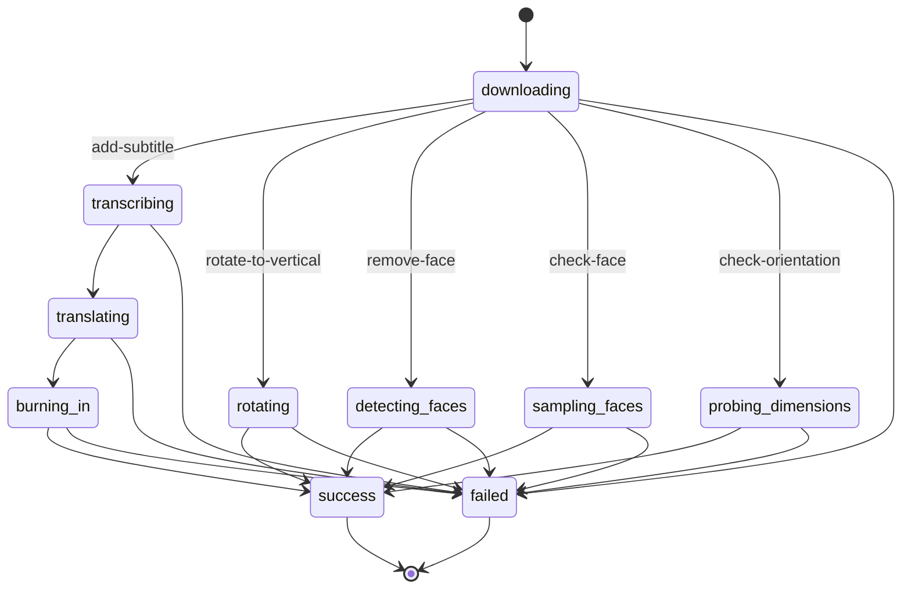

# Video Condition: Check Orientation Implementation Plan

> **For agentic workers:** REQUIRED SUB-SKILL: Use superpowers:subagent-driven-development (recommended) or superpowers:executing-plans to implement this plan task-by-task. Steps use checkbox (`- [ ]`) syntax for tracking.

**Goal:** Add a `check-orientation` operation to the existing `videoCondition` flow node, so a flow can branch on whether a video is landscape or portrait — computed from the video's real pixel width/height (via ffprobe in the shared video-processing container), since YouTube's public API cannot return true dimensions for third-party videos.

**Architecture:** Extends the existing `check-face` async pipeline (queue → container → resume-callback → flow-side threshold evaluation) with a second operation. A new container route (`/probe-dimensions`) reports a raw width/height/ratio; the flow engine compares that ratio against the node's own operator/threshold — the container never learns a threshold exists, exactly like `check-face`.

**Tech Stack:** Cloudflare Workers (Hono), Cloudflare Queues, `@cloudflare/containers` (Flask/Python container running ffmpeg/ffprobe), D1, React (ReactFlow inspector UI), Vitest, pytest.

## Global Constraints

- Repo-wide priority order: 数据准确性 > 系统稳定性 > 功能 > UI界面 (`CLAUDE.md`).
- No new Cloudflare resources — reuse `VIDEO_ACTION_QUEUE`, `video_action_jobs` (D1), and `SUBTITLE_CONTAINER`, exactly as `check-face` does.
- The container never knows a threshold exists — it only ever returns a raw measured ratio; the operator/threshold comparison happens exclusively in `flow`'s `/internal/video-action/resume` route, reading the node's current graph data.
- A probe failure (download failure, unreadable dimensions) resolves the node's `failed` branch — never a guessed `true`/`false`.
- `check-face`'s existing behavior, UI, defaults, and branch semantics are unchanged — this work is purely additive.
- Square video (`width == height`, ratio == 1) is classified as **Portrait** — i.e. the default operator/threshold (`> 1`) must evaluate to `false` when ratio is exactly `1`.
- The new operation's numeric threshold input has **no min/max/step constraint** (unlike `check-face`'s `0–1, step 0.05`) — plain free-form number entry.
- New operation id: `check-orientation` (parallel to `check-face`, same naming convention).
- New resume-payload field: `aspect_ratio` (parallel to `face_ratio`).

---

### Task 1: Container — aspect-ratio helper + `/probe-dimensions` route

**Files:**
- Modify: `content/video_action_lib.py`
- Modify: `content/tests/test_video_action_lib.py`
- Modify: `content/main.py`

**Interfaces:**
- Produces: `aspect_ratio(width: float, height: float) -> float | None` in `video_action_lib.py` — `None` when `height` is falsy (mirrors `face_ratio`'s "unmeasurable → None" convention rather than raising `ZeroDivisionError`).
- Produces: `POST /probe-dimensions` route, request `{"job_id": str, "video_key": str}` (the `video_key` from a prior `/download` call, same as `/rotate-to-vertical` and `/face-ratio`), response `{"width": int, "height": int, "ratio": float}` on success or `{"error": str}` (HTTP 200) on failure. Consumed by Task 2's `probeDimensions()`.
- No existing Flask route in this file has a direct pytest test (only the pure functions in `video_action_lib.py` are unit tested) — this task follows that same split: the pure `aspect_ratio` helper gets a real TDD cycle below; the route itself is a thin wrapper verified via this plan's final end-to-end step, same as every other route in `main.py`.

- [ ] **Step 1: Write the failing tests for `aspect_ratio`**

Edit `content/tests/test_video_action_lib.py` — update the import line and add two tests at the end of the file:

```python
from video_action_lib import compute_keep_segments, needs_rotation, is_too_short, sample_timestamps, face_ratio, aspect_ratio
```

```python
def test_aspect_ratio_basic():
    assert aspect_ratio(1920, 1080) == 1920 / 1080
    assert aspect_ratio(1080, 1920) == 1080 / 1920
    assert aspect_ratio(1000, 1000) == 1.0


def test_aspect_ratio_none_when_height_is_zero():
    # Distinct from raising ZeroDivisionError: unmeasurable dimensions must fail the node, not crash it.
    assert aspect_ratio(1920, 0) is None
```

- [ ] **Step 2: Run test to verify it fails**

Run: `cd content && python3 -m pytest tests/test_video_action_lib.py -v`
Expected: FAIL with `ImportError: cannot import name 'aspect_ratio' from 'video_action_lib'`

- [ ] **Step 3: Implement `aspect_ratio` in `video_action_lib.py`**

Add after the existing `face_ratio` function (end of file):

```python
def aspect_ratio(width, height):
    """width / height, or None if height is falsy (unmeasurable dimensions) -- mirrors
    face_ratio's None-for-unmeasurable convention rather than raising ZeroDivisionError."""
    if not height:
        return None
    return width / height
```

- [ ] **Step 4: Run test to verify it passes**

Run: `cd content && python3 -m pytest tests/test_video_action_lib.py -v`
Expected: PASS, 18 passed (16 existing + 2 new)

- [ ] **Step 5: Commit**

```bash
git add content/video_action_lib.py content/tests/test_video_action_lib.py
git commit -m "feat: add aspect_ratio helper for video-condition orientation check"
```

- [ ] **Step 6: Add the `/probe-dimensions` route to `main.py`**

Edit `content/main.py` line 11 — add `aspect_ratio` to the import:

```python
from video_action_lib import compute_keep_segments, needs_rotation, is_too_short, sample_timestamps, face_ratio, aspect_ratio
```

Add the new route directly after the existing `/rotate-to-vertical` route (after its closing, before `@app.route("/remove-face", ...)`):

```python
@app.route("/probe-dimensions", methods=["POST"])
def probe_dimensions_route():
    """Reports the source video's real pixel width/height/aspect-ratio for the videoCondition
    node's check-orientation operation. Downloads the already-uploaded video from R2 (uploaded
    by a prior /download call) rather than re-downloading via yt-dlp -- same pattern as
    /rotate-to-vertical and /face-ratio."""
    body = request.get_json()
    job_id = body["job_id"]
    video_key = body["video_key"]

    work_dir = f"/tmp/{job_id}-dims"
    video_path = f"{work_dir}/source.mp4"

    try:
        os.makedirs(work_dir, exist_ok=True)

        bucket = os.environ["R2_BUCKET_NAME"]
        client = r2_client()
        client.download_file(bucket, video_key, video_path)

        width, height, error = _probe_dimensions(video_path)
        if error:
            return jsonify({"error": error}), 200

        ratio = aspect_ratio(width, height)
        if ratio is None:
            return jsonify({"error": f"unusable dimensions: {width}x{height}"}), 200

        return jsonify({"width": width, "height": height, "ratio": ratio})
    except Exception as e:
        return jsonify({"error": f"probe-dimensions unexpected error ({type(e).__name__}): {e}"}), 200
    finally:
        shutil.rmtree(work_dir, ignore_errors=True)
```

- [ ] **Step 7: Run the pytest suite again to confirm the import-line change didn't break anything**

Run: `cd content && python3 -m pytest tests/test_video_action_lib.py -v`
Expected: PASS, 18 passed

- [ ] **Step 8: Commit**

```bash
git add content/main.py
git commit -m "feat: add /probe-dimensions container route for video-condition orientation check"
```

---

### Task 2: Worker — `container-client.ts` `probeDimensions()`

**Files:**
- Modify: `content/src/services/video-action/container-client.ts`
- Modify: `content/tests/services/video-action/container-client.test.ts`

**Interfaces:**
- Consumes: Task 1's `POST /probe-dimensions` container route.
- Produces: `probeDimensions(env: Env, jobId: string, videoKey: string): Promise<DimensionsResult>` where `DimensionsResult = { width?: number; height?: number; ratio?: number; error?: string }` — consumed by Task 3's `processCheckOrientation`.

- [ ] **Step 1: Write the failing tests**

Edit `content/tests/services/video-action/container-client.test.ts` — update the import line:

```ts
import { downloadAndExtract, burnSubtitles, downloadVideo, rotateToVertical, removeFace, probeDimensions } from "../../../src/services/video-action/container-client";
```

Add at the end of the `describe("container-client", ...)` block, before the closing `});`:

```ts
  it("probeDimensions returns width/height/ratio on success", async () => {
    const env = makeEnv({ width: 1080, height: 1920, ratio: 0.5625 });
    const result = await probeDimensions(env, "job1", "video-action-jobs/job1/source.mp4");
    expect(result).toEqual({ width: 1080, height: 1920, ratio: 0.5625 });
  });

  it("probeDimensions surfaces an error", async () => {
    const env = makeEnv({ error: "dimension probe failed: ffprobe exited 1" });
    const result = await probeDimensions(env, "job1", "video-action-jobs/job1/source.mp4");
    expect(result.error).toBe("dimension probe failed: ffprobe exited 1");
  });
```

- [ ] **Step 2: Run test to verify it fails**

Run: `cd content && npx vitest run tests/services/video-action/container-client.test.ts`
Expected: FAIL — `probeDimensions` is not exported from `container-client.ts`

- [ ] **Step 3: Implement `probeDimensions`**

Add to the end of `content/src/services/video-action/container-client.ts`:

```ts
export interface DimensionsResult {
  width?: number;
  height?: number;
  ratio?: number;
  error?: string;
}

export async function probeDimensions(env: Env, jobId: string, videoKey: string): Promise<DimensionsResult> {
  const container = env.SUBTITLE_CONTAINER.getByName("subtitle-singleton");
  await container.startAndWaitForPorts();
  const res = await container.fetch("http://container/probe-dimensions", {
    method: "POST",
    headers: { "Content-Type": "application/json" },
    body: JSON.stringify({ job_id: jobId, video_key: videoKey }),
  });
  const body = await res.json() as { width?: number; height?: number; ratio?: number; error?: string };
  if (body.error) return { error: body.error };
  return { width: body.width, height: body.height, ratio: body.ratio };
}
```

- [ ] **Step 4: Run test to verify it passes**

Run: `cd content && npx vitest run tests/services/video-action/container-client.test.ts`
Expected: PASS, all tests in the file green

- [ ] **Step 5: Commit**

```bash
git add content/src/services/video-action/container-client.ts content/tests/services/video-action/container-client.test.ts
git commit -m "feat: add probeDimensions container-client for video-condition orientation check"
```

---

### Task 3: Worker — `queue-video-action.ts` `check-orientation` operation

**Files:**
- Modify: `content/src/services/video-action/job-store.ts`
- Modify: `content/src/queue-video-action.ts`
- Modify: `content/tests/queue-video-action.test.ts`
- Modify: `content/src/services/video-action/status.md`
- Modify: `content/src/services/video-action/sequence.md`

**Interfaces:**
- Consumes: `probeDimensions()` from Task 2.
- Produces: `processVideoActionJob` handles `message.operation === "check-orientation"`; on success calls `resumeFlow(env, pendingId, "success", { aspect_ratio: number })`; on failure calls `resumeFlow(env, pendingId, "failed", {}, reason)`. Consumed by Task 5 (flow's resume route reads `props.aspect_ratio`).

- [ ] **Step 1: Add the new job status**

Edit `content/src/services/video-action/job-store.ts` — add `"probing_dimensions"` to the `JobStatus` union (after `"sampling_faces"`):

```ts
export type JobStatus =
  | "downloading"
  | "transcribing"
  | "translating"
  | "burning_in"
  | "rotating"
  | "detecting_faces"
  | "sampling_faces"
  | "probing_dimensions"
  | "success"
  | "failed";
```

- [ ] **Step 2: Write the failing tests**

Edit `content/tests/queue-video-action.test.ts` — update the `containerClient` import usage is already `import * as containerClient from "../src/services/video-action/container-client";` (no change needed, it's a namespace import). Add three tests at the end of the `describe("processVideoActionJob", ...)` block, before the closing `});`:

```ts
  it("check-orientation: posts the measured aspect ratio and leaves the true/false decision to flow", async () => {
    vi.spyOn(containerClient, "downloadVideo").mockResolvedValue({ videoKey: "v1" });
    vi.spyOn(containerClient, "probeDimensions").mockResolvedValue({ width: 1920, height: 1080, ratio: 1.7778 });

    await processVideoActionJob(makeEnv(), { ...message, operation: "check-orientation" });

    expect(jobStore.updateJobStatus).toHaveBeenCalledWith(expect.anything(), "job1", "probing_dimensions");
    expect(jobStore.updateJobStatus).toHaveBeenCalledWith(expect.anything(), "job1", "success");
    const resumeCall = (fetch as any).mock.calls.find((c: any[]) => c[0].includes("/internal/video-action/resume"));
    const body = JSON.parse(resumeCall[1].body);
    // "success" means "the ratio was measured", not "the condition passed" -- no threshold
    // comparison happens in this module at all.
    expect(body.branch).toBe("success");
    expect(body.props).toEqual({ aspect_ratio: 1.7778 });
  });

  it("check-orientation: resolves failed when the container could not probe dimensions", async () => {
    vi.spyOn(containerClient, "downloadVideo").mockResolvedValue({ videoKey: "v1" });
    vi.spyOn(containerClient, "probeDimensions").mockResolvedValue({ error: "dimension probe failed: ffprobe exited 1" });

    await processVideoActionJob(makeEnv(), { ...message, operation: "check-orientation" });

    expect(jobStore.updateJobStatus).toHaveBeenCalledWith(
      expect.anything(), "job1", "failed", "probing_dimensions", "dimension probe failed: ffprobe exited 1"
    );
    const resumeCall = (fetch as any).mock.calls.find((c: any[]) => c[0].includes("/internal/video-action/resume"));
    const body = JSON.parse(resumeCall[1].body);
    expect(body.branch).toBe("failed");
    expect(body.props).toEqual({});
  });

  it("check-orientation: resolves failed when download fails, without calling probeDimensions", async () => {
    vi.spyOn(containerClient, "downloadVideo").mockResolvedValue({ error: "yt-dlp failed" });
    const probeSpy = vi.spyOn(containerClient, "probeDimensions");

    await processVideoActionJob(makeEnv(), { ...message, operation: "check-orientation" });

    expect(probeSpy).not.toHaveBeenCalled();
    expect(jobStore.updateJobStatus).toHaveBeenCalledWith(expect.anything(), "job1", "failed", "downloading", "yt-dlp failed");
  });
```

- [ ] **Step 3: Run test to verify it fails**

Run: `cd content && npx vitest run tests/queue-video-action.test.ts`
Expected: FAIL — `containerClient.probeDimensions` spy target does not exist yet on the message's operation dispatch (the `check-orientation` branch falls through to `processAddSubtitle` today, so `downloadAndExtract`/`transcribeAudio` get called instead, and the assertions on `probing_dimensions`/`aspect_ratio` fail)

- [ ] **Step 4: Implement `processCheckOrientation` and wire up dispatch**

Edit `content/src/queue-video-action.ts` line 3 — add `probeDimensions` to the import:

```ts
import { downloadAndExtract, downloadVideo, burnSubtitles, rotateToVertical, removeFace, faceRatio, probeDimensions } from "./services/video-action/container-client";
```

Edit the `VideoActionQueueMessage.operation` union (around line 15) — add `"check-orientation"`:

```ts
  // "check-face"/"check-orientation" are the videoCondition node, not a videoAction -- they
  // share this queue, job table and resume callback rather than duplicating the whole async
  // pipeline. Neither produces an output video: each reports a raw measured value and flow
  // turns that into a true/false branch.
  operation: "add-subtitle" | "rotate-to-vertical" | "remove-face" | "check-face" | "check-orientation";
```

Add `processCheckOrientation` directly after `processCheckFace`:

```ts
async function processCheckOrientation(env: Env, jobId: string, message: VideoActionQueueMessage): Promise<void> {
  const downloaded = await downloadVideo(env, jobId, message.videoUrl);
  if (downloaded.error || !downloaded.videoKey) {
    await updateJobStatus(env, jobId, "failed", "downloading", downloaded.error || "unknown download error");
    await cleanupScratch(env, jobId);
    await resumeFlow(env, message.pendingId, "failed", {}, `video_action_failed: downloading — ${downloaded.error || "unknown download error"}`);
    return;
  }

  await updateJobStatus(env, jobId, "probing_dimensions");
  const probed = await probeDimensions(env, jobId, downloaded.videoKey);
  if (probed.error || typeof probed.ratio !== "number") {
    await updateJobStatus(env, jobId, "failed", "probing_dimensions", probed.error || "unknown dimension-probe error");
    await cleanupScratch(env, jobId);
    await resumeFlow(env, message.pendingId, "failed", {}, `video_action_failed: probing_dimensions — ${probed.error || "unknown dimension-probe error"}`);
    return;
  }

  await updateJobStatus(env, jobId, "success");
  await cleanupScratch(env, jobId);
  // "success" here means "the ratio was measured", not "the condition passed". Comparing the
  // ratio against the node's operator/threshold happens in flow's resume route, which reads
  // them from the graph — this module never learns that a threshold exists.
  await resumeFlow(env, message.pendingId, "success", { aspect_ratio: probed.ratio });
}
```

Update the dispatch in `processVideoActionJob` (add an `else if` before the final `else`):

```ts
    } else if (message.operation === "check-face") {
      await processCheckFace(env, jobId, message);
    } else if (message.operation === "check-orientation") {
      await processCheckOrientation(env, jobId, message);
    } else {
```

- [ ] **Step 5: Run test to verify it passes**

Run: `cd content && npx vitest run tests/queue-video-action.test.ts`
Expected: PASS, all tests in the file green

- [ ] **Step 6: Update the state-machine and sequence diagrams**

Edit `content/src/services/video-action/status.md` — replace its contents:

```markdown
# video_action_jobs.job_status state machine



For `check-face`/`check-orientation` (the `videoCondition` node), `success` means "the measured
value (face ratio / aspect ratio) was obtained" — not "the condition passed". The `true`/`false`
decision is made by `flow`'s resume route.
```

Edit `content/src/services/video-action/sequence.md` — add a new `else if` branch to the `alt` block, right after the `check-face` branch and before the closing `end`:

```
    else operation = check-orientation (the videoCondition node, not a videoAction)
        Content->>Container: POST /download
        Container->>R2: upload source.mp4
        Container-->>Content: {videoKey}
        Content->>Container: POST /probe-dimensions {videoKey}
        Container->>Container: ffprobe real pixel width/height, compute ratio = width/height
        Container-->>Content: {width, height, ratio}
        Note over Content: no output video — branch=success means "ratio measured", props={aspect_ratio}
    end
```

And update the trailing note below the diagram to cover both operations:

```markdown
`check-face`/`check-orientation` never compare their measured value against anything: the
operator/threshold live on the flow node, so `flow`'s resume route does that comparison and
derives the `true`/`false` branch. This module only measures.
```

- [ ] **Step 7: Commit**

```bash
git add content/src/services/video-action/job-store.ts content/src/queue-video-action.ts content/tests/queue-video-action.test.ts content/src/services/video-action/status.md content/src/services/video-action/sequence.md
git commit -m "feat: add check-orientation operation to video-action queue consumer"
```

---

### Task 4: `flow/src/engine.ts` — `evaluateOrientationBranch`

**Files:**
- Modify: `flow/src/engine.ts`
- Modify: `flow/tests/unit/engine.test.ts`

**Interfaces:**
- Produces: `evaluateOrientationBranch(data: Record<string, unknown>, ratio: unknown): "true" | "false" | "failed"`, `ORIENTATION_DEFAULT_OPERATOR = ">"`, `ORIENTATION_DEFAULT_THRESHOLD = 1` — consumed by Task 5's resume route.
- `evaluateFaceRatioBranch`'s existing exported name, signature, and behavior are unchanged — every existing test for it must keep passing without modification.

- [ ] **Step 1: Write the failing tests**

Edit `flow/tests/unit/engine.test.ts` line 2 — add `evaluateOrientationBranch` to the import:

```ts
import { executeFlow, resumeFromNode, evaluateFaceRatioBranch, evaluateOrientationBranch, type FlowGraph } from "../../src/engine";
```

Add a new `describe` block directly after the existing `describe("evaluateFaceRatioBranch", ...)` block:

```ts
describe("evaluateOrientationBranch", () => {
  it("defaults to '> 1' when the node carries no operator/threshold", () => {
    expect(evaluateOrientationBranch({}, 1.78)).toBe("true");
    expect(evaluateOrientationBranch({}, 0.56)).toBe("false");
  });

  it("treats a square ratio of exactly 1 as Portrait (false) under the default operator", () => {
    expect(evaluateOrientationBranch({}, 1)).toBe("false");
  });

  it("applies each supported operator", () => {
    expect(evaluateOrientationBranch({ operator: "<=", threshold: 1 }, 1)).toBe("true");
    expect(evaluateOrientationBranch({ operator: "<", threshold: 1 }, 1)).toBe("false");
    expect(evaluateOrientationBranch({ operator: ">=", threshold: 1 }, 1)).toBe("true");
    expect(evaluateOrientationBranch({ operator: ">", threshold: 1 }, 1)).toBe("false");
    expect(evaluateOrientationBranch({ operator: ">", threshold: 1 }, 1.78)).toBe("true");
  });

  it("returns 'failed' rather than guessing when the ratio is missing or not a number", () => {
    expect(evaluateOrientationBranch({}, undefined)).toBe("failed");
    expect(evaluateOrientationBranch({}, null)).toBe("failed");
    expect(evaluateOrientationBranch({}, "1.78")).toBe("failed");
    expect(evaluateOrientationBranch({}, NaN)).toBe("failed");
  });

  it("returns 'failed' on an unrecognised operator instead of silently falling through", () => {
    expect(evaluateOrientationBranch({ operator: "==", threshold: 1 }, 1)).toBe("failed");
  });

  it("falls back to the default threshold when the stored one is unusable", () => {
    expect(evaluateOrientationBranch({ operator: ">", threshold: "abc" }, 1.78)).toBe("true");
    expect(evaluateOrientationBranch({ operator: ">", threshold: 1.9 }, 1.78)).toBe("false");
  });
});
```

- [ ] **Step 2: Run test to verify it fails**

Run: `cd flow && npx vitest run tests/unit/engine.test.ts`
Expected: FAIL — `evaluateOrientationBranch` is not exported from `../../src/engine`

- [ ] **Step 3: Implement — extract a shared ratio-comparator, add `evaluateOrientationBranch`**

In `flow/src/engine.ts`, replace the existing block (lines 260-284: `export const FACE_RATIO_DEFAULT_OPERATOR ...` through the end of `evaluateFaceRatioBranch`) with:

```ts
export const FACE_RATIO_DEFAULT_OPERATOR = "<=";
export const FACE_RATIO_DEFAULT_THRESHOLD = 0.2;
export const ORIENTATION_DEFAULT_OPERATOR = ">";
export const ORIENTATION_DEFAULT_THRESHOLD = 1;

// Shared by evaluateFaceRatioBranch and evaluateOrientationBranch: both turn a videoCondition
// node's single measured number into a branch by comparing it against the node's own
// operator/threshold. The value is measured once by content's container; the threshold lives
// only in the graph, so re-tuning it is pure config with no re-detection. A value of 0 is a
// real answer (e.g. "no faces") and must not be confused with a missing one — anything
// unmeasurable resolves to "failed", never a guess.
function evaluateRatioBranch(
  data: Record<string, unknown>,
  ratio: unknown,
  defaultOperator: string,
  defaultThreshold: number
): "true" | "false" | "failed" {
  if (typeof ratio !== "number" || !Number.isFinite(ratio)) return "failed";

  const operator = (data.operator as string) || defaultOperator;
  const rawThreshold = Number(data.threshold);
  const threshold = Number.isFinite(rawThreshold) ? rawThreshold : defaultThreshold;

  switch (operator) {
    case "<=": return ratio <= threshold ? "true" : "false";
    case "<": return ratio < threshold ? "true" : "false";
    case ">=": return ratio >= threshold ? "true" : "false";
    case ">": return ratio > threshold ? "true" : "false";
    default: return "failed";
  }
}

export function evaluateFaceRatioBranch(data: Record<string, unknown>, ratio: unknown): "true" | "false" | "failed" {
  return evaluateRatioBranch(data, ratio, FACE_RATIO_DEFAULT_OPERATOR, FACE_RATIO_DEFAULT_THRESHOLD);
}

// Turns a videoCondition node's measured width/height ratio into its branch. A square video
// (ratio exactly 1) is Portrait under the default operator ">" — Landscape requires strictly
// greater than 1.
export function evaluateOrientationBranch(data: Record<string, unknown>, ratio: unknown): "true" | "false" | "failed" {
  return evaluateRatioBranch(data, ratio, ORIENTATION_DEFAULT_OPERATOR, ORIENTATION_DEFAULT_THRESHOLD);
}
```

- [ ] **Step 4: Run test to verify it passes**

Run: `cd flow && npx vitest run tests/unit/engine.test.ts`
Expected: PASS, all tests in the file green (existing `evaluateFaceRatioBranch` tests plus the new `evaluateOrientationBranch` tests)

- [ ] **Step 5: Commit**

```bash
git add flow/src/engine.ts flow/tests/unit/engine.test.ts
git commit -m "feat: add evaluateOrientationBranch to flow engine for video-condition orientation check"
```

---

### Task 5: `flow/src/index.ts` — dispatch fix + resume-route operation switch

**Files:**
- Modify: `flow/src/index.ts`
- Modify: `flow/tests/unit/video-action-resume.test.ts`

**Interfaces:**
- Consumes: `evaluateOrientationBranch` from Task 4.
- Fixes an existing bug that blocks this feature: the `VIDEO_ACTION_QUEUE.send()` dispatch (around line 866) hardcodes `operation: "check-face"` for every `videoCondition` node, ignoring the node's actual `data.operation` (which `engine.ts`'s `collectActions`/`buildActionData` already reads correctly at line 428 into `action.operation`) — so today, selecting anything other than "Check Face" in the Operation dropdown has no effect on which container route runs. This task fixes that as part of wiring up the new operation.

- [ ] **Step 1: Write the failing tests**

Edit `flow/tests/unit/video-action-resume.test.ts` — add a new graph fixture directly after `graphWithVideoCondition` (around line 57):

```ts
// Same shape as graphWithVideoCondition but with operation: "check-orientation" -- the resume
// route reads data.operation to decide which measured field (aspect_ratio vs face_ratio) and
// which evaluator (evaluateOrientationBranch vs evaluateFaceRatioBranch) apply.
const graphWithOrientationCondition = JSON.stringify({
  nodes: [
    { id: "t1", type: "xContentTrigger", data: { channelId: "src-chan", mode: "own:get-posts", conditions: [] }, position: { x: 0, y: 0 } },
    { id: "a1", type: "videoCondition", data: { operation: "check-orientation", operator: ">", threshold: 1 }, position: { x: 200, y: 0 } },
    { id: "a2", type: "action", data: { actionType: "noopLeaf" }, position: { x: 400, y: 0 } },
    { id: "a3", type: "action", data: { actionType: "noopLeaf" }, position: { x: 400, y: 100 } },
    { id: "a4", type: "action", data: { actionType: "noopLeaf" }, position: { x: 400, y: 200 } },
  ],
  edges: [
    { id: "e1", source: "t1", target: "a1" },
    { id: "e2", source: "a1", target: "a2", sourceHandle: "true" },
    { id: "e3", source: "a1", target: "a3", sourceHandle: "false" },
    { id: "e4", source: "a1", target: "a4", sourceHandle: "failed" },
  ],
});
```

Change the `resumeVideoCondition` helper (around line 206) to accept an optional graph override, defaulting to the existing `graphWithVideoCondition` so every current call site is unaffected:

```ts
  async function resumeVideoCondition(pendingId: string, contentId: string, body: Record<string, unknown>, graph: string = graphWithVideoCondition) {
    await setupSchema();
    await env.FLOW_DB.prepare(
      `INSERT OR REPLACE INTO flows (id, tenant_id, name, graph_json, status, created_at, updated_at)
       VALUES ('flow-vc', 1, 'video condition flow', ?, 'published', datetime('now'), datetime('now'))`
    ).bind(graph).run();
```

(The rest of the helper's body is unchanged — only the signature and the `.bind(graph)` call change, replacing the previous hardcoded `.bind(graphWithVideoCondition)`.)

Add four new tests directly after the existing `"videoCondition: a success callback with no measurable ratio resolves failed, not a guess"` test, before the closing `});` of the `describe` block:

```ts
  it("videoCondition (check-orientation): a landscape ratio above the threshold resolves the true branch", async () => {
    const { outcome, reached } = await resumeVideoCondition("pend-vc-6", "content-vc-6", {
      branch: "success", props: { aspect_ratio: 1.7778 },
    }, graphWithOrientationCondition);
    expect(outcome).toBe("true");
    expect(reached).toContain("a2");
  });

  it("videoCondition (check-orientation): a portrait ratio at or under the threshold resolves the false branch", async () => {
    const { outcome, reached } = await resumeVideoCondition("pend-vc-7", "content-vc-7", {
      branch: "success", props: { aspect_ratio: 0.5625 },
    }, graphWithOrientationCondition);
    expect(outcome).toBe("false");
    expect(reached).toContain("a3");
  });

  it("videoCondition (check-orientation): a square ratio of exactly 1 resolves false (Portrait), not true", async () => {
    const { outcome, reached } = await resumeVideoCondition("pend-vc-8", "content-vc-8", {
      branch: "success", props: { aspect_ratio: 1 },
    }, graphWithOrientationCondition);
    expect(outcome).toBe("false");
    expect(reached).toContain("a3");
  });

  it("videoCondition (check-orientation): a success callback with no measurable ratio resolves failed, not a guess", async () => {
    const { outcome, reached } = await resumeVideoCondition("pend-vc-9", "content-vc-9", {
      branch: "success", props: {},
    }, graphWithOrientationCondition);
    expect(outcome).toBe("failed");
    expect(reached).toContain("a4");
  });
```

- [ ] **Step 2: Run test to verify it fails**

Run: `cd flow && npx vitest run tests/unit/video-action-resume.test.ts`
Expected: FAIL — the resume route always evaluates via `evaluateFaceRatioBranch(resumedNode.data || {}, payload.face_ratio)` regardless of `data.operation`, so `payload.aspect_ratio` is never read and every new test resolves `"failed"` instead of the expected `"true"`/`"false"`

- [ ] **Step 3: Fix the dispatch and generalize the resume route**

Edit `flow/src/index.ts` line 4 — add `evaluateOrientationBranch` to the import:

```ts
import { executeFlow, resumeFromNode, evaluateCondition, evaluateFaceRatioBranch, evaluateOrientationBranch, type FlowGraph, type ActionResult, type NodeLog } from "./engine";
```

Edit line 866 (the `VIDEO_ACTION_QUEUE.send()` call) — replace:

```ts
        operation: isCondition ? "check-face" : ((action.operation as string) || "add-subtitle"),
```

with:

```ts
        operation: (action.operation as string) || (isCondition ? "check-face" : "add-subtitle"),
```

Edit the resume route (around lines 967-982) — replace:

```ts
  const resumedNode = graph.nodes.find((n) => n.id === row.node_id);
  const effectiveBranch = resumedNode?.type === "videoCondition"
    ? (branch === "success" ? evaluateFaceRatioBranch(resumedNode.data || {}, payload.face_ratio) : "failed")
    : branch;

  // The measured ratio is deliberately not persisted to any table (it rides the payload into
  // the node log), so without this line the one number the whole node turns on is invisible in
  // production — the container's own stdout is not queryable, and the node log reaches R2 with
  // a lag. Logs the decision, not just the measurement, so a wrong threshold is diagnosable.
  if (resumedNode?.type === "videoCondition") {
    console.log(JSON.stringify({
      event: "video_condition_face_ratio", contentId: row.content_id, nodeId: row.node_id,
      faceRatio: payload.face_ratio, operator: resumedNode.data?.operator, threshold: resumedNode.data?.threshold,
      reportedBranch: branch, branch: effectiveBranch,
    }));
  }
```

with:

```ts
  const resumedNode = graph.nodes.find((n) => n.id === row.node_id);
  const nodeOperation = resumedNode?.data?.operation as string | undefined;
  const effectiveBranch = resumedNode?.type === "videoCondition"
    ? (branch === "success"
        ? (nodeOperation === "check-orientation"
            ? evaluateOrientationBranch(resumedNode.data || {}, payload.aspect_ratio)
            : evaluateFaceRatioBranch(resumedNode.data || {}, payload.face_ratio))
        : "failed")
    : branch;

  // The measured value is deliberately not persisted to any table (it rides the payload into
  // the node log), so without this line the one number the whole node turns on is invisible in
  // production — the container's own stdout is not queryable, and the node log reaches R2 with
  // a lag. Logs the decision, not just the measurement, so a wrong threshold is diagnosable.
  if (resumedNode?.type === "videoCondition" && nodeOperation === "check-orientation") {
    console.log(JSON.stringify({
      event: "video_condition_orientation", contentId: row.content_id, nodeId: row.node_id,
      aspectRatio: payload.aspect_ratio, operator: resumedNode.data?.operator, threshold: resumedNode.data?.threshold,
      reportedBranch: branch, branch: effectiveBranch,
    }));
  } else if (resumedNode?.type === "videoCondition") {
    console.log(JSON.stringify({
      event: "video_condition_face_ratio", contentId: row.content_id, nodeId: row.node_id,
      faceRatio: payload.face_ratio, operator: resumedNode.data?.operator, threshold: resumedNode.data?.threshold,
      reportedBranch: branch, branch: effectiveBranch,
    }));
  }
```

- [ ] **Step 4: Run the full flow test suite to verify the new tests pass with no regressions**

Run: `cd flow && npx vitest run`
Expected: PASS, all tests green (`tests/unit/video-action-resume.test.ts`'s new and existing tests, `tests/unit/engine.test.ts`, and every other flow test — the line-866 dispatch fix touches videoAction's operation forwarding too, so the full suite confirms `rotate-to-vertical`/`remove-face`/`add-subtitle` dispatch is unaffected)

- [ ] **Step 5: Commit**

```bash
git add flow/src/index.ts flow/tests/unit/video-action-resume.test.ts
git commit -m "fix: dispatch videoCondition's actual operation instead of hardcoding check-face, add check-orientation resume handling"
```

---

### Task 6: Frontend — `Inspector.tsx` + `VideoConditionNode.tsx`

**Files:**
- Modify: `flow/frontend/components/Inspector.tsx`
- Modify: `flow/frontend/nodes/VideoConditionNode.tsx`

**Interfaces:**
- Consumes: `data.operation` values `"check-face"` / `"check-orientation"` (both already handled end-to-end by Tasks 1-5).
- No existing unit-test harness covers these two files (no `Inspector.test.tsx`/`VideoConditionNode.test.tsx` exists in this codebase, and inspector components generally aren't unit tested here) — this task is verified via this plan's final manual browser-verification step instead, consistent with how the rest of the flow inspector UI is tested.

- [ ] **Step 1: Update `VideoConditionInspector` in `Inspector.tsx`**

Replace the existing block (around lines 849-899, from `const VIDEO_CONDITION_OPERATIONS = ...` through the end of `VideoConditionInspector`):

```tsx
const VIDEO_CONDITION_OPERATIONS = [
  { value: "check-face", label: "Check Face" },
  { value: "check-orientation", label: "Check Orientation" },
];

// Equality is deliberately absent: both ratios are floats measured/computed from the video, so
// "== 0.2" or "== 1" would break on the tiniest floating-point wobble and read as "always False".
const RATIO_OPERATORS = ["<=", "<", ">=", ">"];

const VIDEO_CONDITION_FIELD_LABEL: Record<string, string> = {
  "check-face": "Face Ratio",
  "check-orientation": "Aspect Ratio (width / height)",
};

const VIDEO_CONDITION_HELP_TEXT: Record<string, string> = {
  "check-face": "Share of 20 sampled frames containing a face, 0 to 1. True when the measured ratio satisfies this comparison.",
  "check-orientation": "Video width divided by height (e.g. 16:9 ≈ 1.78, 9:16 ≈ 0.56, square = 1). True when the measured ratio satisfies this comparison.",
};

// Each operation's ratio has a different natural comparison boundary -- face ratio's "mostly no
// faces" default is <= 0.2, orientation's landscape/portrait split is > 1 -- so switching the
// Operation dropdown resets operator/threshold to that operation's own default rather than
// carrying over a value that made sense for the other operation.
const VIDEO_CONDITION_OPERATION_DEFAULTS: Record<string, { operator: string; threshold: number }> = {
  "check-face": { operator: "<=", threshold: 0.2 },
  "check-orientation": { operator: ">", threshold: 1 },
};

function VideoConditionInspector({ nodeId, data }: { nodeId: string; data: Record<string, any> }) {
  const { updateNodeData } = useFlowEditor();
  const operation = data.operation || "check-face";
  const isOrientation = operation === "check-orientation";

  const handleOperationChange = (v: string) => {
    const defaults = VIDEO_CONDITION_OPERATION_DEFAULTS[v] || VIDEO_CONDITION_OPERATION_DEFAULTS["check-face"];
    updateNodeData(nodeId, { operation: v, operator: defaults.operator, threshold: defaults.threshold });
  };

  return (
    <div>
      <h4 className="text-sm font-semibold text-primary mb-3">{NODE_TYPE_REGISTRY.videoCondition.label}</h4>
      <div className="space-y-3">
        <div>
          <Label className="text-xs block mb-1">Operation</Label>
          <OperationSelect
            value={operation}
            onChange={handleOperationChange}
            options={VIDEO_CONDITION_OPERATIONS}
          />
        </div>
        <div>
          <Label className="text-xs block mb-1">{VIDEO_CONDITION_FIELD_LABEL[operation]}</Label>
          <div className="flex items-center gap-2">
            <Select
              value={data.operator || VIDEO_CONDITION_OPERATION_DEFAULTS[operation].operator}
              onChange={(e: SelectChange) => updateNodeData(nodeId, { operator: e.target.value })}
              className="w-20 text-sm"
            >
              {RATIO_OPERATORS.map((op) => (
                <option key={op} value={op}>{op}</option>
              ))}
            </Select>
            <Input
              type="number"
              {...(isOrientation ? {} : { min: 0, max: 1, step: 0.05 })}
              value={data.threshold ?? VIDEO_CONDITION_OPERATION_DEFAULTS[operation].threshold}
              onChange={(e: InputChange) => {
                const parsed = parseFloat(e.target.value);
                const value = isOrientation
                  ? (Number.isFinite(parsed) ? parsed : 0)
                  : Math.max(0, Math.min(1, parsed || 0));
                updateNodeData(nodeId, { threshold: value });
              }}
              className="w-24 text-sm"
            />
          </div>
          <p className="text-xs text-muted-foreground mt-1">
            {VIDEO_CONDITION_HELP_TEXT[operation]}
          </p>
        </div>
      </div>
    </div>
  );
}
```

- [ ] **Step 2: Update the node summary in `VideoConditionNode.tsx`**

Replace the file's contents (it's short — 29 lines):

```tsx
import { Handle, Position, type NodeProps } from "@xyflow/react";
import AnalyticsBadges from "./AnalyticsBadges";
import { NODE_TYPE_REGISTRY } from "../../nodeTypeRegistry";

const OPERATION_DEFAULTS: Record<string, { operator: string; threshold: number; label: string }> = {
  "check-face": { operator: "<=", threshold: 0.2, label: "Face ratio" },
  "check-orientation": { operator: ">", threshold: 1, label: "Aspect ratio" },
};

export default function VideoConditionNode({ data, selected }: NodeProps) {
  const operation = (data.operation as string) || "check-face";
  const defaults = OPERATION_DEFAULTS[operation] || OPERATION_DEFAULTS["check-face"];
  const operator = (data.operator as string) || defaults.operator;
  const threshold = data.threshold === undefined || data.threshold === "" ? defaults.threshold : data.threshold;
  const summary = `${defaults.label} ${operator} ${threshold}`;

  return (
    <div className={`px-4 py-3 rounded-lg border-2 bg-white min-w-[170px] ${selected ? "border-blue-500 shadow-md" : "border-purple-300"}`}>
      <Handle type="target" position={Position.Left} className="!bg-purple-500 !w-3 !h-3" />
      <div className="flex items-center gap-2 mb-1">
        <span className="text-base leading-none">👁️</span>
        <span className="font-semibold text-sm text-purple-700">{NODE_TYPE_REGISTRY.videoCondition.label}</span>
      </div>
      <p className="text-xs text-gray-700">{summary}</p>
      <AnalyticsBadges analytics={data._analytics as any} />
      <span className="absolute right-1 text-[10px] text-green-600" style={{ top: "25%", transform: "translateY(-50%)" }}>True</span>
      <span className="absolute right-1 text-[10px] text-gray-500" style={{ top: "50%", transform: "translateY(-50%)" }}>False</span>
      <span className="absolute right-1 text-[10px] text-red-500" style={{ top: "75%", transform: "translateY(-50%)" }}>Failed</span>
      <Handle type="source" position={Position.Right} id="true" className="!bg-green-500 !w-2.5 !h-2.5" style={{ top: "25%" }} />
      <Handle type="source" position={Position.Right} id="false" className="!bg-gray-400 !w-2.5 !h-2.5" style={{ top: "50%" }} />
      <Handle type="source" position={Position.Right} id="failed" className="!bg-red-400 !w-2.5 !h-2.5" style={{ top: "75%" }} />
    </div>
  );
}
```

- [ ] **Step 3: Typecheck**

Run: `cd flow && npx tsc --noEmit`
Expected: no new errors

- [ ] **Step 4: Commit**

```bash
git add flow/frontend/components/Inspector.tsx flow/frontend/nodes/VideoConditionNode.tsx
git commit -m "feat: add Check Orientation to videoCondition inspector UI"
```

---

## Verification (end-to-end, after all tasks)

1. Run the full test suites one more time to confirm nothing regressed across tasks:
   - `cd content && python3 -m pytest tests/test_video_action_lib.py -v`
   - `cd content && npx vitest run`
   - `cd flow && npx vitest run`
2. Deploy both modules to the real dev environment (per this project's convention — localhost is not sufficient):
   - `cd content && npm run deploy:dev`
   - `cd flow && npm run deploy:dev`
3. Browser check (reuse the existing logged-in session, per project convention):
   - Open the flow editor, add a `videoCondition` node, switch its Operation dropdown to "Check Orientation" — confirm the label changes to "Aspect Ratio (width / height)", the comparator prefills `>`, the threshold prefills `1`, and the numeric input accepts values outside 0–1 with no visible min/max clamping.
   - Switch back to "Check Face" — confirm it reverts to the `<=` / `0.2` / 0–1-range behavior unchanged.
4. Real e2e: wire a `videoCondition` (Check Orientation) node into a test flow after an `xContentTrigger` (or reuse an existing YouTube-sourced flow), trigger it once with a known-landscape video and once with a known-portrait video, and confirm the `true`/`false` branches resolve correctly. Check the flow analytics node-log drawer for the `video_condition_orientation` log line to confirm the measured ratio and decision are visible.
