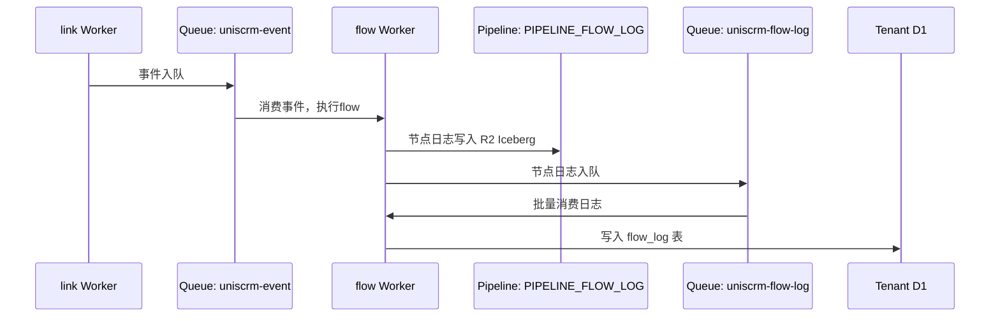
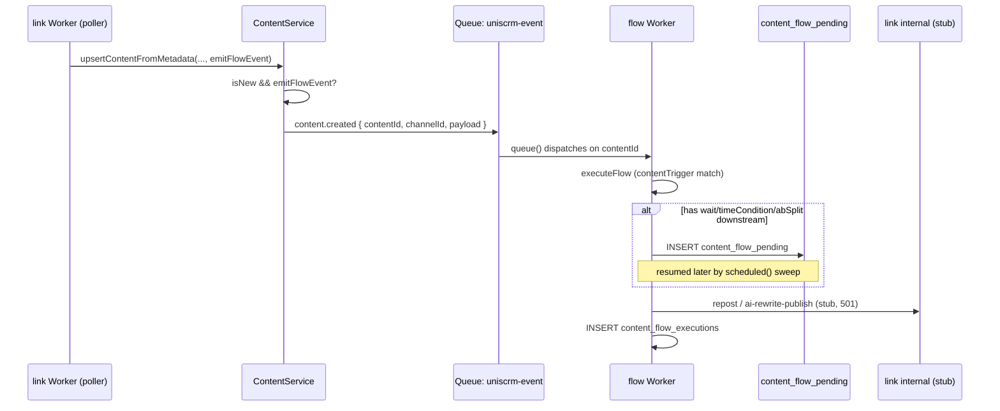

## Content-triggered flows



## Content-domain: aiRewritePublish (real generation + publish)

The `ai-rewrite-publish` call above is no longer a 501 stub. This diagram replaces
that leg with the real path: `link` calls `content` to generate rewritten text,
then posts it to X, then `flow` resolves the graph's success/failed branch —
including the rate-limit retry loop via `content_flow_pending`.

```mermaid
sequenceDiagram
    participant FW as flow Worker
    participant LW as link Worker
    participant CW as content Worker
    participant XAPI as X API
    participant TDB as Tenant D1
    participant CFP as content_flow_pending

    FW->>LW: POST /internal/content/ai-rewrite-publish { contentId, sourceChannelId, targetChannelId, skillId, flowId }
    LW->>TDB: SELECT title/content_text/summary FROM content WHERE id = contentId
    LW->>CW: POST /internal/generate { tenantId, skillId, material, targetPlatform }
    CW-->>LW: { text }
    alt targetChannel.channel_type === "X"
        LW->>XAPI: POST /2/tweets
        XAPI-->>LW: { id } | 429 rate limited | error
    else other channel_type (e.g. TikTok)
        Note over LW: out of scope this phase, returns { ok:false }
    end
    opt posted successfully
        LW->>TDB: recordPublishedContent(targetChannelId, "X", postId, text, ...)
    end
    LW-->>FW: { ok:true } | { ok:false } | { ok:false, rateLimited:true, rateLimitReset }
    alt rateLimited
        FW->>CFP: INSERT content_flow_pending (retry_action, retry_count: 0)
        Note over FW,CFP: scheduled() sweep retries at rateLimitReset;<br/>retry_count < 5 reschedules, otherwise row is deleted with no failed-branch dispatch<br/>(NB: diverges from flow/CLAUDE.md's "重试耗尽后才走failed分支" rule — exhaustion currently gives up silently instead)
    else resolved (ok or non-rate-limited failure)
        FW->>FW: resumeFromNode(graph, nodeId, payload, ok ? "success" : "failed")
        opt resumed branch includes updateContentStatus action
            FW->>TDB: UPDATE content SET status = 'published'|'ignored' WHERE id = contentId
        end
    end
```
