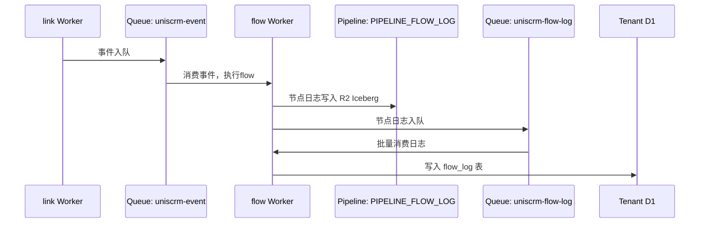
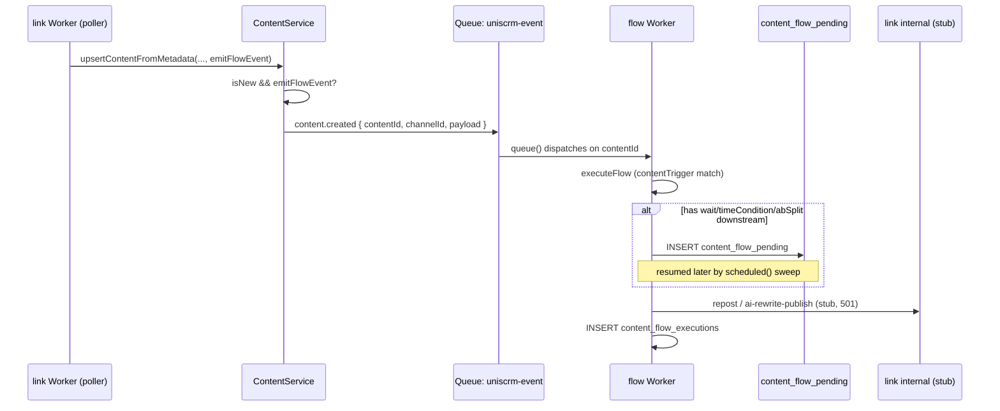

```mermaid
sequenceDiagram
    participant LW as link Worker
    participant EQ as Queue: uniscrm-event
    participant FW as flow Worker
    participant PLG as Pipeline: PIPELINE_FLOW_LOG
    participant LQ as Queue: uniscrm-flow-log
    participant TDB as Tenant D1

    LW->>EQ: 事件入队
    EQ->>FW: 消费事件，执行flow
    FW->>PLG: 节点日志写入 R2 Iceberg
    FW->>LQ: 节点日志入队
    LQ->>FW: 批量消费日志
    FW->>TDB: 写入 flow_log 表
```

## Content-triggered flows

```mermaid
sequenceDiagram
    participant P as link Worker (poller)
    participant CS as ContentService
    participant EQ as Queue: uniscrm-event
    participant FW as flow Worker
    participant CFP as content_flow_pending
    participant STUB as link internal (stub)

    P->>CS: upsertContentFromMetadata(..., emitFlowEvent)
    CS->>CS: isNew && emitFlowEvent?
    CS->>EQ: content.created { contentId, channelId, payload }
    EQ->>FW: queue() dispatches on contentId
    FW->>FW: executeFlow (contentTrigger match)
    alt has wait/timeCondition/abSplit downstream
        FW->>CFP: INSERT content_flow_pending
        Note over FW,CFP: resumed later by scheduled() sweep
    end
    FW->>STUB: repost / ai-rewrite-publish (stub, 501)
    FW->>FW: INSERT content_flow_executions
```
