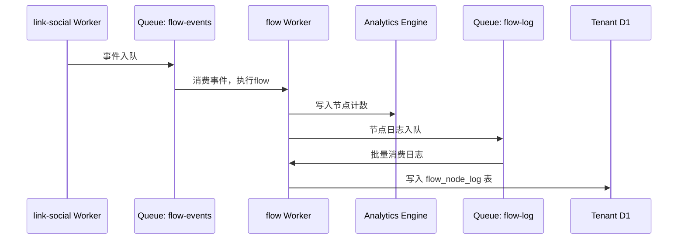

```mermaid
sequenceDiagram
    participant LS as link-social Worker
    participant FQ as Queue: flow-events
    participant FW as flow Worker
    participant AE as Analytics Engine
    participant LQ as Queue: flow-log
    participant TDB as Tenant D1

    LS->>FQ: 事件入队
    FQ->>FW: 消费事件，执行flow
    FW->>AE: 写入节点计数
    FW->>LQ: 节点日志入队
    LQ->>FW: 批量消费日志
    FW->>TDB: 写入 flow_node_log 表
```
