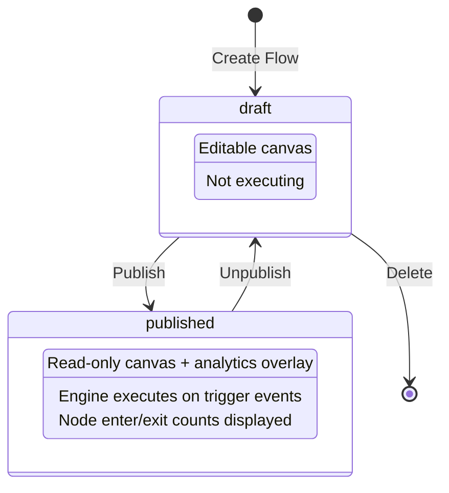

```mermaid
stateDiagram-v2
    [*] --> draft: Create Flow
    draft --> published: Publish
    published --> draft: Unpublish
    draft --> [*]: Delete

    state draft {
        [*]: Editable canvas
        [*]: Not executing
    }
    state published {
        [*]: Read-only canvas + analytics overlay
        [*]: Engine executes on trigger events
        [*]: Node enter/exit counts displayed
    }
```
