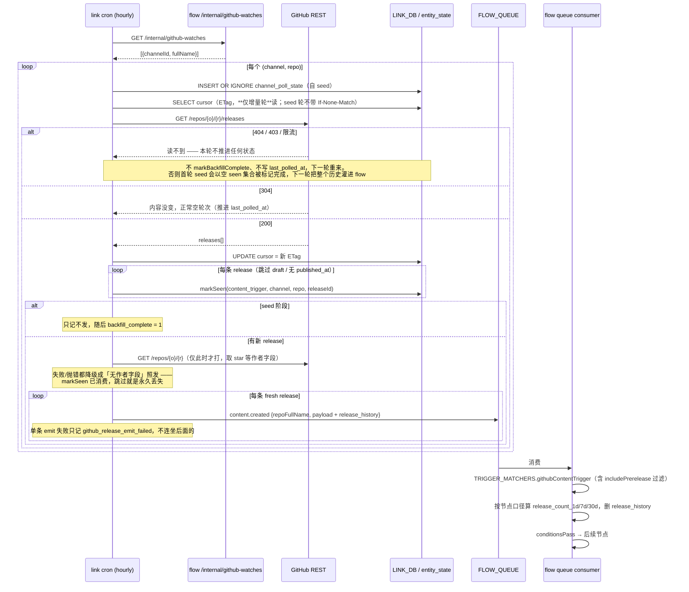

# GitHub release → content flow 时序

```mermaid
sequenceDiagram
    participant Cron as link cron (hourly)
    participant Flow as flow /internal/github-watches
    participant GH as GitHub REST
    participant D1 as LINK_DB / entity_state
    participant Q as FLOW_QUEUE
    participant FW as flow queue consumer

    Cron->>Flow: GET /internal/github-watches
    Flow-->>Cron: [{channelId, fullName}]
    loop 每个 (channel, repo)
        Cron->>D1: INSERT OR IGNORE channel_poll_state（自 seed）
        Cron->>D1: SELECT cursor（ETag，**仅增量轮**读；seed 轮不带 If-None-Match）
        Cron->>GH: GET /repos/{o}/{r}/releases
        alt 404 / 403 / 限流
            GH-->>Cron: 读不到 —— 本轮不推进任何状态
            Note over Cron,D1: 不 markBackfillComplete、不写 last_polled_at，下一轮重来。<br/>否则首轮 seed 会以空 seen 集合被标记完成，下一轮把整个历史灌进 flow
        else 304
            GH-->>Cron: 内容没变，正常空轮次（推进 last_polled_at）
        else 200
            GH-->>Cron: releases[]
            Cron->>D1: UPDATE cursor = 新 ETag
            loop 每条 release（跳过 draft / 无 published_at）
                Cron->>D1: markSeen(content_trigger, channel, repo, releaseId)
            end
            alt seed 阶段
                Note over Cron: 只记不发，随后 backfill_complete = 1
            else 有新 release
                Cron->>GH: GET /repos/{o}/{r}（仅此时才打，取 star 等作者字段）
                Note over Cron: 失败/抛错都降级成「无作者字段」照发 ——<br/>markSeen 已消费，跳过就是永久丢失
                loop 每条 fresh release
                    Cron->>Q: content.created {repoFullName, payload + release_history}
                    Note over Cron: 单条 emit 失败只记 github_release_emit_failed，不连坐后面的
                end
            end
        end
    end
    Q->>FW: 消费
    FW->>FW: TRIGGER_MATCHERS.githubContentTrigger（含 includePrerelease 过滤）
    FW->>FW: 按节点口径算 release_count_1d/7d/30d，删 release_history
    FW->>FW: conditionsPass → 后续节点
```
