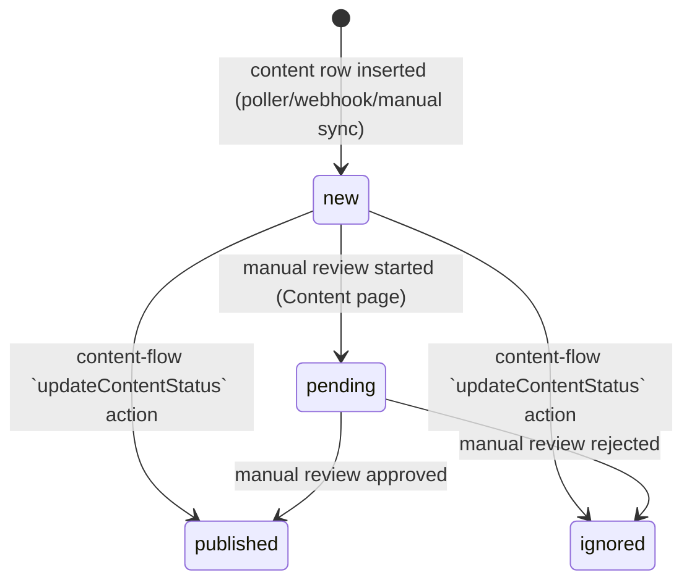

# `content.status` State Machine

`status` is not `_status`-suffixed (unlike e.g. `maigret_status`), so it fell outside the literal trigger for this diagram in root `CLAUDE.md`. Documenting it anyway: the content-triggered-flow design (`docs/superpowers/specs/2026-07-14-content-flow-triggers-design.md`) added an automated edge into this state machine (the `updateContentStatus` action), which previously only had manual/UI-driven transitions.

When this note was first written, that edge existed only as flow-engine scaffolding calling a `501`-stubbed `link` endpoint (`/internal/x/repost`, `/internal/content/ai-rewrite-publish`) — the `updateContentStatus` action ran, but nothing upstream of it had actually generated or published anything. As of this plan's Tasks 13-15 (branch-resolution fixes in `resumeFromNode`/`collectActions`) and Tasks 17-19 (real `content`-worker generation + X-publish call replacing the stub — see `flow/sequence.md`'s "aiRewritePublish" diagram), the `new --> published` / `new --> ignored` edges above are driven by a real, functioning automated write path, not aspirational scaffolding.
