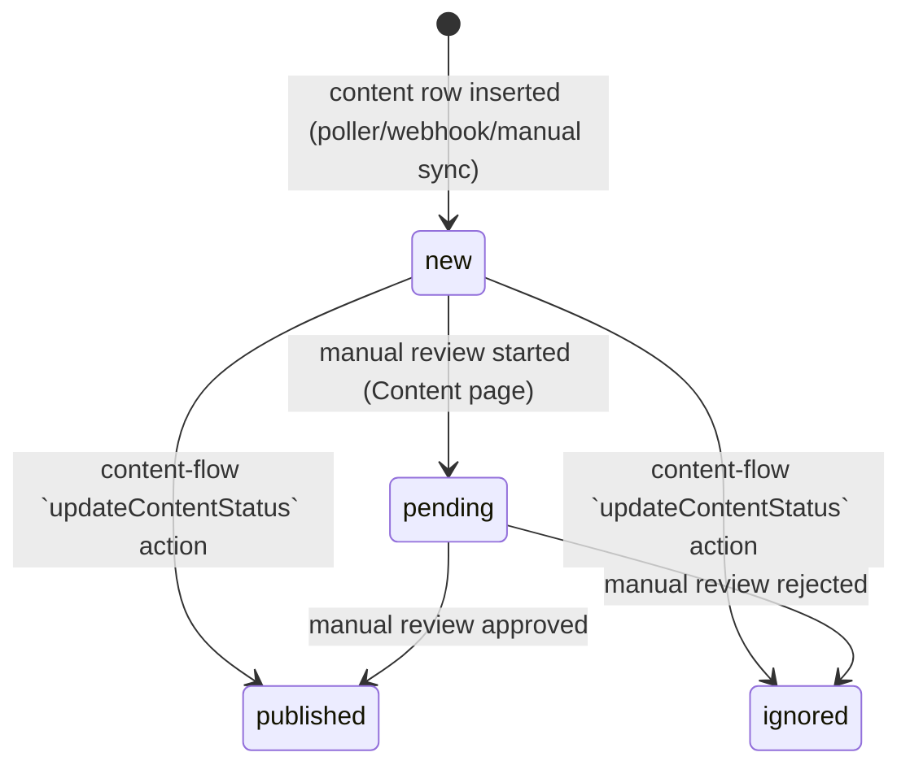

# `content.status` State Machine

`status` is not `_status`-suffixed (unlike e.g. `maigret_status`), so it fell outside the literal trigger for this diagram in root `CLAUDE.md`. Documenting it anyway: the content-triggered-flow design (`docs/superpowers/specs/2026-07-14-content-flow-triggers-design.md`) added an automated edge into this state machine (the `updateContentStatus` action), which previously only had manual/UI-driven transitions.
