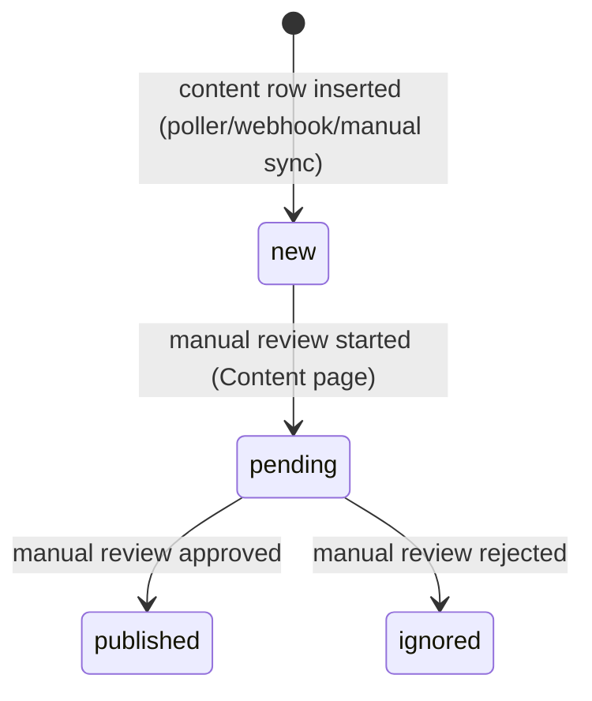

# `content.status` State Machine

`status` is not `_status`-suffixed (unlike e.g. `maigret_status`), so it fell outside the literal trigger for this diagram in root `CLAUDE.md`. Documenting it anyway: all transitions above are manual/UI-driven, via `PATCH /content/:id` (`link/src/services/content.ts`'s `update()` method). The content-triggered-flow design (`docs/superpowers/specs/2026-07-14-content-flow-triggers-design.md`) previously added an automated `new --> published` / `new --> ignored` edge here via a content-flow `updateContentStatus` action, but that action was removed as part of this plan's final cleanup — the flow engine no longer writes `content.status`, so those edges no longer exist.
