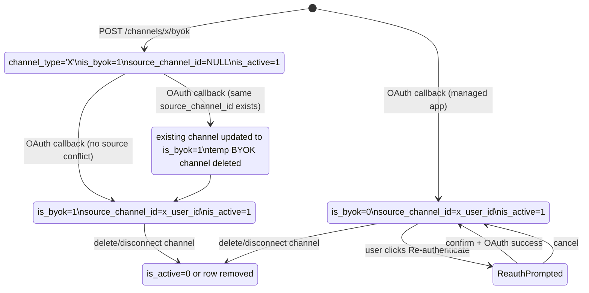

# X / X_BYOK Channel Status Machine

```mermaid
stateDiagram-v2
  [*] --> PreCreatedBYOK: POST /channels/x/byok
  PreCreatedBYOK: channel_type='X'\nis_byok=1\nsource_channel_id=NULL\nis_active=1

  PreCreatedBYOK --> AuthorizedBYOK: OAuth callback (no source conflict)
  AuthorizedBYOK: is_byok=1\nsource_channel_id=x_user_id\nis_active=1

  PreCreatedBYOK --> MergedIntoExisting: OAuth callback (same source_channel_id exists)
  MergedIntoExisting: existing channel updated to is_byok=1\ntemp BYOK channel deleted
  MergedIntoExisting --> AuthorizedBYOK

  [*] --> AuthorizedManagedX: OAuth callback (managed app)
  AuthorizedManagedX: is_byok=0\nsource_channel_id=x_user_id\nis_active=1

  AuthorizedManagedX --> ReauthPrompted: user clicks Re-authenticate
  ReauthPrompted --> AuthorizedManagedX: confirm + OAuth success
  ReauthPrompted --> AuthorizedManagedX: cancel

  AuthorizedBYOK --> Disabled: delete/disconnect channel
  AuthorizedManagedX --> Disabled: delete/disconnect channel
  Disabled: is_active=0 or row removed
```
