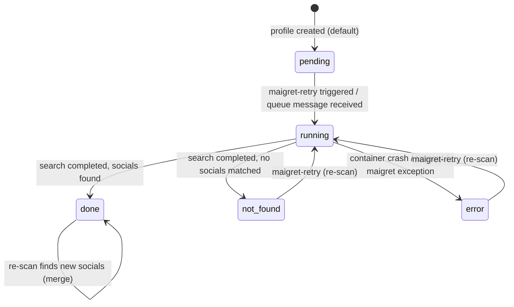

# Profile Maigret Status State Machine

## Status Definitions

| Status | Meaning | Terminal? |
|--------|---------|-----------|
| `pending` | Profile created, maigret scan not yet started | No |
| `running` | Maigret container is actively scanning | No |
| `done` | Scan completed successfully, social profiles found | Yes (can re-scan) |
| `not_found` | Scan completed successfully, no social profiles found for this username | Yes (can re-scan) |
| `error` | Scan process failed (container crash, timeout, Python exception) | No (auto-retry) |
